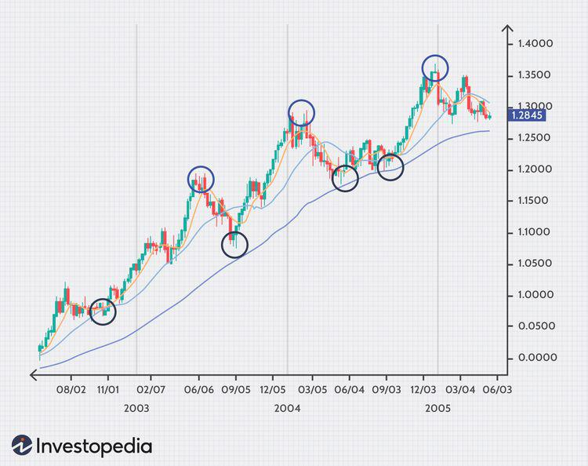

## Table of Contents

## What is the difference between trending and range-bound markets in forex?

In forex, a trending market is when the price of a currency pair moves in a clear direction, either up or down, over a period of time. Traders can see this trend on a chart, and it helps them decide when to buy or sell. When the market is trending, traders often use strategies that take advantage of the continuing movement in one direction. For example, if the price is going up, traders might buy the currency pair, expecting it to keep rising.

On the other hand, a range-bound market is when the price of a currency pair moves within a certain range, without a clear upward or downward trend. The price goes up and down between two levels, called support and resistance. In this type of market, traders use strategies that work well when the price stays within these levels. They might buy near the support level and sell near the resistance level, expecting the price to bounce back and forth.

Understanding whether the market is trending or range-bound is important for forex traders. It helps them choose the right strategies and make better trading decisions. By recognizing the type of market they are in, traders can adjust their approach to match the current market conditions.

## How can beginners identify a trending currency pair?

Beginners can identify a trending currency pair by looking at a price chart over time. They should look for a clear direction where the price is consistently moving up or down. If the price is making higher highs and higher lows, it's an uptrend. This means the currency pair is getting more valuable over time. If the price is making lower highs and lower lows, it's a downtrend, showing that the currency pair is losing value. By drawing trend lines that connect these highs and lows, beginners can see the trend more clearly.

Another way to spot a trend is by using moving averages. A moving average is a line on the chart that shows the average price over a certain number of periods. If the price is above the moving average and the moving average is sloping upwards, it suggests an uptrend. If the price is below the moving average and the moving average is sloping downwards, it indicates a downtrend. Beginners can start with simple moving averages like the 50-day or 200-day moving average to help them identify trends more easily.

## What are the common indicators used to spot range-bound currencies?

To spot range-bound currencies, traders often use indicators like the Bollinger Bands. Bollinger Bands are lines drawn on a price chart that show the highest and lowest prices over a certain time. When the price stays between these lines without breaking out, it suggests that the currency is moving in a range. The bands get closer together when the price is calm and further apart when the price is moving a lot. If the bands are close and the price stays inside them, it's a good sign that the currency is range-bound.

Another common indicator is the Relative Strength Index (RSI). The RSI measures how fast and strong a price is moving. It goes from 0 to 100. When the RSI stays between 30 and 70 without going to the extremes, it can mean the currency is in a range. Traders watch for the RSI to bounce off these levels without breaking them, which shows that the price is not trending strongly in one direction.

Using these indicators together can help beginners see if a currency is range-bound. If the Bollinger Bands are tight and the RSI is stable between 30 and 70, it's a good hint that the currency is not trending but moving within a range. This can help traders decide when to buy or sell based on the expected price movements within the range.

## Can you explain the concept of support and resistance in the context of forex trading?

Support and resistance are important ideas in forex trading. They help traders understand where the price of a currency pair might stop going down or up. Support is like a floor for the price. It's a level where the price often stops falling and starts to go up again. Traders think that at this level, there are enough people wanting to buy the currency to stop it from falling further. Resistance is like a ceiling for the price. It's a level where the price often stops rising and starts to go down again. Traders believe that at this level, there are enough people wanting to sell the currency to stop it from rising further.

These levels are not fixed and can change over time. Traders watch these levels closely because they can help predict where the price might go next. If the price breaks through a support level, it might keep falling until it hits the next support level. If the price breaks through a resistance level, it might keep rising until it hits the next resistance level. By understanding support and resistance, traders can make better decisions about when to buy or sell a currency pair.

## How do economic indicators affect whether a currency is trending or range-bound?

Economic indicators can have a big impact on whether a currency is trending or range-bound. When important economic news comes out, like unemployment rates or inflation numbers, it can make the currency move a lot. If the news is really good or really bad, it can start a trend. For example, if a country's economy is doing well and the news is better than expected, people might want to buy that country's currency, pushing its value up and starting an uptrend. On the other hand, if the news is worse than expected, people might want to sell the currency, causing its value to go down and starting a downtrend.

Sometimes, economic indicators can keep a currency in a range. If the news is not very surprising and stays about the same over time, the currency might not move much. It can stay between certain levels, going up and down but not breaking out of the range. For example, if inflation numbers are steady and not too high or too low, the currency might stay range-bound. Traders watch these indicators to guess if the currency will keep moving in a range or if a big change might start a new trend.

## What are some strategies for trading in a trending market?

When trading in a trending market, one common strategy is to use trend-following techniques. This means buying a currency pair when its price is going up and selling it when the price is going down. Traders can use tools like moving averages to help them spot the trend. For example, if the price stays above a moving average and the moving average is sloping upwards, it's a good sign to buy. If the price stays below a moving average and the moving average is sloping downwards, it's a good sign to sell. This strategy works well because it takes advantage of the market's momentum, helping traders make profits as the trend continues.

Another strategy is to use breakout trading. This means watching for the price to break out of a certain level, like a resistance level in an uptrend or a support level in a downtrend. When the price breaks out, traders can enter a trade in the direction of the breakout. For example, if the price breaks above a resistance level, traders might buy the currency pair, expecting it to keep going up. If the price breaks below a support level, traders might sell the currency pair, expecting it to keep going down. This strategy can be risky, but it can also lead to big profits if the breakout is strong and the trend continues.

## How should a trader adjust their approach when switching from a trending to a range-bound market?

When a trader switches from a trending to a range-bound market, they need to change their strategy to match the new market conditions. In a trending market, the focus is on following the trend and making trades that benefit from the price moving in one direction. But in a range-bound market, the price moves up and down within a certain range, so the trader should look for opportunities to buy near the bottom of the range and sell near the top. This means using tools like support and resistance levels to spot where the price might turn around. Instead of holding trades for a long time, traders in a range-bound market often make shorter trades, taking advantage of the price bouncing back and forth.

To adjust effectively, a trader should also switch from trend-following indicators to those that work better in a range-bound market. For example, in a trending market, moving averages are helpful because they show the direction of the trend. But in a range-bound market, indicators like Bollinger Bands and the Relative Strength Index (RSI) are more useful. Bollinger Bands can show when the price is staying within a tight range, and the RSI can help identify when the price is overbought or oversold, signaling good times to buy or sell. By using these tools and adjusting their strategy, traders can better navigate the challenges of a range-bound market and make the most of the opportunities it offers.

## What technical analysis tools are most effective for predicting trend continuations or reversals?

One of the most effective tools for predicting trend continuations or reversals is the moving average. Traders often use two moving averages, like a short-term one (e.g., 50-day) and a long-term one (e.g., 200-day). When the short-term moving average crosses above the long-term moving average, it's called a "golden cross," which can signal that the trend might continue upwards. On the other hand, if the short-term moving average crosses below the long-term moving average, it's called a "death cross," which might signal a downward trend continuation or a reversal. By watching these crossovers, traders can get a good idea of where the price might go next.

Another useful tool is the Relative Strength Index (RSI). The RSI measures how fast and strong a price is moving and ranges from 0 to 100. When the RSI goes above 70, it means the price might be overbought, which could signal a possible reversal or a pause in an uptrend. When the RSI goes below 30, it means the price might be oversold, which could signal a possible reversal or a pause in a downtrend. Traders also look for divergence, where the price makes a new high or low but the RSI doesn't follow. This can be a strong sign that a trend might be about to reverse. By combining moving averages and the RSI, traders can make better predictions about whether a trend will continue or reverse.

## How does market volatility influence the decision to trade trending versus range-bound currencies?

Market volatility can really change how traders decide to trade trending or range-bound currencies. When the market is very volatile, it means the price of the currency can move a lot and fast. In this case, traders might like to trade trending currencies because big moves can lead to big profits. But, it can also be riskier because the price might suddenly change direction. So, traders need to be careful and use tools like stop-loss orders to protect their money.

On the other hand, if the market is not very volatile, traders might prefer to trade range-bound currencies. When the market is calm, the price stays within a certain range and doesn't move much. This can be good for traders because they can buy near the bottom of the range and sell near the top, making small profits over and over. But, if the market suddenly becomes more volatile, a range-bound currency can break out of its range, which can be bad for traders who were expecting the price to stay calm. So, understanding the market's volatility helps traders choose the right strategy and manage their risks better.

## What role does fundamental analysis play in determining if a currency will be trending or range-bound?

Fundamental analysis looks at the big picture of a country's economy to guess what might happen to its currency. Things like interest rates, inflation, jobs, and how much the country is making or spending can all affect the currency's value. If there's good news, like the economy is doing well or interest rates are going up, people might want to buy that currency, which can start a trend where the currency's value keeps going up. Bad news, like high unemployment or a slowing economy, might make people want to sell the currency, starting a trend where the value goes down.

Sometimes, [fundamental analysis](/wiki/fundamental-analysis) shows that the economy is not changing much and is staying the same. When this happens, the currency might not move a lot and could stay in a range. For example, if inflation and interest rates are steady, the currency might not have a strong reason to go up or down a lot. Traders use this information to decide if they should expect the currency to trend or stay in a range, helping them choose the right way to trade.

## How can advanced traders use algorithmic trading to capitalize on trends and ranges?

Advanced traders can use [algorithmic trading](/wiki/algorithmic-trading) to take advantage of trends by setting up computer programs to automatically buy or sell a currency when certain conditions are met. For example, if they see that a currency's price is going up and staying above a moving average, they can program their computer to buy the currency when this happens. The computer will keep watching the price and sell the currency if it starts to go down or if it reaches a certain profit level. This way, traders can make money from the trend without having to watch the market all the time.

They can also use algorithmic trading to make money from range-bound markets. In this case, they might set up their computer to buy the currency when it gets close to the bottom of the range and sell it when it gets close to the top. The computer will keep doing this over and over, making small profits each time the price moves within the range. By using algorithms, advanced traders can trade more often and take advantage of both trends and ranges without having to do everything by hand.

## What are the psychological challenges traders face in different market conditions, and how can they be overcome?

Traders face different psychological challenges depending on whether the market is trending or range-bound. In a trending market, one big challenge is the fear of missing out (FOMO). When the price keeps going up, traders might jump into a trade too late because they don't want to miss the profit. This can lead to buying at the top and then losing money if the trend reverses. Another challenge is holding onto a losing trade too long, hoping the trend will come back. Traders might think, "It will go back up," and keep the trade open even when it's clear the trend has changed. To overcome these challenges, traders need to stick to their plan, use stop-loss orders to limit losses, and not let emotions like greed or fear drive their decisions.

In a range-bound market, the main psychological challenge is the boredom and impatience that can come from waiting for the price to move within a tight range. Traders might get tired of waiting and make trades too early or too often, trying to catch small moves that aren't there. This can lead to overtrading and losing money on fees and small losses. Another challenge is the fear of a breakout, where the price suddenly moves out of the range. Traders might miss good trades because they're too scared to act when the price breaks out. To handle these challenges, traders should be patient, stick to their strategy, and not let boredom or fear push them into making bad trades. They should also be ready to switch strategies if the market changes from range-bound to trending.

## What are the trends in Forex analysis?

Trending currencies in [forex](/wiki/forex-system), also known as directional markets, display a consistent directional price movement over a period, creating upward or downward trajectories. Identifying these trends is central to forex trading as it enables traders to anticipate market movements and adapt their strategies accordingly.

Technical analysis serves as a vital method for identifying and understanding trends. Among the essential tools in technical analysis are Moving Averages and trendlines. Moving Averages, such as the Simple Moving Average (SMA) and the Exponential Moving Average (EMA), help smooth out price data to identify the direction and strength of a trend. The SMA is calculated by summing up the closing prices over a specific period and then dividing by the number of observations. The EMA, however, places greater emphasis on recent prices, making it more sensitive to new information. 

Mathematically, the formula for a Simple Moving Average is:

$$
\text{SMA} = \frac{P_1 + P_2 + \cdots + P_n}{n}
$$

Where $P_1, P_2, \ldots, P_n$ are the closing prices over $n$ periods.

Trendlines are another critical tool used in technical analysis to determine trend direction. By connecting successive highs in a downtrend or lows in an uptrend, traders can visually identify the trajectory of price movements. Breaks in these trendlines often indicate reversals or the continuation of trends, providing traders with actionable trading signals.

Beyond technical analysis, understanding macroeconomic trends is vital for predicting movements in major currency pairs and commodity block currencies. These trends are often influenced by economic indicators such as GDP growth rates, employment figures, inflation data, and central bank policies. For instance, an economy experiencing robust GDP growth is likely to see its currency strengthen over time as investors seek higher returns. Conversely, monetary policy decisions, such as [interest rate](/wiki/interest-rate-trading-strategies) changes by central banks, can significantly alter the value of a currency by affecting capital flows and economic activity.

Commodity block currencies, such as the Australian Dollar, Canadian Dollar, and New Zealand Dollar, are heavily influenced by global commodity prices. Changes in the demand and supply dynamics of essential commodities like oil, gold, and agricultural products can lead to observable trends in these currencies. For example, a rise in oil prices often results in an appreciation of the Canadian Dollar due to Canada's significant oil exports.

In conclusion, analyzing trends in forex trading requires the integration of both technical and macroeconomic insights. Tools like Moving Averages and trendlines provide visual and mathematical clarity on the direction and strength of trends, while understanding broader economic conditions elucidates the factors driving these movements. This comprehensive approach enables traders to make informed decisions and optimize their trading strategies based on prevailing market trends.

## What are the optimal strategies for range-bound and trending markets?

In forex trading, identifying optimal strategies for range-bound and trending markets is crucial for maximizing profitability. In range-bound markets, strategies that exploit predictable price levels are particularly effective. Traders often rely on support and resistance-based trades where prices are expected to reverse upon reaching these critical levels. By monitoring price action and using oscillatory indicators such as the Relative Strength Index (RSI), traders can determine overbought or oversold conditions, thereby identifying optimal entry and [exit](/wiki/exit-strategy) points.

Mathematically, identifying support and resistance levels often involves observing historical price patterns and calculating averages over specific periods. A simple approach might be using a moving average to determine these levels:

$$
\text{Moving Average} = \frac{P_1 + P_2 + \ldots + P_n}{n}
$$

where $P$ represents past price points, and $n$ is the total number of points considered.

In trending markets, [momentum](/wiki/momentum)-based strategies like [trend following](/wiki/trend-following) and [breakout](/wiki/breakout-trading) trading are favored. Trend following involves identifying and riding the direction of the currency's price movement. Traders use indicators such as Moving Averages or Bollinger Bands to confirm the strength and direction of a trend. Breakout trading, on the other hand, focuses on identifying [volatility](/wiki/volatility-trading-strategies) changes and capitalizing on price movements that break through established support or resistance levels.

Algorithmic trading plays a significant role in executing these strategies efficiently. By adjusting algorithms to fit specific market conditions, traders can better capitalize on both range-bound and trending opportunities. Python is widely used for algorithmic trading due to its simplicity and the vast availability of libraries for data analysis and trading.

Here is a basic example of a Python function using a moving average crossover strategy, which is often employed in trending markets:

```python
import pandas as pd

def moving_average_crossover(data, short_window=50, long_window=200):
    data['Short_MA'] = data['Close'].rolling(window=short_window, min_periods=1).mean()
    data['Long_MA'] = data['Close'].rolling(window=long_window, min_periods=1).mean()
    data['Signal'] = 0
    data['Signal'][short_window:] = np.where(data['Short_MA'][short_window:] > data['Long_MA'][short_window:], 1, 0)
    data['Position'] = data['Signal'].diff()

    return data

# Sample usage with historical market data
# market_data = pd.read_csv('forex_data.csv')
# crossed_data = moving_average_crossover(market_data)
```

In the code above, `Short_MA` and `Long_MA` represent short and long-term moving averages, respectively. A trading signal is generated when a crossover between these averages occurs, indicating potential buy or sell positions.

Adaptation to market conditions is essential, and traders must continually refine their algorithms to accommodate varying market dynamics. Integrating [machine learning](/wiki/machine-learning) techniques for pattern recognition and predictive analytics can further enhance a trader's ability to adjust strategies and achieve optimal trading outcomes in both range-bound and trending markets.

## References & Further Reading

[1]: Bergstra, J., Bardenet, R., Bengio, Y., & Kégl, B. (2011). ["Algorithms for Hyper-Parameter Optimization."](https://dl.acm.org/doi/10.5555/2986459.2986743) Advances in Neural Information Processing Systems 24.

[2]: ["Advances in Financial Machine Learning"](https://www.amazon.com/Advances-Financial-Machine-Learning-Marcos/dp/1119482089) by Marcos Lopez de Prado

[3]: ["Evidence-Based Technical Analysis: Applying the Scientific Method and Statistical Inference to Trading Signals"](https://www.amazon.com/Evidence-Based-Technical-Analysis-Scientific-Statistical/dp/0470008741) by David Aronson

[4]: ["Machine Learning for Algorithmic Trading"](https://github.com/stefan-jansen/machine-learning-for-trading) by Stefan Jansen

[5]: ["Quantitative Trading: How to Build Your Own Algorithmic Trading Business"](https://github.com/LucindaYa/quant-resources/blob/master/Quantitative%20Trading%20How%20to%20Build%20Your%20Own%20Algorithmic%20Trading%20Business.pdf) by Ernest P. Chan