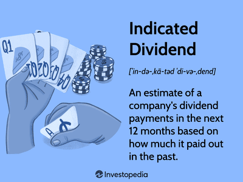

The Walt Disney Company, commonly referred to as Disney (NYSE: DIS), is a leading entity within the global entertainment industry, renowned for its wide-ranging operations spanning media networks, theme parks, studio entertainment, and consumer products. Founded in 1923, Disney has built a significant presence across multiple platforms, establishing itself as a formidable brand synonymous with family entertainment, innovation, and creativity. Its portfolio includes renowned assets like ABC, ESPN, Pixar, Marvel, Lucasfilm, and the incomparable Disney theme parks that attract millions of visitors annually. This vast array of operations not only solidifies Disney's status as an entertainment giant but also underscores the complex nature of evaluating its financial undertakings, particularly its stock investments and dividend policies.

For potential investors, understanding the intricate details of stock investments and dividend policies is strategically important. Dividends can offer investors a steady cash flow and are a sign of a company’s robust financial health. Stock investment insights, particularly related to dividend strategies, are crucial for making informed decisions, allowing investors to weigh the benefits of potential returns against inherent risks. Evaluating a company's dividend history, policies, and future potential is vital, as it reflects on the company’s fiscal responsibility and shareholder value intentions. Moreover, with advancements in financial technology, algorithmic trading emerges as a tool for optimizing these investments, leveraging data analytics to refine trading strategies and potentially enhance investor returns.



This article aims to provide a comprehensive analysis of Disney's stock dividends, offering insights into its historical trends, current policy, and financial performance. Furthermore, it evaluates the potential of investing in Disney stocks through algorithmic trading, which helps to optimize trading decisions using algorithmic models that can identify patterns and trends in stock data. As we navigate through this exploration, the discussion hinges on the premise that a thorough understanding of Disney's fiscal strategies, coupled with advanced trading techniques, can significantly aid investors in maximizing their investment returns. Through this analysis, readers will gain valuable knowledge necessary for making informed investment choices with respect to Disney stocks.

## Table of Contents

## Overview of Disney's Dividend History

The Walt Disney Company, known for its expansive reach across the entertainment industry, has historically maintained a steady and impressive track record regarding dividend payments. Prior to the global upheaval caused by the COVID-19 pandemic, Disney had been a steadfast provider of dividends to its shareholders, showcasing a notable history of consistency and growth over a span of four decades. This pattern of increasing dividends has been a significant component of Disney's appeal to a broad base of investors seeking stable income coupled with the potential for capital appreciation.

Before the pandemic, Disney demonstrated a consistent commitment to enhancing shareholder value through regular dividend increments. This growth trajectory was part of a broader corporate strategy to maintain investor confidence and attract new interest by reflecting a stable financial foundation and robust future prospects. This strategy aligned with Disney's operational expansions and diversified income streams, ranging from its blockbuster movie productions to its globally renowned theme parks and consumer products.

However, the advent of the COVID-19 pandemic in early 2020 introduced unprecedented challenges, drastically impacting Disney's operations, especially with prolonged closures of parks and resorts, and disruptions in its theatrical and retail operations. Responding to these challenges, Disney made the difficult decision to suspend its dividend payments in July 2020. This suspension was one aspect of a broader financial strategy to conserve cash and maintain operational [liquidity](/wiki/liquidity-risk-premium) amid the uncertainty surrounding global economic conditions and recovery timelines.

As the pandemic's impact began to be better managed and economic conditions showed signs of stabilization, the discourse around dividend resumption gained [momentum](/wiki/momentum) among analysts and investors. However, as of the latest updates, Disney has yet to formally resume its dividend payments. The company's current strategy reflects a cautious approach, likely influenced by ongoing financial evaluations and the imperative to recover and stabilize its core business segments fully.

The potential resumption of dividends will probably hinge on Disney's financial recovery and strategic ambitions, particularly its emerging focus on streaming services, which have become increasingly significant revenue drivers. Any shifts in strategy concerning dividend payments will likely reflect broader fiscal decisions and market conditions, especially considering the evolving landscape of the global entertainment industry.

In summary, while Disney's dividend history has been marked by remarkable stability and growth, the pandemic introduced a notable pause, with the future of these payments depending heavily on ongoing recovery efforts and strategic business priorities.

## Current Dividend Policy and Metrics

Disney's current dividend policy reflects its cautious approach to capital management in the post-pandemic economic landscape. Prior to the COVID-19 pandemic, Disney had established a robust record of dividend payments, characterized by a steady increase over several decades. However, in July 2020, the company suspended its dividend payments as a strategic measure to preserve cash in an uncertain market environment.

As of the latest data available, Disney has not yet resumed regular dividend payments, which marks a deviation from the company's long-standing policy of shareholder returns through dividends. The absence of regular dividends indicates a shift in focus towards reinvestment into core business areas and managing debt incurred during the pandemic. This strategic pivot is pivotal for potential investors considering Disney's stock for dividend income.

For investors analyzing Disney's dividend potential, it's crucial to consider the payout ratio, which historically had been conservative, reflecting prudent financial practices. The payout ratio, calculated as:

$$
\text{Payout Ratio} = \frac{\text{Total Dividends Paid}}{\text{Net Income}}
$$

remains a key metric, although currently less relevant due to the dividend suspension. Previously, Disney's payout ratio was sustainable, ensuring dividends while still allowing for growth investments.

The yield percentage, determined by the formula:

$$
\text{Dividend Yield} = \frac{\text{Annual Dividend Per Share}}{\text{Price Per Share}} \times 100
$$

is not applicable in the absence of dividend payments. However, historically, dividend yields for Disney were modest, suggesting the stock's attractiveness was more aligned with long-term growth and capital appreciation rather than high dividend returns.

Disney had a semi-annual payout frequency before the suspension. With dividends currently off the table, the focus for potential investors shifts to anticipating if and when Disney will reinstate its dividends, potentially yielding more competitive returns. Although there have been no explicit announcements regarding changes to dividend growth policies, any future dividend strategy will likely consider the company's post-pandemic financial health, revenue generation capabilities, and broader economic conditions.

In the interim, shareholder yield, which combines dividends and stock buybacks, serves as an alternative indicator of shareholder returns. While dividends are suspended, any share buyback activities will contribute to this metric, although Disney's primary strategy appears to emphasize reinvestment and debt management over immediate shareholder returns.

Investors seeking dividends must stay informed of Disney's financial performance and management's strategic communications regarding any future changes in dividend policy, as these will be critical in shaping the potential yield from Disney stock.

## Algorithmic Trading Insights on Disney Stock

Algorithmic trading, often referred to as algo trading, involves using computer algorithms to execute trades at optimal conditions by analyzing large datasets in real-time. Its relevance in investment strategies has grown substantially, as it enables investors to execute trades at speeds and frequencies that surpass human capabilities. Through [algorithmic trading](/wiki/algorithmic-trading), decisions are informed by historical data patterns, statistical models, and predictive analytics, allowing for more efficient management of stock investments such as those of the Walt Disney Company (DIS).

For Disney stock, algorithmic trading can optimize investment strategies by leveraging data analytics to identify trade opportunities based on various patterns and trends. Historical price data, trading volumes, and sentiment analysis from news and social media can be integrated into algorithmic models to enhance prediction accuracy.

One prevalent technique involves the use of moving averages. Traders may implement algorithms that monitor Disney's stock price relative to its short-term and long-term moving averages. When the short-term average crosses above the long-term average, it might signal a buying opportunity, while the opposite could suggest a sell-off. These indicators can be implemented in Python as follows:

```python
import pandas as pd

# Suppose stock_data is a DataFrame containing Disney's historical prices
# with a 'Close' column for the daily closing price
short_window = 40  # Short-term moving average window
long_window = 100  # Long-term moving average window

# Calculate moving averages
stock_data['Short_MA'] = stock_data['Close'].rolling(window=short_window, min_periods=1).mean()
stock_data['Long_MA'] = stock_data['Close'].rolling(window=long_window, min_periods=1).mean()

# Identify signals
buy_signals = (stock_data['Short_MA'] > stock_data['Long_MA']) & (stock_data['Short_MA'].shift(1) <= stock_data['Long_MA'].shift(1))
sell_signals = (stock_data['Short_MA'] < stock_data['Long_MA']) & (stock_data['Short_MA'].shift(1) >= stock_data['Long_MA'].shift(1))

stock_data['Buy_Signal'] = buy_signals
stock_data['Sell_Signal'] = sell_signals
```

Beyond moving averages, more complex models such as regression analysis and [machine learning](/wiki/machine-learning) algorithms like Random Forests or Support Vector Machines (SVM) can further refine signals by assessing multiple factors simultaneously, including macroeconomic indicators, sector performance metrics, and consumer sentiment indices.

Algorithmic trading can discern patterns related to various market phases or news impacts that might elicit specific reactions in Disney's stock pricing. For instance, significant releases related to Disney's media content or theme park operations may instigate predictable fluctuations that sophisticated algorithms can exploit to time investments more effectively.

Merging algorithmic trading insights with traditional investment strategies can not only optimize returns but also manage risks associated with sudden market changes. Investors employing these techniques must understand the statistical underpinnings and continuously refine their models to adapt to new data, ensuring the strategies remain aligned with Disney's evolving financial landscape and market conditions.

## Disney's Financial Performance and Dividend Future

The Walt Disney Company, a key player in the global entertainment industry, has demonstrated a complex financial performance pattern that has significant implications for its dividend future. Historically, Disney has managed substantial revenue across various segments including Media Networks, Parks, Experiences and Products, Studio Entertainment, and Direct-to-Consumer & International. Each segment plays a critical role in shaping the company’s overall financial health.

### Financial Performance Overview

#### Net Income and Revenue Trends

Disney's net income has experienced [volatility](/wiki/volatility-trading-strategies), influenced by economic conditions, strategic investments, and shifts in consumer behavior. For instance, the COVID-19 pandemic temporarily disrupted traditional revenue streams, particularly in segments such as Parks and Experiential Products, which led to a marked reduction in net income. However, recovery efforts and strategic expansions have contributed to revenue rebounds, notably in their streaming services under Direct-to-Consumer & International through platforms like Disney+.

##### Revenue from Key Segments:

1. **Media Networks**: As a leading revenue generator, Media Networks, including ESPN and ABC, have seen steady income streams due to advertising revenues and affiliate fees. 
2. **Parks, Experiences and Products**: This segment faced setbacks during the pandemic but has rebounded strongly with the reopening of parks and resorts.
3. **Studio Entertainment**: The theatrical release of blockbuster films and series on streaming services continue to bolster this segment's revenue.
4. **Direct-to-Consumer & International**: Rapid growth in subscription numbers for Disney+ and related services represents a pivotal revenue source, showing resilience and potential for scalable growth.

#### Debt Levels

Disney's debt levels have fluctuated as it pursues strategic acquisitions and investments. Significant issuance of debt has been employed to fund ventures like the acquisition of 21st Century Fox, necessitating careful management of leverage to optimize financial stability.

### Prospects of Future Dividend Increases

The reinstatement or adjustment of Disney's dividend yields is contingent upon its financial strategy and performance. Key indicators such as cash flow, profitability, and debt servicing capacity will dictate these policies. 

- **Cash Flow**: Positive operational cash flow is critical for sustaining and eventually growing dividend payouts.
- **Debt Management**: Efficient debt management post-acquisition phases will influence the company’s ability to allocate funds for dividends.
- **Revenue Growth**: Continued growth in profitable segments, such as DTC & International, could allow for increased dividend capacity.

### Expert Opinions 

Financial experts have mixed views on Disney’s ability to immediately reinstate robust dividends. Many suggest a cautious approach, advocating for reinvestment in growth opportunities, particularly in digital and international markets which are expected to yield longer-term returns. However, increases in dividend yield may become feasible with sustained revenue recovery and prudent financial management strategies.

In conclusion, Disney's financial trajectory suggests potential for dividend strategy adjustments. Investment in growth sectors and efficient financial management will be pivotal in influencing future dividend prospects. Investors should remain attuned to Disney’s financial reports and strategic announcements to gauge the likelihood of dividend increase and to make informed investment decisions.

## Investment Risks and Considerations

Investing in Disney stocks involves certain risks that investors should consider carefully. One major risk [factor](/wiki/factor-investing) is market volatility, which can result from broader economic conditions or specific industry challenges facing the entertainment sector. Factors such as fluctuations in consumer demand, changes in media consumption habits, and competition from streaming services like Netflix and Amazon Prime can all impact Disney's stock performance.

Digital transformation presents both opportunities and challenges for Disney. As the company continues to invest in its streaming platform, Disney+, there is a potential risk of significant capital allocation without guaranteed returns. The streaming market is highly competitive, and capturing market share requires substantial investment in content acquisition and technology infrastructure. The rate of subscriber growth and retention is crucial to driving revenue and offsetting high operational costs.

Consumer spending habits are also a critical concern. Economic downturns or declines in discretionary income can negatively affect Disney's theme parks, cruise lines, and movie ticket sales. The company's diverse revenue streams, while advantageous, are susceptible to shifts in consumer behavior during uncertain economic times.

To mitigate these risks, investors should adopt a diversified investment strategy. Diversification can help reduce exposure to Disney-specific risks by balancing the portfolio with investments in different sectors or asset classes. Additionally, investors should stay informed about trends in digital media and entertainment, as well as macroeconomic indicators impacting consumer spending. Regularly reviewing financial metrics such as Disney's earnings reports and debt levels can provide valuable insights into the company's financial health and future dividend prospects.

Furthermore, utilizing algorithmic trading techniques may enhance investment strategies by applying data analytics to identify trends and optimize timing for buying or selling Disney stocks. This data-driven approach can potentially mitigate market volatility by providing predictive insights and highlighting optimal trading opportunities.

In conclusion, while investing in Disney stocks offers potential rewards, it is essential for investors to remain vigilant about the inherent risks. By considering external factors, diversifying investments, and leveraging advanced trading strategies, investors can better navigate the complexities of Disney's stock market presence.

## Conclusion

The Walt Disney Company's stock dividends and investment potential present unique opportunities for informed investors. Historically, Disney has shown a commitment to rewarding its shareholders through consistent dividend payments, which were only disrupted by unforeseen circumstances such as the COVID-19 pandemic. The company's current dividend policy reflects strategic considerations aimed at balancing financial sustainability with shareholder returns. 

A balanced investment strategy that leverages both dividends and algorithmic trading can optimize investment outcomes. Dividends provide a steady income stream, enhancing the overall return on investment, especially for those seeking long-term growth. Meanwhile, algorithmic trading, with its data-driven approach, can offer significant advantages by identifying stock trends and patterns, allowing investors to make informed decisions with precision and speed.

Despite the potential rewards, investors should remain vigilant to the risks associated with Disney stocks, including market volatility and evolving industry dynamics. External factors such as digital transformation and consumer spending habits can significantly impact the company's performance and, consequently, its dividend policies. Therefore, conducting thorough research and aligning investments with personal financial goals is imperative for potential investors. 

Ultimately, Disney's financial performance and strategic initiatives will guide future dividend decisions. By integrating dividends and algorithmic trading into a cohesive investment approach, investors can enhance their portfolio's resilience and growth potential. As with any investment, continuous reassessment and adaptation to changing market conditions will be key to achieving success.

## References & Further Reading

[1]: Bergstra, J., Bardenet, R., Bengio, Y., & Kégl, B. (2011). ["Algorithms for Hyper-Parameter Optimization."](https://dl.acm.org/doi/10.5555/2986459.2986743) Advances in Neural Information Processing Systems 24.

[2]: ["Advances in Financial Machine Learning"](https://www.amazon.com/Advances-Financial-Machine-Learning-Marcos/dp/1119482089) by Marcos Lopez de Prado

[3]: ["Evidence-Based Technical Analysis: Applying the Scientific Method and Statistical Inference to Trading Signals"](https://www.amazon.com/Evidence-Based-Technical-Analysis-Scientific-Statistical/dp/0470008741) by David Aronson

[4]: ["Machine Learning for Algorithmic Trading"](https://github.com/stefan-jansen/machine-learning-for-trading) by Stefan Jansen

[5]: ["Quantitative Trading: How to Build Your Own Algorithmic Trading Business"](https://www.amazon.com/Quantitative-Trading-Build-Algorithmic-Business/dp/1119800064) by Ernest P. Chan

[6]: ["The Walt Disney Company Annual Report and Financial Statements"](https://thewaltdisneycompany.com/app/uploads/2024/02/2023-Annual-Report.pdf) - A valuable resource for understanding Disney's financial performance, including dividend decisions.

[7]: Damodaran, A. (2001). ["Corporate Finance: Theory and Practice"](https://archive.org/details/corporatefinance0000damo_v8d8) - Discusses dividend policy and corporate financial strategies. 

[8]: Bodie, Z., Kane, A., & Marcus, A. J. (2014). ["Investments and Portfolio Management."](https://books.google.com/books/about/EBOOK_Investments_Global_edition.html?id=BMsvEAAAQBAJ) McGraw-Hill Education. - Provides a comprehensive overview of investment strategies, including dividend analysis.