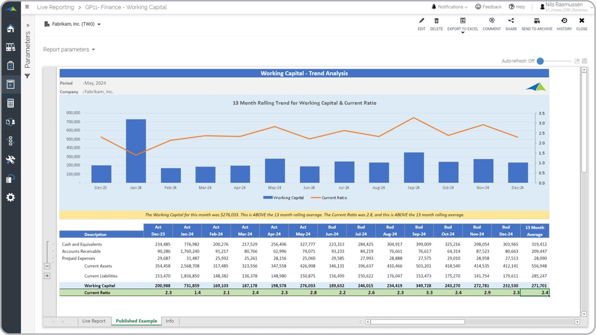

In today's dynamic business environment, understanding key financial concepts is crucial for effective financial management and strategic decision-making. As businesses navigate increasingly complex financial landscapes, integrating knowledge of business finance, working capital, financial analysis, and algorithmic trading becomes vital. This article examines these interconnected areas, shedding light on their collective role in forming a robust financial strategy.

Business finance, at its core, is about managing a company's funds to achieve its strategic objectives. It requires meticulous planning, accurate analysis, and efficient management of financial resources to ensure liquidity and profitability while optimizing the capital structure. Working capital, on the other hand, provides a real-time snapshot of a company's operational efficiency and short-term financial health. It is calculated as the difference between current assets and current liabilities, indicating the firm's ability to meet its short-term obligations and operational demands.



Financial analysis serves as a crucial tool for decision-making. It involves interpreting financial statements to assess a company's profitability, liquidity, and solvency. Techniques such as ratio and trend analysis uncover insights into financial health and potential risks, helping businesses in strategic planning and investment decision-making.

Algorithmic trading represents the technological frontier in finance, automating trade execution based on predetermined criteria. It offers several advantages over traditional trading methods, including minimized transaction costs, reduced human error, and the ability to perform high-frequency trades. By incorporating strategies like trend-following or arbitrage, algorithmic trading enhances market liquidity and trade accuracy. As advancements in AI and machine learning continue to evolve, they offer new dimensions for predictive and analytical capabilities within this domain.

This article aims to elucidate how business finance, working capital management, financial analysis, and algorithmic trading interact, enabling businesses to harness their collective strengths. Readers will gain a comprehensive understanding of these foundational concepts, crucial for navigating the complexities of modern financial markets and formulating strategies that enhance financial performance and strategic decision-making.

## Table of Contents

## Understanding Business Finance

Business finance is essential for the effective management of a company's funds, aimed at achieving strategic objectives. It encompasses the planning, analysis, and management of financial resources to ensure liquidity, maintain profitability, and optimize the capital structure. 

One of the core components of business finance is financial planning, which involves forecasting future financial conditions and performance, budgeting resources accordingly, and setting aside provisions for unexpected liabilities. This proactive approach enables businesses to anticipate future financial needs and prepare for them, thereby enhancing their financial sustainability. 

Key to financial planning is the analysis of financial performance, which includes the interpretation of financial statements and key financial ratios. Financial statements such as the balance sheet, income statement, and cash flow statement provide critical insights into a company's financial health. They reveal information about the company's assets, liabilities, revenue, expenses, and cash flows, enabling comprehensive financial assessment. 

Financial ratios, derived from these statements, serve as quantitative measures to evaluate various aspects of a company's performance and financial condition. Common ratios include:

1. **Liquidity Ratios**: These measure a company's ability to cover its short-term obligations. The Current Ratio ($\text{Current Ratio} = \frac{\text{Current Assets}}{\text{Current Liabilities}}$) is one such example, where a ratio of more than 1 indicates a good short-term financial position.

2. **Profitability Ratios**: These ratios assess a company's ability to generate earnings relative to its revenue, operating costs, and shareholders' equity over time. For instance, the Gross Profit Margin ($\text{Gross Profit Margin} = \frac{\text{Gross Profit}}{\text{Revenue}} \times 100$%) reflects the efficiency in production and sales processes.

3. **Solvency Ratios**: These ratios analyze a company's long-term financial sustainability and its capacity to meet long-term obligations. The Debt to Equity Ratio ($\text{Debt to Equity Ratio} = \frac{\text{Total Debt}}{\text{Total Equity}}$) helps assess how a company finances its operations through debt versus wholly owned funds.

4. **Efficiency Ratios**: These examine how effectively a company utilizes its assets and liabilities to generate sales. The Inventory Turnover Ratio ($\text{Inventory Turnover} = \frac{\text{Cost of Goods Sold}}{\text{Average Inventory}}$) is often used to analyze how quickly inventory is sold and replaced over a period.

Through the careful use of these tools and techniques, business finance aims to ensure that a company not only remains financially stable but is also positioned for growth. The ongoing monitoring and analysis of financial performance allow businesses to adapt strategies in response to changing market conditions, investor expectations, and internal dynamics, thereby safeguarding their financial interests and fostering sustainable success.

## The Role of Working Capital

Working capital serves as a crucial indicator of a company's short-term financial health and operational efficiency. It is computed using the formula:

$$
\text{Working Capital} = \text{Current Assets} - \text{Current Liabilities}
$$

This metric reflects a firm's capability to meet its short-term obligations, which is vital for sustaining daily operations and avoiding potential [liquidity](/wiki/liquidity-risk-premium) issues. Effective working capital management requires balancing several components, such as inventories, accounts receivable and payable, and cash reserves.

Proper inventory management ensures that there is enough stock to meet customer demand without tying up excessive funds. This balance prevents both stockouts and overstock situations, which can lead to financial inefficiencies.

Accounts receivable management focuses on collecting payments from customers promptly, thereby enhancing liquidity. On the other hand, effectively managing accounts payable involves negotiating favorable credit terms with suppliers to optimize cash flow while maintaining good supplier relationships.

Cash reserve management is also a vital part of working capital management. Maintaining adequate cash reserves allows a company to handle unexpected expenses or financial emergencies, contributing to its financial stability.

Overall, the efficient management of working capital is crucial for operational efficiency and financial stability, as it ensures a company can maintain the optimal level of liquidity needed for business sustainability. This involves avoiding a liquidity crisis, which can occur if liabilities exceed assets, and preventing the excessive allocation of resources that could otherwise be utilized for growth opportunities.

## Financial Analysis as a Tool for Decision Making

Financial analysis serves as an indispensable component of strategic planning by providing a comprehensive evaluation of a business's financial performance. At its core, financial analysis involves interpreting the financial statements to assess key aspects such as profitability, liquidity, and solvency. This process transforms raw financial data into actionable insights, enabling more informed decision-making. 

A foundational aspect of financial analysis is the interpretation of financial statements. These statements, which include the balance sheet, income statement, and cash flow statement, provide the quantitative data necessary for assessing a company's financial health. By calculating and analyzing key financial ratios—such as the current ratio, debt-to-equity ratio, and return on equity—analysts gain insights into a firm's operational efficiency, leverage, and profitability. For example, the current ratio, calculated as current assets divided by current liabilities, helps in evaluating a company's short-term liquidity and its ability to meet impending obligations.

In addition to ratio analysis, trend analysis is employed to identify patterns and shifts in financial performance over time. By examining financial data across multiple reporting periods, trend analysis can uncover emerging risks or opportunities that may impact business strategy. For instance, a consistent decline in profit margins might signal the need for cost-reduction strategies or a reevaluation of pricing models.

Financial performance benchmarks provide another critical dimension of financial analysis. By comparing a company's metrics against industry standards or competitor benchmarks, analysts can assess relative performance and identify areas for improvement. This benchmarking process pinpoints competitive advantages or weaknesses, guiding strategic decisions that align with market realities.

In the context of investment, financial analysis is instrumental in evaluating potential opportunities and projecting future returns. It aids investors in discerning viable investments by estimating intrinsic values and potential growth trajectories. This predictive capacity is vital for informed capital allocation and risk management, ensuring that resources are deployed where they are most likely to generate optimal returns.

Moreover, financial analysis enhances risk management by identifying potential financial stress points. Understanding a company's solvency—the ability to meet long-term obligations—helps in anticipating financial distress and implementing preemptive measures. This capability to foresee and mitigate risks is crucial for sustaining business stability and growth over the long term.

In summary, financial analysis equips decision-makers with a robust framework for evaluating a company's financial status and potential. By leveraging techniques like ratio and trend analysis and utilizing comparative benchmarks, businesses can make strategic decisions that optimize performance and mitigate financial risks. As financial environments become increasingly complex, the insights derived from thorough financial analysis are indispensable tools for navigating today's competitive landscape.

## Algorithmic Trading: Revolutionizing Finance

Algorithmic trading, often referred to as algo trading or automated trading, automates the process of executing trades based on a set of predefined criteria. This technological advancement has significantly enhanced market liquidity and trading accuracy by reducing the time and effort required to execute complex trading strategies. Through the automation of trading tasks, [algorithmic trading](/wiki/algorithmic-trading) minimizes human error and lowers transaction costs, allowing for high-frequency trading ([HFT](/wiki/high-frequency-trading-strategies)), where trades are executed at extremely high speeds and volumes.

Among the strategies employed in algorithmic trading, trend-following is a popular approach, where algorithms identify and capitalize on ongoing market trends. Another strategy, [arbitrage](/wiki/arbitrage), involves exploiting price differentials in different markets or instruments, allowing traders to lock in profits with minimal risk. Additionally, index rebalancing involves adjusting a portfolio to maintain the proportions of assets in line with a specific index, a task that can be effectively automated to match market movements efficiently.

Despite its advantages, algorithmic trading faces several challenges. High initial setup costs can be a barrier, as establishing a robust infrastructure requires significant investment in technology and development. Furthermore, algorithmic trading's reliance on technology makes it susceptible to technical issues and vulnerabilities, such as system failures or cyberattacks. Regulatory concerns also pose a challenge, as governing bodies impose strict rules and scrutiny to mitigate potential market manipulation and ensure fair trading practices.

Algorithmic trading is continually evolving, driven by advancements in [artificial intelligence](/wiki/ai-artificial-intelligence) (AI) and [machine learning](/wiki/machine-learning). These technologies improve predictive and analytical capabilities, allowing algorithms to process vast amounts of data and adapt trading strategies in real-time. Machine learning models can analyze historical and current market data to predict future price movements, while AI can optimize trading strategies to maximize returns and mitigate risks.

An example of a simple algorithmic trading strategy implemented in Python might involve using moving averages to inform trade decisions:

```python
import pandas as pd
import numpy as np

# Assuming 'data' is a pandas DataFrame containing stock prices with 'Close' price column
data['Short_MA'] = data['Close'].rolling(window=40, min_periods=1).mean()
data['Long_MA'] = data['Close'].rolling(window=100, min_periods=1).mean()

# Generating trading signals based on moving average crossover
data['Signal'] = 0
data['Signal'][40:] = np.where(data['Short_MA'][40:] > data['Long_MA'][40:], 1, -1)

# Calculating returns
data['Returns'] = data['Close'].pct_change()
data['Strategy_Returns'] = data['Signal'].shift(1) * data['Returns']

cumulative_return = (1 + data['Strategy_Returns']).cumprod() - 1
print("Cumulative Return: {:.2f}%".format(cumulative_return.iloc[-1] * 100))
```

This code demonstrates a moving average crossover strategy, where a buy signal is generated when the short-term moving average exceeds the long-term moving average, and a sell signal is vice versa. Such strategies can be easily extended and enhanced with more complex analyses and indicators, reflecting the adaptability and potential of algorithmic trading in the financial markets.

## Integrating Financial Analysis and Algorithmic Trading

Combining financial ratios with algorithmic trading has introduced substantial advancements in financial technology. This integration allows for automated systems that can modify trading strategies in real-time, based on live financial data. The primary function of these systems is to enhance market responsiveness and accuracy through the dynamic adaptation of strategies that were traditionally static.

These automated trading systems rely on the precise interpretation of financial ratios, which are indicators of company performance derived from their financial statements. Ratios such as the current ratio, quick ratio, and debt-to-equity ratio provide insights into a firm's liquidity, operational efficiency, and financial stability. By incorporating these ratios, algorithms can assess the financial health of companies and adjust trading positions accordingly.

The integration of algorithmic systems with conventional financial analysis allows for improved asset allocation and risk management. This is crucial for maintaining a resilient investment strategy, especially in volatile markets. For instance, when a financial ratio indicates potential instability in a company, algorithms can minimize exposure to risk by reallocating investments to more stable entities or hedging positions through derivatives.

Artificial Intelligence (AI) and machine learning play pivotal roles in this integration by providing sophisticated tools for predictive analytics and decision-making. Machine learning algorithms can be trained on historical data to identify patterns and predict future market trends, thereby informing trading decisions. AI-driven systems can process vast amounts of data more swiftly than human analysts, enabling quicker response times to market changes.

Python stands out as a preferred programming language for implementing these trading algorithms due to its simplicity and the vast array of libraries available for data analysis and machine learning. Libraries like Pandas and NumPy allow for efficient data manipulation and computation, while Scikit-learn and TensorFlow offer robust frameworks for developing and deploying machine learning models. An example of a simple Python script for calculating a common financial ratio might look like this:

```python
import pandas as pd

# Sample data
financials = {'current_assets': [100000, 150000], 'current_liabilities': [40000, 50000]}
df = pd.DataFrame(financials)

# Calculate Current Ratio
df['current_ratio'] = df['current_assets'] / df['current_liabilities']

print(df[['current_assets', 'current_liabilities', 'current_ratio']])
```

Incorporating financial analysis into algorithmic trading systems creates a sophisticated synergy that optimizes both technological and analytical capabilities. The continued evolution of AI and machine learning algorithms will further refine the ways in which financial ratios inform real-time trading decisions, leading to more nuanced and effective risk management and investment strategies.

## Conclusion

The synergy between business finance, working capital, financial analysis, and algorithmic trading forms a foundation for robust financial strategies. Each element plays a vital role in managing and optimizing financial resources effectively. Understanding these components enables businesses to enhance financial performance and bolster strategic decision-making capabilities.

As financial markets continue to evolve, the integration of traditional financial analysis with algorithmic trading solutions creates opportunities for growth and innovation. Algorithmic trading systems, empowered by advancements in artificial intelligence and machine learning, allow for real-time data analysis and the dynamic adjustment of trading strategies. These technologies improve trade execution and market efficiency, offering significant advantages over conventional methods.

Technological advancements are reshaping the landscape of financial management and trading. By leveraging these changes, businesses can achieve better asset allocation, enhance risk management, and ultimately achieve superior profitability. This integration of technology and finance requires a strategic approach, ensuring that businesses remain agile and responsive to market developments.

Embracing the synergy between these elements will position businesses to capitalize on the future of finance. By combining robust financial strategies with cutting-edge technological solutions, companies can navigate financial complexities with increased confidence and efficiency. This proactive approach will lead to sustained growth and competitive advantage in the ever-changing financial environment.

## References & Further Reading

"Advances in Financial Machine Learning" by Marcos Lopez de Prado explores the integration of machine learning techniques in financial markets. This book investigates into advanced statistical methods and algorithms tailored to the financial domain, offering insights into developing predictive models and optimizing trading strategies. Lopez de Prado's work is essential for understanding how data-driven approaches can address the complexity of market behaviors and enhance decision-making processes.

"Quantitative Trading: How to Build Your Own Algorithmic Trading Business" by Ernest P. Chan serves as a comprehensive guide for aspiring quant traders. Chan details the step-by-step process of constructing a profitable trading business using algorithmic techniques. The book covers essential topics such as strategy development, risk management, and the implementation of algorithms in live markets, making it a valuable resource for both beginners and seasoned professionals.

"Machine Learning for Algorithmic Trading" by Stefan Jansen provides a thorough examination of how machine learning can be leveraged to build sophisticated trading systems. Covering a diverse set of topics, from feature engineering to backtesting trading algorithms, Jansen's book is an extensive resource for practitioners aiming to apply machine learning techniques to improve trading performance. The book also emphasizes Python as the primary programming language, offering practical examples and code snippets.

Investopedia offers a range of articles on key financial topics such as working capital management, financial ratios, and algorithmic trading. These articles provide foundational knowledge and insights into the strategies and tools used to analyze financial health and optimize trading. From understanding the importance of maintaining liquidity through effective working capital management to evaluating company performance using financial ratios, Investopedia's resources are invaluable for anyone looking to enhance their understanding of financial analysis and algorithmic trading concepts.

Each of these publications provides a unique perspective and depth of knowledge that collectively enhance the understanding of financial strategy, analysis, and technological integration. These resources are recommended for further exploration and detailed learning in these dynamic fields.

