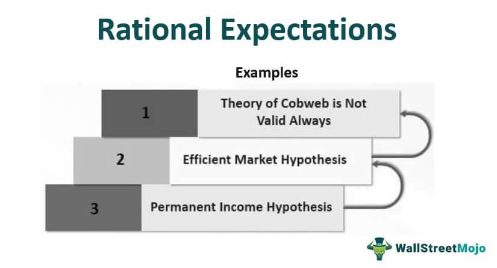

The field of financial analysis and investment forecasting has undergone a transformative shift with the integration of algorithmic trading (algo trading) and advanced artificial intelligence (AI) methodologies. This evolution leverages cutting-edge technology to process vast amounts of data, enhancing the accuracy and efficiency of market predictions. Analyst expectations continue to be pivotal in this ecosystem, where they shape market dynamics by providing informed predictions on stock performance. These predictions are derived using a variety of analytical techniques, including fundamental analysis and sophisticated quantitative models, which help investors make informed decisions.

Algorithmic trading employs pre-set rules and computer algorithms to execute trades, offering a systematic approach to financial markets. This method capitalizes on the ability to analyze enormous datasets in real-time and make rapid trading decisions, tuning strategies to market conditions moment by moment. The sophistication of algo trading systems has increased markedly with AI advancements, particularly through machine learning and neural networks. These technologies enable the identification and analysis of patterns that could affect market trajectories, refining both market predictions and trading strategies.



AI is revolutionizing the trading landscape by offering deeper insights into market behavior and the creation of efficient trading strategies. It allows for the processing of real-time data from diverse sources and offers a dynamic approach to investment forecasts, enhancing the speed and robustness of predictions. This integration of AI into trading systems is poised to further redefine market dynamics, especially as these systems continue to evolve.

Our exploration will cover context-specific financial trading scenarios, providing illustrative examples to highlight how these systems operate in practice. This narrative is crucial for understanding how financial analysis, investment forecasts, analyst expectations, and algorithmic trading harmonize to create a new paradigm in financial markets, providing substantial opportunities for traders and investors alike.

## Table of Contents

## Understanding Financial Analysis and Investment Forecast

Financial analysis involves a comprehensive evaluation of a company's financial data to assess its current performance, stability, and potential for future growth. The process typically includes examining a company’s financial statements, such as the balance sheet, income statement, and cash flow statement, to gain insights into profitability, [liquidity](/wiki/liquidity-risk-premium), solvency, and efficiency metrics.

Investment forecasts, on the other hand, are projections about the likely performance of investments across various sectors. These forecasts are instrumental for investors as they make strategic decisions about asset allocation and risk management. Analysts develop these forecasts by considering macroeconomic indicators, industry trends, and individual company performance.

Analyst expectations play a crucial role in shaping market perceptions. By synthesizing data from financial analyses, analysts generate actionable insights that guide investor behavior. The expectations are usually communicated through recommendations, such as "buy," "sell," or "hold," which can significantly impact stock prices and market trends. An analyst's forecast about a company's earnings, for instance, may lead to adjustments in stock prices if the actual earnings deviate from the forecast.

The methodologies employed in financial analysis are diverse. Fundamental analysis examines the intrinsic value of a security by analyzing related economic, financial, and other qualitative and quantitative factors. It involves evaluating a company’s revenue, profit margins, return on equity, and growth potential. Fundamental analysts might use the Gordon Growth Model $(P = \frac{D_1}{r-g})$ to determine the fair value of a stock, where $P$ is the price, $D_1$ is the expected dividend, $r$ is the required rate of return, and $g$ is the growth rate of dividends.

Technical analysis, in contrast, focuses on statistical trends derived from trading activity, such as price movement and [volume](/wiki/volume-trading-strategy). Technical analysts employ charts and other tools to identify patterns and forecast future market behaviors. Indicators like moving averages and the Relative Strength Index (RSI) are commonly used to spot potential buy or sell signals.

Quantitative models are increasingly utilized in financial analysis, leveraging mathematical and statistical techniques to assess securities and market conditions. These models often employ regression analysis, [machine learning](/wiki/machine-learning) algorithms, and other computational tools to derive insights from large datasets. Python, with libraries such as pandas, numpy, and scikit-learn, is frequently used for developing these quantitative models. For example, a simple linear regression to predict stock returns could be implemented as follows:

```python
import pandas as pd
from sklearn.linear_model import LinearRegression

# Assuming 'data' is a pandas DataFrame with columns 'Returns' and 'Market'
X = data[['Market']]  # market returns
y = data['Returns']   # stock returns

model = LinearRegression().fit(X, y)
predictions = model.predict(X)
```

Integrating these methodologies allows analysts to construct a comprehensive financial outlook, providing valuable predictions that guide investment strategies. As the financial market continues to evolve with technological advancements, the precision and relevance of financial analysis and investment forecasts are expected to increase, aiding investors in making informed decisions in an increasingly complex market landscape.

## Role of Analysts and Their Expectations

Financial analysts play a vital role in the functioning of financial markets by using an array of analytical techniques to forecast market trends. These analysts scrutinize economic indicators, financial statements, industry reports, and other pertinent data to predict future stock performance. These expectations serve a dual purpose: they forecast potential stock price movements and establish benchmarks for assessing a company's performance relative to market predictions.

The accuracy of analyst expectations is pivotal because even minor discrepancies can lead to substantial stock price [volatility](/wiki/volatility-trading-strategies). For instance, if a company does not meet these expectations, it can result in a sharp decline in its stock price as investors adjust their positions based on the updated outlook. This reaction underscores the crucial influence that analyst expectations exert on investor behavior and market dynamics.

A multitude of factors impact these expectations. Macroeconomic factors such as changes in interest rates, inflation rates, and GDP growth are integral as they provide a backdrop against which businesses operate. For example, a rise in interest rates might imply increased borrowing costs for companies, affecting their future profitability and, consequently, their stock valuations. Company-specific factors like earnings reports, management guidance, and strategic initiatives also significantly influence expectations. An announcement of a new product line or a major acquisition could, for instance, lead analysts to revise their forecasts upwards. Furthermore, industry trends, such as technological advancements or regulatory changes, can also shape analyst predictions.

Consensus expectations emerge from aggregating the views of multiple analysts. These consensus forecasts are often used by investors as a benchmark for the collective market sentiment on a stock. They are typically calculated as the mean or median of all analysts' projections. This aggregation helps mitigate the potential biases and errors of individual forecasts, providing a more balanced outlook. For example, if five analysts forecast earnings of $1.00, $1.10, $1.05, $1.02, and $1.08 per share for a particular company, the consensus expectation might be calculated as the average, yielding $1.05 per share.

Overall, the role of analysts and their predictions is indispensable for market participants seeking to navigate the complexities of financial markets. Through their detailed analyses and forecasts, they provide invaluable insights that drive investment decisions and help maintain market efficiency.

## Algorithmic Trading: Revolutionizing Market Forecasting

Algorithmic trading leverages automated processes and sophisticated computer algorithms to execute trades with remarkable speed and precision. These algorithms operate on pre-defined rules and strategies, enabling traders to capitalize on market inefficiencies and optimize trading outcomes. The ability to analyze vast datasets in real-time and respond instantaneously to market fluctuations is a hallmark of [algorithmic trading](/wiki/algorithmic-trading) systems, positioning them as critical tools in modern financial markets.

The integration of [artificial intelligence](/wiki/ai-artificial-intelligence) (AI) within algorithmic trading has significantly enhanced the capacity of these systems. AI-driven methodologies, such as [deep learning](/wiki/deep-learning) and neural networks, have become integral to developing more effective trading strategies. These techniques allow for the analysis of complex, non-linear relationships within market data that traditional methods might overlook. 

Deep learning models, characterized by their multi-layer [neural network](/wiki/neural-network) architectures, are particularly adept at identifying patterns in large, unstructured datasets. For instance, a deep learning algorithm can be trained to recognize and predict price trends based on historical data, news sentiment, and other relevant market indicators. Consider a simple feed-forward neural network implemented in Python for predicting stock prices:

```python
import numpy as np
from keras.models import Sequential
from keras.layers import Dense

# Sample data preparation (for illustration purposes)
X_train = np.array([[...], [...]])  # Feature set
y_train = np.array([..., ...])  # Target values (stock prices)

# Neural network architecture
model = Sequential()
model.add(Dense(units=64, activation='relu', input_dim=X_train.shape[1]))
model.add(Dense(units=64, activation='relu'))
model.add(Dense(units=1))  # Output layer for regression

# Compilation and training
model.compile(optimizer='adam', loss='mean_squared_error')
model.fit(X_train, y_train, epochs=100, batch_size=32)
```

In the code snippet above, a basic neural network is employed to learn from historical stock data to make future price predictions. While this example is simplified, real-world applications incorporate far more sophisticated models and datasets.

Algorithmic trading systems have demonstrated success in efficiently navigating complex financial environments through numerous case studies. For example, Renaissance Technologies, a pioneer in applying quantitative models to trading, has consistently outperformed traditional investment firms using algorithms that leverage a multitude of data sources to predict market movements.

The use of AI in trading also supports high-frequency trading ([HFT](/wiki/high-frequency-trading-strategies)), where algorithms execute thousands of trades in fractions of a second, exploiting minute price discrepancies. This approach demands substantial computational power and speed, where network latency and transaction costs become crucial considerations.

Overall, advancements in AI continue to revolutionize algorithmic trading, offering unmatched opportunities for precision and efficiency in market forecasting. These technologies not only enhance prediction accuracy but also enable traders to respond swiftly to evolving market conditions, thereby maintaining a competitive edge.

## Impact of AI on Analysts’ Predictions and Market Dynamics

Artificial Intelligence (AI) is redefining the landscape of financial analysis and investment forecasting by providing sophisticated tools that enhance the precision and timeliness of analysts’ predictions. Traditionally, financial analysts have relied on a combination of historical data assessments and subjective judgments to guide investment decisions. However, with AI's advancements, particularly in machine learning (ML), the process has become more data-driven and systematic.

Machine learning models, specifically, have proven adept at detecting complex patterns and correlations across large datasets, which may be impractical for human analysts to discern. By analyzing historical stock prices, financial statements, and economic indicators, these models can forecast future market movements with increased accuracy. For instance, ML algorithms, such as regression models, decision trees, and neural networks, can be employed to evaluate past data and make predictive models that suggest future stock price trajectories.

AI also significantly speeds up the handling of real-time data from an array of sources, such as social media, news outlets, and market trends, thereby providing a more immediate and accurate reflection of market dynamics. This agility allows analysts to adjust their forecasts and trading strategies swiftly in response to new information, thus capitalizing on evolving opportunities. High-frequency trading (HFT) and other advanced trading strategies heavily rely on AI's ability to execute rapid decisions by processing real-time data.

The integration of AI with existing financial analysis methodologies has resulted in hybrid systems that combine human intuition with computational efficiency. AI-powered tools assist analysts by providing insights that might not be immediately apparent through traditional methods alone. Examples of such tools include natural language processing (NLP) for sentiment analysis, which interprets news and social media content to aid in predicting market reactions, and [reinforcement learning](/wiki/reinforcement-learning) techniques used to simulate and optimize trading strategies in controlled environments.

For instance, AI platforms like AlphaSense and Kensho utilize AI capabilities to provide investment professionals with actionable insights by processing vast amounts of financial data quickly and effectively. These platforms assimilate diverse data points and present them in user-friendly formats, enabling analysts to draw informed conclusions with greater confidence.

Overall, the adoption of AI in financial analysis not only enhances prediction accuracy but also transforms market dynamics by enabling faster, more informed responses to market changes. This not only aids in forecasting market trends but also equips investors and analysts with powerful tools to mitigate risks and identify potential investment opportunities in a highly dynamic financial landscape.

## Challenges and Future Prospects of Algo Trading and Analyst Expectations

Algorithmic trading, while offering numerous benefits such as increased efficiency and the ability to process vast amounts of data swiftly, also presents several challenges. One significant issue is the technical risk associated with the reliance on complex algorithms. These systems can malfunction or make errors due to software bugs, flawed logic, or unexpected market conditions. As algorithmic strategies often operate at high frequencies, even minor errors can lead to substantial financial losses in a short time. Moreover, regulatory issues loom large as financial markets evolve technologically. Regulators continually strive to keep pace with technological advancements to ensure fair trading practices and prevent market manipulation, making the regulatory landscape a moving target for algo traders.

Market anomalies present another challenge for algorithmic trading. Markets are inherently volatile and can behave unpredictably due to unforeseen global events or financial crises. Algorithms designed based on historical data may struggle to adapt to unprecedented market conditions, leading to potential financial losses. Therefore, it is crucial for these systems to be adaptable, employing mechanisms such as machine learning to evolve with the changing market dynamics.

Analyst expectations remain vital in this context, bridging human insights with technological capabilities. As technology advances, analysts must adapt and refine their methodologies to incorporate new tools and data sources effectively. They play a critical role in refining algorithmic strategies by providing qualitative insights that algorithms may not be able to discern.

Looking to the future, quantum computing and artificial intelligence hold the promise of revolutionizing trading strategies and predictions further. Quantum computing, with its superior processing power, could potentially solve complex optimization problems that are currently intractable, leading to even more sophisticated trading algorithms. AI continues to enhance prediction accuracy through advanced models that learn from extensive datasets, identifying patterns that humans may overlook.

Investors navigating this evolving landscape should focus on integrating advanced technologies while maintaining a robust understanding of market fundamentals. They must remain vigilant about regulatory changes and technological advancements, continually updating their strategies to leverage new opportunities and mitigate risks. A balanced approach that combines technological expertise with traditional financial analysis can provide a competitive edge in the fast-paced world of financial trading.

## Conclusion

The integration of financial analysis, analyst expectations, investment forecasts, and algorithmic trading is ushering in a transformed era in financial markets. This transformation is deeply influenced by technological advancements, particularly in artificial intelligence (AI), which play a pivotal role in enhancing the accuracy, timeliness, and efficacy of market predictions and trading strategies. AI technologies, such as machine learning algorithms and neural networks, provide unprecedented capabilities in analyzing vast datasets, enabling traders to make more informed decisions.

Understanding the complexities of analyst expectations remains a cornerstone for traders seeking to gain a competitive edge. Analysts' predictions incorporate diverse analytical techniques and market factors, making them invaluable for assessing future stock performance. By effectively harnessing algorithmic methods, traders can optimize execution and achieve more favorable outcomes in rapidly changing markets.

As technology continues to evolve, the integration of advanced tools in financial trading presents both challenges and opportunities. Innovations such as quantum computing and sophisticated AI models are expected to further refine trading strategies and enhance predictive accuracy, offering new possibilities for market analysis.

Investors and analysts must remain agile and open to adaptation to navigate these evolving landscapes effectively. Staying informed about technological advancements and integrating these tools into existing investment practices will be crucial to capitalizing on market opportunities while mitigating associated risks. The balance between human insight and technological innovation will delineate success in the continuously advancing world of financial markets.

## References & Further Reading

[1]: Bergstra, J., Bardenet, R., Bengio, Y., & Kégl, B. (2011). ["Algorithms for Hyper-Parameter Optimization."](https://dl.acm.org/doi/10.5555/2986459.2986743) Advances in Neural Information Processing Systems 24.

[2]: ["Advances in Financial Machine Learning"](https://www.amazon.com/Advances-Financial-Machine-Learning-Marcos/dp/1119482089) by Marcos Lopez de Prado

[3]: ["Evidence-Based Technical Analysis: Applying the Scientific Method and Statistical Inference to Trading Signals"](https://www.amazon.com/Evidence-Based-Technical-Analysis-Scientific-Statistical/dp/0470008741) by David Aronson

[4]: ["Machine Learning for Algorithmic Trading"](https://github.com/stefan-jansen/machine-learning-for-trading) by Stefan Jansen

[5]: ["Quantitative Trading: How to Build Your Own Algorithmic Trading Business"](https://www.amazon.com/Quantitative-Trading-Build-Algorithmic-Business/dp/1119800064) by Ernest P. Chan