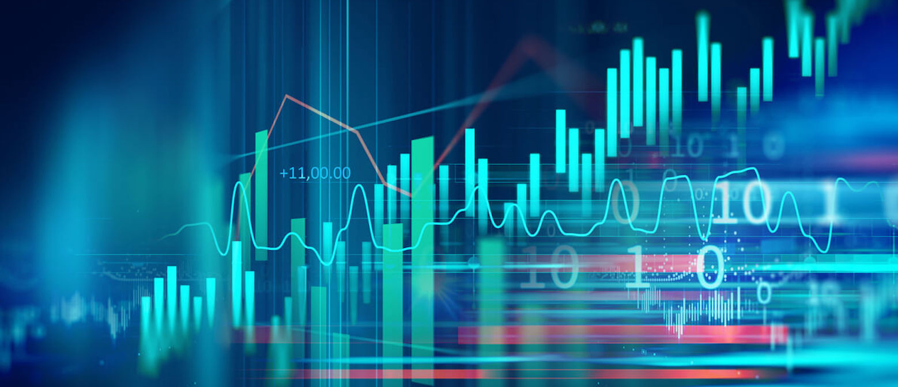

## Table of Contents

## What is data analytics and why is it important?

Data analytics is the process of looking at raw data to find useful information. It involves using different tools and methods to turn data into insights that can help people make better decisions. For example, businesses might use data analytics to understand their customers better or to find ways to improve their products.

Data analytics is important because it helps us make sense of large amounts of information. In today's world, there is so much data being created every day that it can be hard to know what to do with it all. By using data analytics, we can find patterns and trends that would be hard to see otherwise. This can lead to better decisions in areas like business, healthcare, and even sports, making things more efficient and effective.

## What are the different types of data analytics?

There are four main types of data analytics: descriptive, diagnostic, predictive, and prescriptive. Descriptive analytics is the simplest type. It looks at past data to tell you what happened. For example, it can show how many people visited a website last month. Diagnostic analytics goes a step further by trying to figure out why something happened. It might look at different pieces of data to find the reasons behind a trend or an event.

Predictive analytics uses data and math models to guess what might happen in the future. It can help businesses predict things like how many products they will sell next month or which customers might leave. Prescriptive analytics is the most advanced type. It not only predicts what will happen but also suggests what actions to take to get the best results. For instance, it might tell a company which products to promote to increase sales.

Each type of data analytics builds on the last, starting with understanding the past, moving to explaining why things happened, then predicting the future, and finally advising on what to do next. Together, they help people and organizations make smarter decisions based on data.

## How does data analytics differ from data science and business intelligence?

Data analytics, data science, and business intelligence are all about using data to make decisions, but they each do it in different ways. Data analytics focuses on looking at data to find useful information and understand what happened or why it happened. It uses tools and methods to turn raw data into insights that can help people make better choices. For example, a company might use data analytics to see how many people bought a product last month and why.

Data science is a broader field that includes data analytics but goes further. It involves not just analyzing data, but also creating new ways to collect, clean, and model data. Data scientists use math, [statistics](/wiki/bayesian-statistics), and computer science to find patterns and make predictions. They might build a model to predict future sales based on past data, which is more complex than just looking at what happened.

Business intelligence (BI) is about turning data into actionable information that can help businesses run better. BI tools help people see and understand data through reports and dashboards. It's often used to keep track of things like sales, costs, and customer behavior. While data analytics might focus on digging deep into the data, BI is more about giving a clear picture of what's happening in the business right now, so leaders can make quick decisions.

## What are the key steps in the data analytics process?

The data analytics process starts with gathering data from different places like databases, surveys, or websites. Once you have the data, you need to clean it. This means fixing any mistakes or missing pieces so the data is ready to use. After cleaning, you organize the data into a format that's easy to work with. This step is important because it makes sure your data is accurate and ready for analysis.

Next, you analyze the data using different tools and methods. This can mean looking for patterns, making charts, or using math models to find out what the data means. The goal is to turn the data into insights that can help answer questions or solve problems. Once you have your insights, the last step is to share them with others. This could be through reports, presentations, or dashboards. Sharing the results helps people make better decisions based on what the data shows.

## What tools and technologies are commonly used in data analytics?

Data analytics uses many tools and technologies to help people look at data and find useful information. Some popular tools are Microsoft Excel and Google Sheets, which are easy to use and good for basic data analysis. They let you organize data, make charts, and do simple calculations. For more advanced analysis, people often use software like Tableau or Power BI. These tools help create interactive dashboards and reports that make it easy to see patterns and trends in the data.

Other important tools include programming languages like Python and R, which are used for more complex data analysis. Python and R have many libraries and packages that help with tasks like cleaning data, making models, and running statistics. For working with big data, technologies like Apache Hadoop and Apache Spark are often used. They help process large amounts of data quickly and efficiently. All these tools together make it possible to turn raw data into insights that can help people make better decisions.

## How can data analytics be applied in various industries?

Data analytics can help many different industries in lots of ways. In healthcare, it can look at patient data to find patterns and help doctors make better decisions about treatments. It can also predict which patients might get sick, so they can be helped early. In retail, data analytics can show what customers like to buy and when they shop. This helps stores decide what products to stock and when to have sales. For example, if data shows that many people buy ice cream in summer, a store might order more ice cream during those months.

In sports, teams use data analytics to understand how players perform and to make game plans. By looking at data, coaches can see which strategies work best and how to improve player skills. In finance, banks and investment firms use data analytics to find risks and make smart investment choices. They can look at past market data to predict future trends and decide where to put their money. Overall, data analytics helps industries work better by giving them useful information to make decisions.

## What are some common data analytics techniques and methodologies?

Data analytics uses many techniques to find useful information from data. One common technique is data mining, which looks for patterns in large sets of data. It can find things like what products people often buy together or which customers are likely to leave. Another technique is statistical analysis, which uses math to understand data. It can help figure out if something happened by chance or if there's a real pattern. For example, it can tell if a new medicine really works or if the results are just luck.

Another important method is [machine learning](/wiki/machine-learning), which lets computers learn from data without being told exactly what to do. It can predict future events based on past data, like guessing how many people will visit a store next week. There's also text analytics, which looks at words in things like emails or social media posts to find out what people think or feel. This can help companies understand what customers like or don't like about their products. All these techniques help turn raw data into insights that people can use to make better decisions.

## How do you ensure data quality and integrity in data analytics?

To make sure data is good and stays correct in data analytics, you start by collecting data from reliable places. This means using sources that you can trust and checking that the data is complete and accurate. Once you have the data, you clean it. Cleaning means fixing mistakes, like spelling errors or missing information, and removing any data that doesn't belong. This step is important because if the data is wrong, your analysis will be wrong too. After cleaning, you organize the data in a way that makes it easy to work with, which helps keep the data accurate and ready for analysis.

Another way to keep data good is by using checks and rules during the analysis. This means setting up ways to make sure the data stays correct as you work with it. For example, you can use tools to spot strange data points that might be errors, and fix them before they cause problems. It's also important to keep track of where the data comes from and how it's been changed, so you can go back and check if something seems off. By being careful at every step, from collecting to analyzing, you can make sure the data you use is high quality and trustworthy.

## What are the challenges and limitations of data analytics?

One big challenge with data analytics is dealing with a lot of data. As more and more information is created every day, it can be hard to collect, store, and analyze it all. This is called "big data," and it can be tricky to manage. Another problem is making sure the data is good. If the data has mistakes or is missing important pieces, the results of the analysis might be wrong. This means people have to spend a lot of time cleaning and checking the data before they can use it.

Another limitation is that data analytics can sometimes be hard to understand. The tools and methods used can be complex, and not everyone knows how to use them. This can make it tough for people to trust the results or use them to make decisions. Also, data analytics can't always predict the future perfectly. There are many things that can change, and data from the past might not always tell us what will happen next. So, while data analytics is very helpful, it has its limits and challenges that people need to think about.

## How can data analytics drive decision-making and strategic planning?

Data analytics helps people make better decisions by showing them what is happening and why. When businesses use data analytics, they can look at things like how many people are buying their products, what customers like or don't like, and how well their marketing is working. This information helps them decide what to do next. For example, if data shows that a certain product is not selling well, a company might decide to change the product or run a special sale to boost sales. By using data to guide their choices, businesses can make smarter decisions that help them do better.

Data analytics also plays a big role in planning for the future. It can help businesses predict what might happen next, like how many products they will sell in the coming months or which new products customers might want. This is important for making long-term plans, like deciding where to invest money or how to grow the business. By looking at data, companies can create strategies that are based on real information, not just guesses. This makes their plans more likely to succeed and helps them stay ahead of their competition.

## What advanced data analytics techniques are used for predictive and prescriptive analytics?

Predictive analytics uses advanced techniques like machine learning to guess what will happen in the future. One common method is regression analysis, which looks at how different things are related to each other. For example, it can help predict how many ice creams a store might sell based on the weather. Another technique is time series analysis, which looks at data over time to find patterns and make predictions. This can be used to forecast things like sales or stock prices. Machine learning algorithms, like decision trees and neural networks, are also used a lot. They can learn from past data to make predictions about things like which customers might leave or what products will be popular.

Prescriptive analytics goes a step further by not just predicting the future but also suggesting what to do about it. It uses techniques like optimization algorithms to find the best way to solve a problem. For instance, it can help a company decide how to set prices to make the most profit. Simulation is another technique used in prescriptive analytics. It creates models of different situations to see what might happen if certain actions are taken. This can help businesses test out different strategies before they actually do them. By using these advanced techniques, prescriptive analytics helps people make better decisions and take the right actions to achieve their goals.

## How can organizations build and maintain a data-driven culture to enhance data analytics capabilities?

To build and maintain a data-driven culture, organizations need to start by making sure everyone understands how important data is. This means teaching people about data analytics and showing them how it can help make better decisions. Leaders should use data in their meetings and decisions, so others can see it in action. It's also important to give employees the right tools and training so they can work with data easily. When people see that using data leads to good results, they will be more likely to use it themselves.

Keeping a data-driven culture going takes work. Organizations should keep talking about the value of data and celebrate successes that come from using it. They can set up regular check-ins or meetings where teams share what they've learned from data and how it's helped them. It's also key to keep improving how data is collected and analyzed, so it stays useful and accurate. By making data a normal part of everyday work, organizations can keep their data-driven culture strong and continue to get the most out of their data analytics capabilities.

## References & Further Reading

[1]: ["Advances in Financial Machine Learning"](https://www.amazon.com/Advances-Financial-Machine-Learning-Marcos/dp/1119482089) by Marcos Lopez de Prado

[2]: ["Machine Learning for Algorithmic Trading"](https://www.oreilly.com/library/view/machine-learning-for/9781839217715/) by Stefan Jansen

[3]: ["Quantitative Trading: How to Build Your Own Algorithmic Trading Business"](https://books.google.com/books/about/Quantitative_Trading.html?id=j70yEAAAQBAJ) by Ernest P. Chan

[4]: ["Evidence-Based Technical Analysis: Applying the Scientific Method and Statistical Inference to Trading Signals"](https://www.amazon.com/Evidence-Based-Technical-Analysis-Scientific-Statistical/dp/0470008741) by David Aronson

[5]: Bergstra, J., Bardenet, R., Bengio, Y., & Kégl, B. (2011). ["Algorithms for Hyper-Parameter Optimization."](https://dl.acm.org/doi/10.5555/2986459.2986743) Advances in Neural Information Processing Systems 24.