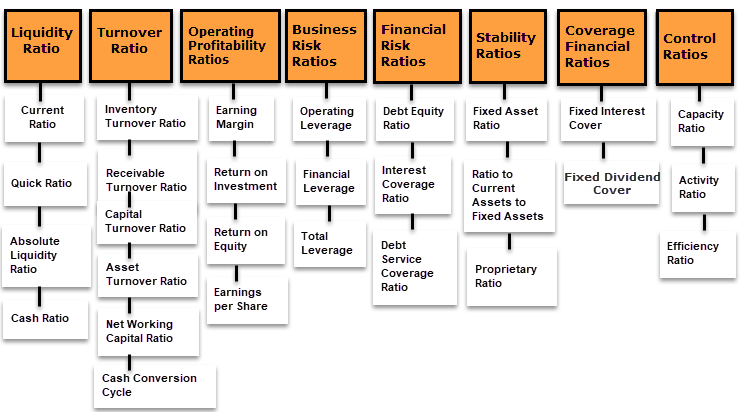

In this article, we examine the processes involved in evaluating a company's financial position via financial analysis and consider how algorithmic trading can benefit from comprehensive financial evaluations. Understanding a company's financial health is crucial for making informed investment decisions, providing critical insights into its viability and potential for returns. Investors and traders use these insights to assess different companies, enabling better decision-making in selecting where to allocate capital. 

Algorithmic trading relies on automated and algorithmic systems to make trading decisions, offering a way to execute trades with speed and precision. By analyzing comprehensive financial data, these systems can improve their decision-making processes, leading to optimized trading outcomes. The integration of financial analysis within algorithmic trading can enhance the effectiveness of trading strategies, providing a systematic approach to exploiting market opportunities while minimizing risks.



In conclusion, financial analysis plays a fundamental role in both traditional and algorithmic trading strategies by equipping investors with a structured methodology to assess financial health and make informed decisions.

## Table of Contents

## Understanding Financial Analysis

Financial analysis is the assessment of a company's financial statements to determine its performance and intrinsic value. Key components in financial analysis include the balance sheet, income statement, and cash flow statement, each offering essential insights into a company's financial health.

The **balance sheet** provides a snapshot of a company's financial position at a particular point in time. It details three primary components: assets, liabilities, and shareholders' equity. By analyzing these elements, analysts can assess the company's economic stability and ability to cover its obligations. 

The **income statement** focuses on a company's financial performance over a specific period, detailing revenues and expenses. This statement helps analysts evaluate a company's profitability and operating efficiency. Key metrics derived from the income statement include net income, gross profit, and operating income.

The **cash flow statement** tracks the movement of cash into and out of a business. It comprises three sections: operating activities, investing activities, and financing activities. This statement is crucial for assessing a company's [liquidity](/wiki/liquidity-risk-premium) and overall cash management.

Financial analysts use various ratios to extract deeper insights from these financial statements. **Profitability ratios** such as the return on assets (ROA) and return on equity (ROE) measure a company's ability to generate profit relative to its resources. The formulas for these ratios are:

- \[\text{ROA} = \frac{\text{Net Income}}{\text{Total Assets}}\]

- \[\text{ROE} = \frac{\text{Net Income}}{\text{Shareholders' Equity}}\]

**Liquidity ratios**, including the current ratio and quick ratio, evaluate a company's capacity to meet short-term obligations. The current ratio is calculated as:

- \[\text{Current Ratio} = \frac{\text{Current Assets}}{\text{Current Liabilities}}\]

**Leverage ratios**, such as the debt-to-equity ratio, assess the degree of a company's financial leverage and its ability to manage debts. This ratio is computed as:

- \[\text{Debt-to-Equity Ratio} = \frac{\text{Total Liabilities}}{\text{Shareholders' Equity}}\]

These statements and ratios provide a comprehensive view of a company's economic position, assisting stakeholders in making informed decisions regarding investments or strategic planning.

## Evaluating Financial Position

Assessing a company's financial position involves a thorough examination of its assets, liabilities, and shareholders' equity to determine its net worth, commonly referred to as book value. This assessment is fundamental for evaluating the company's financial health, operational efficiency, and strategic positioning. 

The balance sheet is the quintessential tool for this evaluation, presenting a snapshot of a company's financial standing at a specific point in time. It is structured in a way that clearly delineates the company's total assets, which encompass current and non-current assets, from its total liabilities, comprising short-term and long-term obligations. Shareholders' equity, which reflects the residual interest in the assets of the company after deducting liabilities, is also prominently featured.

**Assets**: Assets are resources owned by the company that are expected to produce future economic benefits. They are typically categorized into two main types:
- **Current Assets**: These are assets that are expected to be converted into cash within a year, such as cash and cash equivalents, accounts receivable, and inventory.
- **Non-Current Assets**: These are long-term investments or assets, such as property, plant, and equipment (PPE), intangible assets, and long-term investments.

**Liabilities**: Liabilities are obligations that the company must settle in the future, and they are divided into:
- **Current Liabilities**: These are obligations due within one year, including accounts payable, short-term debt, and other accrued expenses.
- **Non-Current Liabilities**: Obligations that are due beyond one year, such as long-term debt, leases, and pension liabilities.

**Shareholders' Equity**: Shareholders' equity represents the owners' residual interest in the company after liabilities are subtracted from assets. It includes common stock, retained earnings, and other comprehensive income.

The fundamental accounting equation, Assets = Liabilities + Shareholders' Equity, is the backbone of the balance sheet. This equation ensures that the balance sheet remains balanced, reflecting that all assets are financed either by borrowing money (liabilities) or by the shareholders' investments (equity).

Analyzing a company's financial position through its balance sheet provides insights into its ability to meet both short-term and long-term obligations. For instance, a high level of current assets relative to current liabilities suggests strong liquidity, meaning the company can cover its short-term debts. This is often measured using the current ratio:
$$
\text{Current Ratio} = \frac{\text{Current Assets}}{\text{Current Liabilities}}
$$

A ratio greater than one indicates that the company has more current assets than current liabilities, suggesting good short-term financial health. Conversely, examining the proportion of debt in a company’s capital structure through the debt-to-equity ratio gives insights into its financial leverage:
$$
\text{Debt-to-Equity Ratio} = \frac{\text{Total Liabilities}}{\text{Shareholders' Equity}}
$$

A higher ratio might indicate greater risk, as the company relies heavily on borrowed money to finance its operations, which could impact its solvency and long-term financial stability.

In summary, evaluating a company's financial position using its balance sheet provides critical data about its financial strength, liquidity, and operational efficiency. This analysis not only aids in investment decision-making but also informs management strategies for sustaining and enhancing financial performance.

## Key Financial Ratios and Their Importance

Financial ratios are essential tools in evaluating a company's performance and financial health, allowing comparisons with industry standards and peers. By utilizing ratios, investors and traders can assess various aspects of a company’s operations, such as its liquidity, efficiency, profitability, and solvency.

One of the fundamental financial ratios is the **current ratio**, which measures a company's liquidity by comparing its current assets to its current liabilities. It is expressed as:

$$
\text{Current Ratio} = \frac{\text{Current Assets}}{\text{Current Liabilities}}
$$

A higher current ratio indicates a company's ability to cover its short-term obligations, signifying financial stability. Typically, a ratio above 1 suggests that the company has more current assets than liabilities, which is generally viewed favorably.

Another vital ratio is the **debt-to-equity ratio**, used to evaluate financial leverage. It illustrates the proportion of debt and equity financing a company uses and is calculated as:

$$
\text{Debt-to-Equity Ratio} = \frac{\text{Total Liabilities}}{\text{Shareholders' Equity}}
$$

This ratio helps investors understand the level of risk associated with a company’s capital structure. A higher ratio may indicate that a company is heavily reliant on debt, potentially increasing financial risk, especially in volatile market conditions.

Additionally, the **profit margin** ratio is critical for assessing profitability. It reveals how much profit a company makes for each dollar of sales and is computed as:

$$
\text{Profit Margin} = \frac{\text{Net Income}}{\text{Revenue}} \times 100\%
$$

A higher profit margin signifies greater efficiency in converting sales into actual profit, indicative of a strong competitive position and effective cost management.

Financial ratios also include the **return on equity (ROE)**, a measure of financial performance calculated by dividing net income by shareholders' equity. ROE offers insight into how effectively management is using equity financing to grow the business:

$$
\text{ROE} = \frac{\text{Net Income}}{\text{Average Shareholders' Equity}}
$$

Evaluating ROE in conjunction with other ratios can provide a comprehensive view of a company’s operational efficiency and financial health, allowing investors to make informed decisions. 

Ultimately, these ratios are indispensable for determining the financial stability and profitability of a company, aiding investors and traders in assessing investment potential and risk.

## Algorithmic Trading and Financial Analysis

Algorithmic trading employs advanced algorithms and automated systems to perform trades at speeds unattainable by human traders. Central to this approach is financial analysis, which provides the essential data and insights necessary for crafting effective trading strategies. Financial statements such as the balance sheet, income statement, and cash flow statement serve as the primary sources of information, offering detailed insights into a company's assets, liabilities, revenues, and expenses.

Integrating financial analysis into algorithmic models allows traders to make more informed decisions by relying on quantitative data and patterns. This integration is achieved through the development and implementation of complex mathematical models, which analyze historical and real-time data to predict market movements and execute trades. For example, using a Python-based [algorithmic trading](/wiki/algorithmic-trading) system, one could incorporate financial ratios such as the current ratio or debt-to-equity ratio to assess a company's liquidity and leverage. By setting predefined conditions within the algorithm, the system can initiate trades based on these financial indicators.

```python
# Example of a simple financial analysis-based trade decision in Python

# Assume we have a function that calculates the current ratio
def calculate_current_ratio(current_assets, current_liabilities):
    return current_assets / current_liabilities

# Trading decision based on predefined criteria
current_ratio_threshold = 1.5
current_assets = 200000
current_liabilities = 100000

current_ratio = calculate_current_ratio(current_assets, current_liabilities)

# Execute trade if the current ratio is above the threshold
if current_ratio > current_ratio_threshold:
    print("Execute Buy Order")
else:
    print("Hold Position")
```

By incorporating financial analysis into algorithmic trading models, traders can enhance their trading strategies and improve decision-making processes. These models can be further advanced by integrating [machine learning](/wiki/machine-learning) techniques, enabling the system to adapt and optimize strategies over time. This synergistic relationship between financial analysis and algorithmic trading is key to achieving more predictable and successful outcomes in the fast-paced trading environment.

## The Role of Fundamental Analysis in Trading

Fundamental analysis is a crucial aspect of evaluating a company's economic health and intrinsic value. This type of analysis extends beyond simple financial metrics, encompassing a thorough examination of financial statements, assessment of management quality, and understanding of the competitive landscape in which a company operates. At its core, [fundamental analysis](/wiki/fundamental-analysis) aims to provide investors with a clear picture of a company’s true worth and future [earning](/wiki/earning-announcement) potential.

A critical component of fundamental analysis is scrutinizing a company's financial statements, which include the balance sheet, income statement, and cash flow statement. These documents offer a comprehensive view of a company’s financial health by detailing its assets, liabilities, revenue streams, expenditure patterns, and cash flow activities. By analyzing these statements, investors can gauge a company's profitability, liquidity, and financial stability.

Management evaluation is another essential element, as competent leadership is often associated with successful business strategies and robust financial performance. Analysts may examine the backgrounds, track records, and decision-making processes of key executives to assess managerial effectiveness and its potential impact on the company’s future.

Market competition is also factored into fundamental analysis. Understanding an industry’s competitive dynamics can reveal a company’s market positioning and potential growth opportunities or threats. This involves an in-depth look at factors such as market share, competitive advantages, regulatory environment, and overall market trends.

Implementing fundamental analysis is vital for making long-term investment decisions, as it provides a comprehensive picture of potential returns and associated risks. This method allows investors to identify undervalued or overvalued stocks, guiding them in building a portfolio aligned with their investment goals.

In the context of algorithmic trading, fundamental analysis plays a pivotal role in informing algorithm development. By integrating solid financial data derived from fundamental analysis, algorithms can be designed to make more informed trading decisions. These algorithms can systematically analyze a vast array of financial variables and indicators to predict price movements and optimize trading strategies.

For instance, an algorithm might leverage fundamental analysis data to identify stocks that are trading at a discount relative to their intrinsic value. By employing a Python-based algorithm, traders can automate this analysis process:

```python
def intrinsic_value_analysis(stock_data):
    # hypothetical function to evaluate intrinsic value
    intrinsic_value = calculate_intrinsic_value(stock_data)
    market_price = stock_data['market_price']

    if intrinsic_value > market_price:
        return "Undervalued"
    else:
        return "Overvalued"

stock_data = {
    'market_price': 120,
    'financials': {...}
}

result = intrinsic_value_analysis(stock_data)
print(f"Stock status: {result}")
```

In summary, fundamental analysis is paramount for long-term investment strategies and offers significant advantages in algorithmic trading. By incorporating thorough financial evaluations, traders can develop algorithms that not only systematically assess a company’s intrinsic value but also adapt to market conditions, ultimately enhancing trading performance and investment returns.

## Conclusion

Understanding and analyzing a company's financial position is a crucial step in making sound investment decisions, as it allows investors to gauge the financial health and potential growth of businesses. This comprehension starts with thorough financial analysis, which evaluates financial statements to derive meaningful insights into a company's operating performance and economic standing. 

Financial and fundamental analyses are vital for algorithmic trading strategies, as they lay the foundation for data-driven decision-making processes. By synthesizing these analyses, automated systems can generate more precise trading signals, reducing the emotional biases and human errors that manual trading might encounter. When well-executed, these strategies can swiftly adapt to market fluctuations, characteristic of contemporary financial environments.

Incorporating quantitative financial analyses into algorithmic trading involves using algorithms to parse vast amounts of financial data. These algorithms identify profitable trading opportunities, often leveraging statistical methods and machine learning techniques to enhance predictive accuracy. The integration of structured financial metrics, such as financial ratios and trends, into trading models ensures that decisions are backed by solid financial data, thus increasing the likelihood of success.

Python, a preferred language due to its extensive libraries for data analysis and machine learning, can be effectively utilized for constructing such algorithms. Libraries like NumPy and Pandas allow for efficient data manipulation and analysis, while machine learning libraries such as scikit-learn facilitate pattern recognition within historical financial data. By tapping into this synergy between financial analysis and algorithmic trading, investors can develop robust strategies that are capable of capitalizing on opportunities and weathering market storms. 

In conclusion, the amalgamation of financial analysis with algorithmic trading presents a powerful approach for contemporary investors. This amalgamation ensures that their strategies are not only grounded in empirical financial evidence but also dynamically responsive to the ever-evolving market landscape.

## References & Further Reading

[1]: Bergstra, J., Bardenet, R., Bengio, Y., & Kégl, B. (2011). ["Algorithms for Hyper-Parameter Optimization."](https://papers.nips.cc/paper/4443-algorithms-for-hyper-parameter-optimization) Advances in Neural Information Processing Systems 24.

[2]: ["Advances in Financial Machine Learning"](https://www.amazon.com/Advances-Financial-Machine-Learning-Marcos/dp/1119482089) by Marcos Lopez de Prado

[3]: ["Evidence-Based Technical Analysis: Applying the Scientific Method and Statistical Inference to Trading Signals"](https://www.amazon.com/Evidence-Based-Technical-Analysis-Scientific-Statistical/dp/0470008741) by David Aronson

[4]: ["Machine Learning for Algorithmic Trading"](https://github.com/stefan-jansen/machine-learning-for-trading) by Stefan Jansen

[5]: ["Quantitative Trading: How to Build Your Own Algorithmic Trading Business"](https://www.amazon.com/Quantitative-Trading-Build-Algorithmic-Business/dp/1119800064) by Ernest P. Chan