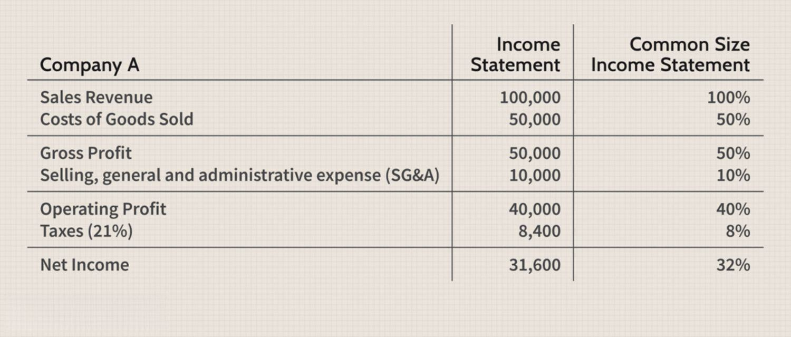

## Table of Contents

## What are financial statements and why are they important for a company?

Financial statements are reports that show a company's financial health and performance. They include documents like the income statement, balance sheet, and cash flow statement. These statements help people understand how much money the company is making, how much it owes, and how it is spending its money.

These statements are very important for a company because they help owners, investors, and managers make good decisions. For example, if a company wants to borrow money, a bank will look at its financial statements to see if it can pay back the loan. Also, investors use these statements to decide if they should buy or sell the company's stock. By looking at the financial statements, everyone can see if the company is doing well or if it needs to make changes.

## What are the main types of financial statements?

The main types of financial statements are the income statement, the balance sheet, and the cash flow statement. The income statement shows how much money a company made and spent over a certain time, like a year. It tells you if the company made a profit or a loss. The balance sheet is like a snapshot of what the company owns and owes at a specific time. It lists assets, like money and equipment, and liabilities, like loans and bills.

The cash flow statement is important because it shows how money moves in and out of the company. It tells you where the money came from, like sales or loans, and where it went, like paying for supplies or salaries. Together, these three statements give a full picture of the company's financial health. They help everyone understand if the company is doing well or if it needs to make changes.

## How can a beginner read and understand an income statement?

An income statement is a report that shows how much money a company made and spent over a certain time, like a year or a quarter. It starts with the company's total revenue, which is all the money it earned from selling its products or services. Then, it subtracts the costs of doing business, like the cost of goods sold, which is how much it cost to make or buy the products. After that, it subtracts other expenses, like salaries, rent, and utilities. The result is the company's net income, which tells you if the company made a profit or a loss.

To read an income statement, start at the top with the revenue and work your way down. Look for any big changes from one year to the next. For example, if the revenue went up a lot, that's a good sign. But if the costs went up more than the revenue, that could be a problem. Pay attention to the net income at the bottom. If it's positive, the company made a profit. If it's negative, the company had a loss. By looking at these numbers and comparing them over time, you can get a good idea of how well the company is doing.

## What information does a balance sheet provide and how is it useful?

A balance sheet is like a picture of what a company owns and owes at a specific time. It lists the company's assets, which are things like cash, equipment, and buildings. It also lists the company's liabilities, which are things like loans and bills that the company needs to pay. The difference between the assets and liabilities is called equity, which shows how much the company is worth to its owners.

The balance sheet is useful because it helps people see if a company is financially healthy. If a company has a lot of assets and not many liabilities, it's in good shape. But if it has a lot of liabilities and not many assets, it might be in trouble. By looking at the balance sheet, owners, investors, and managers can make smart decisions about the company's future. They can see if the company needs to borrow money, sell assets, or make other changes to stay strong.

## How do cash flow statements differ from income statements?

Cash flow statements and income statements both show important information about a company's money, but they do different things. An income statement tells you how much money a company made and spent over a certain time, like a year. It starts with the company's total revenue, subtracts the costs of doing business, and other expenses to show if the company made a profit or a loss. It's like a report card for the company's earnings.

A cash flow statement, on the other hand, shows how money actually moves in and out of the company during that time. It's divided into three parts: operating activities, which show money from the company's main business; investing activities, which show money spent on things like equipment; and financing activities, which show money from loans or paying back loans. This statement helps you see if the company has enough cash to keep running and growing.

Both statements are important, but they give different views of the company's financial health. The income statement focuses on profits and losses, while the cash flow statement focuses on the actual flow of cash. Together, they help give a complete picture of how well the company is doing.

## What are some key financial ratios that can be derived from financial statements?

Financial ratios are numbers that help you understand a company's financial health by comparing different parts of its financial statements. Some key ratios include the current ratio, which shows if a company can pay its short-term bills by comparing its current assets to its current liabilities. A higher current ratio means the company is in a better position to pay its debts. Another important ratio is the debt-to-equity ratio, which shows how much the company relies on borrowed money compared to money from its owners. A lower debt-to-equity ratio usually means the company is less risky.

The return on equity (ROE) is another useful ratio, which shows how well the company is using the money its owners have invested to make a profit. A higher ROE means the company is doing a good job of turning owner's money into profits. The gross profit margin is also important, as it shows how much money the company makes after paying for the cost of goods sold. A higher gross profit margin means the company is good at controlling its costs. These ratios, when used together, give a clear picture of a company's financial health and help people make smart decisions about the company.

## How can financial statements be used to assess a company's liquidity?

Financial statements help us see how easily a company can pay its short-term bills, which is called liquidity. One way to check liquidity is by looking at the current ratio in the balance sheet. The current ratio compares what the company owns that can be quickly turned into cash (current assets) with what it owes in the short term (current liabilities). If the current ratio is high, it means the company has enough cash or things it can sell fast to pay its bills. A low current ratio might mean the company could have trouble paying its bills on time.

Another way to assess liquidity is by looking at the cash flow statement. This statement shows how money moves in and out of the company. If the company has a lot of cash coming in from its main business (operating activities), it's a good sign that it can pay its bills. But if the company is spending a lot of cash on things like new equipment (investing activities) or paying back loans (financing activities), it might not have enough cash left to cover its short-term needs. By looking at both the balance sheet and the cash flow statement, we can get a good idea of how liquid a company is and if it can handle its short-term financial obligations.

## What methods can be used to analyze trends in financial statements over time?

To analyze trends in financial statements over time, one method is to compare the numbers from different years side by side. This is called horizontal analysis. For example, if you want to see how a company's sales have changed, you can look at the sales numbers from the past few years. If sales are going up every year, that's a good sign. If they're going down, it might mean the company is having problems. By looking at the changes in numbers over time, you can see if the company is growing, shrinking, or staying the same.

Another method is vertical analysis, which looks at each item on the financial statement as a percentage of a base number. For example, on an income statement, you can look at each expense as a percentage of total sales. This helps you see if certain costs are getting bigger or smaller compared to sales. If the cost of goods sold is getting bigger as a percentage of sales, it might mean the company is having trouble controlling its costs. By using vertical analysis, you can see how different parts of the company are doing relative to each other over time.

A third method is ratio analysis, which uses financial ratios to spot trends. For example, you can look at the debt-to-equity ratio over several years to see if the company is relying more or less on borrowed money. If the ratio is going up, it might mean the company is taking on more debt, which could be risky. By comparing these ratios over time, you can get a good idea of how the company's financial health is changing. These three methods—horizontal analysis, vertical analysis, and ratio analysis—help you understand the big picture of a company's financial performance over time.

## How do you perform a horizontal analysis of financial statements?

To do a horizontal analysis of financial statements, you look at the numbers from different years and compare them side by side. For example, if you want to see how a company's sales have changed, you can take the sales number from this year and compare it to last year's sales number. You can do this for every item on the income statement, balance sheet, and cash flow statement. By doing this, you can see if numbers are going up, down, or staying the same over time. It's like looking at a timeline of the company's financial performance.

When you do a horizontal analysis, it's helpful to calculate the percentage change between years. To do this, you subtract last year's number from this year's number, then divide that by last year's number, and finally multiply by 100 to get a percentage. For example, if sales were $100 last year and $110 this year, the change is $10. Divide $10 by $100 to get 0.1, then multiply by 100 to get a 10% increase. By calculating these percentages, you can see how big the changes are. This helps you understand if the company is growing quickly, slowly, or not at all.

## What is vertical analysis and how does it help in understanding financial statements?

Vertical analysis is a way to look at a company's financial statements by turning all the numbers into percentages. It helps you see how each part of the statement compares to a big number, like total sales on the income statement or total assets on the balance sheet. For example, if you want to understand the income statement, you can take each expense and show it as a percentage of total sales. This makes it easy to see if certain costs are getting bigger or smaller compared to how much the company is selling.

Using vertical analysis helps you understand the company's financial health better. By turning everything into percentages, you can compare the company's financial statements from one year to the next, even if the total numbers are different. For example, if the cost of goods sold is 60% of sales one year and 65% the next year, you can see that the company might be having trouble controlling its costs. This way, you can see how different parts of the company are doing relative to each other over time, which helps in making smart decisions about the company's future.

## How can advanced users apply DuPont analysis to evaluate a company's return on equity?

DuPont analysis is a way to break down a company's return on equity (ROE) into three parts to understand it better. ROE shows how well a company is using the money its owners have invested to make a profit. The three parts of DuPont analysis are the profit margin, which shows how much profit the company makes from each dollar of sales; the asset turnover, which shows how well the company uses its assets to make sales; and the equity multiplier, which shows how much the company relies on borrowed money. By looking at these three parts, you can see what's driving the company's ROE and where it might need to improve.

For example, if a company has a high profit margin but a low asset turnover, it means the company is good at making money from sales but not so good at using its assets to make those sales. If the equity multiplier is high, it means the company is using a lot of borrowed money, which can be risky. By using DuPont analysis, advanced users can get a detailed picture of what's affecting the company's ROE. This helps them make better decisions about whether to invest in the company or how to help it improve its performance.

## What are the limitations of financial statement analysis and how can they be mitigated?

Financial statement analysis has some limitations that can make it hard to get a complete picture of a company's health. One big problem is that financial statements only show numbers, not the whole story. They don't tell you about things like the company's reputation, the quality of its products, or how happy its customers are. Another issue is that companies can use different ways to account for their money, which can make it hard to compare them. Also, financial statements are usually about the past, so they might not show what's happening right now or what might happen in the future.

To make financial statement analysis better, you can use other information to fill in the gaps. For example, you can look at industry reports, news articles, and customer reviews to learn more about the company's situation. It's also a good idea to compare the company to others in the same industry, using the same accounting methods if possible. And, to get a sense of what might happen in the future, you can look at the company's plans and forecasts. By combining financial statements with other information, you can get a fuller picture of the company's health and make smarter decisions.

## What is the key to understanding financial statements?

Financial statements are formal records that provide crucial insights into a company's financial health and operational success. These documents are indispensable for both traditional investors and algorithmic traders, as they encapsulate the economic activities and conditions of a company. The primary components of financial statements include the balance sheet, income statement, cash flow statement, and statement of shareholders' equity, each serving a unique purpose in financial analysis.

The balance sheet offers a snapshot of a company's financial standing at a specific point in time, detailing its assets, liabilities, and shareholders' equity. It reflects the equation:

$$
\text{Assets} = \text{Liabilities} + \text{Shareholders' Equity}
$$

This equation underscores the relationship between a company’s resources and the claims against those resources, providing essential information on the company's [liquidity](/wiki/liquidity-risk-premium) and capital structure.

The income statement, also known as the profit and loss statement, records a company's revenues and expenses over a period, culminating in the net income. This document is crucial for understanding a company's profitability and operational efficiency. Key figures such as gross profit, operating income, and net income are derived from the income statement.

The cash flow statement breaks down the cash inflows and outflows into operating, investing, and financing activities. This statement is vital for assessing how a company manages its cash, ensuring it has sufficient liquidity to meet obligations and invest in growth opportunities. Unlike net income, cash flow is less subject to accounting adjustments and, therefore, provides a clearer picture of financial health.

Lastly, the statement of shareholders' equity details changes in the ownership interest of shareholders in the company, showcasing items like retained earnings and stock issuance or buybacks. It communicates how profits are used—whether reinvested in the business or distributed as dividends.

Understanding how to read and interpret these financial statements is foundational for evaluating a company's current financial standing and assessing its potential for future growth. For traditional investors, this analysis forms the basis for investment decisions, while algorithmic traders utilize this data algorithmically to automate and refine trading strategies. Financial statements serve as a bridge, translating corporate actions and market possibilities into quantifiable data, guiding both manual and automated financial decision-making processes.

## What is the relationship between Algorithmic Trading and Financial Statements?

Algorithmic trading utilizes sophisticated algorithms to execute trading decisions based on data-driven insights. These algorithms, often implemented using programming languages such as Python, require a foundation of accurate and comprehensive data, which is principally provided by financial statements. 

Financial statements encapsulate crucial metrics that algorithms leverage to inform trading strategies. Among these metrics, the Price-to-Earnings (P/E) ratio and free cash flow are paramount. The P/E ratio, calculated as

$$
\text{P/E ratio} = \frac{\text{Market Value per Share}}{\text{Earnings per Share (EPS)}}
$$

serves as a fundamental indicator of a company's market expectations and value. It assists in the determination of whether a stock is over or undervalued, guiding automated buy or sell orders in trading algorithms.

Similarly, free cash flow, representing the available cash a company generates after cash expenses, is integral to evaluating a company's financial health. It is calculated as:

$$
\text{Free Cash Flow} = \text{Operating Cash Flow} - \text{Capital Expenditures}
$$

These indicators are inherently valuable in creating trading signals within algorithmic models. An algorithm may use the P/E ratio to filter potential investment opportunities or employ free cash flow metrics to assess financial sustainability.

Effective [algorithmic trading](/wiki/algorithmic-trading) mandates not only precise data from financial statements but also their timely analysis. Developments in programming offer powerful tools such as Python libraries for data analysis, including Pandas and NumPy, which facilitate the integration of such metrics into complex trading algorithms. For instance, a simple framework for utilizing financial metrics in Python might involve:

```python
import pandas as pd

# Assume financial_data is a DataFrame containing market data
def calculate_pe_ratio(market_value_per_share, earnings_per_share):
    return market_value_per_share / earnings_per_share

def calculate_free_cash_flow(operating_cash_flow, capital_expenditures):
    return operating_cash_flow - capital_expenditures

# Example usage with data
financial_data['PE_Ratio'] = financial_data.apply(lambda row: calculate_pe_ratio(row['MarketValue'], row['EPS']), axis=1)
financial_data['FreeCashFlow'] = financial_data.apply(lambda row: calculate_free_cash_flow(row['OperatingCashFlow'], row['CapitalExpenditures']), axis=1)
```

By leveraging such tools, traders ensure that their algorithms operate on the most current and precise financial data available. The successful execution of algorithmic trading strategies hinges on this seamless integration of financial statement analysis, underscoring its indispensable role in modern trading environments.

## What are the key financial ratios for algo trading?

In algorithmic trading, financial ratios serve as critical tools for evaluating a company's financial status efficiently. They provide succinct snapshots of various aspects of financial health, aiding in the development of effective trading strategies. Two key ratios often employed are the debt-to-equity ratio and the net profit margin.

The debt-to-equity ratio is a measure of a company's financial leverage. It is calculated as:

$$
\text{Debt-to-Equity Ratio} = \frac{\text{Total Liabilities}}{\text{Shareholders' Equity}}
$$

This ratio helps assess how much debt a company is using to finance its assets relative to the value of shareholders' equity. A high ratio could signify potential financial instability, indicating increased risk, which is crucial for algorithmic models focusing on risk management.

On the other hand, the net profit margin provides insights into a company's operational efficiency by illustrating the percentage of revenue that translates into profit. It is calculated as:

$$
\text{Net Profit Margin} = \left(\frac{\text{Net Income}}{\text{Revenue}}\right) \times 100
$$

A higher net profit margin indicates efficient management and is often associated with business models that can withstand economic challenges. This ratio is essential for algorithms seeking companies with robust profit-generating capabilities.

Integrating these ratios into algorithmic trading involves using predefined criteria or thresholds. For instance, an algorithm might be programmed to execute a purchase order if the debt-to-equity ratio remains below a specific threshold and the net profit margin exceeds a set percentage. This integration is often achieved using Python libraries such as Pandas, which facilitate data manipulation and analysis. Here is a basic example:

```python
import pandas as pd

# Sample financial data
data = {'Debt': [1000, 2000], 'Equity': [500, 1000], 'Revenue': [800, 1500], 'Net Income': [80, 200]}

df = pd.DataFrame(data)

# Calculate ratios
df['Debt-to-Equity Ratio'] = df['Debt'] / df['Equity']
df['Net Profit Margin'] = (df['Net Income'] / df['Revenue']) * 100

# Filter based on defined criteria
signals = df[(df['Debt-to-Equity Ratio'] < 1.5) & (df['Net Profit Margin'] > 10)]
```

By employing these metrics, traders convert complex financial information into actionable signals, which supports the execution of data-driven trading strategies. Optimizing the use of such ratios can significantly enhance algorithmic trading performance, leading to better investment decisions and higher returns in financial markets.

## References & Further Reading

[1]: Bergstra, J., Bardenet, R., Bengio, Y., & Kégl, B. (2011). ["Algorithms for Hyper-Parameter Optimization."](https://dl.acm.org/doi/10.5555/2986459.2986743) Advances in Neural Information Processing Systems 24.

[2]: ["Advances in Financial Machine Learning"](https://www.amazon.com/Advances-Financial-Machine-Learning-Marcos/dp/1119482089) by Marcos Lopez de Prado

[3]: ["Evidence-Based Technical Analysis: Applying the Scientific Method and Statistical Inference to Trading Signals"](https://www.amazon.com/Evidence-Based-Technical-Analysis-Scientific-Statistical/dp/0470008741) by David Aronson

[4]: ["Machine Learning for Algorithmic Trading"](https://github.com/stefan-jansen/machine-learning-for-trading) by Stefan Jansen

[5]: ["Quantitative Trading: How to Build Your Own Algorithmic Trading Business"](https://www.amazon.com/Quantitative-Trading-Build-Algorithmic-Business/dp/1119800064) by Ernest P. Chan