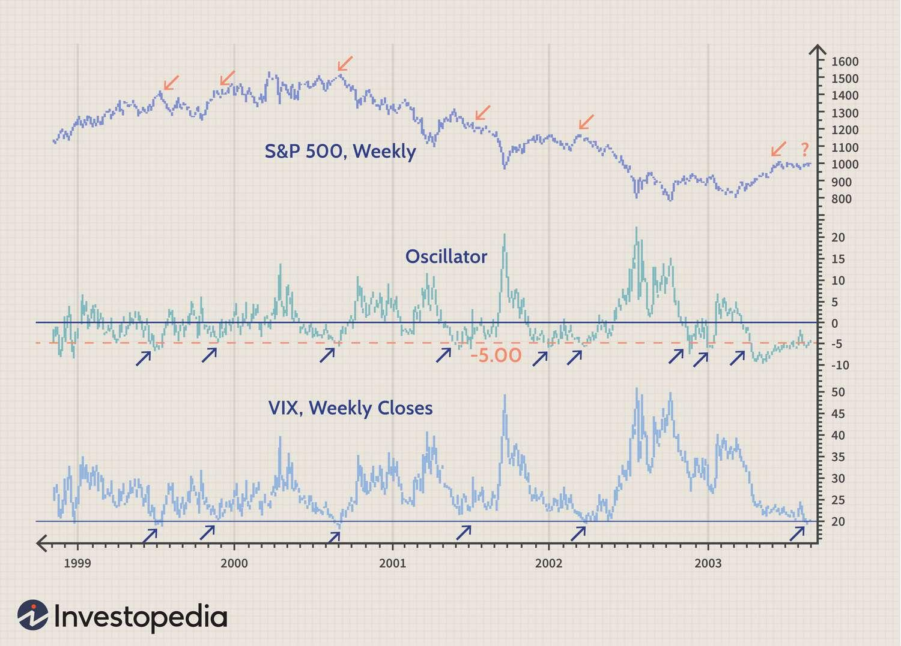

## Table of Contents

## What is the VIX and what does it measure?

The VIX, or Volatility Index, is a tool used by investors to measure how much the stock market might change in the near future. It's often called the "fear gauge" because it shows how worried or calm investors are about the market. The VIX is calculated using the prices of options on the S&P 500, which is a big group of stocks that represents the overall market. When the VIX is high, it means investors expect big changes in the market, and when it's low, they expect smaller changes.

The VIX is important because it helps investors understand the level of risk in the market. If the VIX is high, it might be a sign that investors are scared and think the market could go down a lot. On the other hand, a low VIX suggests that investors feel safe and expect the market to stay steady. By watching the VIX, investors can make better decisions about when to buy or sell stocks, and how to protect their investments from big swings in the market.

## How is the VIX calculated?

The VIX is calculated using the prices of options on the S&P 500. Options are contracts that give investors the right to buy or sell stocks at a certain price in the future. The VIX looks at both call options, which let you buy stocks, and put options, which let you sell stocks. It focuses on options that will expire in about a month. By looking at the prices of these options, the VIX figures out how much investors expect the S&P 500 to move up or down.

To calculate the VIX, a special formula is used that takes into account the prices of many different options. This formula looks at how much the prices of these options change when the S&P 500 goes up or down. The more the option prices change, the higher the VIX will be, because it means investors expect bigger swings in the market. The VIX is updated every 15 seconds during trading hours, so it always shows the latest expectations of market volatility.

## Why is the VIX important for analyzing market trends?

The VIX is important for analyzing market trends because it shows how much investors expect the stock market to move. When the VIX is high, it means investors are worried and expect big changes in the market. This can be a sign that people are scared and might start selling their stocks, which could make the market go down. On the other hand, when the VIX is low, it means investors are calm and expect the market to stay steady. This can be a sign that people feel safe and might keep buying stocks, which could help the market go up.

By watching the VIX, investors can get a better idea of what might happen next in the market. If the VIX starts to go up quickly, it might be a warning that a big drop in the market could be coming. This can help investors decide if they should sell their stocks to avoid losing money. If the VIX stays low or goes down, it might be a good time to buy stocks because the market seems stable. Overall, the VIX helps investors understand the level of risk and make smarter choices about their investments.

## What does a high VIX value indicate about market volatility?

A high VIX value means that investors expect the stock market to have big ups and downs soon. It's like a warning sign that the market might be getting ready for a wild ride. When the VIX is high, it shows that people are worried and think the market could change a lot. This worry can make investors nervous, and they might start selling their stocks to avoid losing money.

Because the VIX is based on the prices of options on the S&P 500, a high VIX tells us that the cost of these options is going up. This happens because more people want to buy options to protect their investments from big market swings. So, a high VIX is a clear signal that the market might be getting more risky and that investors should be careful with their money.

## How can a low VIX value be interpreted in terms of market stability?

A low VIX value means that investors think the stock market will stay calm and not change much. It's like a sign that says the market is feeling safe and steady. When the VIX is low, it shows that people are not too worried and expect the market to keep going in a smooth way. This can make investors feel more confident, and they might decide to keep their money in the market or even buy more stocks.

Because the VIX is based on the prices of options on the S&P 500, a low VIX tells us that these options are not very expensive. This happens because fewer people want to buy options to protect their investments from big market swings. So, a low VIX is a clear signal that the market is seen as stable and that investors can feel more relaxed about their money.

## What historical events have significantly impacted the VIX?

The VIX has been affected by many big events over the years. One of the most famous times was during the 2008 financial crisis. The VIX jumped to very high levels because people were really scared about the economy. Banks were failing, and the stock market was dropping a lot. This made the VIX go up to around 80, which is much higher than normal. It showed how worried everyone was about what would happen next.

Another important time was in early 2020 when the COVID-19 pandemic started. The VIX went up a lot again because the virus was spreading fast, and no one knew how bad it would get. People were worried about their jobs and the economy, so they started selling their stocks. This made the VIX reach about 82, showing how much fear there was in the market. These events show how the VIX can go up when big, scary things happen in the world.

## How can the VIX be used in conjunction with other market indicators?

The VIX can be used with other market indicators to get a fuller picture of what's happening in the stock market. One way to do this is by looking at the VIX along with the S&P 500. If the VIX is high and the S&P 500 is going down, it might mean that investors are very worried and expect the market to keep falling. But if the VIX is high and the S&P 500 is going up, it could mean that investors are expecting a big change but are not sure which way the market will go.

Another useful indicator to use with the VIX is the put-call ratio. This ratio shows how many people are buying options to protect against a market drop (puts) compared to options betting on a market rise (calls). If the VIX is high and the put-call ratio is also high, it's a strong sign that investors are scared and think the market might go down a lot. By looking at the VIX together with other indicators, investors can make better guesses about what might happen next in the market and decide how to manage their investments.

## What are some common strategies for trading based on VIX levels?

One common strategy for trading based on VIX levels is to use the VIX as a signal to buy or sell stocks. When the VIX is very high, it can mean that the market is scared and might go down more. Some investors see this as a chance to buy stocks at lower prices, hoping that the market will calm down and the stocks will go back up. This is called "buying the dip." On the other hand, if the VIX is low and the market seems stable, investors might feel safe to keep their money in the market or buy more stocks, expecting steady growth.

Another strategy is to use VIX-related products like VIX futures or options. These are special investments that let you bet on whether the VIX will go up or down. If you think the VIX will go up because the market is getting more risky, you can buy VIX futures or options to make money if your guess is right. If you think the VIX will go down because the market is getting calmer, you can sell these products to make money. This way, you can make money from changes in the VIX without having to buy or sell actual stocks.

Some investors also use the VIX to help them decide when to use hedging strategies. Hedging is like buying insurance for your investments. If the VIX is high and you're worried about your stocks losing value, you can buy put options to protect your money. These options will make money if the market goes down, which can help cover any losses from your stocks. By watching the VIX, you can decide when it's a good time to use these protective strategies to keep your investments safe.

## How does the VIX influence investor sentiment and market behavior?

The VIX, or Volatility Index, has a big impact on how investors feel and what they do in the market. When the VIX goes up, it means investors are worried and expect the market to change a lot. This can make people scared, and they might start selling their stocks to avoid losing money. When everyone is selling, it can make the market go down even more. So, a high VIX can create a cycle of fear and selling that makes the market more unstable.

On the other hand, when the VIX is low, it tells investors that the market is expected to stay calm. This can make people feel safe and more confident about keeping their money in the market or even buying more stocks. When everyone feels good about the market, they might buy more, which can help the market go up. So, a low VIX can create a cycle of calm and buying that makes the market more stable. By watching the VIX, investors can get a sense of the overall mood in the market and decide how to act.

## What are the limitations of using the VIX as a sole indicator for market trends?

The VIX is a helpful tool, but it has some limits when used by itself to guess market trends. One big limit is that the VIX only looks at how much the S&P 500 might change in the next month. It doesn't tell you anything about what might happen in the long run or in other parts of the market. So, if you only use the VIX, you might miss important signs from other stocks or from what's happening in the world.

Another limit is that the VIX can be wrong sometimes. Just because the VIX is high doesn't always mean the market will go down a lot. Sometimes, the market can stay calm even when the VIX is high. And when the VIX is low, the market can still have big changes. So, if you make choices only based on the VIX, you might be surprised by what the market does. It's better to use the VIX with other tools to get a fuller picture of what might happen next.

## How can advanced statistical models enhance the predictive power of the VIX?

Advanced statistical models can make the VIX a better tool for guessing what the market might do next. These models can look at more than just the VIX. They can use information from other parts of the market, like how stocks are doing or what people are saying on the news. By putting all this information together, the models can see patterns that the VIX alone might miss. This can help investors understand if a high VIX means the market will really go down a lot, or if it's just a short scare.

Using these models also helps to see if the VIX is giving the right signals. Sometimes, the VIX can be wrong, but advanced models can check if the VIX is acting the way it should based on past data. By doing this, the models can tell investors how much to trust the VIX at any given time. This way, investors can make smarter choices about when to buy or sell stocks, knowing that they have a more complete picture of what might happen in the market.

## What are the future developments or proposed enhancements to the VIX methodology?

People who study the stock market are always thinking of ways to make the VIX even better. One idea is to make the VIX look at more than just the S&P 500. They want to include other big stock groups, like the Nasdaq, to get a fuller picture of what's happening in the market. Another idea is to use new math tricks to make the VIX better at guessing what the market will do. These tricks can help the VIX see patterns that it might miss now, making it a more useful tool for investors.

Another big change that some people want is to make the VIX look further into the future. Right now, it only guesses what might happen in the next month. But if the VIX could also look at what might happen in the next few months or even a year, it would be even more helpful. By making these changes, the VIX could help investors understand the market better and make smarter choices about their money.

## What is the understanding of the VIX?

The VIX, formally known as the Chicago Board Options Exchange (CBOE) Volatility Index, functions as a barometer for market anxiety. It evaluates market volatility expectations over a 30-day forward period, derived from option prices on the S&P 500 index. This index is instrumental in quantifying investor sentiment, often being nicknamed the "fear gauge" due to its inverse relationship with market confidence. High values of the VIX indicate increased market volatility and fear of market downturns, while low values suggest market stability.

### Calculation of the VIX

The calculation of the VIX involves a comprehensive process that incorporates the prices of multiple S&P 500 index options. More specifically, the index is calculated using the weighted prices of out-of-the-money calls and puts, across a wide range of strike prices. The formula involves a variance swap rate, which is essentially derived from the expected variance of the S&P 500 over the next 30 days, primarily calculated using the Black-Scholes options pricing model. The mathematical representation is given by:

$$
VIX = 100 \times \sqrt{\frac{2}{T} \sum \left( \frac{\Delta K_i}{K_i^2} e^{RT} Q(K_i) \right)}
$$

where $T$ is the time to expiration, $\Delta K_i$ is the interval between strike prices, $K_i$ is the strike price of option $i$, $R$ is the risk-free rate, and $Q(K_i)$ is the mid-point of the bid-ask spread for each option.

### Predictive Utility and Market Behavior

The VIX is a forward-looking indicator, capturing expected [volatility](/wiki/volatility-trading-strategies) based on current options market prices rather than historical data. When investors anticipate potential market disruptions, demand for protective options typically elevates, which increases their price and thus affects the VIX. Consequently, the VIX has proven valuable as a leading indicator of market behavior, suggesting potential corrections when it rises and signaling complacency or optimism when it falls.

### Role in Risk Assessment

In risk management, the VIX serves as a crucial tool by offering insights into the likelihood of rapid market movements. Portfolio managers monitor VIX levels to adjust their risk exposure consistent with anticipated market conditions. For instance, an ascending VIX might prompt reconsideration of hedging strategies or diversification efforts, especially in forecasting economic downturns. Conversely, a descending VIX might align with a recalibration towards growth investments or leveraging opportunities.

### VIX and Market Trends

There is a notable inverse correlation between the VIX and stock market performance. As historical data reveals, significant spikes in the VIX often coincide with periods of sharp market declines, acting as an inverse indicator. This relationship empowers traders to predict broader market trends and prepare their strategies accordingly. During bearish market phases, the VIX generally rises as panic sets in, while during bullish phases, it tends to decline as confidence and market stability improve.

In summary, understanding how the VIX is constructed, its predictive capabilities, and its relationship with stock market behavior offers valuable insights into market dynamics, guiding strategic planning, risk management, and proactive financial analysis.

## References & Further Reading

[1]: Whaley, R. E. (2009). "Understanding the VIX." *The Journal of Portfolio Management*, 35(3), 98-105. [https://jpm.iijournals.com/content/35/3/98](https://www.researchgate.net/publication/277429711_Understanding_the_VIX)

[2]: Lopez de Prado, M. (2018). ["Advances in Financial Machine Learning."](https://www.amazon.com/Advances-Financial-Machine-Learning-Marcos/dp/1119482089) Wiley.

[3]: Hull, J. C. (2009). ["Options, Futures, and Other Derivatives."](https://www.amazon.com/Options-Futures-Other-Derivatives-9th/dp/0133456315) Pearson College Div.

[4]: Chan, E. P. (2009). ["Quantitative Trading: How to Build Your Own Algorithmic Trading Business."](https://github.com/ftvision/quant_trading_echan_book) Wiley.

[5]: Simonian, J. (2011). "An Introduction to VIX Option Strategies." *The Journal of Trading*, 6(4), 55-62. [https://jot.iijournals.com/content/6/4/55](https://jot.iijournals.com/content/6/4/55)

[6]: Alexander, C. (2001). ["Market Models: A Guide to Financial Data Analysis."](https://www.casact.org/sites/default/files/old/marketmodels.pdf) Wiley.

[7]: Jansen, S. (2020). ["Machine Learning for Algorithmic Trading."](https://github.com/financeacadfpm/machine-learning-for-trading_stefan_jansen) Packt Publishing.