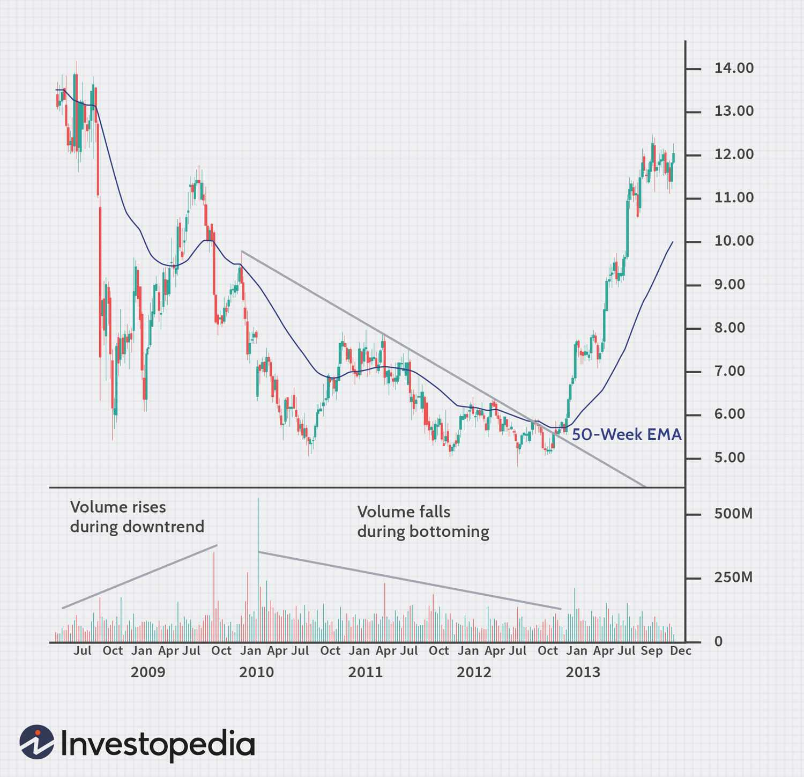

The financial market landscape is characterized by a dynamic and intricate environment influenced by various economic, political, and psychological factors. This volatility is a critical component of market behavior as it reflects the uncertainty and risk inherent in trading activities. Understanding these fluctuations is essential for traders and financial analysts aiming to make informed decisions and optimize their strategies.

Market volume is a fundamental concept in financial markets, representing the total number of shares or contracts traded within a specified period. It serves as a proxy for market activity and investor interest, shedding light on market sentiment. High market volume can indicate strong investor confidence or fear, while low volume might suggest indecision or lack of interest. Consequently, market volume plays a significant role in influencing price movements and market liquidity.



The concept of a market bottom is pivotal in investment strategies, referring to the point at which a declining market reverses its trend and begins to rise. Identifying market bottoms can present lucrative investment opportunities, making it a focal point for many investors. However, predicting these points with precision poses challenges, necessitating a deep understanding of market dynamics and indicators.

Algorithmic trading, often termed algo trading, represents the integration of advanced data analysis with trading strategies, automating processes for speed, precision, and efficiency. These algorithms utilize market data, including volume and trends, to execute trades at optimal moments. The advent of algorithmic trading has transformed market analysis, offering strategic advantages through the rapid processing of vast amounts of data.

The purpose of this article is to explore the intersection of market volume, market bottoms, and algorithmic trading, highlighting their interconnected roles in today's financial markets. By examining these elements, the article aims to provide insights into the mechanisms that drive market behavior, equipping traders and analysts with knowledge to enhance their decision-making processes. The integration of algorithmic trading with comprehensive market analysis signifies a progressive step toward understanding and leveraging the complexities of financial markets.

## Table of Contents

## Understanding Market Volume

Market volume is a fundamental concept in financial markets, representing the total amount of a security traded during a specific period. It provides crucial insights into investor activity and market sentiment, serving as an indicator of the market's health and stability. High market volume typically points to high investor interest and can signify robust market conditions, while low volume might indicate a lack of interest or uncertain market conditions.

In financial markets, [volume](/wiki/volume-trading-strategy) acts as a barometer for determining market movements and trends. Higher trading volumes suggest stronger conviction among market participants and can precede significant price movements. Conversely, low trading volumes might imply weaker market sentiment and result in less pronounced price changes. By examining volume data, traders can gauge whether a trend is likely to continue or reverse, providing valuable context to price action.

Several factors influence market volume, including economic events and market news. For instance, major announcements, such as [interest rate](/wiki/interest-rate-trading-strategies) changes by central banks or geopolitical developments, can lead to spikes in trading volumes as investors reposition their portfolios. Additionally, earnings reports and corporate news can also impact the trading volume of specific stocks, either drawing in more participants or prompting current investors to [exit](/wiki/exit-strategy) their positions.

Market volume affects both price movements and market [liquidity](/wiki/liquidity-risk-premium). Price movements, whether upward or downward, are often accompanied by corresponding changes in volume. This relationship helps analysts determine the strength and validity of price trends. For example, a rising market volume along with increasing prices could suggest a strong bullish trend, while declining volume during a price increase might indicate a lack of support for the trend. Market liquidity, which refers to the ease with which a security can be bought or sold without affecting its price, is also closely tied to volume. High volume generally enhances liquidity, enabling smoother transactions with minimal price impact.

Analyzing market volume requires various techniques depending on market conditions. One common method is using volume indicators such as the On-Balance Volume (OBV) or the Volume-Price Trend (VPT). These indicators help traders identify potential buying or selling pressure by considering the direction of price movements in conjunction with volume changes. Additionally, traders may use volume analysis in combination with other technical analysis tools to validate the strength and sustainability of market trends.

In Python, traders can leverage libraries like Pandas and NumPy to perform volume analysis efficiently. An example of calculating an OBV would be:

```python
import pandas as pd

def calculate_obv(data):
    obv = [0]
    for i in range(1, len(data)):
        if data['Close'][i] > data['Close'][i - 1]:
            obv.append(obv[-1] + data['Volume'][i])
        elif data['Close'][i] < data['Close'][i - 1]:
            obv.append(obv[-1] - data['Volume'][i])
        else:
            obv.append(obv[-1])
    return obv

# Assuming 'data' is a DataFrame with 'Close' and 'Volume' columns
data['OBV'] = calculate_obv(data)
```

Understanding market volume is pivotal for financial analysts and traders. It aids in evaluating the validity of price trends and assessing market liquidity, providing critical information necessary for making informed trading decisions. By considering how volume reacts to various market stimuli, participants can better anticipate market movements and adjust their strategies accordingly.

## Identifying Market Bottoms

A market bottom is defined as the lowest point in a market cycle before a sustained recovery, serving as a critical signal for investors to consider entering or increasing their positions in a financial market. Identifying market bottoms is a fundamental aspect of investment strategies, as it allows traders and analysts to recognize potential opportunities for profit maximization and risk mitigation.

**Indicators and Metrics for Market Bottoms**

Various indicators and metrics are employed to identify potential market bottoms. These include:

1. **Price-to-Earnings (P/E) Ratios**: A lower P/E ratio compared to historical averages might suggest an undervaluation, signaling a potential market bottom.

2. **Moving Averages**: Crossovers, where short-term moving averages dip below long-term ones and then reverse, may indicate a market bottom.

3. **Market Breadth**: A divergence between price trends and indicators such as the number of advancing vs. declining stocks can signal a market bottom.

4. **Relative Strength Index (RSI)**: An RSI below 30 is typically viewed as an oversold condition, which can indicate a buying opportunity.

5. **Volume Analysis**: High trading volumes during a market decline and surge upon price stabilization can denote capitulation, potentially marking a bottom.

**Historical Market Bottom Case Studies**

Examining historical case studies of market bottoms provides valuable insights. For instance, the market bottom in March 2009 during the global financial crisis was characterized by widespread pessimism, significant declines in stock prices, and extreme oversold conditions on technical indicators. Similar patterns were observed during the bottoming process in 2003 following the dot-com bubble burst.

**Challenges in Predicting Market Bottoms**

Accurately predicting market bottoms poses significant challenges due to market [volatility](/wiki/volatility-trading-strategies), the unpredictability of economic indicators, and external factors such as geopolitical events. False signals and market noise can lead to premature or delayed responses, thus complicating decision-making processes. Additionally, psychological factors and herd behavior often exacerbate market swings, adding layers of complexity to the task of identifying bottoms.

**Strategic Approaches to Capitalize on Market Bottoms**

To capitalize on market bottoms, strategic approaches include:

- **Incremental Investing**: Gradually buying into the market as it shows signs of bottoming can mitigate the risk of incorrect timing.
- **Diversification**: Spreading investments across various asset classes can protect against sector-specific downturns.
- **Fundamental Analysis**: Assessing intrinsic value helps in recognizing undervalued assets during market bottoms.
- **Hedging Strategies**: Utilizing options or derivatives to protect against further declines while awaiting potential recovery.

In conclusion, while identifying market bottoms is fraught with challenges, employing a combination of quantitative indicators and qualitative analysis, understanding historical contexts, and adopting versatile investment strategies can improve the prospects for accurately predicting and leveraging market bottoms for successful investment outcomes.

## The Role of Algorithmic Trading

Algorithmic trading, commonly known as algo trading, refers to the use of computer algorithms to automatically make trading decisions and execute transactions in financial markets. Its emergence has significantly transformed the landscape of financial trading by enhancing the accuracy and speed of transactions. Algo trading uses predefined criteria, mathematical models, and algorithms to decide the timing, price, and quantity of orders, making it a cornerstone of modern trading strategies.

### Evolution of Algorithmic Trading

Algorithmic trading has evolved from simple automated systems to complex algorithms capable of executing a multitude of trading strategies simultaneously. The evolution began with basic rule-based systems in the 1970s and 1980s, which automated order execution to take advantage of pricing inefficiencies. With advancements in computational power and data analytics, algo trading today encompasses sophisticated strategies that incorporate [machine learning](/wiki/machine-learning) and high-frequency trading ([HFT](/wiki/high-frequency-trading-strategies)).

### Utilization of Market Data in Algo Trading

Algo trading harnesses vast amounts of market data, such as market volume, price fluctuations, and historical patterns, to build predictive models. Market volume data provides insights into liquidity and market activity, helping algorithms assess the best times to execute trades to minimize market impact. Additionally, recognizing market bottoms assists algorithms in identifying potential buy or sell points, enhancing the strategic positioning of trades.

### Speed and Precision

One of the primary advantages of [algorithmic trading](/wiki/algorithmic-trading) over traditional methods is its speed and precision. Algorithms can process and analyze data far quicker than human traders, executing trades in microseconds. This speed reduces latency and allows traders to capitalize on short-lived market opportunities. Precise calculations ensure that trades are executed at optimal prices, minimizing the risk of slippage.

### Types of Algorithms

Various types of algorithms are used in market analysis and trading strategies, each serving different purposes. Some common types include:

- **Trend-Following Algorithms**: These algorithms identify trends in price movements and seek to profit by following these trends.

- **Arbitrage Algorithms**: Designed to exploit price inefficiencies across different markets or instruments, such as price discrepancies between stocks and their derivatives.

- **Market-Making Algorithms**: These provide liquidity to markets by continuously quoting buy and sell prices.

- **Mean Reversion Algorithms**: Based on the assumption that prices will revert to their historical averages, these algorithms identify overbought or oversold conditions.

### Impact on Market Volume and Volatility

Algorithmic trading has a substantial impact on market volume and volatility. By enabling rapid transactions, it contributes significantly to market liquidity, ensuring smoother execution of trades. However, the high-speed nature of these trades can also lead to increased volatility, particularly when multiple algorithms react simultaneously to market events or signals, resulting in phenomena such as flash crashes.

In conclusion, algorithmic trading integrates a variety of market data, employing sophisticated algorithms to execute trades with exceptional speed and accuracy. Its impact on market volume and volatility is profound, shaping modern trading practices and financial market dynamics. As the technology continues to advance, the role of algo trading in financial markets is set to become even more integral, driving further innovations and efficiencies.

## Integrating Market Volume and Bottom Analysis in Algo Trading

Algorithmic trading has revolutionized the way financial markets are analyzed and traded, particularly through the incorporation of intricate data such as market volume and market bottoms. To harness the full potential of these data types, algorithmic models are crafted to include sophisticated techniques that enhance trading strategies and decision-making processes.

### Incorporation of Market Volume Data

Algorithmic trading models use market volume as a central parameter to gauge the intensity of trades at any given moment. Market volume serves as an indicator of investor activity and market sentiment, often preceding significant price movements. By analyzing the volume, algorithms can discern patterns and predict future price action with greater accuracy. One common approach to incorporating volume data is through the use of volume-weighted average price (VWAP) algorithms. VWAP calculates the average price a security has traded at throughout the day, based on both volume and price. This helps traders identify optimal entry and exit points.

### Techniques for Integrating Market Bottom Predictions

Identifying market bottoms is crucial for optimizing trading strategies, as these points mark potential buy opportunities. Algorithms leverage technical indicators such as moving averages, relative strength index (RSI), and stochastic oscillators to identify oversold conditions that suggest market bottoms. Machine learning models are increasingly employed to predict market bottoms by analyzing historical data patterns and taking into account a multitude of factors beyond conventional indicators.

For example, a Python-based approach to predicting market bottoms could involve training a machine learning model on historical data, as shown in the pseudocode below:

```python
import pandas as pd
from sklearn.ensemble import RandomForestClassifier

# Load historical market data
data = pd.read_csv('market_data.csv')

# Define features and target
features = data[['moving_average', 'RSI', 'stochastic_oscillator']]
target = data['is_market_bottom']

# Initialize and train the model
model = RandomForestClassifier()
model.fit(features, target)

# Predict future market bottoms
future_predictions = model.predict(new_market_data)
```

### Case Studies of Algo Trading Success

Several successful case studies highlight the efficacy of integrating market volume and market bottom analysis. High-frequency trading (HFT) firms often use these techniques to exploit microseconds of information advantages, achieving success through speed and precision. One notable instance involves trading firms using AI-driven algorithms that incorporate real-time volume data and technical indicators to predict and capitalize on short-term market bottoms, resulting in significant profits during volatile market conditions.

### Risk Management and Optimization Strategies

Risk management is a cornerstone of sustainable algo trading. Algorithms are designed to mitigate risks by incorporating stop-loss limits, dynamic hedging strategies, and real-time monitoring of market conditions. Optimization strategies involve [backtesting](/wiki/backtesting) algorithms on historical data to refine their predictive accuracy and adaptability to different market scenarios. Continuous learning algorithms can adapt to changing market conditions by retraining on fresh data, ensuring ongoing relevance and effectiveness.

### Future Trends

The future of algorithmic trading lies in the continued enhancement of models through big data and [artificial intelligence](/wiki/ai-artificial-intelligence). Advances in computing power and data analytics are expected to further refine the integration of market volume and bottom analysis, enabling traders to make even more informed decisions. Additionally, the application of natural language processing (NLP) to analyze news headlines and social media sentiment provides an added dimension to market analysis. In these ways, algorithmic trading is poised to evolve, driven by technological advancements and an increasing pool of data.

In conclusion, the integration of market volume and bottom analysis into algorithmic trading represents a significant leap in the sophistication of financial market strategies. As technology evolves, the capabilities of algorithmic trading will continue to expand, offering traders more precise and informed pathways to achieving their financial objectives.

## Challenges and Considerations

Potential pitfalls exist when using market volume and market bottom data for trading, stemming from inherent uncertainties and market behavior complexities. While these metrics provide invaluable insights, they can be misleading if not contextualized with comprehensive market analysis. One common pitfall is the misinterpretation of volume spikes, which may not always indicate a true market trend but rather short-term volatility or manipulation. Moreover, identifying market bottoms is notoriously difficult due to the randomness of market cycles and external factors influencing prices beyond historical patterns.

Ethical and regulatory considerations in algorithmic trading are paramount. The flash crash of 2010, an event where the Dow Jones Industrial Average plummeted nearly 1,000 points within minutes, highlighted potential risks associated with high-frequency trading algorithms. In response, regulatory bodies such as the U.S. Securities and Exchange Commission (SEC) have implemented measures, including circuit breakers and scrutiny over trading algorithms, to ensure market fairness and stability. Ethical concerns also include the potential for algorithms to be used for manipulative practices, like spoofing, where orders are placed with intent to cancel before execution to deceive other market participants.

The technology and infrastructure requirements for effective algorithmic trading involve robust data processing capabilities and low-latency network infrastructure. Algorithms require real-time data feeds and substantial computational power to execute trades within milliseconds. A failure in infrastructure can lead to losses due to delayed executions or missed opportunities. Therefore, investment in redundant systems and cutting-edge technologies, such as cloud computing and artificial intelligence, is essential for maintaining competitive advantage and resilience against infrastructure failures.

Managing market anomalies and unexpected events is a significant challenge. Algorithms typically rely on historical data to predict future movements, which can be insufficient during unprecedented market activities, such as geopolitical events or natural disasters. Incorporating adaptive learning mechanisms in algorithms, such as machine learning models that can evolve with data changes, may improve resilience to anomalies. An example approach is using [reinforcement learning](/wiki/reinforcement-learning) to dynamically adjust strategies based on real-time feedback.

Evaluating the long-term sustainability of algorithmic trading approaches involves assessing the durability of trading models in adapting to changing market conditions. Markets are not static; hence, continuous model validation, backtesting, and updates are critical to account for shifts in market structure and participant behavior. Additionally, the increasing prevalence of algorithmic trading raises questions about market liquidity and stability, necessitating ongoing research and regulatory oversight to balance innovative trading with financial system integrity.

In conclusion, while algorithmic trading provides unmatched speed and precision, acknowledging and addressing these challenges are fundamental for leveraging its full potential in financial markets.

## Conclusion

Analyzing market volume and identifying market bottoms are crucial for understanding and navigating financial markets. Market volume acts as a barometer for investor engagement and sentiment, while accurate prediction of market bottoms can lead to profitable investments. These elements provide critical insights that can shape effective trading strategies and inform decision-making processes in financial markets.

Algorithmic trading (algo trading) offers significant benefits, including enhanced speed and precision in executing trades, which are vital for capitalizing on market opportunities. Algorithms can process vast amounts of market data in real-time, making them invaluable tools for traders seeking to leverage market volume and bottom analysis. However, algo trading is not without challenges; it requires sophisticated technology, understanding of regulatory frameworks, and strategies to mitigate risks associated with market anomalies and sudden market shifts.

Traders are encouraged to continuously refine their strategies by integrating data-driven insights. Market conditions and technological capabilities are ever-evolving, necessitating an ongoing adaptation to maintain competitive edge. By embracing new data sources and analytical tools, traders can improve the efficacy of their trading models and respond adeptly to complex market dynamics.

As financial markets become more interconnected and technologically advanced, the role of algo trading is expected to grow. Future advancements will likely focus on enhancing analytical capabilities and integrating artificial intelligence to further refine decision-making processes. This evolution presents opportunities for increased market efficiency and effectiveness in trade execution.

A call to action is issued for further research and development in algo trading methodologies. Emphasizing collaboration between financial analysts, data scientists, and technologists can lead to innovative solutions that harness big data and machine learning, driving forward the sophistication and robustness of algorithmic trading strategies. By advancing these methodologies, the potential for risk mitigation and improved market outcomes will be significantly enhanced.

## References & Further Reading

[1]: Bergstra, J., Bardenet, R., Bengio, Y., & Kégl, B. (2011). ["Algorithms for Hyper-Parameter Optimization."](https://dl.acm.org/doi/10.5555/2986459.2986743) Advances in Neural Information Processing Systems 24.

[2]: ["Advances in Financial Machine Learning"](https://www.amazon.com/Advances-Financial-Machine-Learning-Marcos/dp/1119482089) by Marcos Lopez de Prado

[3]: ["Evidence-Based Technical Analysis: Applying the Scientific Method and Statistical Inference to Trading Signals"](https://www.amazon.com/Evidence-Based-Technical-Analysis-Scientific-Statistical/dp/0470008741) by David Aronson

[4]: ["Machine Learning for Algorithmic Trading"](https://github.com/stefan-jansen/machine-learning-for-trading) by Stefan Jansen

[5]: ["Quantitative Trading: How to Build Your Own Algorithmic Trading Business"](https://www.amazon.com/Quantitative-Trading-Build-Algorithmic-Business/dp/1119800064) by Ernest P. Chan