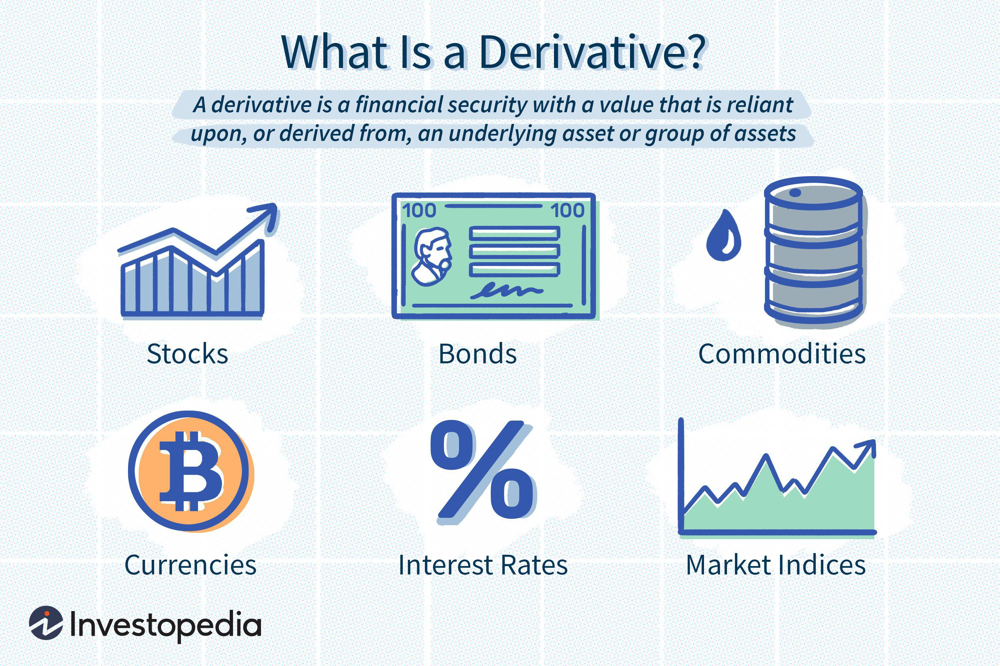

In today's digital age, technology has transformed financial markets by providing investors with unparalleled access to information and tools. Previously, such resources were exclusive to large institutions, but now individual investors can leverage them to enhance their decision-making processes. The proliferation of online platforms and analytical tools has democratized access to crucial financial data and techniques, empowering a new generation of investors to analyze stocks, interpret SEC filings, and engage in algorithmic trading effectively.

The accessibility of detailed stock analysis tools enables investors to scrutinize a company's financial health, assess market trends, and predict future performance with greater accuracy. This ability to conduct in-depth analyses, which once required significant resources, now allows individuals to engage as more informed and active participants in the financial markets.



Equally transformative is the availability of SEC filings, which provide transparent insights into a company's operations and financial status. These documents, critical for conducting due diligence, offer investors a standardized method to evaluate potential investments and uncover risks and opportunities within the investment landscape.

Algorithmic trading, another byproduct of technological advancement, has revolutionized the execution of trades. By utilizing sophisticated algorithms, investors can execute trades at speeds and efficiencies beyond human capabilities, optimizing the timing and pricing of trades to potentially enhance returns.

This article will explore how these elements—stock analysis, SEC filings, and algorithmic trading—interrelate and influence today's investment strategies. In doing so, we aim to offer insights into their combined impact on the modern investment landscape, highlighting both opportunities and challenges that come with integrating technology into financial decision-making.

## Table of Contents

## The Role of Stock Analysis in Investment

Stock analysis plays a pivotal role in shaping investment strategies by providing investors with critical insights into a company's financial viability, industry positioning, and growth potential. Investors employ various methodologies to dissect and interpret market data, enabling them to formulate informed investment decisions.

### Fundamental Analysis

Fundamental analysis involves evaluating a company's intrinsic value by examining comprehensive financial data and external factors. Key components include financial statements, macroeconomic indicators, management effectiveness, and industry dynamics. Analysts scrutinize balance sheets, income statements, and cash flow statements to assess [liquidity](/wiki/liquidity-risk-premium), profitability, and solvency. Ratios such as the Price-to-Earnings (P/E) ratio, Debt-to-Equity ratio, and Return on Equity (ROE) offer a quantifiable measure of a company's financial performance and relative valuation.

For example, the P/E ratio is calculated as:

$$

\text{P/E Ratio} = \frac{\text{Market Value per Share}}{\text{Earnings per Share (EPS)}}
$$

A lower P/E ratio might suggest an undervalued stock relative to its earnings potential, whereas a higher ratio could indicate overvaluation.

### Technical Analysis

Technical analysis focuses on interpreting market activity patterns through price charts and trading volumes. It is grounded in the belief that historical price movements can predict future behavior. Analysts use tools like moving averages, Relative Strength Index (RSI), and Bollinger Bands to identify trends, support, and resistance levels. These indicators help in assessing the market sentiment and potential price movements.

A moving average, for instance, is computed to smooth out price action over a specified period, providing a clearer view of the trend. The formula for a simple moving average (SMA) over $n$ periods is:

$$

\text{SMA} = \frac{\sum_{i=1}^{n} \text{Price}_i}{n}
$$

### Integration of Qualitative and Quantitative Factors

Successful stock evaluation requires an integration of both qualitative and quantitative factors. Quantitative aspects involve numerical data analysis, while qualitative factors consider elements such as a company’s management quality, brand reputation, and market position. Evaluating competitive advantages, regulatory environment, and industry trends supplements numerical analyses to build a comprehensive view.

Both fundamental and technical analyses can be used in conjunction by investors to form a holistic understanding. While [fundamental analysis](/wiki/fundamental-analysis) may uncover a company with strong growth prospects, technical analysis could suggest the most opportune time to enter or [exit](/wiki/exit-strategy) an investment.

In conclusion, the role of stock analysis in investment is to empower investors with tools and frameworks necessary to gauge potential risks and returns. By synthesizing insights from both fundamental and technical analyses, investors can craft strategies tailored to their risk tolerance and investment objectives. Integrating these analyses ensures a robust approach to stock selection and portfolio management.

## Understanding SEC Filings

SEC filings are crucial for investors aiming to gain a comprehensive understanding of a company's financial performance and operations. The United States Securities and Exchange Commission (SEC) mandates that publicly traded companies file regular reports to ensure transparency and protect investors. Among the various filings, the quarterly 10-Q and the annual 10-K reports stand out. These documents offer an unbiased examination of a company's financial statements and management discussions.

### Key Components of SEC Filings

1. **Financial Statements**: The 10-Q and 10-K include detailed financial statements such as the balance sheet, income statement, and cash flow statement. These documents help investors evaluate the financial stability and profitability of a company. By scrutinizing these financials, investors can identify trends in revenue, expenses, and overall financial health.

2. **Management Discussion and Analysis (MD&A)**: This section provides management's perspective on the financial results, offering insights into the conditions affecting the company’s performance. It helps investors understand the rationale behind financial outcomes and potential future challenges or opportunities.

3. **Risk Factors**: Both the 10-Q and 10-K highlight existing and potential risks that could impact business operations and financial performance. Investors can use this information to assess the potential risks involved in investing in a particular company.

### Analyzing SEC Filings for Risks and Opportunities

Analyzing SEC filings can reveal insights not apparent from the surface level. For example, a consistent increase in accounts receivable might indicate potential cash flow issues, whereas a significant rise in assets might suggest expansion or acquisition.

Here's a simple Python snippet demonstrating how one might start analyzing trends in financial data extracted from an SEC filing:

```python
import pandas as pd

# Load financial data into a pandas DataFrame
data = pd.read_csv('financial_data.csv')

# Calculate the year-over-year revenue growth
data['Revenue Growth'] = data['Revenue'].pct_change()

# Identify trends and anomalies
growth_trends = data[['Year', 'Revenue Growth']]
print(growth_trends)
```

This code provides a basic method to compute and analyze revenue growth trends over different periods.

### Speed-Reading Tips for SEC Filings

Given the depth and [volume](/wiki/volume-trading-strategy) of information contained in SEC filings, investors can benefit from effective speed-reading strategies:

1. **Prioritize Sections**: Focus on the financial statements, MD&A, and risk factors first. These sections provide critical insights into a company's financial health and strategic direction.

2. **Look for Narratives**: Pay attention to changes in language or emphasis in the MD&A. Companies might signal future directions or concerns through the management's narrative.

3. **Use Technology**: Leverage tools and platforms that offer AI-driven insights to highlight significant changes from previous filings or predict potential risks. These tools can help investors quickly identify anomalies or significant shifts in the company's performance or strategy.

Understanding and effectively analyzing SEC filings empowers investors with the knowledge needed to make well-informed decisions. By focusing on key areas and using strategic reading techniques, investors can uncover both risks and opportunities within these comprehensive documents.

## Algorithmic Trading and Its Impact

Algorithmic trading has fundamentally transformed the financial markets by automating the process of buying and selling securities. This method uses complex algorithms to make trading decisions based on predefined criteria, which significantly enhances the speed and efficiency of transactions.

**Design and Execution of Algorithms**

Algorithms in trading are crafted to ensure transactions occur at the most favorable speed and price. These algorithms analyze vast amounts of market data in real-time, allowing them to execute trades within milliseconds. The primary objective is to capitalize on minuscule price discrepancies across different markets or to react swiftly to market news and trends. For instance, algorithms can be programmed to follow a moving average crossover strategy, which involves generating buy or sell signals when a short-term moving average crosses a long-term moving average.

Here is an example of Python code implementing a simple moving average crossover strategy using the `pandas` and `numpy` libraries:

```python
import pandas as pd
import numpy as np

# Sample data: Price data as a pandas DataFrame
data = pd.DataFrame({
    'price': [110, 115, 120, 125, 130, 135, 125, 120, 110]
})

# Calculate moving averages
data['short_mavg'] = data['price'].rolling(window=2).mean()
data['long_mavg'] = data['price'].rolling(window=4).mean()

# Generate signals
data['signal'] = np.where(data['short_mavg'] > data['long_mavg'], 1, 0)

# Display signals
print(data)
```

In this code, buy signals are generated when the short-term moving average is above the long-term moving average, and vice versa for sell signals.

**Benefits and Risks**

Algorithmic trading provides several advantages, notably in terms of efficiency and cost reduction. It reduces human errors and emotions that can lead to irrational trading decisions. Moreover, the vast processing power of computers allows for the rapid execution of trades, ensuring that traders can exploit fleeting market opportunities.

However, [algorithmic trading](/wiki/algorithmic-trading) also introduces potential risks, such as increased market [volatility](/wiki/volatility-trading-strategies). Algorithms can amplify price swings if, for instance, they all react in the same way to a market event. This was illustrated by the Flash Crash of May 6, 2010, when the Dow Jones Industrial Average plummeted and then quickly rebounded in response to algorithmic transactions.

**Predictive Analytics in Algorithmic Strategies**

Predictive analytics plays a crucial role in shaping algorithmic trading. By leveraging methods such as [machine learning](/wiki/machine-learning) and statistical analysis, traders can develop predictive models to forecast future price movements based on historical data and current market conditions. These models can incorporate various factors including earnings reports, news sentiment, and economic indicators to enhance decision-making.

For example, machine learning algorithms can analyze patterns and trends in stock prices to predict future movements. This predictive capability allows algorithms to not only react to market changes but also anticipate them, affording traders a competitive edge.

In summary, algorithmic trading, bolstered by predictive analytics, offers significant potential for gaining efficiency in financial markets, though it also necessitates a careful management of its associated risks.

## Interlinking of Stock Analysis, SEC Filings, and Algo Trading

The integration of stock analysis, SEC filings review, and algorithmic trading offers a comprehensive framework for optimizing investment strategies. Each component brings unique insights and advantages that, when combined, enable investors to make well-informed decisions backed by data and precise execution techniques.

Stock analysis provides the foundational knowledge required to understand the intrinsic value of a company. It involves evaluating various factors such as financial statements, market conditions, and industry trends. For instance, fundamental analysis assesses a company's financial health and future potential, whereas technical analysis examines historical price and volume patterns to predict future movements. The integration with SEC filings, like 10-Q and 10-K reports, adds a layer of transparency and detail, offering a deep dive into a company's financial health and risk factors. For example, quarterly reports may reveal revenue trends or debt levels that significantly influence investment decisions.

Algorithmic trading enhances this process by utilizing computer algorithms to execute trades at optimal speeds and prices, enabling the processing of vast amounts of data in real-time. This approach allows for seamless incorporation of insights drawn from stock analysis and SEC filings into automated trading strategies. Algorithms can be programmed to react to specific data points and market conditions, ensuring that investment strategies are timely and efficient.

Examining case studies underscores how the combination of these elements can be practical and beneficial. For example, quantitative hedge funds such as Renaissance Technologies have famously employed intricate models that integrate comprehensive data analysis with high-frequency trading algorithms to outperform the market consistently. Their success illustrates the potential for merging qualitative insights with algorithm-driven execution.

Future trends and innovations in this intersecting field are expected to further influence investment practices. Advances in machine learning and [artificial intelligence](/wiki/ai-artificial-intelligence) will likely enhance the predictive capabilities of algorithms, allowing for even more sophisticated analysis of SEC filings and market data. Moreover, the growing importance of [alternative data](/wiki/best-alternative-data) sources, such as social media sentiment and satellite imagery, is expected to redefine how stock analysis is conducted, providing fresh inputs for algorithms.

While challenges such as data security and ethical considerations remain, the ongoing development in computing power and data analytics promises to refine and expand the opportunities available at the intersection of stock analysis, SEC filings review, and algorithmic trading. These innovations are poised to optimize investment strategy development, execution, and risk management, offering significant potential for informed and agile decision-making in financial markets.

## Challenges and Considerations

Despite the transformative benefits of stock analysis, SEC filings, and algorithmic trading, several challenges are inherent to their utilization. One significant challenge is the interpretation of copious amounts of data. With financial markets generating vast quantities of information every second, distinguishing signal from noise requires sophisticated analytical skills and tools. Investors often rely on advanced algorithms to process and interpret this data, which presents an additional challenge: reliance on technology. While technology can enhance efficiency and decision-making, it may also lead to overdependence, making investors susceptible to technical failures and errors.

Algorithm-based market manipulation is another critical concern. High-frequency trading and complex trading algorithms can sometimes lead to practices that mimic manipulation, such as spoofing or layering. These activities can distort market prices and undermine market integrity. Both regulators and investors are advised to remain vigilant and advocate for stringent regulatory frameworks that discourage such practices while maintaining market fluidity.

Cybersecurity risks are particularly relevant in the context of algorithmic trading platforms. As these platforms become more sophisticated, they may also become more appealing targets for cyberattacks. Unauthorized access and data breaches pose significant threats, potentially leading to substantial financial losses and compromising investor confidence. Thus, robust security measures, including encryption, multi-[factor](/wiki/factor-investing) authentication, and regular security audits, are essential in mitigating these risks.

In summary, while leveraging stock analysis, SEC filings, and algorithmic trading strategies can enhance investment portfolios, it is imperative to acknowledge and address the associated challenges. This necessitates a balanced approach that embraces technological advancements while maintaining rigorous oversight and security measures.

## Conclusion

Leveraging the power of stock analysis, SEC filings, and algorithmic trading presents considerable advantages for investors seeking to optimize their investment strategies. These tools offer unprecedented access to data-driven insights, enabling informed decision-making previously reserved for institutional investors. Stock analysis allows investors to evaluate a company's financial health and market potential, while SEC filings provide transparency and an unbiased understanding of the company's operations and financial status. Algorithmic trading enhances the speed and precision of trade execution, minimizing human error and maximizing efficiency.

The democratization of these financial tools through technology has empowered individual investors, bridging the gap between retail and institutional market participants. Nevertheless, this empowerment comes with responsibilities. Due diligence is essential to harness these tools effectively, as a comprehensive understanding of each framework's intricacies is crucial. Investors must be vigilant in interpreting data and aware of the potential biases or pitfalls in their analyses.

Staying informed and adaptable is paramount in navigating the complexities of modern financial markets. Markets are influenced by various factors, including economic indicators, geopolitical events, and technological advances, necessitating a flexible approach. Investors who continuously educate themselves and evolve their strategies in response to market changes stand to gain the most from this new era of financial tools. By being proactive and maintaining an informed stance, investors can successfully manage both opportunities and risks, securing their place in the ever-changing investment landscape.

## References & Further Reading

[1]: Moyer, R. C. (2014). ["Real Options and Investment Valuation with High Price Volatility."](https://en.wikipedia.org/wiki/Real_options_valuation) Journal of Business Research.

[2]: ["Financial Statement Analysis and Security Valuation"](https://www.mheducation.com/highered/product/Financial-Statement-Analysis-and-Security-Valuation-Penman.html) by Stephen H. Penman

[3]: "The Handbook of Fixed Income Securities" by Frank J. Fabozzi.

[4]: ["The Intelligent Investor: The Definitive Book on Value Investing"](https://www.amazon.com/Intelligent-Investor-Third-Definitive-Investing/dp/0063423537) by Benjamin Graham

[5]: ["Machine Learning: A Probabilistic Perspective"](https://archive.org/details/machinelearningp0000murp) by Kevin P. Murphy

[6]: ["Python for Finance: Analyze Big Financial Data"](https://books.google.com/books/about/Python_for_Finance.html?id=E93SBQAAQBAJ) by Yves Hilpisch

[7]: United States Securities and Exchange Commission. ["Beginner’s Guide to Financial Statement."](https://www.sec.gov/about/reports-publications/investorpubsbegfinstmtguide)

[8]: Jones, Charles M. (2013). ["What Do We Know About High-Frequency Trading?"](https://papers.ssrn.com/sol3/papers.cfm?abstract_id=2236201) Columbia Business School Research Paper No. 13-11. 

[9]: ["Algorithmic Trading and DMA: An introduction to Direct Access Trading Strategies."](https://archive.org/details/algorithmictradi0000john) by Barry Johnson

[10]: Securities and Exchange Commission. (2016). ["Form 10-K."](https://www.sec.gov/Archives/edgar/data/73309/000119312517062124/d298801d10k.htm) 

[11]: ["Flash Boys: A Wall Street Revolt"](https://en.wikipedia.org/wiki/Flash_Boys) by Michael Lewis