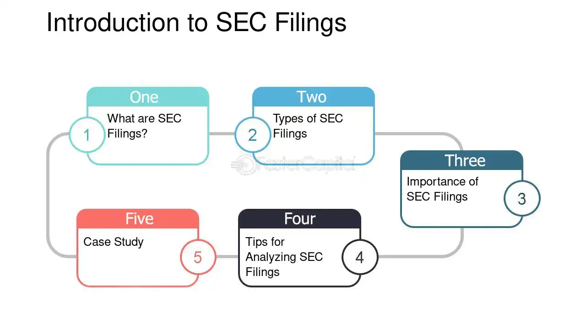

## Table of Contents

## What are SEC filings and why are they important for stock selection?

SEC filings are documents that companies have to send to the Securities and Exchange Commission (SEC). The SEC is a government group that makes sure companies follow the rules when they sell stocks or bonds. These filings tell investors important things about the company, like how much money it makes, what it owns, and any big changes happening. There are different types of SEC filings, like the 10-K, which is a yearly report, and the 10-Q, which is a report every three months.

These filings are really important for picking stocks because they give investors a lot of information to help them decide if a company is a good investment. By reading the filings, investors can see if the company is making money, if it has a lot of debt, or if there are any risks they should know about. This helps investors make smarter choices about which stocks to buy or sell. Without these filings, it would be much harder for people to know if a company is doing well or not.

## How can beginners access and navigate through SEC filings?

Beginners can easily access SEC filings by visiting the SEC's official website, called EDGAR (Electronic Data Gathering, Analysis, and Retrieval system). On the EDGAR website, you can search for a company by its name or its ticker symbol, which is a short code used to identify a company on the stock market. Once you find the company you're interested in, you can click on it to see all its recent filings. The filings are listed with their type, like 10-K or 10-Q, and the date they were filed.

Navigating through SEC filings might seem tricky at first, but it gets easier with practice. Start by looking at the most recent annual report, or 10-K, which gives a full picture of the company's performance over the past year. The 10-K is divided into sections like business overview, risk factors, financial statements, and management's discussion. You can jump to these sections using the table of contents at the beginning of the document. For more frequent updates, you can also look at the quarterly reports, or 10-Q, which provide updates every three months. By focusing on these key sections, beginners can get a good understanding of the company's health and performance.

## What are the most common types of SEC filings to look at for stock analysis?

For stock analysis, the most common SEC filings to look at are the 10-K and 10-Q. The 10-K is an annual report that gives a detailed look at a company's performance over the past year. It includes important sections like the business overview, risk factors, financial statements, and management's discussion. This report is very useful because it helps investors understand the company's overall health, how it makes money, and what risks it faces.

The 10-Q is a quarterly report that comes out every three months. It's not as detailed as the 10-K, but it's still important because it gives more frequent updates on the company's performance. By reading the 10-Q, investors can see if the company is doing better or worse than expected and if there are any new risks or changes happening. Both the 10-K and 10-Q are key documents for anyone trying to analyze a company's stock.

Another important filing to consider is the 8-K. This is used to report major events that happen between the regular quarterly and annual reports. These events could be things like a change in leadership, a merger or acquisition, or a big financial change. The 8-K helps investors stay up-to-date with important news that could affect the company's stock price. By keeping an eye on these three types of filings, you can get a good picture of what's going on with a company and make better investment decisions.

## How do you identify key financial data in SEC filings?

To identify key financial data in SEC filings, start by looking at the financial statements section in the 10-K or 10-Q reports. These statements include the income statement, balance sheet, and cash flow statement. The income statement shows how much money the company made and spent over a period, helping you see if it's making a profit. The balance sheet lists what the company owns and owes, giving you a snapshot of its financial health. The cash flow statement tells you how cash is moving in and out of the business, which is important for understanding if the company can pay its bills.

In the 10-K, also pay attention to the Management's Discussion and Analysis (MD&A) section. This part explains the financial statements in plain language and discusses any important changes or trends. It's a great place to learn about what the company thinks about its own financial performance and future plans. By focusing on these sections, you can quickly find the key financial data you need to analyze the company's stock.

## What are the differences between 10-K, 10-Q, and 8-K filings, and how should each be used in stock analysis?

The 10-K, 10-Q, and 8-K filings each serve different purposes and provide different kinds of information. The 10-K is an annual report that a company must file with the SEC. It gives a detailed look at the company's financial performance over the past year, including its income statement, balance sheet, and cash flow statement. The 10-K also includes sections like the business overview, risk factors, and management's discussion and analysis (MD&A), which explain the financial data in simple terms and discuss any important changes or trends. This report is very useful for getting a complete picture of the company's health and performance over the year.

The 10-Q is a quarterly report that provides updates on the company's performance every three months. It's not as detailed as the 10-K, but it includes the same key financial statements. The 10-Q helps investors see how the company is doing more frequently, allowing them to spot any changes or trends that might affect the stock price. The 8-K is different because it's used to report major events that happen between the regular quarterly and annual reports. These events could be things like a change in leadership, a merger or acquisition, or a big financial change. The 8-K is important for staying up-to-date with news that could impact the company's stock price.

For stock analysis, the 10-K should be your starting point because it gives you a full year's worth of data and a detailed look at the company's financial health. Use the 10-Q to keep track of the company's progress throughout the year and to see if there are any new developments or changes in the company's performance. The 8-K should be monitored regularly to catch any significant events that could affect the stock price. By using all three types of filings together, you can get a comprehensive understanding of the company and make more informed investment decisions.

## How can one analyze the management discussion and analysis (MD&A) section of a 10-K for insights into a company's operations?

The Management's Discussion and Analysis (MD&A) section of a 10-K is a great place to get insights into a company's operations. This part of the report is written by the company's management, so it gives you their view on how the business is doing. They explain the financial numbers in simple terms and talk about what's going well and what challenges the company is facing. You can learn about the company's strategy, how it makes money, and what it plans to do in the future. By reading the MD&A, you can understand the story behind the numbers and see if the company is making smart decisions.

When analyzing the MD&A, start by looking at the overview of the company's operations. This will give you a sense of what the company does and how it's organized. Then, pay attention to how management talks about the financial results. They might discuss why profits went up or down, or what's affecting the company's sales. Look for any risks or challenges they mention, as these can impact the company's future. Finally, see if they talk about future plans or investments. This can help you figure out if the company is on a good path and if it's worth investing in. By carefully reading the MD&A, you can get a clearer picture of the company's operations and make better investment choices.

## What are some red flags to look for in SEC filings that might indicate potential issues with a company?

When you look at SEC filings, there are some red flags that might show a company is having problems. One big warning sign is if the company keeps changing its auditors a lot. This can mean they are trying to hide something or that their financials are not reliable. Another red flag is if the company has a lot of related-party transactions. These are deals with people or companies that are connected to the company's leaders, and they can be used to make the company's financials look better than they really are. Also, if you see the company has a lot of debt and not enough money coming in to pay it back, that's a big problem. It could mean the company might have trouble staying in business.

Another thing to watch out for is if the company's financial statements have a lot of unusual or one-time charges. These can make the company's profits look better in some years but worse in others, which can be confusing and might hide ongoing problems. Also, if the management discussion and analysis (MD&A) section talks about a lot of risks or legal issues, that's a warning sign. It means the company could face big problems that might hurt its business. Finally, if the company's revenue or profits are going down a lot and they don't have a good reason for it, that's a red flag. It might mean the company is losing customers or facing other big challenges. By keeping an eye out for these signs, you can better understand if a company is in trouble.

## How can advanced investors use footnotes in financial statements to uncover hidden risks or opportunities?

Advanced investors can use footnotes in financial statements to find hidden risks or opportunities by carefully reading the details that explain the numbers in the financial reports. Footnotes often give extra information about how the company makes money, what it owns, and what it owes. For example, they might explain how the company values its inventory or how it accounts for its pensions. If a company uses a different way to value its inventory than other companies, it could make its profits look better than they really are. By looking at these details, investors can spot if a company is taking big risks or if it has hidden problems that could affect its future.

Footnotes can also show opportunities that are not clear from the main financial statements. For instance, they might mention new contracts or investments that the company is making, which could lead to more profits in the future. Investors can also find out if the company is involved in legal cases or if there are changes in laws that could help or hurt the business. By understanding these details, advanced investors can make better decisions about whether to buy, sell, or hold a company's stock. The key is to read the footnotes carefully and think about how the information could affect the company's future.

## What quantitative methods can be applied to data extracted from SEC filings to predict stock performance?

Advanced investors can use numbers from SEC filings to predict how a stock might do by looking at financial ratios. One common method is to calculate the price-to-earnings (P/E) ratio, which compares the stock's price to its earnings per share. If the P/E ratio is low, it might mean the stock is a good deal because it's cheaper compared to its earnings. Another useful ratio is the debt-to-equity ratio, which shows how much the company owes compared to what it owns. A high debt-to-equity ratio can be a warning sign that the company might have trouble paying back its loans, which could affect its stock price.

Another way to use SEC data is through regression analysis. This method helps investors see how different financial numbers, like revenue or profit margins, affect the stock price. By studying past data, investors can make models that predict future stock prices based on these numbers. For example, if a company's revenue growth is strong, the model might predict that the stock price will go up. Using these quantitative methods, investors can make smarter guesses about how a stock will perform based on the hard data found in SEC filings.

## How can you use SEC filings to compare the performance and risk profile of different companies within the same industry?

You can use SEC filings to compare how different companies in the same industry are doing by looking at their financial statements in the 10-K and 10-Q reports. Start by comparing their income statements to see which company is making more money and if their profits are growing. Look at their balance sheets to see how much debt each company has and what they own. If one company has a lot more debt than another, it might be riskier. You can also compare their cash flow statements to see how well they manage their money. By looking at these numbers side by side, you can see which company is performing better and which one might be a safer investment.

Another way to compare companies is by looking at the risk factors and management's discussion and analysis (MD&A) sections in their 10-K reports. These parts tell you about the challenges each company faces and how their leaders think about the future. If one company talks about a lot of risks or legal problems, it might be riskier than a company with fewer issues. The MD&A can also show you if a company is growing faster or has better plans for the future. By reading these sections carefully, you can get a good idea of which company has a better risk profile and which one might be a better investment in the long run.

## What role do insider transactions disclosed in SEC filings play in stock selection strategies?

Insider transactions, which are reported in SEC filings like Form 4, can give important clues about what the people running a company think about its future. If insiders, like the CEO or other top executives, are buying a lot of the company's stock, it might mean they believe the stock price will go up. This can be a good sign for investors because it shows that the people who know the company best are confident in its future. On the other hand, if insiders are selling a lot of their stock, it might mean they think the stock price is too high or they see problems ahead. This could be a warning sign for investors to be careful.

Using insider transactions in your stock selection strategy can help you make better choices. You can look at the SEC filings to see the details of these transactions, like how many shares were bought or sold and at what price. By keeping track of these insider moves over time, you can get a sense of the overall trend. If insiders are consistently buying more stock, it might be a good time to think about investing in the company too. But if they are selling a lot, it might be wise to wait or look for other investment opportunities. Always remember to use insider transactions as just one part of your overall analysis, along with other financial data and company news.

## How can machine learning and big data analytics be integrated with SEC filings analysis for more accurate stock predictions?

Machine learning and big data analytics can help make stock predictions more accurate by using the huge amount of data in SEC filings. These tools can look at lots of numbers and patterns in the financial statements, like revenue, profits, and debts, to find trends that might be hard for people to see. For example, [machine learning](/wiki/machine-learning) can use past data to create models that predict how a company's stock price might change based on its financial health. By feeding these models with data from SEC filings, investors can get better guesses about future stock performance. This can help them make smarter choices about which stocks to buy or sell.

Big data analytics can also help by pulling together information from many different sources, not just SEC filings. This can include news articles, social media posts, and economic reports. By combining all this data, machine learning models can get a fuller picture of what's happening with a company and its industry. This bigger view can lead to more accurate predictions because it takes into account more factors that might affect stock prices. By using these advanced tools, investors can spot opportunities and risks that they might miss otherwise, making their stock selection strategies more effective.

## What is the Role of Stock Analysis in Investment?

Stock analysis plays a pivotal role in shaping investment strategies by providing investors with critical insights into a company's financial viability, industry positioning, and growth potential. Investors employ various methodologies to dissect and interpret market data, enabling them to formulate informed investment decisions.

### Fundamental Analysis

Fundamental analysis involves evaluating a company's intrinsic value by examining comprehensive financial data and external factors. Key components include financial statements, macroeconomic indicators, management effectiveness, and industry dynamics. Analysts scrutinize balance sheets, income statements, and cash flow statements to assess [liquidity](/wiki/liquidity-risk-premium), profitability, and solvency. Ratios such as the Price-to-Earnings (P/E) ratio, Debt-to-Equity ratio, and Return on Equity (ROE) offer a quantifiable measure of a company's financial performance and relative valuation.

For example, the P/E ratio is calculated as:

$$

\text{P/E Ratio} = \frac{\text{Market Value per Share}}{\text{Earnings per Share (EPS)}}
$$

A lower P/E ratio might suggest an undervalued stock relative to its earnings potential, whereas a higher ratio could indicate overvaluation.

### Technical Analysis

Technical analysis focuses on interpreting market activity patterns through price charts and trading volumes. It is grounded in the belief that historical price movements can predict future behavior. Analysts use tools like moving averages, Relative Strength Index (RSI), and Bollinger Bands to identify trends, support, and resistance levels. These indicators help in assessing the market sentiment and potential price movements.

A moving average, for instance, is computed to smooth out price action over a specified period, providing a clearer view of the trend. The formula for a simple moving average (SMA) over $n$ periods is:

$$

\text{SMA} = \frac{\sum_{i=1}^{n} \text{Price}_i}{n}
$$

### Integration of Qualitative and Quantitative Factors

Successful stock evaluation requires an integration of both qualitative and quantitative factors. Quantitative aspects involve numerical data analysis, while qualitative factors consider elements such as a company’s management quality, brand reputation, and market position. Evaluating competitive advantages, regulatory environment, and industry trends supplements numerical analyses to build a comprehensive view.

Both fundamental and technical analyses can be used in conjunction by investors to form a holistic understanding. While [fundamental analysis](/wiki/fundamental-analysis) may uncover a company with strong growth prospects, technical analysis could suggest the most opportune time to enter or [exit](/wiki/exit-strategy) an investment.

In conclusion, the role of stock analysis in investment is to empower investors with tools and frameworks necessary to gauge potential risks and returns. By synthesizing insights from both fundamental and technical analyses, investors can craft strategies tailored to their risk tolerance and investment objectives. Integrating these analyses ensures a robust approach to stock selection and portfolio management.

## References & Further Reading

[1]: Moyer, R. C. (2014). ["Real Options and Investment Valuation with High Price Volatility."](https://en.wikipedia.org/wiki/Real_options_valuation) Journal of Business Research.

[2]: ["Financial Statement Analysis and Security Valuation"](https://www.mheducation.com/highered/product/Financial-Statement-Analysis-and-Security-Valuation-Penman.html) by Stephen H. Penman

[3]: "The Handbook of Fixed Income Securities" by Frank J. Fabozzi.

[4]: ["The Intelligent Investor: The Definitive Book on Value Investing"](https://www.amazon.com/Intelligent-Investor-Third-Definitive-Investing/dp/0063423537) by Benjamin Graham

[5]: ["Machine Learning: A Probabilistic Perspective"](https://archive.org/details/machinelearningp0000murp) by Kevin P. Murphy

[6]: ["Python for Finance: Analyze Big Financial Data"](https://books.google.com/books/about/Python_for_Finance.html?id=E93SBQAAQBAJ) by Yves Hilpisch

[7]: United States Securities and Exchange Commission. ["Beginner’s Guide to Financial Statement."](https://www.sec.gov/about/reports-publications/investorpubsbegfinstmtguide)

[8]: Jones, Charles M. (2013). ["What Do We Know About High-Frequency Trading?"](https://papers.ssrn.com/sol3/papers.cfm?abstract_id=2236201) Columbia Business School Research Paper No. 13-11. 

[9]: ["Algorithmic Trading and DMA: An introduction to Direct Access Trading Strategies."](https://archive.org/details/algorithmictradi0000john) by Barry Johnson

[10]: Securities and Exchange Commission. (2016). ["Form 10-K."](https://www.sec.gov/Archives/edgar/data/73309/000119312517062124/d298801d10k.htm) 

[11]: ["Flash Boys: A Wall Street Revolt"](https://en.wikipedia.org/wiki/Flash_Boys) by Michael Lewis