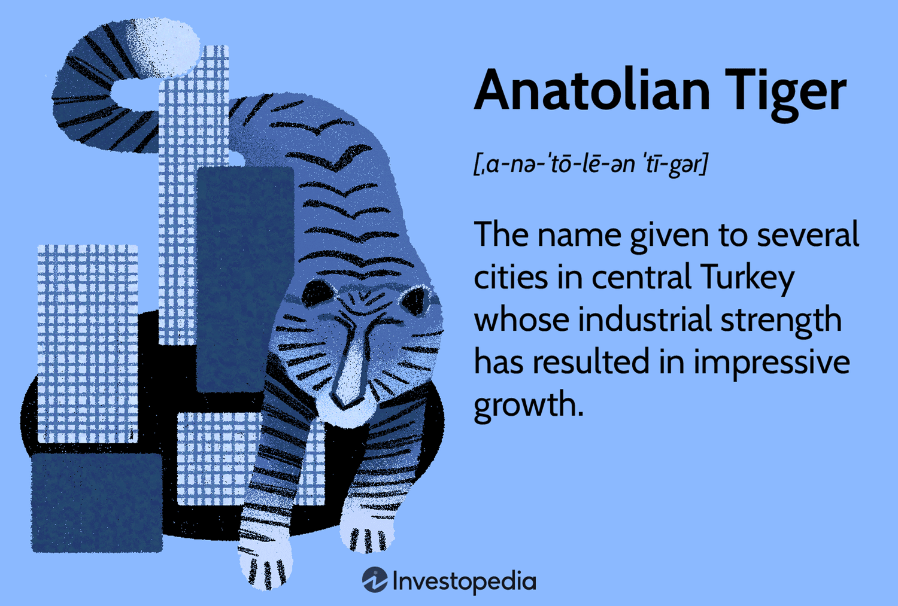

The Turkish economy is characterized by its dynamic and ever-evolving nature, reflecting a blend of traditional industries and modern innovations. This article explores the key components shaping Turkey's economic landscape, focusing on economic growth, the role of the Anatolian Tigers, and advancements in algorithmic trading. These elements collectively define and drive Turkey's economic progression, offering insights into the factors contributing to its rapid development and global significance.

Economic growth in Turkey has been marked by significant milestones, transitioning from a period of liberalization to becoming a robust player on the international stage. This transformation is attributed to strategic economic policies, a focus on export growth, and diversification efforts across various sectors. As Turkey continues to develop, it garners considerable global attention for its economic strategies and potential as an emerging market.

A pivotal aspect of this economic landscape is the Anatolian Tigers, a group of cities that epitomize Turkey's industrial vigor. Renowned for their entrepreneurial spirit, these cities have become the powerhouses driving regional economic development. Their socio-economic contributions are substantial, as they have been instrumental in shaping Turkey's economic narrative through innovation and industrialization.

Concurrent with the rise of the Anatolian Tigers is the advancement in algorithmic trading, a technological leap that signifies Turkey's foray into modern trading practices. This technology has transformed financial markets by employing sophisticated algorithms to execute trades, thus enhancing efficiency and market dynamics. Turkey's integration of algorithmic trading showcases its adaptability and forward-thinking approach within the global economic framework.

This article proceeds with a thematic exploration of these key areas, underscoring their interconnectedness and influence on Turkey's economic future. It aims to provide a comprehensive understanding of how Turkey's economic strategies have drawn international focus and the ways in which these elements collectively contribute to its economic prowess. Through this exploration, stakeholders are encouraged to recognize and engage with the opportunities presented by Turkey's evolving economic landscape, fostering further exploration and investment in its emerging markets.

## Table of Contents

## Overview of Turkey's Economic Growth

Turkey's economic trajectory over the past few decades showcases a paradigmatic shift marked by liberalization, robust growth, and progressive transformation. Initially, the Turkish economy was characterized by state-driven policies and protectionism. However, beginning in the early 1980s, a series of structural reforms oriented towards economic liberalization laid the groundwork for sustained economic growth. These reforms included reducing state interventions, liberalizing trade, and encouraging foreign direct investment (FDI), which collectively spurred economic dynamism.

Key economic indicators provide insights into Turkey’s growth trends. For instance, GDP growth has experienced notable fluctuations but has generally trended upwards. Turkey’s GDP expanded consistently, except during global economic downturns, reflecting resilience. From the 2000s onward, Turkey's real GDP growth averaged around 5%, except during the 2008 global financial crisis and subsequent regional instabilities. Inflation, which was once rampant, has been gradually brought under control through prudent monetary policies, although it remains a challenge. Employment levels have also improved, albeit with varying degrees of success across different sectors.

Governmental policies have significantly influenced Turkey's economic expansion. The regulatory landscape has been optimized to enhance business environments and stimulate entrepreneurship. Policies enhancing public infrastructure, education, and technology adoption have further fueled development. Government initiatives focusing on industrial development propelled the growth of sectors such as automotive, electronics, and textiles. Additionally, policies fostering public-private partnerships have accelerated infrastructural projects, contributing to the broader economic growth.

Export growth and diversification play pivotal roles in Turkey's economic strategy. The nation has evolved from predominantly agricultural exports to a more diversified portfolio, including industrial products, machinery, and vehicles. This diversification has mitigated economic vulnerabilities and bolstered resilience against external shocks. Turkey's strategically advantageous geographic location has facilitated substantial trade relations with Europe, the Middle East, and Asia, reinforcing its export capabilities.

Several milestones signify Turkey’s economic development journey. The Customs Union agreement with the European Union in 1995 marked a critical turning point, integrating Turkey more closely with European markets. The early 2000s witnessed a stabilization drive underpinned by structural adjustments and reforms that sought EU membership as a catalyst for transformation. The ensuing years saw unprecedented growth rates that positioned Turkey as a key player among emerging economies. The establishment of organized industrial zones and free trade zones catalyzed industrial growth, further embedding Turkey into global supply chains.

While challenges remain, including geopolitical tensions, currency [volatility](/wiki/volatility-trading-strategies), and the need for further financial and institutional reforms, Turkey’s economic journey highlights a transition from state-centric models to more liberal, diverse, and dynamic frameworks. This evolution continues to shape its current growth narrative and underscores its significant economic potential on the global stage.

## Anatolian Tigers: Powerhouses of Economic Development

The Anatolian Tigers are a group of cities in Turkey known for their rapid industrial growth, economic dynamism, and significant contributions to the country's economic landscape. Emerging primarily in the late 20th century, these cities have transformed from modest industrial bases into vibrant centers of commerce and industry. Among the prominent cities that are often referred to as Anatolian Tigers are Gaziantep, Kayseri, Konya, Denizli, and Bursa.

Gaziantep has become a hub for manufacturing and export, particularly in the textile and food sectors. Kayseri is renowned for its furniture and textile industries, while Konya has emerged as a center for agriculture, machinery, and automotive industries. Denizli is known for textiles and ceramics, whereas Bursa has strong ties to the automotive and textile industries. These cities exemplify the Anatolian entrepreneurial spirit, characterized by strong work ethics, innovative business practices, and a focus on small and medium-sized enterprises (SMEs).

The socio-economic factors contributing to the success of the Anatolian Tigers include a blend of cultural heritage, favorable geographical positioning, and supportive governmental policies. The latter has been instrumental in providing infrastructure, subsidies, and incentives for business development and export growth. Additionally, the robust network of organized industrial zones in these areas has facilitated manufacturing and industrial activities by providing essential facilities and resources for business operations.

Despite their successes, the Anatolian Tigers face several contemporary challenges. These include economic uncertainties and vulnerabilities to global market fluctuations, logistical inefficiencies, and potential skill shortages in their workforces. There is also the need for continued investment in technology and innovation to maintain competitiveness in an increasingly digital and interlinked global economy.

To sustain growth, these regions must address these challenges by investing in education, technology, and infrastructure improvements, and by fostering an environment conducive to continuous innovation. Emphasizing sustainable development practices will also be crucial in ensuring that these cities can maintain their competitive edge while contributing positively to Turkey's overall economic growth.

## Algorithmic Trading: A Technological Leap

Algorithmic trading involves the use of computer algorithms to automate trading decisions in financial markets. This technological advancement leverages complex mathematical models and high-speed data analysis to execute trades at speeds far greater than human capability. Typically, these algorithms are used to identify profitable trading opportunities and execute orders with minimal human intervention. The relevance of [algorithmic trading](/wiki/algorithmic-trading) in modern economies is significant due to its ability to enhance market efficiency, provide [liquidity](/wiki/liquidity-risk-premium), and reduce transaction costs.

In Turkey, algorithmic trading is increasingly being adopted, reflecting a global trend towards more technologically-driven financial markets. The Istanbul Stock Exchange has seen a rise in the use of algorithmic strategies, especially after infrastructural upgrades and regulatory support that facilitate faster and more efficient trading environments. Turkish financial institutions and individual investors use algorithmic trading to optimize their trading strategies, maximize profits, and compete effectively in both local and international markets.

The integration of technology in trading practices offers numerous benefits. Algorithmic trading allows for the processing of vast amounts of data at high speeds, enabling traders to capitalize on market movements quickly. It reduces human error and emotional bias, leading to more consistent and objective trading decisions. Additionally, the ability to backtest trading strategies on historical data helps investors refine their algorithms for better performance.

However, the rise of algorithmic trading comes with risks and regulatory concerns. These include market manipulation risks, such as spoofing or layering, where algorithms are used to create false market signals. The high speed of trading can sometimes exacerbate market volatility, as seen in incidents like the "flash crash" of 2010. In Turkey, regulators are vigilant, ensuring that the use of algorithmic trading adheres to rules designed to maintain market integrity and protect investors.

Global trading trends significantly influence Turkey's market practices. As global markets increasingly adopt algorithmic trading, Turkey faces both opportunities and challenges. The technology-driven landscape requires Turkish traders to stay competitive by continuously updating their technological infrastructure and strategies. In parallel, the adaptation of international regulatory standards is crucial to mitigate risks and promote a stable trading environment.

In conclusion, algorithmic trading represents a technological leap that is reshaping Turkey's financial markets. By enhancing efficiency and market competitiveness, it offers significant opportunities for growth while necessitating robust regulatory frameworks to address potential risks. As Turkey continues to align with global trading trends, algorithmic trading is set to play a critical role in the future of its financial sector.

## Interplay Between Anatolian Tigers and Algorithmic Trading

The economic growth of Anatolian Tigers provides a compelling case for examining how traditional industries are enhanced by modern trading technologies. Anatolian Tigers, a group of rapidly industrializing cities in Turkey, have been pivotal in stimulating economic development through their strong manufacturing and export-oriented economies. This growth is fundamentally aligned with advancements in algorithmic trading, facilitating enhanced efficiencies and market expansion.

One of the core synergies between the traditional industries of Anatolian Tigers and modern trading technologies is the optimization of supply chain and financial operations. Algorithmic trading systems can process vast amounts of market data to execute trades at optimal prices, reducing costs, and preventing human errors. For instance, manufacturers in cities like Kayseri and Gaziantep, key members of the Anatolian Tigers, can leverage algorithmic trading to hedge against commodity price fluctuations, improving their risk management capabilities.

Several case studies illustrate how Anatolian Tigers have embraced technological innovation. In Konya, a city known for its agricultural machinery industry, firms have integrated algorithmic models to forecast demand patterns, aligning production schedules with market needs more accurately. These models employ historical sales data coupled with current market trends, employing [machine learning](/wiki/machine-learning) techniques to enhance predictive accuracy. This technological shift not only increases operational efficiencies but also positions these companies to exploit new market opportunities swiftly.

Success stories from the Anatolian Tigers often highlight the adaptive entrepreneurial spirit that fosters innovation. A notable example is the textile industry in Denizli, which has implemented advanced data analytics tools to improve supply chain logistics and customer engagement through personalized marketing strategies. The adoption of these technologies has led to increased competitiveness in international markets.

Looking forward, the interplay between traditional industries in the Anatolian Tigers and algorithmic trading is likely to drive several future trends and innovations. One foreseeable trend is the increased utilization of real-time data analytics to make informed decisions rapidly, an approach that will enhance market responsiveness and strategic agility. Moreover, the integration of blockchain technology in algorithmic trading could further streamline operations by ensuring transparency and security in financial transactions.

Emerging technological innovations, such as quantum computing, might also revolutionize trading strategies for Anatolian Tigers, allowing for the processing of complex algorithms at unprecedented speeds. This could potentially unlock new dimensions of market analysis and trading capabilities, fostering further economic growth and global competitiveness for these regions.

In conclusion, the Anatolian Tigers exemplify how traditional industries can progress by adopting modern trading technologies. The continuous evolution of algorithmic trading presents myriad opportunities for these cities to enhance their economic stature and influence in global markets.

## Challenges and Opportunities

Turkey's economy is characterized by a blend of opportunities and challenges that shape its economic landscape. Among the significant challenges are political and economic uncertainties. Political instability, resulting from complex geopolitical dynamics and internal governance issues, has occasionally disrupted economic progress. Additionally, inflation and currency volatility have undermined economic stability, complicating fiscal and monetary policy management.

Foreign direct investment (FDI) emerges as a critical [factor](/wiki/factor-investing) with the potential to bolster the Turkish economy. FDI provides much-needed capital, technology transfer, and employment opportunities, which can drive economic growth. However, the level of FDI is sensitive to political stability, legal frameworks, and the ease of doing business, necessitating a favorable investment climate to maximize its impact.

Technological advancement offers a promising avenue for economic growth in Turkey. The country's investment in digital infrastructure and innovation could yield significant productivity gains and enhance competitiveness. Regional partnerships, particularly with European and Middle Eastern countries, present further opportunities for trade expansion and collaborative growth.

Policy reforms play a crucial role in addressing economic challenges. Structural reforms aimed at improving governance, reducing bureaucratic hurdles, and enhancing the investment climate would address some of the root causes of economic uncertainty. Additionally, monetary and fiscal policy adjustments are central to combating inflation and stabilizing the currency.

Looking forward, Turkey's growth prospects are contingent upon its ability to navigate these challenges and leverage existing opportunities. With the right mix of policy interventions, technological adoption, and regional cooperation, Turkey can bolster its economic resilience and achieve sustainable growth. Emphasizing technological integration and reforming institutional frameworks will be key to unlocking Turkey's economic potential and securing its position in the global economic arena.

## Conclusion

Turkey's economic narrative is distinguished by its robust growth, driven by the synergy between traditional economic frameworks and modern technological innovations. This evolution is prominently illustrated by the Anatolian Tigers, a group of progressive cities that have emerged as dynamic hubs of economic activity. These regions exemplify Turkey's entrepreneurial spirit, highlighting the importance of regional development in bolstering national economic progress. The Anatolian Tigers' contribution is significant; they act as catalysts for industrial diversification and innovation, which are essential for sustaining Turkey's economic growth.

Algorithmic trading represents another dimension of Turkey's economic transformation, introducing technological advancements that reshape the country's financial landscape. This technological leap facilitates more efficient and precise trading practices, integrating Turkey into a globalized market where speed and accuracy are paramount. While these advancements present potential risks, such as market volatility and regulatory challenges, they also offer significant opportunities for enhancing market efficiency and competitiveness.

The interplay between the Anatolian Tigers and algorithmic trading highlights a broader economic framework where traditional industries and modern technologies coexist and bolster each other. This synergy not only promotes economic resilience but also positions Turkey as a forward-thinking player in the global market. The collaboration between these elements underscores the necessity for Turkey to invest in technology-driven solutions while also nurturing its traditional economic strengths.

As Turkey navigates its economic future, stakeholders must recognize the vast opportunities that arise from these dynamics. Continued exploration and investment in technological innovations, coupled with effective policy reforms, can unlock new avenues for growth and integration into the global economy. There is a compelling need for stakeholders—ranging from policymakers to investors—to harness the potential within Turkey's economic landscape. By doing so, they can contribute to Turkey's trajectory towards becoming a more influential global economic entity.

In conclusion, the synthesis of Turkey's economic growth, the Anatolian Tigers, and algorithmic trading elucidates the country's evolving economic potential. By embracing these elements, Turkey can solidify its position in the global economy. Stakeholders are invited to engage actively with Turkey's economic prospects, ensuring that the country not only maintains its current [momentum](/wiki/momentum) but also pioneers future developments on the world stage.

## References & Further Reading

[1]: Şenses, F. (2007). "Globalization and the Turkish Economy." Routledge.

[2]: Pamuk, Ş. (2010). "Economic Change in Twentieth Century Turkey: Is the Glass More than Half Full?" In Keyder, Ç. (Ed.), "The Cambridge History of Turkey", Vol. 4, Cambridge University Press.

[3]: Yalçın, K. C., & Thorbecke, W. (2010). "The evolution of Turkey’s trade flows." Journal of International Trade & Economic Development, 19(3), 493-517.

[4]: Eraydın, A. (2002). "The Role of Female Labor in Industrial Restructuring: New Productions, New Workers and New Gender Dynamics in the Industrial Cities of Turkey." In Migration and Gender: Place, Time and People Specific, University of Warwick.

[5]: Durak, C., & Urkut, I. M. (2012). "Growth performance and structural change in the Turkish economy since 1980." Middle East Development Journal, 4(1), 81-104.

[6]: Gürkaynak, R. S., & Taş, B. K. O. (2014). "High frequency trading: A brief overview of the issues." Boğaziçi Journal: Review of Social, Economic and Administrative Studies, 28(2), 153-166.

[7]: Öniş, Z., & Türem, U. (2001). "Business, globalisation and democracy: A comparative analysis of Turkish business associations." Mediterranean Politics, 6(3), 1-21.

[8]: Kaya, A., & Teczan, B. (2011). "Politics of Diversification: The Anatolian Tigers." Southeast European and Black Sea Studies, 11(1), 25-44.

[9]: Goodhart, C., & O'Hara, M. (1997). "High-frequency trading." Journal of Financial Markets, 1(1), 1-7.