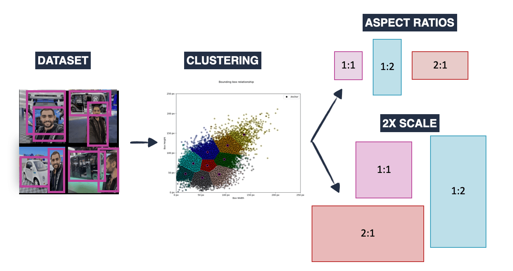

## Table of Contents

## What is an Anchor Generation Module in machine learning?

An Anchor Generation Module in machine learning is a part of certain algorithms, especially those used in object detection tasks. It helps by creating a set of reference boxes, called anchors, which are placed across an image. These anchors serve as starting points for the algorithm to predict where objects might be located in the image. By using anchors, the algorithm can more efficiently guess the positions and sizes of objects, making the detection process faster and more accurate.

In practical terms, the Anchor Generation Module works by spreading these anchor boxes evenly over the image. Each anchor box has a specific size and aspect ratio, which are chosen based on the types of objects the model is expected to detect. For example, if the model is designed to find cars and pedestrians, the anchor boxes might be sized and shaped accordingly. The module then adjusts these anchors during training to better fit the actual objects in the images, improving the model's performance over time.

## How does an Anchor Generation Module work in object detection?

An Anchor Generation Module in object detection helps the computer guess where objects might be in a picture. It does this by spreading out small boxes, called anchors, all over the image. Each anchor has a certain size and shape, chosen to match the kinds of things the computer is looking for, like cars or people. The module places these anchors evenly across the image, so it can start looking for objects from many different spots.

Once the anchors are in place, the object detection algorithm uses them as starting points to figure out where the actual objects are. The algorithm looks at the picture and adjusts the anchors to better fit the objects it finds. This process helps the computer quickly narrow down where to look, making it faster and more accurate at finding things in the image. By using anchors, the computer can focus on the most likely spots for objects, instead of searching the whole image from scratch.

## What is the role of anchors in object detection algorithms?

Anchors are important in object detection algorithms because they help the computer guess where objects might be in a picture. Imagine you are looking for a specific toy in a messy room. Instead of searching the entire room from scratch, you start by checking spots where the toy is often found, like under the bed or in the toy box. Anchors work the same way. They are small boxes placed all over the image, each with a specific size and shape. These boxes act as starting points for the algorithm, making it easier and faster to find objects by focusing on likely spots first.

During the training of an object detection model, the algorithm adjusts these anchors to better match the actual objects in the images. For example, if the model is trained to detect cars, it will learn to resize and reposition the anchors to fit cars more accurately. This process helps the model become more precise over time. By using anchors, the algorithm can efficiently predict where objects are, saving time and computational resources. This makes object detection algorithms more effective, especially when dealing with complex scenes containing multiple objects of different sizes and shapes.

## Can you explain the concept of Guided Anchoring in Anchor Generation Modules?

Guided Anchoring is a smart way to make anchor generation even better in object detection. Instead of just placing anchors randomly all over the image, guided anchoring uses information from the image itself to decide where and how big the anchors should be. It's like having a map that shows where the treasure might be buried, so you can dig in the right spots instead of guessing. By looking at the image, the algorithm can figure out where objects are likely to be and adjust the anchors to fit those spots better.

This method makes object detection more accurate and efficient. For example, if the image has a big truck, guided anchoring can create larger anchors around where the truck is, making it easier to spot the truck's exact location and size. This way, the computer doesn't waste time checking small anchors that won't fit the truck anyway. By using the image's clues to guide the anchors, the algorithm can focus on the most promising areas, leading to faster and more precise object detection.

## What are the main components of a Guided Anchoring system?

Guided Anchoring in object detection uses two main parts to make finding things in pictures easier and more accurate. The first part is the anchor prediction module. This part looks at the image and guesses where objects might be. It creates anchors that are the right size and shape for the objects it thinks it sees. For example, if it sees a big truck, it will make bigger anchors around that area. The second part is the anchor refinement module. This part takes the initial guesses and fine-tunes them. It adjusts the anchors to fit the objects more precisely, making sure they are the correct size and in the right spot.

These two parts work together to help the computer find objects quickly and correctly. The anchor prediction module gives a good starting point, and the anchor refinement module makes it even better. By using the image's clues to guide where and how big the anchors should be, the system can focus on the most likely spots for objects. This makes the whole process of detecting objects faster and more efficient, like having a map that shows where to look for treasure instead of digging randomly.

## How does Probabilistic Anchor Assignment differ from traditional anchor assignment methods?

Probabilistic Anchor Assignment is different from traditional anchor assignment methods because it uses a smart way to decide which anchors should be used to detect objects. In traditional methods, anchors are assigned to objects based on fixed rules, like if an anchor overlaps with an object more than a certain amount, it is used. But with Probabilistic Anchor Assignment, the system uses probabilities to decide. It looks at how well each anchor fits different objects and assigns them based on how likely they are to be correct. This means the system can handle situations where objects are close together or overlap better, because it can choose the best anchors more flexibly.

This method makes object detection more accurate and efficient. Instead of using a strict yes-or-no rule, Probabilistic Anchor Assignment lets the system consider all possible anchors and weigh their chances of being right. For example, if two objects are very close, traditional methods might struggle to assign the right anchors, but the probabilistic approach can figure out the best way to assign anchors by considering all possibilities. This leads to better results, especially in complex scenes where objects are not neatly separated.

## What are the advantages of using Probabilistic Anchor Assignment in Anchor Generation Modules?

Probabilistic Anchor Assignment helps make object detection better by being more flexible than traditional methods. Instead of using strict rules to decide which anchors to use, it uses probabilities. This means the system can look at all the possible anchors and choose the ones that are most likely to be right. This is especially helpful when objects in a picture are close together or overlapping. By considering all the possibilities, the system can handle tricky situations better and make fewer mistakes.

This method also makes the whole process of finding objects in pictures faster and more efficient. Traditional anchor assignment might struggle when objects are not neatly separated, but Probabilistic Anchor Assignment can figure out the best way to assign anchors by weighing their chances of being correct. This leads to more accurate results, especially in complex scenes. By using probabilities, the system can adapt to different situations and improve its performance over time.

## How do you implement a Guided Anchoring system in a deep learning framework like PyTorch or TensorFlow?

To implement a Guided Anchoring system in a deep learning framework like PyTorch or TensorFlow, you start by creating two main parts: the anchor prediction module and the anchor refinement module. In PyTorch, you would use a convolutional neural network (CNN) to design the anchor prediction module. This module looks at the image and guesses where objects might be, creating anchors that match the size and shape of the objects it thinks it sees. You can use a CNN to output a feature map that predicts the center, width, and height of anchors. For example, you might use a CNN to output three channels for the anchor center coordinates and two channels for the anchor's width and height. In TensorFlow, you would follow a similar approach, defining layers and operations to predict anchor properties.

Once you have the anchor prediction module, you need the anchor refinement module to fine-tune the initial guesses. In PyTorch, you can use another set of convolutional layers to adjust the anchors based on the image's details. This module refines the anchors' positions and sizes to fit the objects more precisely. You might use a loss function that measures how well the refined anchors match the actual objects in the image. In TensorFlow, you would similarly define layers to refine the anchors, and use a loss function to guide the refinement process. Both frameworks allow you to train the entire system end-to-end, improving the accuracy of object detection by iteratively adjusting the anchors to better match the objects in the images.

Here's a simple example of how you might start implementing the anchor prediction module in PyTorch:

```python
import torch
import torch.nn as nn

class AnchorPredictionModule(nn.Module):
    def __init__(self, in_channels, out_channels):
        super(AnchorPredictionModule, self).__init__()
        self.conv = nn.Conv2d(in_channels, out_channels, kernel_size=3, padding=1)
        self.activation = nn.ReLU()

    def forward(self, x):
        x = self.conv(x)
        x = self.activation(x)
        # Output shape: (batch_size, out_channels, height, width)
        # The first two channels predict the anchor center (x, y)
        # The next two channels predict the anchor's width and height
        return x
```

In this example, the `AnchorPredictionModule` uses a convolutional layer to predict anchor properties from an input image. You would need to expand this to include the anchor refinement module and integrate it into a full object detection system.

## What are some common challenges faced when optimizing Anchor Generation Modules?

Optimizing Anchor Generation Modules can be tricky because of a few main challenges. One big challenge is choosing the right sizes and shapes for the anchors. If the anchors are too big or too small, or if they have the wrong shapes, the system might miss objects or make mistakes. It's like trying to fit different-sized boxes into a puzzle; if the boxes don't match the puzzle pieces, they won't fit well. Another challenge is dealing with objects that are very close together or overlapping. When objects are near each other, it's hard for the system to figure out which anchor belongs to which object. This can lead to confusion and errors in detecting the objects correctly.

Another difficulty is making the system work well for different types of images. Pictures can have different lighting, angles, and backgrounds, which can make it hard for the anchors to work the same way every time. The system needs to be smart enough to adjust the anchors based on these changes. Also, training the system to use anchors effectively takes a lot of time and data. You need many examples of different objects in different situations to teach the system how to place and adjust the anchors correctly. This means you have to spend a lot of time and resources to make the Anchor Generation Module work well.

## How can the performance of Anchor Generation Modules be evaluated and compared?

To evaluate and compare the performance of Anchor Generation Modules, you can look at how well they detect objects in pictures. One way to do this is by checking the accuracy of the module. Accuracy means how often the module correctly finds and labels objects. You can use something called the Intersection over Union (IoU) score to see how well the anchors match the actual objects. The IoU score is calculated by dividing the area where the anchor and the object overlap by the area of the combined shape of the anchor and the object. If the IoU score is high, it means the anchor fits the object well. You can also look at the precision and recall of the system. Precision tells you how many of the detected objects are correct, while recall tells you how many of the actual objects were found. By comparing these scores across different Anchor Generation Modules, you can see which one works better.

Another way to compare Anchor Generation Modules is by looking at how fast they work. Speed is important because if a module takes too long to process an image, it might not be useful for real-time applications like self-driving cars or security cameras. You can measure the time it takes for the module to process an image and compare it with other modules. Also, you can check how well the module uses computer resources, like memory and processing power. A good module should be both accurate and fast, and it should not use too much of the computer's resources. By looking at all these factors—accuracy, speed, and resource usage—you can decide which Anchor Generation Module is the best for your needs.

## What are the latest advancements in Anchor Generation Modules for improving object detection accuracy?

Recent advancements in Anchor Generation Modules have focused on making object detection more accurate by using smarter ways to place and adjust anchors. One big improvement is called Adaptive Anchor Generation. This method uses the image's information to create anchors that are the right size and shape for the objects it sees. For example, if the image has a big truck, the system can make larger anchors to fit the truck better. This helps the system find objects more accurately, especially when they are different sizes or close together. Another advancement is called Dynamic Anchor Assignment. Instead of using fixed rules to decide which anchors to use, this method looks at all the possible anchors and chooses the ones that are most likely to be right. This is helpful when objects are overlapping or very close, because the system can handle these tricky situations better.

These new methods also use advanced techniques like deep learning to improve anchor generation. For example, some systems use convolutional neural networks (CNNs) to predict where anchors should be placed and how they should be sized. This helps the system learn from many different images and get better over time. By using these smart techniques, Anchor Generation Modules can now detect objects more accurately and efficiently, even in complex scenes with many objects of different shapes and sizes. This makes them very useful for real-world applications like self-driving cars, security systems, and more.

## How do Anchor Generation Modules integrate with other components of a machine learning pipeline for object detection?

Anchor Generation Modules are a key part of the object detection pipeline in machine learning. They work by creating small boxes called anchors that are spread across an image. These anchors act as starting points for the object detection algorithm to guess where objects might be. The anchors are then used by other parts of the pipeline, like the feature extraction module, which uses a convolutional neural network (CNN) to analyze the image and find features that match the anchors. The feature extraction module helps the system understand what's in the image by looking at patterns and shapes. After that, the anchor refinement module comes into play, adjusting the anchors to better fit the actual objects based on the features detected. This integration helps the system quickly and accurately detect objects by focusing on the most likely spots first.

Once the anchors are refined, they are passed to the object classification and bounding box regression modules. The classification module looks at the refined anchors and decides what kind of object is inside each one, like a car or a person. The bounding box regression module fine-tunes the position and size of the anchors to make them fit the objects even more precisely. All these components work together in a loop, where the system keeps learning and improving over time. By using anchors as a starting point, the entire pipeline becomes more efficient and accurate, making it easier to detect objects in complex scenes with many different things happening at once.