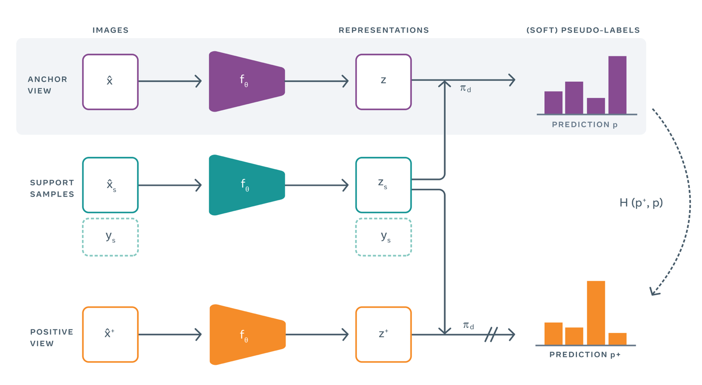

## Table of Contents

## What is Anchor Supervision in the context of machine learning?

Anchor supervision is a technique used in machine learning to improve the training of models, especially in scenarios where labeled data is limited. It involves using a small set of confidently labeled examples, called "anchors," to guide the model's learning process. These anchors act as reference points that help the model understand the data better and make more accurate predictions. By focusing on these reliable examples, the model can learn more effectively, even when the overall dataset is noisy or contains many mislabeled instances.

In practice, anchor supervision can be particularly useful in semi-supervised learning, where only a portion of the data is labeled. The model uses the anchors to infer patterns and relationships in the unlabeled data, thereby improving its performance across the entire dataset. This approach not only enhances the model's accuracy but also makes the training process more efficient, as it reduces the reliance on large amounts of labeled data. By strategically using anchors, machine learning practitioners can achieve better results with less effort and resources.

## How does Anchor Supervision differ from traditional supervised learning?

Anchor supervision and traditional supervised learning both aim to train models to make accurate predictions, but they use different approaches. In traditional supervised learning, the model is trained on a large dataset where every example is labeled. The model learns by trying to predict the correct label for each example, using all the labeled data equally. This method relies on having a lot of accurately labeled data, which can be expensive and time-consuming to gather.

In contrast, anchor supervision uses a smaller set of confidently labeled examples, called anchors, to guide the model's learning. Instead of treating all data equally, the model focuses more on these reliable anchors to understand the patterns in the data. This approach is particularly useful when you don't have many labeled examples or when the data is noisy. By using anchors, the model can still learn effectively and make good predictions, even with limited or imperfect data.

## What are the key components of an Anchor Supervision system?

The key components of an Anchor Supervision system include a small set of confidently labeled examples, known as anchors, and a larger dataset that may include both labeled and unlabeled examples. The anchors are the foundation of the system, serving as reliable reference points that guide the model's learning process. These anchors are chosen because they are believed to be accurately labeled and representative of the data's underlying patterns. The rest of the dataset, which may contain noisy or mislabeled examples, is used in conjunction with the anchors to train the model.

The model in an Anchor Supervision system is designed to prioritize learning from the anchors. By focusing on these high-quality examples, the model can infer the correct patterns and relationships in the data more effectively. This approach is particularly useful when labeled data is scarce or when the dataset is large but contains many errors. The model's ability to generalize from the anchors to the rest of the data helps improve its performance, making Anchor Supervision a powerful technique for training models under challenging conditions.

## Can you explain the concept of FreeAnchor in Anchor Supervision?

FreeAnchor is a special way of using Anchor Supervision in [machine learning](/wiki/machine-learning). It's called "FreeAnchor" because it lets the model pick its own anchors instead of using ones that people choose. In regular Anchor Supervision, people pick the anchors based on what they think is important. But with FreeAnchor, the model looks at all the data and decides which examples should be anchors. This can help the model learn better because it can focus on the examples that it thinks are most useful.

The idea behind FreeAnchor is to make the learning process more flexible and effective. By letting the model choose its own anchors, it can adapt to the data better and find the most important patterns. This can be especially helpful when the data is complicated or when there are a lot of different types of examples. FreeAnchor helps the model work smarter, not harder, by focusing on the right examples to learn from.

## What problems does FreeAnchor aim to solve in object detection?

FreeAnchor aims to solve some big problems in object detection. One main problem is that choosing anchors the old way can be hard and might not work well for all kinds of images. When people pick anchors, they might miss some important parts of the image or focus too much on the wrong things. FreeAnchor lets the computer pick its own anchors, so it can learn better from the whole picture and find the objects more accurately.

Another problem FreeAnchor helps with is making the model more flexible. In regular object detection, the model might struggle with different shapes and sizes of objects. FreeAnchor lets the model look at all the data and decide what's important, so it can handle a wider variety of objects. This makes the model smarter and better at finding things in different kinds of images.

## How is FreeAnchor implemented in a machine learning model?

FreeAnchor is implemented in a machine learning model by letting the model pick its own anchors instead of using ones chosen by people. The model looks at all the data and decides which examples are the most important to learn from. This is done by using a special part of the model called a "feature extractor" to understand the data, and then another part called a "prediction head" to guess where the objects are. The model keeps adjusting its guesses until it finds the best anchors to use. This way, the model can learn from the most useful examples and get better at finding objects in pictures.

To make FreeAnchor work, the model needs to be trained in a special way. During training, the model uses a loss function that helps it figure out which anchors are the best. The loss function compares the model's guesses to the actual objects in the picture and tells the model how to improve. By focusing on the right anchors, the model can learn to find objects more accurately and handle different kinds of images better. This makes the model more flexible and smarter at object detection.

## What are the benefits of using FreeAnchor over other anchor-based methods?

FreeAnchor helps make object detection easier and better by letting the computer choose its own important examples, called anchors. When people pick anchors, they might miss some important parts of the picture or focus on the wrong things. But with FreeAnchor, the computer looks at everything and decides what's most useful. This way, the model can learn from the best examples and find objects more accurately. It's like giving the model a superpower to see and understand pictures better.

Another big benefit of FreeAnchor is that it makes the model more flexible. Regular anchor methods can struggle with different shapes and sizes of objects. But FreeAnchor lets the model adapt to all kinds of objects by choosing the right anchors. This means the model can handle a wider variety of pictures and find objects no matter how they look. By using FreeAnchor, the model becomes smarter and better at its job, making object detection more reliable and efficient.

## What are some practical applications of Anchor Supervision with FreeAnchor?

Anchor Supervision with FreeAnchor can be used in many real-world situations where computers need to find things in pictures. For example, in self-driving cars, FreeAnchor helps the car's computer see and understand the road better. It can pick out important things like other cars, people, and signs, even if they look different from what it's seen before. This makes the car safer and smarter because it can react quickly to what's around it.

Another place where FreeAnchor is useful is in security cameras. These cameras need to spot things like people or cars that might be doing something unusual. With FreeAnchor, the computer can learn to focus on the most important parts of the picture and ignore things that don't matter. This means the security system can catch problems faster and work better, keeping places safer.

## How does FreeAnchor affect the training process of a machine learning model?

FreeAnchor changes the way a machine learning model learns by letting the computer pick its own important examples, called anchors. In regular training, people choose the anchors, but with FreeAnchor, the model looks at all the data and decides what's most useful. This means the model can focus on the best examples to learn from, which helps it understand pictures better. During training, the model uses a special way of measuring how well it's doing, called a loss function. This loss function helps the model figure out which anchors are the best and keeps adjusting until it finds the right ones.

By using FreeAnchor, the training process becomes more flexible and effective. The model can handle different kinds of pictures and find objects no matter how they look. This makes the model smarter and better at its job. For example, in self-driving cars, FreeAnchor helps the car's computer see the road and other things around it more clearly. In security cameras, it helps spot unusual activities faster. Overall, FreeAnchor makes the training process easier and more reliable, leading to better results in object detection.

## What are the performance metrics used to evaluate Anchor Supervision models?

To check how well Anchor Supervision models work, people use different ways to measure their performance. One common way is to look at the model's accuracy, which means how often it guesses right. Another important measure is precision, which shows how many of the things the model says it found are actually there. Recall is also used, which tells us how many of the real things the model was able to find. People often use a mix of these measures called the F1 score, which balances precision and recall to give a good overall idea of how the model is doing. The formula for the F1 score is $$F1 = 2 \times \frac{\text{precision} \times \text{recall}}{\text{precision} + \text{recall}}$$.

Another way to see how well Anchor Supervision models work is by looking at the average precision (AP), which is often used in object detection tasks. AP measures how well the model can find objects at different levels of confidence. For example, if the model is good at finding objects even when it's not very sure, it will have a high AP. People also use the mean average precision (mAP), which is the average of the AP scores for different types of objects. This helps to understand how well the model works across all the things it needs to find. By using these measures, people can see if the model is getting better at its job and make changes to help it work even better.

## How can hyperparameters be tuned in Anchor Supervision to optimize model performance?

Tuning hyperparameters in Anchor Supervision involves adjusting settings like the number of anchors, the learning rate, and the loss function to make the model work better. One way to do this is by using a method called grid search, where you try different combinations of these settings to see which ones give the best results. For example, you might change the number of anchors from 10 to 20 to 30 and see how the model's accuracy changes. Another way is to use random search, where you pick random combinations of hyperparameters and test them. This can be faster than grid search because it doesn't try every possible combination.

Another important hyperparameter to tune is the learning rate, which controls how fast the model learns from the data. If the learning rate is too high, the model might miss important patterns, but if it's too low, the model might take too long to learn. You can use a method called learning rate scheduling, where the learning rate changes over time. For example, you might start with a high learning rate and slowly decrease it as the model gets better. The formula for a simple learning rate schedule could be $$ \text{new_learning_rate} = \text{initial_learning_rate} \times \text{decay_rate}^{\text{epoch}} $$. By carefully tuning these hyperparameters, you can help the model find the best anchors and improve its performance in object detection tasks.

## What are the current challenges and future directions for research in Anchor Supervision?

One of the main challenges in Anchor Supervision is finding the right anchors. When the data is noisy or has many different types of objects, it can be hard to pick anchors that help the model learn well. Another challenge is making the model work quickly. Anchor Supervision can slow down the training process because the model has to look at lots of data to find the best anchors. Researchers are trying to find ways to make this faster and more efficient. They are also working on making the model better at handling different kinds of images and objects, which can be tricky when using anchors.

In the future, researchers want to make Anchor Supervision even better. They are looking into new ways to choose anchors automatically, like using FreeAnchor, which lets the model pick its own anchors. This could make the model more flexible and able to handle all sorts of pictures. Another direction is to combine Anchor Supervision with other learning methods, like semi-supervised learning, to use both labeled and unlabeled data more effectively. By working on these areas, researchers hope to make Anchor Supervision a powerful tool for all kinds of machine learning tasks.