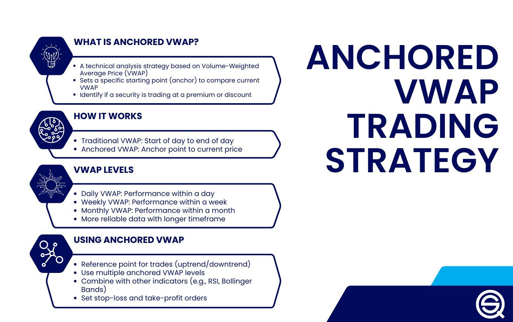

## Table of Contents

## What is VWAP and how is it calculated?

VWAP, or Volume Weighted Average Price, is a trading benchmark used by investors to determine the average price of a security over a specific time period, taking into account both the price and the volume of trades. It helps traders understand whether they are getting a good deal on a trade compared to the market average. Essentially, VWAP gives more weight to price levels at which more shares were traded, making it a useful tool for large institutional investors who want to execute trades without significantly impacting the market price.

To calculate VWAP, you start by multiplying the price of each trade by the volume of that trade. You do this for every trade within the chosen time frame, usually a trading day. Then, you add up all these values to get the total price-volume product. Next, you add up the volumes of all the trades to get the total volume. Finally, you divide the total price-volume product by the total volume to get the VWAP. This calculation is typically updated throughout the trading day to reflect the most current data.

## What is an Anchored VWAP and how does it differ from standard VWAP?

An Anchored VWAP is a variation of the standard VWAP that allows you to start the calculation from a specific point in time, rather than the beginning of the trading day. This point could be a significant event like a news announcement or a particular price movement that you want to analyze. By anchoring the VWAP to this specific moment, you can better understand how the price has evolved since that event, which can be useful for making trading decisions based on more recent data.

The main difference between Anchored VWAP and standard VWAP is the starting point of the calculation. Standard VWAP resets at the start of each trading day and includes all trades from that point forward. In contrast, Anchored VWAP can start at any time you choose, allowing you to focus on a particular period that might be more relevant to your trading strategy. This flexibility makes Anchored VWAP a valuable tool for traders who want to analyze price movements in relation to specific events or time frames.

## Why would a trader use an Anchored VWAP strategy?

A trader might use an Anchored VWAP strategy to focus on how a stock's price has moved since a specific event, like a news release or a big price change. By starting the VWAP calculation from that moment, the trader can see if the stock is trading above or below its average price since the event. This can help them decide if it's a good time to buy or sell based on recent trends, rather than the whole day's trading.

Using Anchored VWAP also helps traders understand the impact of certain events on a stock's price. For example, if a company announces good news and the stock price goes up, the trader can anchor the VWAP to that announcement time to see if the price is still rising or if it's starting to fall back. This can guide them in making smarter trading choices by focusing on what's happening right now, instead of looking at the entire day's data.

## How do you set the anchor point for an Anchored VWAP?

To set the anchor point for an Anchored VWAP, you pick a specific time or event that you want to start measuring from. This could be when a news story comes out, a big price jump happens, or any other moment you think is important. You tell your trading software or chart the exact time you want to start the calculation, and it will use that as the beginning point instead of the start of the trading day.

Once you've set the anchor point, the software will calculate the VWAP using all the trades that happened after that time. This helps you see how the stock's price has moved since your chosen event. It's like zooming in on a specific part of the day to see if the price is going up or down compared to the average price since that moment.

## Can you explain the basic steps to implement an Anchored VWAP trading strategy?

To start using an Anchored VWAP trading strategy, first choose a specific time or event that you think is important. This could be when a company makes a big announcement, or when the stock price suddenly changes a lot. Once you've picked your moment, use your trading software to set the anchor point at that time. This tells the software to start calculating the VWAP from that moment instead of the start of the day.

After setting the anchor point, watch how the stock's price moves compared to the Anchored VWAP line on your chart. If the price is above the VWAP line, it might mean the stock is doing well since your chosen event, and you might think about buying. If the price is below the VWAP line, it could mean the stock isn't doing as well, and you might consider selling or waiting for a better time. Keep an eye on the VWAP line as it updates with new trades to help you make your trading decisions based on recent trends.

## What are the common entry and exit signals used in an Anchored VWAP strategy?

In an Anchored VWAP strategy, common entry signals happen when the stock price moves away from the VWAP line. If the price goes above the VWAP line, it might be a good time to buy because it shows the stock is doing better than average since the event you picked. If the price goes below the VWAP line, it could be a sign to sell or short sell because the stock isn't doing as well.

Exit signals in this strategy often come when the price moves back towards the VWAP line. If you bought the stock when it was above the VWAP and it starts to go back down to the line, that might be a good time to sell and take your profits. If you shorted the stock when it was below the VWAP and it starts to go back up to the line, that could be a sign to cover your short position to avoid losses. Watching how the price interacts with the VWAP line helps you decide when to get in and out of trades.

## How does an Anchored VWAP help in identifying trend reversals?

An Anchored VWAP helps in identifying trend reversals by showing when the stock price starts to move differently compared to its average price since a specific event. If the price was going up and then it starts to fall back towards the Anchored VWAP line, it might mean the trend is reversing. Traders watch for the price to cross the VWAP line because it can signal that the stock's [momentum](/wiki/momentum) is changing.

For example, if a stock was trading above the Anchored VWAP line and then the price drops below it, this could be a sign that the upward trend is ending and a downward trend might be starting. By keeping an eye on how the price behaves around the VWAP line, traders can spot these potential reversals early and adjust their trading strategies accordingly.

## What are the advantages of using Anchored VWAP over other volume-based indicators?

Using Anchored VWAP can be better than other [volume](/wiki/volume-trading-strategy)-based indicators because it lets you focus on a specific time or event. With Anchored VWAP, you can start your calculation from a moment that's important to you, like when a company announces news or when the stock price suddenly changes a lot. This helps you see how the price has moved since that moment, which can be more useful than looking at the whole day's data. Other indicators might not give you this kind of focus, making it harder to understand recent trends.

Another advantage of Anchored VWAP is that it's good at showing when a trend might be changing. If the stock price goes above or below the VWAP line, it can tell you if the stock is doing better or worse since your chosen event. This can help you decide when to buy or sell. Other volume-based indicators might not be as clear about trend reversals, making Anchored VWAP a handy tool for traders who want to make quick and informed decisions based on recent events.

## What are some potential pitfalls or limitations of using Anchored VWAP?

One problem with using Anchored VWAP is that it can be tricky to pick the right time to start the calculation. If you choose the wrong moment, the VWAP line might not show you the right trends, and you could make bad trading choices. Also, because Anchored VWAP focuses on a specific time, it might miss out on important price movements that happened before or after your chosen event, which could affect your understanding of the stock's overall trend.

Another limitation is that Anchored VWAP can be affected by big trades or sudden price changes. If there's a huge trade right after your anchor point, it can pull the VWAP line in a way that doesn't really show what's happening with the stock's price. This can make it hard to know if the stock is really doing well or not. So, while Anchored VWAP is a helpful tool, you need to use it carefully and look at other information too to make the best trading decisions.

## How can Anchored VWAP be combined with other technical indicators for better results?

Combining Anchored VWAP with other technical indicators can help traders get a better picture of what's happening with a stock. For example, you might use the Relative Strength Index (RSI) along with Anchored VWAP. The RSI can show if a stock is overbought or oversold, which can help you decide when to buy or sell. If the price is above the Anchored VWAP line and the RSI is also high, it might be a good time to sell because the stock could be overbought. On the other hand, if the price is below the Anchored VWAP line and the RSI is low, it might be a good time to buy because the stock could be oversold.

Another useful indicator to combine with Anchored VWAP is the Moving Average Convergence Divergence (MACD). The MACD can help you spot when the stock's trend might be changing. If the price crosses the Anchored VWAP line and the MACD line crosses its signal line at the same time, it can be a strong sign that the trend is reversing. This can give you more confidence in your trading decisions. By using Anchored VWAP together with other indicators, you can get a fuller view of the market and make smarter trades.

## What are some real-world examples or case studies of successful Anchored VWAP trades?

One real-world example of a successful Anchored VWAP trade happened when a trader used it to buy stock in a company right after it announced good news. The trader set the anchor point at the time of the announcement and saw the stock price go above the Anchored VWAP line. This showed that the stock was doing better than average since the news came out. The trader bought the stock when it was above the line and sold it when the price started to come back down to the line, making a profit.

Another example is when a trader used Anchored VWAP to spot a trend reversal. The trader chose a moment when the stock price suddenly dropped a lot and set the anchor point there. They watched the price move below the Anchored VWAP line, which suggested the stock was doing worse than average since the drop. The trader shorted the stock when it was below the line and then covered the short when the price started to go back up towards the line. This move helped the trader make money by predicting the stock's change in direction.

## How can one backtest an Anchored VWAP strategy to optimize performance?

To backtest an Anchored VWAP strategy, you first need to use historical stock data to see how the strategy would have worked in the past. You pick different times to set the anchor point, like after a big news event or a price change, and then look at how the stock's price moved compared to the Anchored VWAP line. You track when you would have bought or sold the stock based on the price moving above or below the line. By doing this over many different days and events, you can see if your strategy would have made money or lost money.

Once you have the results from your [backtesting](/wiki/backtesting), you can change things to try to make your strategy better. You might try different times to set the anchor point, or you might change how far above or below the VWAP line you need the price to be before you buy or sell. By testing these changes on past data, you can find the best way to use Anchored VWAP for your trading. This helps you feel more confident that your strategy will work well when you use it for real trading.

## References & Further Reading

[1]: ["Technical Analysis of the Financial Markets"](https://www.amazon.com/Technical-Analysis-Financial-Markets-Comprehensive/dp/0735200661) by John J. Murphy

[2]: ["Trading and Exchanges: Market Microstructure for Practitioners"](https://www.amazon.com/Trading-Exchanges-Market-Microstructure-Practitioners/dp/0195144708) by Larry Harris

[3]: ["Volume Weighted Average Price (VWAP)"](https://www.investopedia.com/terms/v/vwap.asp) on Investopedia

[4]: Berkowitz, S. A., Logue, D. E., & Noser, E. A. (1988). ["The Total Cost of Transactions on the NYSE."](https://onlinelibrary.wiley.com/doi/abs/10.1111/j.1540-6261.1988.tb02591.x) The Journal of Finance, 43(1), 97-112.

[5]: Hendershott, T., & Riordan, R. (2013). ["Algorithmic Trading and the Market for Liquidity."](https://papers.ssrn.com/sol3/papers.cfm?abstract_id=2001912) The Review of Financial Studies, 27(3), 839-879.