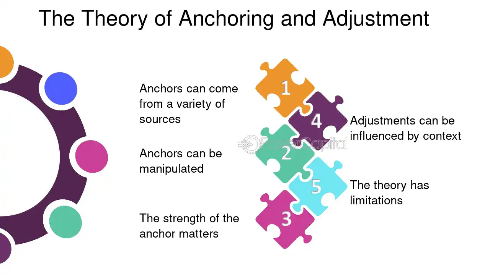

## Table of Contents

## What is anchoring and adjustment in the context of business and finance?

Anchoring and adjustment is a mental shortcut that people use when they need to make a decision or estimate something. In business and finance, it means that people start with an initial piece of information, called an "anchor," and then adjust their thoughts or decisions from there. For example, if a company sets a high initial price for a product, customers might see that as the anchor and think any lower price is a good deal, even if it's still expensive.

This concept can affect how people invest, negotiate, and make financial decisions. For instance, if an investor hears a stock was once worth $100, they might anchor to that price and think it's a bargain if it drops to $80, even if the stock's true value is lower. Businesses use anchoring and adjustment to their advantage by setting high initial prices or making big first offers in negotiations, knowing that people will adjust from that starting point. Understanding this can help people make better decisions by questioning their anchors and considering other information.

## How does anchoring affect decision-making in financial negotiations?

Anchoring can really change how people make decisions during financial negotiations. When someone starts a negotiation with a high or low number, that number becomes the "anchor." The other person then bases their decisions on this anchor. For example, if you're selling a car and you start by asking for a high price, the buyer might think that any price lower than your first ask is a good deal, even if it's still more than the car is worth.

This can lead to people making choices that aren't the best for them. In negotiations, the person who sets the anchor can have a big advantage. If the buyer in our car example starts with a low offer instead, the seller might feel pressured to accept a lower price than they wanted. Knowing about anchoring can help people be more careful and think about whether the starting number is fair before they make their decisions.

## Can you provide examples of anchoring in everyday business scenarios?

In a store, you might see a shirt with a big sign that says "Was $50, Now $30." The $50 price is the anchor. Even though $30 might still be a lot for the shirt, it feels like a good deal because it's less than $50. The store uses the higher price to make the sale price seem better. This can make people more likely to buy the shirt, thinking they're getting a bargain.

In a salary negotiation, if a job candidate asks for a starting salary of $70,000, that number becomes the anchor. The employer might then offer $65,000, which feels like a compromise. But if the candidate had asked for $80,000, the employer might have offered $70,000 instead. The first number the candidate asks for sets the stage for the whole negotiation, and it can affect the final salary a lot.

## What psychological principles underlie the anchoring and adjustment heuristic?

The anchoring and adjustment heuristic is based on how our brains handle information. When we need to make a guess or a decision, we often start with the first piece of information we get, which is the anchor. This anchor then influences all our later thoughts and choices, even if it's not really related to what we're deciding. For example, if you're at a store and see a shirt marked down from $50 to $30, the $50 becomes the anchor, making $30 seem like a good deal.

Another important part of this is how we adjust from the anchor. People usually don't adjust enough away from the starting point. This means the first number we hear or see has a big effect on our final decision. It's like if someone asks you to guess how many jelly beans are in a jar and gives you a starting guess of 1000. Even if you think it's too high, you might still end up guessing around 800 or 900, because that first number sticks in your mind. Understanding this can help us make better choices by questioning our anchors and thinking more about other information.

## How can businesses use anchoring strategically to influence consumer behavior?

Businesses can use anchoring to make their products seem like better deals. They might show a high original price next to a lower sale price. For example, a store might put a sign on a shirt that says "Was $50, Now $30." The $50 is the anchor, making the $30 price look like a good deal. This can make people more likely to buy the shirt, thinking they're getting a bargain. Companies also use this in ads, showing a high price first to make the sale price seem better.

Another way businesses use anchoring is in pricing strategies. They might offer different versions of a product at different prices, with the most expensive one setting the anchor. For example, a tech company might sell a basic phone for $200, a mid-range one for $500, and a premium one for $1000. The $1000 phone sets the anchor, making the $500 phone seem like a reasonable choice. This can make people feel like they're getting a good deal on the mid-range option, even though it's still expensive. By understanding how anchoring works, businesses can guide customers to make choices that benefit the company.

## What are common mistakes people make due to anchoring bias in financial markets?

In financial markets, people often make mistakes because of anchoring bias. They might see a stock's past high price and think it's a good buy when it drops, even if the stock isn't worth that much anymore. For example, if a stock used to be $100 but now it's $80, someone might buy it thinking it's a bargain. But if the company's doing worse now, the stock might not be worth $80 either. Anchoring to the old high price can make people ignore important information about the stock's current value.

Another common mistake is when people set their investment goals based on an anchor. If someone hears that a stock usually goes up by 10% each year, they might expect that every year, even if things change. They might keep the stock longer than they should, hoping it will reach that 10% again, even if it's not likely. This can lead to big losses if the stock keeps going down. By not adjusting their expectations away from the anchor, people can make poor investment choices.

## How can individuals and organizations mitigate the effects of anchoring bias?

People and companies can reduce the effects of anchoring bias by being aware of it. When making choices, they should question the first number or piece of information they get. For example, if someone sees a shirt marked down from $50 to $30, they should think about whether $50 was a fair price to start with. By challenging the anchor, people can make better decisions and not be tricked into thinking something is a good deal just because it's less than the first number they saw.

Another way to fight anchoring bias is to look for more information. Instead of just focusing on the first number, people should gather other facts to help them decide. In financial markets, this means looking at a stock's current value and the company's recent performance, not just its past high price. Companies can help their employees do this by training them to consider different viewpoints and not just rely on the first piece of information they get. By doing these things, individuals and organizations can make smarter choices and avoid the pitfalls of anchoring bias.

## What role does anchoring play in setting prices and salaries in a company?

In a company, anchoring can really affect how prices are set for products or services. When a business decides on a price, they might start with a high number as the anchor. This makes any lower price seem like a good deal to customers. For example, if a company first prices a new phone at $1000 and then drops it to $800, people might think $800 is a bargain because it's less than the first price. The company uses this trick to make their products seem cheaper and more attractive, even if the lower price is still high.

Anchoring also plays a big part in setting salaries. When someone asks for a certain salary, that number becomes the anchor. If a job candidate asks for $70,000 to start, the company might offer $65,000, which feels like a compromise. But if the candidate had asked for $80,000, the company might have offered $70,000 instead. The first number the candidate asks for sets the stage for the whole negotiation, and it can affect the final salary a lot. Knowing about anchoring can help both employees and employers make better salary decisions by thinking carefully about what the first number should be.

## How does anchoring impact investment decisions and portfolio management?

Anchoring can mess up how people make investment choices. When someone looks at a stock, they might remember its highest price and think it's a good buy if it drops. For example, if a stock used to be $100 but now it's $80, someone might buy it thinking it's a bargain. But if the company is doing worse now, the stock might not be worth $80 either. Anchoring to the old high price can make people ignore important information about the stock's current value. This can lead to bad investment choices, like buying a stock just because it's cheaper than it used to be, not because it's a good investment now.

In managing a portfolio, anchoring can also cause problems. People might set their investment goals based on an anchor, like expecting a stock to go up by 10% every year because that's what it used to do. If they keep the stock longer than they should, hoping it will reach that 10% again, they might lose money if the stock keeps going down. By not adjusting their expectations away from the anchor, people can make poor choices about which investments to keep or sell. To avoid these mistakes, investors need to look at the current situation and not just rely on past numbers.

## Can anchoring and adjustment lead to systemic risks in financial systems?

Anchoring and adjustment can create big problems in financial systems. When lots of people use the same anchor, like a stock's past high price, they might all make the same mistake. If everyone thinks a stock is a good buy just because it's cheaper than it used to be, they might all buy it at the same time. This can make the stock's price go up a lot, even if the company isn't doing well. If the stock then drops, everyone who bought it could lose money, which could cause a big problem in the market.

This kind of group thinking can also affect how banks and other big financial groups make choices. If they all use the same anchor, like a certain [interest rate](/wiki/interest-rate-trading-strategies) or economic forecast, they might all make the same bad decisions. For example, if banks think a certain interest rate is normal because it was that way before, they might lend too much money when rates are lower. If rates then go up, it could cause a lot of loans to go bad, which could hurt the whole financial system. By understanding anchoring, people in finance can try to avoid these big risks.

## What advanced statistical methods can be used to quantify the impact of anchoring in financial data?

To measure how anchoring affects financial data, people can use a method called regression analysis. This method looks at how different numbers, like past stock prices or economic forecasts, affect what people do now. For example, researchers can use regression to see if people buy a stock more often just because it used to be more expensive. By comparing what people do with different anchors, regression can show how much anchoring influences choices.

Another way to study anchoring is with experiments. Scientists can set up situations where they give people different starting numbers, or anchors, and see how it changes what they do. For instance, they might tell some people a stock used to be $100 and others that it was $50, then see if the first group buys more of the stock when it's at $80. By doing this over and over with different groups, they can figure out how strong the effect of anchoring is. These experiments can help show how anchoring works in real financial markets.

## How do cultural differences affect the application and perception of anchoring in global finance?

Cultural differences can change how people use and see anchoring in global finance. In some cultures, people might be more likely to trust the first number they hear because they value respect for authority or tradition. For example, in a culture where elders or experts are highly respected, people might anchor more to the first price or forecast they hear from someone they see as an authority. This can make anchoring stronger in those places. On the other hand, in cultures where people like to question things and think for themselves, they might not anchor as much to the first number they hear. They might look for more information before deciding, which can make anchoring weaker.

These differences can lead to different financial behaviors around the world. In a market where people anchor strongly to past prices, there might be more big swings in stock prices because everyone is making the same mistake at the same time. But in a market where people are less likely to anchor, the prices might be more stable because people are making decisions based on more information. Understanding these cultural differences can help global businesses and investors make better choices by knowing how people in different places might react to anchors.

## References & Further Reading

[1]: Bergstra, J., Bardenet, R., Bengio, Y., & Kégl, B. (2011). ["Algorithms for Hyper-Parameter Optimization."](https://dl.acm.org/doi/10.5555/2986459.2986743) Advances in Neural Information Processing Systems 24.

[2]: ["Advances in Financial Machine Learning"](https://www.amazon.com/Advances-Financial-Machine-Learning-Marcos/dp/1119482089) by Marcos Lopez de Prado

[3]: ["Evidence-Based Technical Analysis: Applying the Scientific Method and Statistical Inference to Trading Signals"](https://www.amazon.com/Evidence-Based-Technical-Analysis-Scientific-Statistical/dp/0470008741) by David Aronson

[4]: ["Machine Learning for Algorithmic Trading"](https://github.com/stefan-jansen/machine-learning-for-trading) by Stefan Jansen

[5]: ["Quantitative Trading: How to Build Your Own Algorithmic Trading Business"](https://www.amazon.com/Quantitative-Trading-Build-Algorithmic-Business/dp/1119800064) by Ernest P. Chan