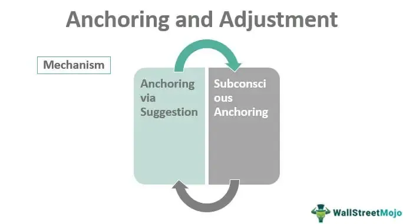

The intersection of behavioral finance and algorithmic trading presents both fascinating challenges and substantial opportunities for financial professionals and businesses. Behavioral finance, a field that studies how cognitive biases and psychological factors affect financial decision-making, identifies anchoring and adjustment as pivotal concepts. Anchoring is a cognitive heuristic where individuals place undue emphasis on the first piece of information they encounter, often using it as a reference point for subsequent decisions. Adjustment refers to the process of revising these initial estimates in light of new information.

In financial contexts, these heuristics can significantly influence outcomes. For instance, anchoring might lead investors and traders to cling to historical stock prices or initial forecasts, potentially skewing their evaluations and decisions. In algorithmic trading, which relies on pre-programmed rules and models to execute trades at high speeds, the anchoring effect can be embedded in the initial data inputs and models, affecting trading performance and decision-making.



This article examines how the anchoring effect influences financial adjustments and contributes to the complexities of algorithmic trading. By gaining a deeper understanding of these cognitive processes, businesses and financial practitioners can make more informed and accurate decisions, ultimately achieving improved trading outcomes and financial performances. Leveraging advancements in technology and refining strategies can play a crucial role in mitigating the effects of these biases, enhancing the overall efficiency and effectiveness of financial systems.

## Table of Contents

## Understanding Anchoring in Financial Markets

Anchoring is a cognitive bias where individuals rely heavily on the first piece of information encountered. This phenomenon is particularly influential in financial markets, where initial data or experiences often set a reference point for future decisions. Investors frequently use past stock prices as benchmarks, leading to a fixed perception of a stock's value, regardless of subsequent market conditions or changes in the company's performance. Anchoring can decisively affect stock prices, trading volume, and investment strategies.

For instance, if an investor first learns that a stock's historic high was $100, they may anchor to this figure, unduly influencing their perception of the stock’s current and future value, even if the actual current determinants of value suggest otherwise. This cognitive bias can lead to skewed evaluations and decision-making, as the investor might overvalue the stock based on historical prices rather than on the fundamental analysis or current market conditions.

Similarly, analysts might anchor their forecasts to initial projections or market indices, making insufficient adjustments in response to new information or market movements. This anchoring bias can lead to a misallocation of resources, poor timing of market entry or [exit](/wiki/exit-strategy), and ultimately, significant financial losses.

Addressing anchoring bias requires recognizing its presence and utilizing strategies to mitigate its effects. Financial professionals must consciously assess how much weight they allocate to initial information versus new developments. Techniques such as reevaluating forecasts with updated data, employing statistical models that rigorously test assumptions, and practicing a disciplined approach to data analysis are essential.

One useful tactic is diversification of information sources. By consulting multiple data points and perspectives, decision-makers can reduce the undue influence of any single piece of information, thus diminishing the anchoring effect. Practicing such strategies allows investors and analysts to make more balanced and informed decisions, which can lead to improved financial outcomes in the complex environment of financial markets.

## Adjustment and Its Role in Financial Forecasting

Adjustment in financial forecasting represents a critical step in refining predictions and aligning them with updated information. It involves modifying initial decisions or projections when new, more accurate data becomes available. This process is particularly important in mitigating the effects of cognitive biases, such as anchoring, that can significantly distort outcomes. Anchoring occurs when the first piece of information provided—or an initial estimate—serves as a baseline for subsequent judgments and forecasts, leading individuals to give inadequate weight to new information.

In financial forecasting, failure to properly adjust for new information due to anchoring can obstruct accurate decision-making. For instance, if an initial estimate of a company's earnings is overly optimistic, subsequent revisions might remain biased towards this initial anchor, even when market conditions suggest a more moderate outlook. To counteract this bias, it is essential to incorporate systematic strategies for adjustment into the forecasting process.

One effective technique for facilitating better adjustments is sensitivity analysis. This involves assessing how the variation in the output of a model can be attributed to different input variables. By examining these input-output relationships, forecasters can better understand which factors most influence projections and how uncertainties in these inputs can skew results. A typical sensitivity analysis might follow these steps in Python:

```python
import numpy as np
import matplotlib.pyplot as plt

# Define a basic model for financial forecasting
def revenue_forecast(price, volume):
    return price * volume

# Define ranges and base values for sensitivity factors
price_range = np.linspace(90, 110, 100)
volume_base = 1000

# Calculate sensitivity of forecast to price variations
revenue_estimations = revenue_forecast(price_range, volume_base)

# Plot the sensitivities
plt.plot(price_range, revenue_estimations)
plt.title('Sensitivity of Revenue Forecast to Price Changes')
plt.xlabel('Price')
plt.ylabel('Revenue')
plt.show()
```

Another approach involves the use of probabilistic models, which incorporate statistical techniques to account for uncertainty and randomness in forecasts. These models use distributions, rather than single values, to represent inputs and are better suited for making adjustments when new data alters the probability estimates. By incorporating a range of possible outcomes, probabilistic models reduce reliance on initial anchors and enhance the robustness of forecasts. Here's a simple demonstration using Python's `numpy` and `scipy` libraries:

```python
import numpy as np
from scipy.stats import norm

# Define variables with distributions
mean_price = 100
std_dev_price = 5
mean_volume = 1000
std_dev_volume = 50

# Generate random samples
price_samples = norm.rvs(mean_price, std_dev_price, size=10000)
volume_samples = norm.rvs(mean_volume, std_dev_volume, size=10000)

# Calculate probabilistic forecasts
revenue_samples = price_samples * volume_samples

# Analyze distribution of revenue forecasts
estimated_mean_revenue = np.mean(revenue_samples)
estimated_std_dev_revenue = np.std(revenue_samples)
```

These techniques enable forecasters to adjust predictions dynamically and accurately, taking into account the cognitive bias of anchoring while leveraging new, pertinent information. As financial markets are highly dynamic and influenced by various unforeseeable factors, such deliberate and methodical adjustments are crucial for generating realistic and dependable forecasts.

## Anchoring and Adjustment in Algorithmic Trading

Algorithmic trading systems are fundamentally dependent on mathematical models and data inputs. Typically, the initial dataset used in developing trading algorithms creates an implicit reference point, potentially embedding the anchoring bias into the system. Thus, when these algorithms encounter new data, there is a risk that the initial anchor will disproportionately influence subsequent analyses and decisions.

To minimize the prevalence of anchoring biases, developers must be proactive in updating the models and ensuring that diverse data sources are utilized. This is important because continuous model updates help algorithms adjust to market conditions that may have changed since the initial data was collected. By incorporating diverse datasets, the algorithms gain a more comprehensive perspective, which can help counteract any skewed anchor established by earlier data.

Machine learning techniques can further ameliorate anchoring effects by enabling the adaptability of algorithms. Unlike static models, [machine learning](/wiki/machine-learning) algorithms continuously learn from new data, which enhances their decision-making capabilities. Techniques such as supervised learning allow models to identify patterns and adjust outputs based on new inputs. Python is often used for implementing these models using libraries such as TensorFlow or Scikit-learn.

For example, consider a basic implementation of a machine learning model that dynamically updates its parameters as new trading data becomes available:

```python
from sklearn.linear_model import LinearRegression
import numpy as np

# Initial data
X_train = np.array([[1], [2], [3], [4], [5]])
y_train = np.array([5, 7, 9, 11, 13])

# New data
X_new = np.array([[6], [7]])
y_new = np.array([15, 17])

# Initial model training
model = LinearRegression().fit(X_train, y_train)

# Predicting with initial model
initial_predictions = model.predict(X_new)

# Incorporating new data
X_combined = np.vstack((X_train, X_new))
y_combined = np.concatenate((y_train, y_new))

# Re-training the model with new data
updated_model = LinearRegression().fit(X_combined, y_combined)

# Predicting with updated model
updated_predictions = updated_model.predict(X_new)

print("Initial Predictions:", initial_predictions)
print("Updated Predictions:", updated_predictions)
```

In this script, a basic linear regression model initially trained with `X_train` and `y_train` is updated with new data (`X_new` and `y_new`). This retraining process is crucial in [algorithmic trading](/wiki/algorithmic-trading) to maintain the agility of the models in adapting to market dynamics, thus reducing the anchoring effect. 

Ongoing research and developments in machine learning continue to present opportunities for reducing cognitive biases, including anchoring effects, in algorithmic trading. By employing these techniques and maintaining vigilance in model updates and data incorporation, developers can improve the resilience and accuracy of trading systems.

## Real-World Applications and Case Studies

Historical events in financial markets often illustrate the subtleties and challenges of cognitive biases like anchoring. One of the most prominent examples is the dot-com bubble of the late 1990s and early 2000s. During this period, the market valuation of internet-based companies soared to unprecedented levels. Many investors anchored their expectations on the initial high valuations of these companies, without adequate adjustments for changing realities, such as unsustainable business models and overestimated growth prospects.

High valuations during the dot-com era functioned as psychological anchors, particularly influencing retail investors and even some experienced market analysts. These initial price points created a reference that seemed credible amidst the hype, leading participants to adjust their future valuations insufficiently, even as market conditions began to reveal signs of overvaluation and impending corrections. This anchoring bias contributed significantly to the eventual market crash, as investors failed to adjust their beliefs and expectations adequately in the face of new and contrary information.

The financial correction that followed the dot-com bubble burst serves as a case study for the importance of recognizing anchoring effects in decision-making. Professionals can learn from such historical instances to enhance their analytical approaches by implementing methods that counteract cognitive biases. For instance, maintaining a skeptical view of initially popular market sentiments and continuously revising models based on diversified data sources could help mitigate the impact of anchoring.

Moreover, examining past market scenarios offers insights into identifying psychological traps in financial evaluation and trading processes. By understanding how anchoring contributed to the overvaluation and subsequent downfall of tech stocks, current and future financial analysts can develop better risk assessment frameworks. This involves promoting adaptive learning structures within financial teams and fostering an environment where challenging the status quo is encouraged. 

Quantitative tools and models that emphasize flexibility and integrate machine learning can further assist traders and analysts in sidestepping anchoring biases. For example, a Python-scripted trading algorithm might first establish a set of initial conditions as anchors but is programmed to dynamically update these conditions in response to new data inputs regularly. Here is a sample Python pseudocode that demonstrates such an approach:

```python
def adjust_anchors(current_data, anchor_point, learning_rate):
    # Simple model to adjust anchor points using a designated learning rate
    new_anchor = anchor_point + learning_rate * (current_data - anchor_point)
    return new_anchor

# Simulation of market data
market_data = [100, 102, 105, 101, 98]  # Sample market prices

# Initial anchor
anchor = 100

# Learning rate to guide adjustment
learning_rate = 0.1

# Update anchor based on new market data
for data_point in market_data:
    anchor = adjust_anchors(data_point, anchor, learning_rate)
    print(f"Updated Anchor: {anchor}")
```

This example hints at how, by employing adaptive algorithms, financial practitioners can better align their predictions and strategies with real-world conditions, minimizing the repercussions of anchoring bias. Such approaches ensure that financial markets evolve in their analytical capabilities, promoting more robust decision-making pathways that can improve overall market resilience.

## Tools and Strategies to Mitigate Anchoring Bias

Financial technology tools have fundamentally transformed the ability to counteract anchoring bias in trading. These tools, particularly algorithmic trading platforms like QuantConnect, provide comprehensive data analytics capabilities and facilitate the development of sophisticated trading strategies designed to address and mitigate cognitive biases inherent in human decision-making processes.

QuantConnect is an open-source algorithmic trading platform that offers access to extensive historical data and advanced analytical tools. By allowing traders to simulate various trading strategies using historical data, QuantConnect helps in minimizing the anchoring effect. Traders can evaluate the performance of their strategies under different market conditions without being unduly influenced by specific past reference points. This approach not only aids in identifying anchoring biases but also encourages a data-driven methodology for decision-making.

In addition to leveraging technology, embedding a culture of critical thinking and strategy diversification is essential in reducing reliance on single data points. Encouraging traders and analysts to question initial perceptions and consider alternative scenarios or data sources can significantly decrease the impact of anchoring bias. Diversified strategies that incorporate multiple data streams offer a more balanced view and reduce the tendency to anchor decisions based on an initial piece of information. 

Training and awareness programs are vital for equipping financial teams with the necessary skills to recognize and manage anchoring biases. These programs should focus on educating traders about common cognitive biases and provide practical techniques for bias mitigation. For instance, scenario analysis and sensitivity analysis are effective techniques that compel traders to consider a wide range of potential outcomes, thus reducing the impact of specific anchoring points.

Python programming can be instrumental in implementing the aforementioned strategies. For example, using Python libraries like pandas and numpy, financial analysts can create scripts to perform real-time data analysis, thereby minimizing reliance on historical anchors. The following Python snippet demonstrates a basic setup for analyzing financial data to prevent anchoring:

```python
import pandas as pd
import numpy as np

# Load historical financial data
data = pd.read_csv('historical_data.csv')

# Calculate moving average to prevent anchoring to specific price points
data['MovingAverage'] = data['Price'].rolling(window=20).mean()

# Function to evaluate trading strategy
def evaluate_strategy(data):
    anchor_bias = (data['Price'] - data['MovingAverage']) / data['MovingAverage']
    decision = ['Buy' if bias < -0.05 else 'Sell' if bias > 0.05 else 'Hold' for bias in anchor_bias]
    return decision

# Apply strategy
strategy_decisions = evaluate_strategy(data)
```

This example shows how a moving average can act as an anchoring mitigation tool by providing an evolving reference point rather than a fixed one. Through the synergy of advanced technology and informed human oversight, financial institutions can effectively combat anchoring bias and improve the robustness of their trading strategies.

## Conclusion

Anchoring and adjustment profoundly impact financial decision-making and algorithmic trading by introducing biases that can skew forecasts and trading outcomes. Recognizing and addressing these biases is vital for enhancing the accuracy of financial predictions and achieving better business results. Businesses can adopt strategies such as sensitivity analysis and the integration of machine learning models to systematically counter these cognitive biases. For instance, machine learning algorithms can dynamically adjust to new data, reducing the reliance on initial data points or anchors that may no longer be relevant.

Leveraging new technologies is a crucial step in overcoming the challenges posed by these biases. Cutting-edge platforms like QuantConnect provide robust tools for analyzing data, which can aid in mitigating anchoring effects. Developers and financial analysts can use such platforms to diversify data inputs, regularly update their models, and foster a culture of critical thinking. This, in turn, helps reduce the risk of anchoring and encourages more nuanced decision-making processes.

Continued research and adaptation play a pivotal role in ensuring financial practices remain aligned with behavioral finance advancements. As the financial landscape evolves, staying informed about the latest findings in cognitive psychology and behavioral economics can help professionals adapt their techniques to minimize bias-driven errors. Developing training and awareness initiatives can further bolster this effort, equipping financial teams with the knowledge and skills needed to combat anchoring effects effectively.

In conclusion, acknowledging, addressing, and actively working to mitigate anchoring and adjustment biases through innovative technologies and adaptive strategies is essential. This commitment not only supports enhanced decision-making and trading outcomes but also ensures that financial practices evolve with advancements in behavioral finance, paving the way for a more accurate and bias-free financial future.

## References & Further Reading

[1]: Bergstra, J., Bardenet, R., Bengio, Y., & Kégl, B. (2011). ["Algorithms for Hyper-Parameter Optimization."](https://dl.acm.org/doi/10.5555/2986459.2986743) Advances in Neural Information Processing Systems 24.

[2]: ["Advances in Financial Machine Learning"](https://www.amazon.com/Advances-Financial-Machine-Learning-Marcos/dp/1119482089) by Marcos Lopez de Prado

[3]: ["Evidence-Based Technical Analysis: Applying the Scientific Method and Statistical Inference to Trading Signals"](https://www.amazon.com/Evidence-Based-Technical-Analysis-Scientific-Statistical/dp/0470008741) by David Aronson

[4]: ["Machine Learning for Algorithmic Trading"](https://github.com/stefan-jansen/machine-learning-for-trading) by Stefan Jansen

[5]: ["Quantitative Trading: How to Build Your Own Algorithmic Trading Business"](https://www.amazon.com/Quantitative-Trading-Build-Algorithmic-Business/dp/1119800064) by Ernest P. Chan