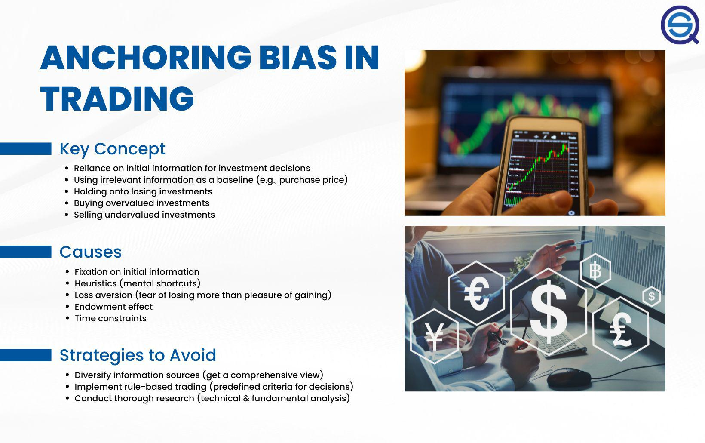

Investment strategies are experiencing significant transformation, largely due to the advancements in behavioral finance and technology. As the understanding of market dynamics deepens, cognitive biases such as the anchoring effect are identified as influential factors in decision-making processes. The anchoring effect, a concept grounded in behavioral finance, describes the human tendency to over-rely on the first piece of information encountered (the "anchor") when making subsequent decisions. In the context of investing, this bias can profoundly affect decision-making, leading individuals and even algorithmic systems to make potentially suboptimal choices.

With the increasing sophistication of algorithmic trading, the blend of human psychological biases and machine-driven decision-making invites a need for better understanding and mitigation of such biases. Algorithmic trading, characterized by executing pre-defined strategies with minimal human intervention, was originally thought to circumvent many cognitive biases disadvantageous in human trading. Nevertheless, if algorithms are programmed or trained using historical data that inadvertently includes anchoring bias, they too are at risk of being influenced by this cognitive fallacy.



Recognizing and understanding the anchoring effect is crucial for investors seeking to refine their strategies. In traditional trading scenarios, this understanding can lead to more informed decisions that consider current market dynamics rather than being anchored to past values or estimates. In the context of algorithmic trading, awareness and mitigation of anchoring bias can enhance the adaptability and accuracy of algorithms, ensuring that trading strategies are responsive to actual rather than perceived market conditions.

The continuing interplay between evolving investment strategies, technological advances, and insights from behavioral finance emphasizes the importance of addressing cognitive biases in decision-making. This article aims to investigate the role and implications of anchoring within investment strategies, providing insights into how investors can recognize and overcome this bias to optimize their trading processes in both traditional and automated contexts.

## Table of Contents

## Understanding Behavioral Finance and Anchoring

Behavioral finance is an interdisciplinary field that combines psychology and finance to understand how psychological influences and biases impact financial behaviors and market outcomes. Traditional financial theories often assume that investors act rationally to maximize their utility. However, behavioral finance challenges this notion by demonstrating that investors are often swayed by cognitive biases, leading to deviations from rational behavior.

Anchoring is one such cognitive bias extensively studied within behavioral finance. It refers to the human tendency to rely heavily on the first piece of information encountered (the "anchor") when making decisions. This bias can have profound effects on investment decisions. For instance, if an investor becomes anchored to the initial price of a stock, they may irrationally hold onto it even as its value declines, based on the belief that the price will rebound to its initial level. Conversely, anchoring can lead investors to overvalue an asset based on an initial high selling price, regardless of current market indicators.

In real-world investing, anchoring can manifest in various ways. One common scenario involves investors fixating on the purchase price of a security, using it as a benchmark for future trading decisions. This can result in holding onto losing stocks longer than is financially prudent, driven by the desire to "break even" instead of cutting losses. On the flip side, when buying assets, investors might rely too heavily on initial analyst reports or market forecasts as anchors, potentially leading them to acquire overvalued assets. 

To illustrate, consider an investor who purchases a stock at $100 per share. If the stock's price falls to $80, anchoring bias might cause the investor to cling to the belief that the original purchase price remains the appropriate value of the stock. This bias often results in investors ignoring new, potentially more relevant information, such as changes in the company's earnings potential or broader market conditions.

Understanding anchoring is crucial for investors seeking to make rational, informed decisions based on current and comprehensive market analysis rather than past valuations. Awareness of this bias and employing strategies to mitigate its influence can result in more strategic investment choices, improving overall financial outcomes.

## The Impact of Anchoring on Investment Choices

The anchoring effect significantly influences investment choices by causing investors to fixate on the purchase price of securities, which can skew their selling decisions and risk assessments. When investors anchor to the initial acquisition cost, they may assess the investment's value based on past prices rather than current market conditions, leading to potential misjudgments. This often results in the reluctance to sell securities at a loss or an overvaluation of assets, hindering objective decision-making.

For instance, an investor who buys a stock at $100 may anchor on this purchase price, perceiving any subsequent decrease below $100 as a loss, even if market conditions justify a lower valuation. This cognitive bias often causes investors to retain underperforming assets longer than strategically sound, potentially increasing their financial exposure to declining markets.

Moreover, anchoring can lead investors to place undue weight on historical prices or external guidance when evaluating security values. Such overreliance on static reference points undermines the adaptability needed in dynamic financial markets. A classic scenario occurs during market bubbles, where initial price points become anchors, skewing perceptions of value and leading to overinvestment.

Understanding the anchoring bias is vital for investors seeking rational investment strategies grounded in current market realities. By acknowledging the influence of initial reference points on decision-making, investors can better navigate fluctuating financial landscapes. Adopting strategies that emphasize current data and diversified inputs can mitigate anchoring's effects, promoting more informed and flexible investment choices.

## Algorithmic Trading and the Anchoring Effect

Algorithmic trading is a technology-driven approach to executing trades, utilizing pre-set programming and algorithms to perform actions swiftly, often mitigating human emotional biases that can skew decision-making. These algorithms, however, are not immune to cognitive biases like the anchoring effect. Anchoring occurs when initial data points or parameters disproportionately influence future decisions. In [algorithmic trading](/wiki/algorithmic-trading), such biases can emerge if strategies rely heavily on historical data or utilize initial parameter settings as constants, forming a de facto anchor.

Algorithm reliance on historical data as a baseline can lead to anchoring if market conditions shift dramatically but the algorithms remain tethered to obsolete information. For example, if an algorithm uses historical [volatility](/wiki/volatility-trading-strategies) measures as a central input to adjust its trading strategy, a sudden market shift might render these historical measures less predictive or even misleading.

To counteract anchoring effects, strategy adjustments can be made to enhance algorithmic responsiveness and adaptability to new information. One methodology involves implementing dynamic adjustment techniques, where algorithms are designed to periodically reassess and recalibrate their parameters based on real-time data. This allows the systems to discard outdated 'anchor' data points in favor of more pertinent recent information.

Diversifying data inputs also helps mitigate anchoring. Algorithms can be programmed to use a broader array of data, such as macroeconomic indicators, real-time news analytics, and sentiment analysis, aside from historical prices. This breadth of data can dilute the undue influence of any single data point or historical trend, thereby reducing the risk of anchoring.

In practical terms, consider a simple algorithm coded in Python. It can be set to dynamically adjust moving averages:

```python
def dynamic_moving_average(prices, period):
    import numpy as np
    return np.convolve(prices, np.ones(period), 'valid') / period

def adaptive_strategy(prices, short_period, long_period):
    short_ma = dynamic_moving_average(prices, short_period)
    long_ma = dynamic_moving_average(prices, long_period)
    trading_signals = ["Buy" if short > long else "Sell" for short, long in zip(short_ma, long_ma)]
    return trading_signals

# Example usage with recalibration
prices = [/* some list of prices */]
short_period, long_period = 5, 20  # Period settings can be dynamically recalibrated
signals = adaptive_strategy(prices, short_period, long_period)
```

This simple adaptive approach reviews and adjusts moving averages, a fundamental strategy in technical analysis, to ensure they reflect current market realities.

Implementing these dynamic and diverse strategies can help diminish the anchoring effect, allowing algorithms to make more predictive and rational investment choices aligned with prevailing market conditions. By addressing and adjusting for cognitive biases like anchoring, algorithmic trading can be made more efficient and less susceptible to predictable errors stemming from outdated or overly specific initial assumptions.

## Strategies to Mitigate Anchoring in Investment Decisions

Employing effective strategies to mitigate the anchoring effect in investment decisions is crucial for both individual investors and institutional traders seeking to enhance their decision-making processes. One primary approach is employing a diversified information strategy when analyzing investments. This involves gathering information from multiple, independent sources rather than relying heavily on a single data point, which might act as an inadvertent anchor. By diversifying the informational inputs, investors can form a comprehensive understanding of an asset's potential, leading to more balanced decision-making.

Setting pre-determined, fundamental criteria for making investment decisions is another vital strategy to counteract anchoring. These criteria should be based on [fundamental analysis](/wiki/fundamental-analysis) and sound financial principles, as opposed to temporary market fluctuations or 'noise'. For instance, investors could establish criteria based on key financial ratios like the price-to-earnings ratio (P/E), the debt-to-equity ratio (D/E), and earnings per share (EPS). Such predetermined metrics provide a stable foundation for evaluating potential investments objectively.

Regularly reviewing and updating investment perceptions and criteria as new information becomes available is equally important. Markets are dynamic, and remaining rigidly anchored to outdated information can lead to suboptimal investment choices. Investors should incorporate ongoing market analysis and revise their investment models to reflect the latest data and insights. This practice ensures that decisions are made in response to the current market environment, reducing the impact of anchoring on outdated reference points.

To automate part of this process, investors can leverage computational tools, running algorithms that recalibrate their models based on new data inputs. Implementing a mechanism to continuously integrate fresh data points can keep investment strategies aligned with the market's current state. For example, in Python, one could use libraries like pandas and NumPy to process financial data and update analytical models dynamically:

```python
import pandas as pd
import numpy as np

# Simulated function to fetch latest market data
def fetch_market_data():
    # return updated market data here
    pass

# Function to update investment criteria
def update_criteria(current_data, new_data):
    # Update criteria based on new data
    updated_data = current_data + new_data # Simplified example
    return updated_data

# Creating a DataFrame for tracking investment criteria
current_data = pd.DataFrame({
    'P/E Ratio': [15],
    'D/E Ratio': [0.5],
    'EPS': [5]
})

# Simulating a data update process
new_market_data = fetch_market_data()
updated_criteria = update_criteria(current_data, new_market_data)

print(updated_criteria)
```

By using such systematic approaches and incorporating technological tools, investors can greatly reduce the anchoring bias, ensuring investment choices are guided by thorough and current analysis.

## Conclusion

Anchoring significantly influences financial decision-making, distorting choices for both individual investors and institutional traders. This cognitive bias leads investors to rely on initial reference points, often resulting in suboptimal investment outcomes, such as holding onto losing positions or misjudging asset values.

Recognizing and mitigating the effects of anchoring can substantially enhance investment strategies. By being aware of this bias, investors can focus on making decisions rooted in current market conditions rather than outdated benchmarks. This awareness facilitates a disciplined approach to investment, encouraging the sale or purchase of assets based on real-time data and objective analysis rather than ingrained biases.

Incorporating insights from behavioral finance and acknowledging cognitive biases like anchoring in investment models can foster more adaptive and responsive trading methodologies. Algorithmic trading systems, which are susceptible to the same biases if anchored improperly, can benefit significantly from such integration. By utilizing a diverse set of data inputs and applying dynamic adjustment techniques, these systems can reduce the risk of anchoring, leading to improved performance.

Moreover, understanding the anchoring effect and other psychological biases provides a foundation for developing robust investment strategies. This foundation equips both human traders and algorithmic systems to make informed decisions that align with market realities. Ultimately, addressing anchoring in investment decisions can promote a more rational and successful financial strategy, enhancing both individual and institutional outcomes in the financial markets.

## References & Further Reading

[1]: Tversky, A., & Kahneman, D. (1974). [“Judgment under Uncertainty: Heuristics and Biases.”](https://www2.psych.ubc.ca/~schaller/Psyc590Readings/TverskyKahneman1974.pdf) Science, 185(4157), 1124-1131.

[2]: Thaler, R. H., & Sunstein, C. R. (2008). ["Nudge: Improving Decisions About Health, Wealth, and Happiness."](https://www.researchgate.net/publication/257178709_Nudge_Improving_Decisions_About_Health_Wealth_and_Happiness_RH_Thaler_CR_Sunstein_Yale_University_Press_New_Haven_2008_293_pp) Yale University Press.

[3]: Shiller, R. J. (2015). ["Irrational Exuberance."](https://press.princeton.edu/books/paperback/9780691173122/irrational-exuberance) Princeton University Press.

[4]: Barberis, N., & Thaler, R. (2003). [“A Survey of Behavioral Finance.”](https://www.nber.org/papers/w9222) Handbook of the Economics of Finance, Elsevier.

[5]: Kahneman, D. (2011). ["Thinking, Fast and Slow."](https://link.springer.com/article/10.1007/s00362-013-0533-y) Farrar, Straus and Giroux.