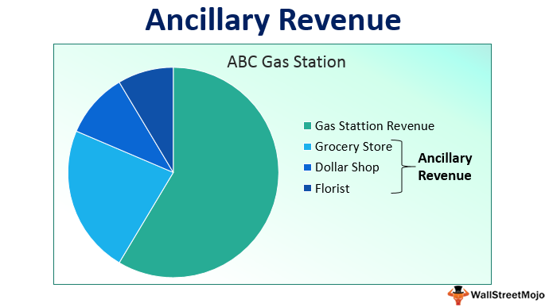

## Table of Contents

## What is ancillary revenue?

Ancillary revenue is the extra money a business makes from selling additional products or services that are not part of its main business. For example, if an airline sells tickets as its main business, the money it makes from selling food, drinks, or extra legroom on the plane would be considered ancillary revenue. This type of revenue is important because it can help a business increase its overall profits without relying solely on its primary product or service.

Businesses in many industries use ancillary revenue to improve their financial performance. For instance, hotels might make money from room bookings, but they can also earn ancillary revenue from services like spa treatments, room service, or even parking fees. By offering these extras, businesses can attract more customers and provide them with a better overall experience, which can lead to increased customer satisfaction and loyalty.

## Why is ancillary revenue important for businesses?

Ancillary revenue is important for businesses because it helps them make more money without just relying on their main product or service. For example, if a hotel only made money from renting rooms, it might struggle if fewer people wanted to stay there. But if the hotel also makes money from things like breakfast, spa services, or parking, it can still earn a good income even if fewer rooms are booked. This extra money can help the business stay strong and grow, even when times are tough.

Also, ancillary revenue can make customers happier. When businesses offer extra things that customers like, it can make their overall experience better. For instance, if an airline offers snacks, movies, or extra legroom, passengers might enjoy their flight more and choose that airline again. Happy customers are more likely to come back and tell others about their good experiences, which can bring in even more business. So, ancillary revenue not only helps businesses make more money but also helps them build stronger relationships with their customers.

## What are common examples of ancillary revenue in the airline industry?

In the airline industry, ancillary revenue comes from selling extra things that aren't part of the basic plane ticket. For example, when you buy a snack or a drink on the plane, that money is ancillary revenue. Airlines also make money by charging for checked bags. If you need to bring more than a [carry](/wiki/carry-trading)-on, you might have to pay extra for each bag you check. Another common way airlines earn ancillary revenue is by selling seat upgrades. If you want more legroom or a better seat, you can pay more to sit in the front of the plane or in a special section.

Airlines also make money from offering extra services like Wi-Fi on the plane. If you want to use the internet during your flight, you might have to pay for it. Some airlines sell travel insurance too, which can cover things like trip cancellations or lost luggage. Lastly, airlines can earn ancillary revenue from partnering with other companies. For example, they might get money from credit card companies if you sign up for a card that gives you airline miles or discounts. All these extra charges and services help airlines make more money on top of what they get from selling tickets.

## How can hotels generate ancillary revenue?

Hotels can make extra money by offering things that aren't part of the room price. For example, if you stay at a hotel, they might charge you for breakfast, which is a way to make more money. They can also make money from their spa, where you can get a massage or other treatments. If you want to park your car at the hotel, they might charge you for that too. All these extra services help the hotel earn more money without just relying on room bookings.

Another way hotels can earn extra money is by offering special packages or deals. For instance, they might have a package that includes a room, dinner at their restaurant, and a tour of the city. This not only makes the hotel more money but also makes your stay more enjoyable. Hotels can also partner with local businesses to offer things like discounted tickets to attractions or special events. By providing these extras, hotels can attract more guests and keep them happy, which can lead to more people coming back or telling their friends about the hotel.

## What role does technology play in maximizing ancillary revenue?

Technology helps businesses make more money from extra things they sell. For example, hotels and airlines use special computer systems to keep track of what extra services people want. These systems can show guests what extras are available, like spa treatments or seat upgrades, right when they are booking. This makes it easy for people to add these extras to their stay or flight, and the business can make more money.

Also, technology like apps and websites helps businesses tell people about their extra services. For instance, an airline might send you a message on your phone about buying Wi-Fi on your flight. Or a hotel might have an app where you can order room service or book a massage. These tools make it simple for customers to see and buy these extras, which helps the business earn more money. Plus, using technology can make the whole process faster and smoother, which makes customers happier and more likely to spend money on these extra things.

## Can you explain how ancillary revenue impacts the overall profitability of a company?

Ancillary revenue can make a big difference in how much money a company makes. When a business sells extra things that aren't part of its main product or service, it can add a lot to its overall profits. For example, if an airline only made money from selling tickets, it might struggle if fewer people wanted to fly. But if it also makes money from selling snacks, seat upgrades, or Wi-Fi, it can still earn a good income even if fewer tickets are sold. This extra money helps the company stay strong and grow, even when times are tough.

Ancillary revenue also helps a company because it can make customers happier. When businesses offer extra things that customers like, it can make their overall experience better. For instance, if a hotel offers a nice breakfast or spa services, guests might enjoy their stay more and choose that hotel again. Happy customers are more likely to come back and tell others about their good experiences, which can bring in even more business. So, ancillary revenue not only helps a company make more money but also helps it build stronger relationships with its customers.

## What strategies can businesses use to increase their ancillary revenue?

Businesses can increase their ancillary revenue by making it easy for customers to buy extra things. For example, they can use technology like apps and websites to show customers what extras are available right when they are making a booking. If a hotel has an app where guests can order room service or book a massage, it makes it simple for them to spend more money. Airlines can send messages to passengers about buying Wi-Fi or snacks on the flight. By using these tools, businesses can make sure customers know about and can easily buy these extras, which can help them earn more money.

Another way to increase ancillary revenue is by offering special packages or deals that include extra services. For instance, a hotel might offer a package that includes a room, dinner at their restaurant, and a city tour. This not only makes the hotel more money but also makes the guest's stay more enjoyable. Businesses can also partner with local companies to offer things like discounted tickets to attractions or special events. By providing these extras, businesses can attract more customers and make them happier, which can lead to more people coming back or telling their friends about the good experience.

## How do customer loyalty programs contribute to ancillary revenue?

Customer loyalty programs help businesses make more money from extra things they sell. When customers join a loyalty program, they often get special deals or rewards for buying extra services. For example, an airline might give you extra miles if you buy a seat upgrade or Wi-Fi on your flight. These rewards make customers more likely to spend money on these extras because they feel like they are getting something good in return. So, loyalty programs can help businesses sell more of these extra things and make more money.

Loyalty programs also help businesses keep customers happy and coming back. When customers feel like they are getting good value from a loyalty program, they are more likely to choose that business again. For example, if a hotel gives you points for using their spa or eating at their restaurant, you might decide to stay at that hotel more often because you want to use those points. Happy customers who keep coming back are more likely to buy extra things, which helps the business earn more ancillary revenue. So, loyalty programs not only make customers feel special but also help the business make more money in the long run.

## What are the challenges associated with managing ancillary revenue?

Managing ancillary revenue can be tricky because businesses have to keep track of a lot of different things. They need to make sure their computer systems can handle all the extra services they offer, like booking spa treatments or selling Wi-Fi on a flight. If the systems are not working well, it can be hard to sell these extras and make money from them. Also, businesses have to keep an eye on what customers want and change their offerings to match those wants. If they don't, customers might not buy the extras, and the business could miss out on making more money.

Another challenge is making sure the extra services are good enough that customers want to buy them. If the food on a plane is not tasty or the spa treatments at a hotel are not relaxing, customers won't spend money on them. Businesses have to keep the quality high and make sure the prices are fair. It can be hard to find the right balance between making money and keeping customers happy. If they charge too much, customers might not buy the extras, but if they charge too little, they might not make enough money to cover their costs.

## How does ancillary revenue differ across various industries?

Ancillary revenue can look different depending on the industry. In the airline industry, it often comes from things like selling snacks, drinks, Wi-Fi, and charging for extra bags or seat upgrades. These extras help airlines make more money on top of what they get from selling tickets. For hotels, ancillary revenue might come from services like breakfast, spa treatments, room service, and parking fees. These extras make the stay more enjoyable for guests and help the hotel earn more money without just relying on room bookings.

In other industries, ancillary revenue can be different too. For example, in the car rental business, companies might make extra money by selling insurance, GPS systems, or child car seats. These extras help car rental companies increase their profits. In the retail world, stores might earn ancillary revenue from things like extended warranties, gift wrapping services, or loyalty programs. Each industry finds its own way to offer extras that customers want, which helps them make more money and improve the customer experience.

## What are the best practices for tracking and analyzing ancillary revenue?

To track and analyze ancillary revenue well, businesses need good computer systems. These systems should be able to keep track of all the extra things sold, like snacks on a plane or spa treatments at a hotel. It's important that these systems work well and can give clear reports on how much money is made from these extras. Businesses should also look at the data often to see what extras customers like and which ones they don't. This helps them know what to keep selling and what to change.

Another important part is to use simple ways to show the data. Charts and graphs can help businesses see how much money they are making from different extras. They should also compare this data over time to see if they are making more or less money from these extras. By doing this, businesses can make smart choices about what to offer and how to price things to make more money. Keeping track of ancillary revenue this way helps businesses stay strong and grow.

## How can data analytics be used to optimize ancillary revenue streams?

Data analytics helps businesses make more money from extra things they sell by looking at what customers like and don't like. By using data, businesses can see which extras are popular and which ones aren't. For example, an airline might find out that more people buy snacks if they are offered at a certain time during the flight. With this information, the airline can change when they offer snacks to sell more and make more money. Data analytics also helps businesses know how much to charge for these extras. If the data shows that people are willing to pay more for Wi-Fi, the airline might raise the price a little to make more money.

Another way data analytics helps is by showing businesses how to make customers happier. If a hotel sees that guests often use the spa but complain about the prices, they might offer special deals to make guests feel like they are getting a good value. This can make guests more likely to use the spa and spend more money. By looking at data over time, businesses can keep making changes to their extra services to match what customers want. This not only helps them make more money but also keeps customers coming back because they have a better experience.

## What are the revenue streams in algorithmic trading?

Algorithmic trading utilizes automated systems to initiate and execute trades based on predefined criteria, transforming the landscape of financial markets. This trading technique capitalizes on distinct revenue opportunities by exploiting market inefficiencies, speed, and precision. By deploying algorithms, traders can execute complex trading strategies at a scale and speed unattainable by human traders.

High-frequency trading ([HFT](/wiki/high-frequency-trading-strategies)) and statistical [arbitrage](/wiki/arbitrage) are two prominent strategies within [algorithmic trading](/wiki/algorithmic-trading) that enhance revenue potential. HFT relies on algorithms to conduct a high [volume](/wiki/volume-trading-strategy) of trades in extremely short timeframes, often milliseconds or microseconds. The primary objective is to benefit from price discrepancies that exist for mere moments before market equilibrium is restored. For example, due to the fast nature of HFT, even marginal changes in stock prices can be profitable. The formula for calculating the profit (P) from a series of trades can be represented as:

$$
P = \sum_{i=1}^{n} (S_i - B_i) - C
$$

where $S_i$ is the selling price, $B_i$ is the buying price, and $C$ represents the transaction costs. As n, the number of trades, increases, the aggregate profit potential may grow, emphasizing the importance of high-frequency trading.

Statistical arbitrage, on the other hand, uses quantitative models to identify patterns and correlations between various financial instruments. By detecting and exploiting statistical discrepancies in their pricing, traders can execute trades that seem low-risk due to the predicted convergence of prices. A common practice in [statistical arbitrage](/wiki/statistical-arbitrage) involves pairs trading, where two correlated securities are traded simultaneously, betting on their relative movement. The strategy profits when the price differential, or spread, deviates significantly from historical norms and subsequently reverts.

The key to maximizing revenue in algorithmic trading lies in understanding these complex mechanisms and tailoring strategies to fit both the market and the trader's objectives. Firms leveraging algorithmic trading can analyze vast datasets rapidly, allowing them to react to market changes with increased agility. This capability provides a competitive advantage, helping firms optimize trade executions and achieve their financial goals.

To effectively employ algorithmic trading, companies need to assess both the opportunities and risks associated with these strategies. For instance, while the speed of execution is a significant advantage, it also imposes risks related to market [volatility](/wiki/volatility-trading-strategies), technological failures, and regulatory changes. Hence, a balanced approach combining technological leverage with strategic caution is essential for sustainability in revenue generation. Through careful analysis and strategic implementation, firms can unlock the dynamic revenue potential offered by algorithmic trading.

## References & Further Reading

[1]: Bergstra, J., Bardenet, R., Bengio, Y., & Kégl, B. (2011). ["Algorithms for Hyper-Parameter Optimization."](https://papers.nips.cc/paper/4443-algorithms-for-hyper-parameter-optimization) Advances in Neural Information Processing Systems 24.

[2]: ["Advances in Financial Machine Learning"](https://www.amazon.com/Advances-Financial-Machine-Learning-Marcos/dp/1119482089) by Marcos Lopez de Prado

[3]: ["Evidence-Based Technical Analysis: Applying the Scientific Method and Statistical Inference to Trading Signals"](https://www.amazon.com/Evidence-Based-Technical-Analysis-Scientific-Statistical/dp/0470008741) by David Aronson

[4]: ["Machine Learning for Algorithmic Trading"](https://github.com/stefan-jansen/machine-learning-for-trading) by Stefan Jansen

[5]: ["Quantitative Trading: How to Build Your Own Algorithmic Trading Business"](https://www.amazon.com/Quantitative-Trading-Build-Algorithmic-Business/dp/1119800064) by Ernest P. Chan