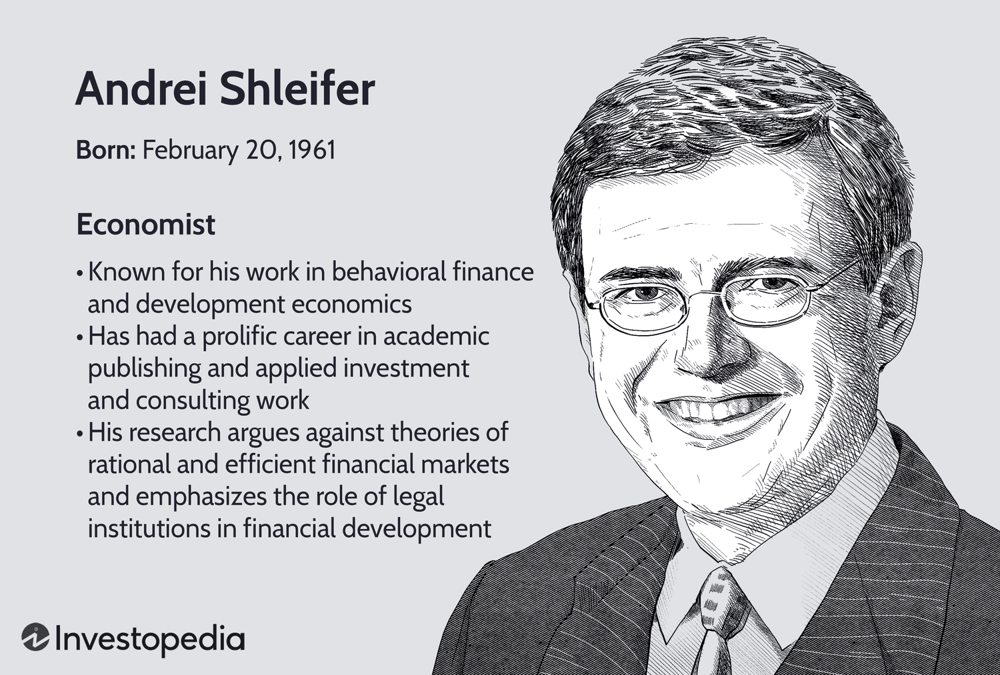

Andrei Shleifer is a distinguished Russian-American economist recognized for his significant contributions to financial economics, behavioral finance, and development economics. As a professor at Harvard University, Shleifer has substantially influenced both academic theories and practical investment strategies. He was awarded the John Bates Clark Medal, which underlines his impact and stature in the field of economics. Shleifer’s research frequently challenges conventional theories of market efficiency, positing that markets are not always rational and are often subject to cognitive biases and psychological influences. This has opened new avenues for understanding phenomena such as market bubbles and crashes.

In addition to his work on market behavior, Shleifer has emphasized the importance of legal institutions in economic development. He argues that robust legal frameworks are critical in fostering financial development and facilitating economic growth. This multifaceted approach has positioned Shleifer as a pivotal figure in economic discussions about how institutional structures influence markets.



This article aims to explore Shleifer's contributions to financial economics, with particular attention to his insights into algorithmic trading. His work on behavioral finance provides valuable perspectives that can be used to model market behaviors, impacting the design and implementation of algorithmic trading systems. These systems, which are increasingly prevalent in today's financial markets, can incorporate behavioral biases identified by Shleifer's research, leading to more nuanced and potentially more effective trading strategies.

## Table of Contents

## Andrei Shleifer's Background and Career

Andrei Shleifer, a distinguished economist, was born in Moscow in 1961. He moved to the United States during his teenage years, a critical transition that set the stage for his academic journey. Shleifer pursued his undergraduate studies at Harvard University, culminating in his graduation in 1982. He then advanced to the Massachusetts Institute of Technology (MIT), where he earned a Ph.D. in Economics in 1986 under the supervision of renowned economist Robert Solow.

Shleifer's academic career is marked by his tenures at several prestigious institutions. He initially joined the faculty at Princeton University before moving to the University of Chicago in 1989. Two years later, in 1991, he returned to Harvard University, where he has remained a prominent figure, currently holding the title of Professor of Economics. His time at Harvard has been distinguished by not only teaching but also by his extensive research contributions.

In addition to his academic pursuits, Shleifer played an influential role during the Russian economic reforms in the early 1990s, a period following the dissolution of the Soviet Union. He acted as an advisor to the Russian government, a position that placed him at the center of significant economic transformations. However, his involvement was later mired in controversy due to allegations of conflicts of interest, as Shleifer and his wife were accused of profiting from their advisory roles, ultimately leading to legal challenges and settlements.

Despite this controversy, Shleifer's academic work has garnered significant recognition. His research, predominantly in financial economics and development economics, is widely cited and has had a profound impact on these fields. His contributions have enriched the understanding of market behavior, the role of institutions in economic development, and the intersection of finance and psychology, establishing him as a thought leader in economic scholarship.

## Contributions to Financial Economics

Andrei Shleifer's impact on financial economics is largely attributed to his pioneering work in behavioral finance, where he highlights the significance of cognitive biases and behavioral factors in shaping financial markets. His distinctive approach challenges the traditional efficient market hypothesis (EMH), which postulates that asset prices fully reflect all available information and thus, markets are inherently rational. Instead, Shleifer introduces evidence suggesting that markets frequently deviate from rationality, primarily due to investor psychology.

A critical aspect of Shleifer’s analysis involves understanding how cognitive biases influence investor decisions. These biases often lead to systematic errors in judgment, affecting asset valuations and market behavior. For instance, investors might exhibit overconfidence, leading to excessive trading and deviations from fundamental values. This behavioral aspect indicates that price movements in financial markets can often stem from these psychological influences rather than purely rational evaluations.

Shleifer’s research extends to the investigation of asset price bubbles, wherein he provides a framework for identifying and analyzing such phenomena. Asset bubbles are characterized by rapid escalations in asset prices followed by a contraction, often leaving markets disrupted. By examining historical cases and conducting empirical analyses, Shleifer contributes insights into the genesis and evolution of these bubbles. His work suggests that these events are frequently driven by herding behavior, where investors follow the actions of others rather than relying on their independent analysis, leading to irrational market exuberance.

A simplified Python code snippet can illustrate a basic concept of overconfidence bias affecting trading [volume](/wiki/volume-trading-strategy):

```python
import numpy as np

def simulate_trading_volume(days, initial_volume, overconfidence_factor):
    # Simulate random returns
    returns = np.random.normal(0, 0.01, days)
    volume = initial_volume
    volumes = []

    for return_ in returns:
        # Increase trading volume based on overconfidence
        volume *= (1 + overconfidence_factor * np.abs(return_))
        volumes.append(volume)

    return volumes

# Simulate over 100 days with initial volume of 1,000 and overconfidence factor of 0.5
trading_volumes = simulate_trading_volume(100, 1000, 0.5)
```

In this simulation, trading volumes are adjusted based on the returns of previous days, with an overconfidence [factor](/wiki/factor-investing) influencing the magnitude of adjustments. This models how overconfidence can artificially inflate trading activity.

Shleifer's contributions to financial economics, particularly in understanding the interplay between psychological factors and market dynamics, are invaluable for explaining anomalies such as market bubbles and crashes. His work lays a foundation for developing strategies to better navigate and perhaps mitigate such market phenomena, challenging the notion of inherently efficient markets.

## Development Economics and Legal Institutions

Andrei Shleifer's contributions to development economics emphasize the critical role of legal institutions in shaping financial development and promoting economic growth. His research, particularly in collaboration with several colleagues, highlights how the origins and structure of legal systems can influence the economic trajectories of nations. Shleifer and his collaborators have shown that countries with legal systems based in common law typically exhibit more favorable investment climates and exhibit stronger economic outcomes than those rooted in civil law traditions.

One of the key studies by Shleifer and his co-researchers, Rafael La Porta, Florencio Lopez-de-Silanes, and Robert Vishny, known collectively as LLSV, explores the connection between legal systems and financial development. They found that common law countries tend to have better protection of investor rights compared to civil law countries, which often correlates with more robust financial markets (La Porta et al., 1998). The common law system, which evolves through judicial decisions, often provides a flexible framework that can adapt to changing economic and business environments, thereby fostering economic growth.

In contrast, civil law systems, which derive from Roman law and are more prescriptive, can create rigidities and inefficiencies in legal procedures and economic regulations. Such systems may place constraints on market participants and limit the efficient allocation of resources, inhibiting the dynamics of economic expansion.

Shleifer's research also touches upon the implications of these legal origins on corporate governance, the protection of shareholders and creditors, and the efficiency of financial markets. The findings suggest that legal reforms aimed at enhancing investor protection and increasing judicial efficiency can be beneficial for economic development, especially in countries with civil law traditions. These insights have profound implications for policy-making, as they provide a basis for understanding the importance of legal infrastructure in stimulating economic progress and advocating for necessary reforms.

Shleifer's work on legal institutions and development economics is frequently referenced in discussions surrounding global economic policy and reform. The evidence provided by his research continues to inform debates on how countries can adjust their legal frameworks to attract investment, boost economic activity, and improve overall living standards.

## Impact on Algorithmic Trading

Andrei Shleifer's foundational work in behavioral finance has significant implications for [algorithmic trading](/wiki/algorithmic-trading), a domain where mathematical models and automated strategies dominate. By challenging the assumptions of market efficiency and highlighting the influence of cognitive biases on investor behavior, Shleifer’s insights provide a rich framework for enhancing algorithmic trading systems.

One of the primary contributions of Shleifer’s research is the identification and understanding of behavioral biases such as overconfidence, loss aversion, and herding. These biases, when incorporated into algorithmic models, can help in predicting market anomalies and developing strategies that exploit these inefficiencies. For instance, algorithms can be tailored to recognize patterns of overreaction in stock prices, allowing traders to buy undervalued stocks or sell overvalued ones, potentially increasing returns.

Algorithmic trading systems can employ [machine learning](/wiki/machine-learning) techniques to model these behavioral biases effectively. For example, a Python-based machine learning model could be used to predict stock price movements by incorporating behavioral indicators along with traditional financial metrics:

```python
from sklearn.ensemble import RandomForestRegressor
from sklearn.model_selection import train_test_split
import pandas as pd

# Sample data consisting of financial metrics and behavioral indicators
data = pd.read_csv('market_data.csv')
X = data[['financial_metric1', 'financial_metric2', 'behavioral_indicator1']]
y = data['stock_price']

# Splitting data into training and test sets
X_train, X_test, y_train, y_test = train_test_split(X, y, test_size=0.2, random_state=42)

# Creating and training a Random Forest model
model = RandomForestRegressor(n_estimators=100, random_state=42)
model.fit(X_train, y_train)

# Predicting stock prices
predictions = model.predict(X_test)
```

Such models allow for a dynamic adaptation to market conditions by learning from past data and adjusting trading strategies, thereby navigating market inefficiencies more effectively. The emphasis Shleifer places on psychological factors in market behavior provides a nuanced understanding that purely quantitative approaches might overlook. Consequently, integrating these insights into trading algorithms helps in creating robust strategies that anticipate and capitalize on market irrationalities.

While Shleifer's work primarily addresses theoretical aspects of finance, its real-world applications in algorithmic trading illustrate the transformative potential of incorporating behavioral insights into complex trading ecosystems. As financial markets grow increasingly complex and intertwined, the ability to model and anticipate human behavior will continue to be an invaluable asset in the development of sophisticated trading algorithms.

## Conclusion

Andrei Shleifer’s research has decisively shaped both academic discourse and practical approaches within financial economics. His groundbreaking insights into market behavior have challenged traditional notions of market efficiency, emphasizing the significance of psychological factors and market inefficiencies. By spotlighting the impact of cognitive biases and investor psychology, Shleifer has laid the groundwork for new perspectives in understanding financial markets. These contributions are invaluable as they have implications for predicting and navigating asset bubbles and market fluctuations.

Moreover, Shleifer’s examination of legal institutions has highlighted their pivotal role in economic development. His work in identifying the advantageous conditions offered by common law systems over civil law frameworks has provided a clear pathway for discussing legal reforms and economic policies. The correlation between legal origins and economic performance remains crucial for policymakers and economists striving to improve investment climates globally.

As algorithmic trading systems advance, Shleifer's contributions to behavioral finance will become increasingly integral. Algorithms that incorporate behavioral biases and market inefficiencies can potentially generate trading strategies that are more adaptive and effective. Understanding these complexities is imperative for designing algorithms that harness the nuances of market behavior identified by Shleifer’s research.

In conclusion, Andrei Shleifer’s wide-ranging impact extends across both theoretical economics and practical financial strategies. His foundational work on market behavior, legal institutions, and economic forecasting ensures that his influence will endure, providing a framework for future advancements across financial economics and trading methodologies.

## References & Further Reading

[1]: La Porta, R., Lopez-de-Silanes, F., Shleifer, A., & Vishny, R. W. (1998). ["Law and Finance."](https://www.jstor.org/stable/10.1086/250042) The Quarterly Journal of Economics, 113(1), 113-147.

[2]: Shleifer, A. (2000). ["Inefficient Markets: An Introduction to Behavioral Finance."](https://academic.oup.com/book/27761) Oxford University Press.

[3]: Thaler, R. H. (Ed.). (1993). ["Advances in Behavioral Finance."](https://psycnet.apa.org/record/1993-98595-000) Russell Sage Foundation.

[4]: Sewell, M. (2010). ["Behavioral Finance."](https://www.scss.tcd.ie/Khurshid.Ahmad/Teaching/Behavioural_Finance/Papers/2010_Martin%20Sewell_behavioural-finance.pdf) University of Cambridge.

[5]: Kahneman, D., & Tversky, A. (1979). ["Prospect Theory: An Analysis of Decision under Risk."](https://www.jstor.org/stable/1914185) Econometrica, 47(2), 263-291.