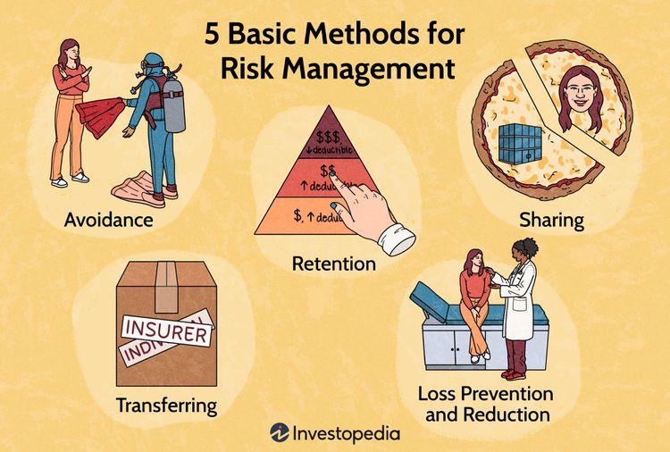

Andrew Wen-Chuan Lo, a prominent figure in the worlds of finance and algorithmic trading, has significantly advanced the fields of financial engineering and quantitative investment. As a professor and economist, Lo's research and theories have transformed how market participants understand and approach financial market complexities. His pioneering work in algorithmic trading has provided both theoretical frameworks and practical applications that have influenced the practices of hedge funds, investment banks, and financial academic research.

Lo's approach to finance is characterized by a detailed understanding of market dynamics. His efforts focus on integrating quantitative methods and behavioral insights, and applying this knowledge to develop advanced models for market prediction and risk management. Through his work, he emphasizes the importance of a scientific approach to finance, blending traditional economic theories with innovative practices from other disciplines such as psychology and biology.

By examining Lo's educational background and professional journey, we gain insights into how his unique perspective on finance was cultivated. His rigorous academic training and influential career have equipped him with the tools to challenge conventional thinking and propose novel solutions to financial market challenges. As a result, Andrew Lo continues to play a pivotal role in shaping the future directions of financial strategies and algorithmic trading.

## Table of Contents

## Early Life and Education

Andrew Lo was born in Hong Kong in 1960 and moved to the United States with his family at the tender age of five. This early relocation marked the beginning of a journey that would see the convergence of diverse cultural perspectives and an exceptional educational trajectory. Lo's academic path led him to Yale University, where he earned a Bachelor of Arts in Economics. This formative experience at Yale was characterized by a strong foundation in economic principles and a burgeoning interest in quantitative analysis. 

His pursuit of knowledge did not stop there. Driven by a desire to further hone his expertise in economics, Lo advanced to Harvard University, where he achieved both a Master's degree and a Ph.D. in Economics. During his time at Harvard, Lo was immersed in a rigorous academic environment that emphasized analytical rigor and intellectual curiosity. These years played a pivotal role in shaping his quantitative approach to finance, as he engaged with complex economic theories and mathematical models.

Lo's education at these prestigious institutions laid the groundwork for his later innovations in financial engineering and quantitative investment. The intellectual rigor and analytical skills he developed during these years became integral to his approach in understanding and tackling financial market complexities.

## Career and Contribution to Finance

Andrew Lo's distinguished career in finance and economics traces back to his early academic role at the Wharton School, University of Pennsylvania. This position served as a stepping stone toward his eventual move to the Massachusetts Institute of Technology (MIT) Sloan School of Management, where he further cemented his reputation as a thought leader in financial economics. At MIT, Lo assumed the role of director at the Laboratory for Financial Engineering (LFE), a platform that has been instrumental in advancing research on risk management, financial technology, and market behavior.

Lo's contributions to financial economics have been both extensive and impactful. He is renowned for integrating principles of evolutionary biology with financial theory, culminating in his development of the Adaptive Markets Hypothesis. This innovative framework challenges the traditional Efficient Market Hypothesis by suggesting that market dynamics are better understood through the lens of adaptation and natural selection, akin to ecological systems.

Lo further extended his influence by co-founding the AlphaSimplex Group, an investment management company that applies sophisticated quantitative models to develop investment strategies. The firm implements advanced methods such as machine learning and statistical [arbitrage](/wiki/arbitrage) to optimize returns, reflecting Lo's commitment to leveraging technology and data science in finance. AlphaSimplex's strategies are designed to dynamically adjust to changing market conditions, an approach that embodies the principles outlined in the Adaptive Markets Hypothesis.

Through his academic and professional endeavors, Andrew Lo has significantly influenced both theoretical and applied finance. His work continues to spur innovation in quantitative finance, with a lasting legacy that bridges the gap between complex market theories and practical financial applications.

## Algorithmic Trading Innovations

Andrew Lo's contributions to [algorithmic trading](/wiki/algorithmic-trading) are profoundly rooted in his innovative approach to quantitative risk management and market prediction models. Central to his work is the concept of the Adaptive Markets Hypothesis (AMH), which challenges the traditional Efficient Market Hypothesis by considering the influence of evolutionary principles in financial markets. According to the AMH, markets are not always efficient due to the complex behaviors and adaptive nature of market participants. This framework suggests that market dynamics can be better understood and predicted by adopting a scientific lens to study these evolutionary processes.

One of Lo's significant innovations is his emphasis on the integration of [machine learning](/wiki/machine-learning) and statistical techniques for developing predictive models. These models analyze vast datasets to identify patterns and assess the probability of different market scenarios. Lo's approach encourages the use of adaptive algorithms that evolve based on changing market conditions, enabling traders to exploit temporary inefficiencies.

Lo has also contributed to the practical application of these theories through the development of algorithms that have been implemented in real-world trading. His research provides sophisticated tools for managing quantitative risk, thereby supporting more informed decision-making in trading strategies. For instance, he advocates using mean-variance optimization – a mathematical process that helps in constructing a portfolio maximizing expected return for a given level of risk. This foundational concept in modern portfolio theory is augmented in Lo's work by incorporating evolutionary dynamics and adaptive responses to market stressors.

Additionally, Lo's work has been instrumental in advancing theoretical finance by introducing frameworks that merge economic psychology and behavioral economics. These include understanding how emotions and cognitive biases can influence trading behavior and market outcomes. Such insights have been vital for creating algorithms that incorporate behavioral data, improving the accuracy and efficacy of trading systems.

In summary, Andrew Lo's innovations have reshaped algorithmic trading by integrating adaptable, science-driven methodologies and practical applications in finance, helping traders and markets navigate the complexities of financial systems more effectively. His research continues to inspire new generations of financial economists and algorithmic traders who seek to harness the power of adaptive technologies in an ever-evolving market landscape.

## Impact and Legacy

Andrew Lo's work has fundamentally reshaped how market risks are understood and managed within the algorithmic trading environment. His insights have been instrumental in highlighting the complexities of systemic risks in financial systems. Lo's research underscores the fact that financial markets are not inherently stable, and that they exhibit complex adaptive behaviors akin to biological ecosystems. This recognition of market dynamism is encapsulated in his Adaptive Markets Hypothesis (AMH), which argues that market efficiency is not static but evolves over time with changes in the economic environment and market participants' behaviors.

Furthermore, Lo has been vocal about the urgent need for robust financial legislation that addresses systemic risks. His contributions have been critical in informing policymakers about the vulnerabilities within financial systems and the potential for systemic collapse if these risks are not properly managed. For example, Lo's reflections on the 2008 financial crisis have emphasized the importance of implementing regulatory frameworks that can adapt to the rapid changes in market conditions and participant strategies.

Apart from his academic pursuits, Lo's influence extends significantly through his leadership at AlphaSimplex Group, a firm he founded to harness quantitative investment strategies. Here, he has overseen the development of cutting-edge trading strategies that leverage his research findings. By integrating scientific research with practical applications, AlphaSimplex has been at the forefront of using quantitative models to predict market movements and manage risks effectively. Under Lo's guidance, the firm continues to innovate, utilizing advanced data analytics and machine learning techniques to refine trading algorithms that are responsive to the dynamic nature of financial markets.

Lo's dual focus on theoretical insights and their practical implementations has ensured that his work remains not only relevant but crucial in the ever-evolving landscape of finance. As markets continue to be shaped by technological advancements and global economic changes, Andrew Lo's contributions provide a robust framework for understanding and navigating the complex nature of modern financial systems.

## Conclusion

Andrew Lo's pioneering efforts in algorithmic trading and finance have set new standards for quantitative economic research. His work, characterized by blending rigorous theoretical insights with practical applications, underscores his lasting influence across the financial sector. Through a scientific and data-driven approach, Lo has advanced our understanding of market dynamics by integrating concepts from evolutionary biology into financial models, notably through his Adaptive Markets Hypothesis. This approach has not only informed academic inquiry but also provided actionable frameworks for real-world trading, enhancing both risk management and market prediction capabilities.

Lo’s extensive research, particularly in crafting algorithms that can adjust to ever-changing market conditions, has been instrumental in shaping current practices and theories in algorithmic trading. His methodologies facilitate the development of adaptive trading strategies that are robust to market fluctuations, a necessity in today's fast-paced and volatile financial environments. As financial markets continue to evolve, they increasingly rely on the kind of quantitative and adaptive strategies that Lo has advocated.

The legacy of Andrew Lo is evident not only in academia but also in the success of practical financial applications such as those employed by AlphaSimplex Group, where innovative trading approaches inspired by his research continue to thrive. As we look to the future, his foundational contributions remain essential, paving the way for ongoing advancements in algorithmic trading and financial engineering.

## References & Further Reading

[1]: Lo, A. W. (2004). ["The Adaptive Markets Hypothesis: Market Efficiency from an Evolutionary Perspective."](https://papers.ssrn.com/sol3/papers.cfm?abstract_id=602222) *Journal of Portfolio Management*, 30(5), 15-29.

[2]: Lo, A. W. (2017). ["Adaptive Markets: Financial Evolution at the Speed of Thought."](https://www.amazon.com/Adaptive-Markets-Financial-Evolution-Thought/dp/0691135142) Princeton University Press.

[3]: Lo, A. W., & MacKinlay, A. C. (1999). ["A Non-Random Walk Down Wall Street."](https://www.amazon.fr/Non-Random-Walk-Down-Wall-Street/dp/0691092567) Princeton University Press.

[4]: Lo, A. W. (2005). ["Reconciling Efficient Markets with Behavioral Finance: The Adaptive Markets Hypothesis."](https://www.researchgate.net/publication/228259155_Reconciling_Efficient_Markets_with_Behavioral_Finance_The_Adaptive_Markets_Hypothesis) *Journal of Investment Consulting*, 7, 21-44.

[5]: Lo, A. W., & Hasanhodzic, J. (2009). ["The Heretics of Finance: Conversations with Leading Practitioners of Technical Analysis."](https://www.amazon.com/Heretics-Finance-Conversations-Practitioners-Technical/dp/1576603164) Bloomberg Press.