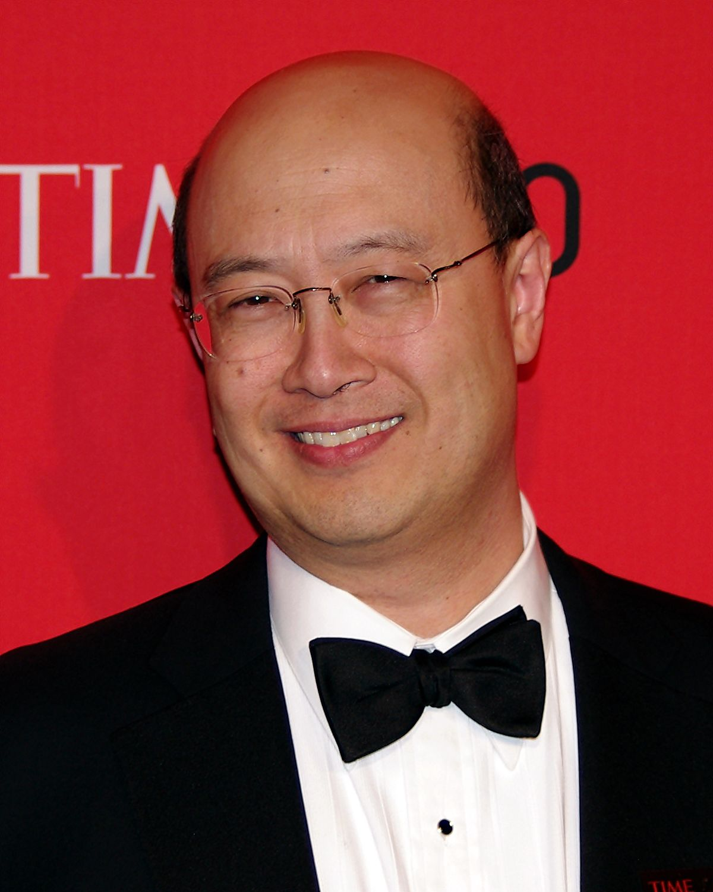

## Table of Contents

## Who is Andrew Lo?

Andrew Lo is a famous person who works in finance and science. He was born in 1960 in Hong Kong. He moved to the United States when he was young. He studied at Yale University and got a degree in economics. Later, he went to Harvard University and got a Ph.D. in economics. Now, he teaches at the Massachusetts Institute of Technology (MIT) as a professor.

Andrew Lo is known for his work in something called "behavioral finance." This means he studies how people's feelings and behaviors affect their choices about money. He also started a company called AlphaSimplex Group. This company helps people invest their money. Besides finance, Andrew Lo is interested in biology and medicine. He works on projects that use math and science to help with diseases like cancer and Alzheimer's.

## What is Andrew Lo's educational background?

Andrew Lo was born in Hong Kong in 1960. When he was young, he moved to the United States. He went to Yale University and studied economics. He worked hard and got a degree from Yale.

After Yale, Andrew Lo went to Harvard University. There, he studied more about economics and got a Ph.D. This is a very high level of education. After finishing at Harvard, he became a professor at the Massachusetts Institute of Technology, or MIT for short.

## What are some of Andrew Lo's major contributions to finance?

Andrew Lo has made big contributions to finance, especially in something called behavioral finance. Behavioral finance looks at how people's feelings and behaviors affect their money choices. Andrew Lo helped show that people do not always make smart choices about money because their emotions can get in the way. He wrote important papers and [books](/wiki/algo-trading-books) about this. His work helped people in finance understand that they need to think about how people feel, not just numbers and facts.

Another big thing Andrew Lo did was start a company called AlphaSimplex Group. This company uses what he learned in behavioral finance to help people invest their money better. The company looks at how people might act and uses that to make better investment plans. This has helped a lot of people and companies make smarter choices with their money. Andrew Lo's ideas have changed how many people think about investing and managing money.

## How has Andrew Lo influenced the field of behavioral finance?

Andrew Lo has had a big impact on behavioral finance. He helped show that people's feelings and behaviors can affect their money choices. Before Andrew Lo's work, many people in finance thought that everyone made smart, logical choices about money. But Andrew Lo's research showed that people can make mistakes because of their emotions. This changed how people in finance think about investing and managing money. Now, they know they need to think about how people feel, not just numbers and facts.

One of the big ways Andrew Lo influenced behavioral finance was through his writing. He wrote important papers and books that explained how people's feelings can affect their money choices. His work helped other researchers and people in finance understand these ideas better. Because of Andrew Lo, more people started to study and use behavioral finance. His ideas have changed how many people and companies make decisions about money.

## What role does Andrew Lo play at MIT?

Andrew Lo is a professor at the Massachusetts Institute of Technology, or MIT. He teaches students about finance and economics. He uses his knowledge to help them learn about how people make money choices and how to invest wisely.

At MIT, Andrew Lo also does research. He studies how people's feelings affect their money decisions. This is called behavioral finance. He shares what he learns with other researchers and students to help them understand this topic better.

## Can you describe Andrew Lo's work on the Adaptive Markets Hypothesis?

Andrew Lo came up with an idea called the Adaptive Markets Hypothesis. This idea says that people in the stock market are not always smart and logical. Instead, they act more like animals trying to survive. They learn from their experiences and change how they act over time. This means that the market can change and adapt, just like living things do. Andrew Lo's idea is different from the old idea called the Efficient Market Hypothesis, which said that the market always makes the best choices with all the information it has.

Andrew Lo wrote a book about the Adaptive Markets Hypothesis called "Adaptive Markets: Financial Evolution at the Speed of Thought." In the book, he explains how his idea can help us understand why the market sometimes acts in strange ways. He uses examples from biology and psychology to show how people's feelings and behaviors can affect the market. This idea has helped people in finance think about the market in new ways and make better choices.

## What are Andrew Lo's views on financial regulation?

Andrew Lo believes that financial regulation is important to keep the market fair and safe. He thinks that rules help stop people from doing bad things with money. He also believes that regulations can help protect people who are not experts in finance. Andrew Lo says that without good rules, the market can be like a wild place where only the strongest or smartest survive. He wants to make sure that everyone has a fair chance to do well with their money.

Andrew Lo also thinks that regulations should change over time. He believes that as the market changes, the rules need to change too. This way, the rules can keep up with new ways people use money and new kinds of financial products. Andrew Lo says that regulators should work with people in finance to make sure the rules are fair and helpful. He thinks that good regulation can help the market grow and be strong, not just stop bad things from happening.

## How has Andrew Lo contributed to the understanding of hedge funds?

Andrew Lo has helped people understand hedge funds better by studying them closely. He looked at how hedge funds work and how they make money. He found that hedge funds use special strategies to try to make more money than regular investments. These strategies can be risky, but they can also pay off big if they work. Andrew Lo's research showed that hedge funds are not just about taking big risks; they also use smart ways to manage those risks.

He also wrote a lot about hedge funds, which helped other people learn about them. In his writings, Andrew Lo explained how hedge funds can be good for the economy by giving people more ways to invest their money. He pointed out that hedge funds can help balance the market by doing things that other investors might not do. His work has made it easier for people to see the good and bad sides of hedge funds, so they can make better choices about investing in them.

## What is Andrew Lo's involvement in healthcare and biotech?

Andrew Lo is interested in healthcare and biotech. He uses his skills in math and science to help with big health problems like cancer and Alzheimer's. He started a group called the MIT Laboratory for Financial Engineering. This group works on projects that mix finance with biology and medicine. They try to find new ways to pay for and develop new medicines.

One big project Andrew Lo worked on is about making medicine cheaper and faster. He helped start something called the "megafund" idea. This is a way to get a lot of money to pay for new medicine research. The idea is to use money from investors to help scientists work on many projects at once. This can help find new treatments faster and make them cheaper for everyone. Andrew Lo's work in healthcare and biotech shows how finance can help solve big health problems.

## What awards and recognitions has Andrew Lo received in his career?

Andrew Lo has received many awards for his work in finance and science. One big award he got is the James R. Vertin Award from the CFA Institute. This award is for people who have made big contributions to investment management. He also got the Graham and Dodd Award from the Financial Analysts Journal. This award is for the best papers written about investing. These awards show that many people think Andrew Lo's work is very important.

Another important award Andrew Lo received is the Eugene Fama Prize from the HEC Foundation. This prize is for people who have done great research in finance. He also got the Nicholas Molodovsky Award from the CFA Institute. This award is for people who have helped make the world of finance better. These awards show that Andrew Lo is respected by many people in finance and science.

## How does Andrew Lo's work integrate finance with other disciplines like biology and neuroscience?

Andrew Lo's work brings together finance with biology and neuroscience in really interesting ways. He uses ideas from biology to help understand how the stock market works. For example, he came up with the Adaptive Markets Hypothesis, which says that people in the market act like animals trying to survive. They learn from what happens and change how they act over time. This is like how animals adapt to their environment. By using biology, Andrew Lo helps us see that the market can change and grow, just like living things do.

Andrew Lo also looks at how our brains work to understand money choices better. He studies neuroscience to see how people's feelings can affect their decisions about money. This is part of his work in behavioral finance. He thinks that understanding how our brains work can help us make smarter choices about investing. By mixing finance with biology and neuroscience, Andrew Lo shows how different fields can work together to solve big problems. His work helps us think about money in new ways and can even help find new treatments for diseases like cancer and Alzheimer's.

## What are some of the future research directions Andrew Lo is pursuing?

Andrew Lo is always looking for new ways to help people with their money and health. One big thing he is working on is how to use money to make new medicines faster and cheaper. He started a project called the "megafund," which is a way to get a lot of money to pay for medicine research. This can help scientists work on many projects at the same time, which can lead to new treatments faster. Andrew Lo thinks this can make a big difference in helping people who are sick.

Another thing Andrew Lo is looking into is how to use computers and math to understand the stock market better. He wants to see if he can use these tools to predict how the market will act in the future. This can help people make smarter choices about their money. Andrew Lo also wants to keep studying how people's feelings affect their money choices. He thinks this can help make the market fairer and safer for everyone.

## References & Further Reading

[1]: Lo, A. W. (2004). ["The Adaptive Markets Hypothesis: Market Efficiency from an Evolutionary Perspective."](https://papers.ssrn.com/sol3/papers.cfm?abstract_id=602222) *Journal of Portfolio Management*, 30(5), 15-29.

[2]: Lo, A. W. (2017). ["Adaptive Markets: Financial Evolution at the Speed of Thought."](https://www.amazon.com/Adaptive-Markets-Financial-Evolution-Thought/dp/0691135142) Princeton University Press.

[3]: Lo, A. W., & MacKinlay, A. C. (1999). ["A Non-Random Walk Down Wall Street."](https://www.amazon.fr/Non-Random-Walk-Down-Wall-Street/dp/0691092567) Princeton University Press.

[4]: Lo, A. W. (2005). ["Reconciling Efficient Markets with Behavioral Finance: The Adaptive Markets Hypothesis."](https://www.researchgate.net/publication/228259155_Reconciling_Efficient_Markets_with_Behavioral_Finance_The_Adaptive_Markets_Hypothesis) *Journal of Investment Consulting*, 7, 21-44.

[5]: Lo, A. W., & Hasanhodzic, J. (2009). ["The Heretics of Finance: Conversations with Leading Practitioners of Technical Analysis."](https://www.amazon.com/Heretics-Finance-Conversations-Practitioners-Technical/dp/1576603164) Bloomberg Press.