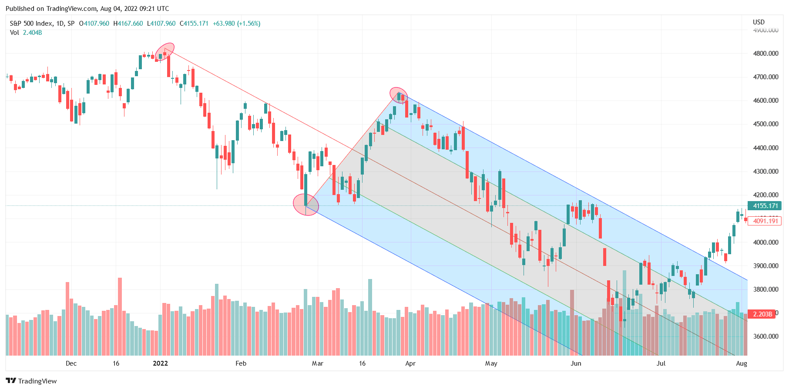

In the world of technical analysis, the Andrews Pitchfork is a unique tool that assists traders in identifying trends and potential reversal points. Developed by Alan Andrews, this indicator uses three parallel trend lines to form a pitchfork shape on price charts. The central line, or median line, is pivotal in predicting price movements, while the lines above and below it act as resistance and support levels, respectively. This method enables traders to foresee market trends and make informed decisions about their entry and exit strategies.

Although less commonly used by novice traders, the Andrews Pitchfork offers valuable insights into support and resistance levels, essential components of effective trading strategies. Its ability to provide visual cues aids traders in interpreting market dynamics, offering the opportunity to anticipate future price actions. This adaptability makes it a versatile tool applicable to various asset markets, including stocks, forex, and commodities.



This article aims to explore the inner workings of the Andrews Pitchfork indicator, shedding light on its practical application in technical analysis and its integration into algorithmic trading. By understanding this tool's mechanics, traders can enhance their market analysis skills, creating a more robust strategy to navigate the volatility of financial markets. Additionally, the discussion will highlight ways to utilize the Andrews Pitchfork across different asset classes, maximizing its potential to optimize trading performance.

## Table of Contents

## Understanding Andrews' Pitchfork

Andrews' Pitchfork is a technical analysis tool conceptualized by Alan Andrews. It involves a set of three parallel trend lines, which are strategically plotted on price charts to identify potential market trends and reversals. The configuration resembles a pitchfork, providing traders with a clear graphical representation that can aid in market analysis. 

The process begins by identifying three crucial points on a chart, typically referred to as pivots: a high point (peak), a low point (trough), and a subsequent peak or trough. These points denote significant price levels in the market. The median trend line, often called the median line, is drawn from the first point running through the midpoint between the second and third points. This line serves as the central axis of the pitchfork. 

From the central line, two equidistant parallel lines are extended. One is placed above and one below, often termed as the upper resistance line and the lower support line, respectively. These lines create a channel that encapsulates the price movements. The median line acts as a magnetic reference point, where prices are statistically likely to gravitate towards or oscillate around.

Traders utilize Andrews' Pitchfork to discern points of support and resistance. These are pivotal levels where the price tends to stall and potentially change direction. When prices approach the lower line, it is considered a potential buying opportunity, signaling support. Conversely, an approach towards the upper line may indicate a selling juncture, suggesting overhead resistance.

The effectiveness of Andrews' Pitchfork arises from its ability to predict market behavior by using these linear constructs. However, while it can indicate potential entry and [exit](/wiki/exit-strategy) points, it should be employed in conjunction with other analytical tools to enhance accuracy and reduce the risk of false signals. Understanding how to accurately select pivot points and plot these lines enables traders to significantly improve their strategic decision-making in various asset markets.

## How to Calculate and Draw Andrews' Pitchfork

To calculate and draw Andrews' Pitchfork, begin by identifying three key points on a price chart: a peak, a trough, and a subsequent peak or trough. These points are crucial for determining the pitchfork’s structure and guiding the drawing process.

1. **Identify Key Points**:
   - Select an initial pivot point, which can be a significant peak or trough in the price data.
   - Choose the second and third points as the subsequent peak or trough. These points define the angle and breadth of the pitchfork.

2. **Draw the Median Line**:
   - The median line, or the central line of the pitchfork, is essential as it serves as a trend line around which price movements are analyzed. 
   - Calculate the midpoint between the second and third points. Let's denote the first point as $P_1$, the second as $P_2$, and the third as $P_3$. The midpoint $M$ between $P_2$ and $P_3$ is given by:
$$
     M = \left( \frac{P_{2_x} + P_{3_x}}{2}, \frac{P_{2_y} + P_{3_y}}{2} \right)

$$
   - Draw a line from $P_1$ through this midpoint $M$. This line represents the median line of the pitchfork.

3. **Add Parallel Lines**:
   - Once the median line is in place, draw two additional lines parallel to the median line. These lines pass through $P_2$ and $P_3$, forming the upper and lower boundaries of the pitchfork.
   - These parallel lines serve as potential resistance and support levels, guiding traders in making buy and sell decisions.

Here is a basic Python code snippet illustrating how to calculate these points and draw the lines:

```python
import matplotlib.pyplot as plt

# Example points on the price chart (These points need to be provided as real market data).
P1 = (1, 1)
P2 = (2, 3)
P3 = (3, 2)

# Calculate the midpoint M
M = ((P2[0] + P3[0]) / 2, (P2[1] + P3[1]) / 2)

# Plot the points and lines
plt.plot([P1[0], M[0]], [P1[1], M[1]], 'k-', label='Median Line')  # Median Line

# Upper Line (parallel to Median through P2)
plt.plot([P1[0], P2[0]], [P1[1], P2[1]], 'r--', label='Upper Line') 

# Lower Line (parallel to Median through P3)
plt.plot([P1[0], P3[0]], [P1[1], P3[1]], 'b--', label='Lower Line') 

# Plot points for visualization
plt.scatter(*zip(*[P1, P2, P3]), color=['black', 'red', 'blue'], zorder=5)
plt.legend()
plt.title('Andrews\' Pitchfork')
plt.show()
```

This framework allows traders to visualize support and resistance levels relative to current price movements. By integrating these lines into a broader analysis, traders can better anticipate potential market behavior and make more strategic decisions.

## Using Andrews' Pitchfork in Trading

Traders often leverage Andrews' Pitchfork to adjust their trading strategies by pinpointing crucial buy and sell locations. The lower support line of the pitchfork can be interpreted as a prospective entry point for long positions, as prices rebounding from this line suggest an upward [momentum](/wiki/momentum). Conversely, the upper resistance line serves as an indicator for potential exit points, indicating likely reversals or pullbacks, and therefore being suitable spots for short-selling or closing long positions.

Beyond identifying entry and exit points, Andrews' Pitchfork aids in the placement of stop-loss orders. These orders are crucial for managing risk, as they limit potential losses in volatile markets. By utilizing the pitchfork's trend lines, traders can set stop-loss orders just below the lower support line for long positions or slightly above the upper resistance line for short positions. This strategic placement allows for the protection of capital if the market moves against the predicted direction.

Despite its reliability, Andrews' Pitchfork should not be used in isolation. It is crucial to confirm its predictions with other technical indicators such as moving averages, Relative Strength Index (RSI), or Fibonacci retracement levels. For instance, aligning a buy signal from the pitchfork with an oversold condition by the RSI can provide a more robust setup, thus enhancing the probability of a profitable trade.

Incorporating Andrews' Pitchfork with other tools also assists in validating market reversals or continuations. For example, a scenario where price consistently respects the pitchfork's lines and aligns with trend direction indicators can reinforce confidence in projected market trends. This multi-tool approach facilitates a more comprehensive analysis, ensuring traders are better equipped to handle the uncertainties inherent in financial markets.

## Andrews' Pitchfork and Algorithmic Trading

In [algorithmic trading](/wiki/algorithmic-trading), Andrews' Pitchfork is a tool that programmers integrate into automated trading systems to generate buy and sell signals by analyzing historical price data. This indicator is especially useful in volatile markets, such as [forex](/wiki/forex-system), where rapid decision-making can significantly impact profitability. By using historical price patterns, Andrews' Pitchfork delineates potential future market movements, allowing automated systems to set precise entry and exit points based on the trend lines it establishes.

With the ability to execute trades with high efficiency and speed, automated systems leverage Andrews' Pitchfork to react to market movements that align with the pitchfork's trend indications. For example, a trading algorithm might be programmed to initiate a buy order when a price approaches the lower support line of the pitchfork, assuming this suggests a probable upward trend reversal. Conversely, a sell signal could be triggered as the price reaches the upper resistance line, indicating a potential downturn.

The utility of Andrews' Pitchfork in algorithmic trading is further enhanced by its compatibility with various programming languages, such as Python, which is widely used for designing trading algorithms due to its vast libraries and ease of use. Below is an example of how a simple algorithm could be structured using Python to automate buy and sell signals based on Andrews' Pitchfork:

```python
import numpy as np
import pandas as pd

def calculate_pitchfork(data):
    # Assuming 'data' is a DataFrame with columns 'High', 'Low', and 'Close'
    p1 = data.iloc[0]  # Starting pivot
    p2 = data.iloc[1]  # Middle pivot
    p3 = data.iloc[2]  # Ending pivot

    # Calculate the median line
    ml_slope = ((p3['Close'] - p1['Close']) / (p3['index'] - p1['index']))
    ml_intercept = p1['Close'] - ml_slope * p1['index']

    data['median_line'] = ml_slope * data.index + ml_intercept

    # Parallel lines calculations can follow here
    # for simplicity, this example only calculates the median line

    return data

def trading_strategy(data):
    # Apply Andrews' Pitchfork calculation
    data = calculate_pitchfork(data)

    # Simple strategy: buy/sell based on relative position to median line
    data['signal'] = np.where(data['Close'] < data['median_line'], 'buy', 'sell')

    return data[['Close', 'median_line', 'signal']]

# Example stock data initialization
stock_data = pd.DataFrame({
    'High': np.random.rand(100) * 100,
    'Low': np.random.rand(100) * 100,
    'Close': np.random.rand(100) * 100
}).reset_index()

result = trading_strategy(stock_data)
print(result.tail())
```

This code illustrates a basic implementation of Andrews' Pitchfork in an algorithmic trading context, highlighting how automated decision-making can be optimized using this technical analysis tool. By providing precise entry and exit strategies, Andrews' Pitchfork helps algorithms to navigate complex market conditions efficiently.

## Practical Examples and Case Studies

Reviewing historical charts where Andrews' Pitchfork was employed can offer significant insight into its effectiveness and practical application in various trading scenarios. This tool has been instrumental in optimizing trading strategies across different asset markets. Additionally, case studies from both stocks and forex markets emphasize the critical role of pattern recognition and understanding market dynamics for achieving trading success.

### Stock Market Example

In the stock market, Andrews' Pitchfork has been particularly effective in analyzing trends and predicting price movements. For instance, consider a historical chart of a well-known stock such as Apple Inc. (AAPL). Traders might identify a significant trough followed by a peak and another trough to set up the pitchfork. The central median line can serve as a dynamic support or resistance level:

1. **Identification of Points**: Suppose the historical data point `P1`, `P2`, and `P3` are selected based on significant highs and lows. 

2. **Drawing the Pitchfork**: 
   ```python
   import matplotlib.pyplot as plt
   import numpy as np

   # Assuming hypothetical data points
   P1 = (1, 150)
   P2 = (2, 200)
   P3 = (5, 180)

   x = np.array([P1[0], P2[0], P3[0]])
   y = np.array([P1[1], P2[1], P3[1]])

   plt.plot(x, y, 'o', label='Pivot Points')

   # Calculate median line
   median_slope = (P3[1] - P1[1]) / (P3[0] - P1[0])
   median_intercept = P1[1] - (median_slope * P1[0])

   x_vals = np.linspace(0, 10, 100)
   median_y_vals = median_slope * x_vals + median_intercept

   plt.plot(x_vals, median_y_vals, '-', label='Median Line (Pitchfork)')

   plt.title('Andrews Pitchfork Example')
   plt.xlabel('Time')
   plt.ylabel('Price')
   plt.legend()
   plt.show()
   ```

In this scenario, traders could use the lower parallel line as a guide for entry points and the upper line as for exit points, thus optimizing buys and sells.

### Forex Market Example

Andrews' Pitchfork is equally beneficial in the forex market, which involves analyzing more volatile and liquid assets. For example, in a historical analysis of the EUR/USD currency pair during a trending market, traders identified critical pivot points to draw a more accurate pitchfork and make profitable decisions:

1. **Setup**: Using historical data, traders pinpointed a significant peak, trough, and subsequent peak.

2. **Benefits**: By aligning the pitchfork with these points, traders could predict future resistance and support levels. Trading decisions were then based on price interactions with these lines.

These real-world examples demonstrate how traders leverage Andrews’ Pitchfork in conjunction with other indicators, such as RSI (Relative Strength Index) or MACD (Moving Average Convergence Divergence), to verify trend strength and direction. This multi-tool approach helps in sharpening decision-making and improving the chances of trading success.

Overall, the implementation of Andrews' Pitchfork highlights the importance of skillful pivot point selection and understanding underlying market dynamics, as both are essential for maximizing the utility of this technical analysis tool.

## Limitations and Considerations

Andrews' Pitchfork is a technical tool that has proven useful for many traders; however, it is important to acknowledge its limitations and potential pitfalls. The effectiveness of this tool is heavily dependent on the accuracy of its plotting, and incorrect application can lead to inaccurate projections. Selecting the appropriate pivot points is critical; if the chosen points do not reflect the market's behavior, the resulting trend lines can be misleading. This misrepresentation can lead traders to make decisions based on faulty data, which may negatively impact trading outcomes.

The fundamental challenge lies in identifying the correct pivot points: a peak, a trough, and a subsequent peak or trough. Selecting these points requires an understanding of market dynamics and the ability to discern meaningful price movements from noise. Incorrectly chosen points can drastically alter the pitchfork's angle and breadth, skewing the central trend line and its parallel support and resistance lines. This miscalculation can lead traders to incorrect conclusions about entry and exit points or potential reversal zones. 

To mitigate these risks, it is advisable for traders to spend time practicing the plotting and interpretation of Andrews' Pitchfork using historical data. Historical charts provide a wealth of information and allow traders to experiment with different pivot points to see how they affect the trend lines. Engaging in such back-testing enhances a trader's skill in accurately applying the tool and helps build confidence in making informed decisions based on its insights.

Further, it is prudent to complement the Pitchfork with other analytical methods or indicators to confirm trends and support/resistance levels. Relying solely on the Pitchfork could increase exposure to error if the chosen pivot points are suboptimal. By integrating additional tools, traders can achieve a more comprehensive market analysis, reinforce predictions, and potentially enhance trading success.

In conclusion, while Andrews' Pitchfork is a valuable asset for interpreting market trends and making informed trading decisions, it is essential to acknowledge its limitations. Proper plotting, practice, and the application of additional analytical tools can significantly enhance its effectiveness, ultimately benefiting traders in their strategic decision-making processes.

## Conclusion

Andrews' Pitchfork is a versatile tool that offers traders valuable insights into market dynamics, particularly in identifying trends and potential buy or sell points. By using three significant pivot points to create a pitchfork formation on price charts, traders can effectively visualize potential support and resistance levels. This visualization aids in decision-making concerning entry and exit strategies in various asset markets. 

While the Andrews’ Pitchfork excels in delineating these crucial levels, its efficacy is substantially amplified when used in conjunction with other technical analysis tools. Integrating additional indicators can provide confirmation and enhance the accuracy of market predictions, thereby refining a trader’s strategy.

Practicing the implementation and interpretation of Andrews’ Pitchfork can significantly bolster a trader’s technical analysis skills. This acquired competence enables traders to seamlessly incorporate this tool into more intricate trading strategies, ultimately aiming for optimal trading outcomes. By consistently applying and adjusting their approach, traders can harness the full potential of Andrews’ Pitchfork to navigate the complexities of volatile markets effectively.

## References & Further Reading

[1]: Sholl, Louisa (2019). ["Andrews' Pitchfork: A Technical Analysis Tool"](https://chartschool.stockcharts.com/table-of-contents/chart-analysis/chart-annotation-tools/andrews-pitchfork). Investopedia.

[2]: Andrews, Alan H. (1963). ["Action/Reaction Course"](https://www.ino.com/blog/2009/06/the-median-line-a-leading-indicator/). Medianline.

[3]: Murphy, John J. (1999). ["Technical Analysis of the Financial Markets: A Comprehensive Guide to Trading Methods and Applications"](https://archive.org/details/technicalanalysi0000murp). New York Institute of Finance.

[4]: Elder, Alexander (1993). ["Trading for a Living: Psychology, Trading Tactics, Money Management"](https://www.amazon.com/Trading-Living-Psychology-Tactics-Management/dp/0471592242). Wiley.

[5]: Aronson, David R. (2007). ["Evidence-Based Technical Analysis: Applying the Scientific Method and Statistical Inference to Trading Signals"](https://onlinelibrary.wiley.com/doi/book/10.1002/9781118268315). Wiley.