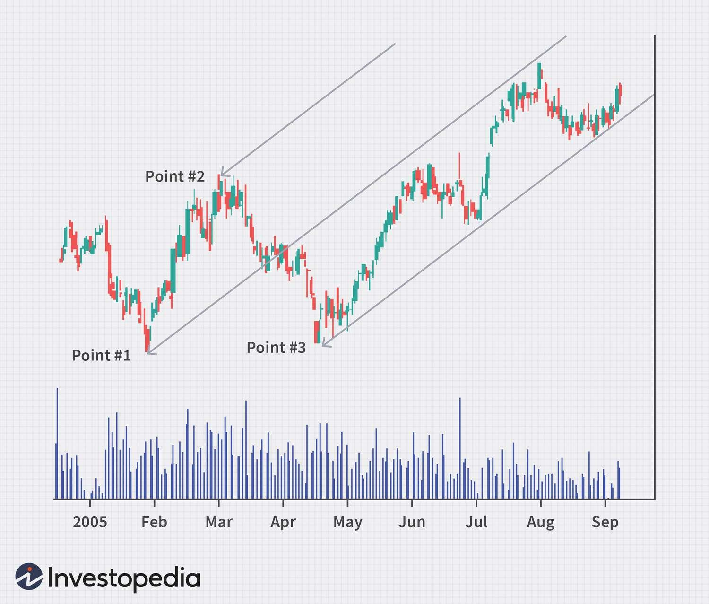

## Table of Contents

## What is Andrew's Pitchfork Indicator?

Andrew's Pitchfork Indicator is a technical analysis tool used by traders to predict potential price movements in financial markets. It is named after its creator, Dr. Alan Andrews, and is also known simply as the "Pitchfork." The indicator consists of three parallel lines that are drawn based on three specific points on a chart, typically representing significant highs and lows. The middle line, or the "handle," is drawn through the second point, while the two outer lines, or the "tines," are drawn at equal distances from the handle, creating a shape that resembles a pitchfork.

Traders use Andrew's Pitchfork to identify potential support and resistance levels, as well as to spot possible trend reversals. The idea is that prices will tend to move within the boundaries of the pitchfork, bouncing off the tines or following the handle. If the price breaks through one of the tines, it might indicate a stronger move in that direction, suggesting a potential trading opportunity. While the Pitchfork can be a useful tool, it is not foolproof and should be used in conjunction with other indicators and analysis methods to make more informed trading decisions.

## Who invented Andrew's Pitchfork Indicator?

Andrew's Pitchfork Indicator was invented by Dr. Alan Andrews. He was a well-known figure in the world of technical analysis. Dr. Andrews came up with this tool to help traders predict how prices might move in the future.

The Pitchfork is named after Dr. Andrews and is easy to spot on a chart because it looks like a farming tool called a pitchfork. It uses three points on a chart to draw three lines. The middle line is called the handle, and the two outer lines are called the tines. Traders use this to see where prices might go next and to find good times to buy or sell.

## How is Andrew's Pitchfork Indicator drawn on a chart?

To draw Andrew's Pitchfork Indicator on a chart, you need to find three important points. First, pick a big high or low point on the chart. This will be your first point. Then, find the next big high or low that comes after it. This will be your second point. Finally, find the third point which is the next big high or low after the second point. Once you have these three points, you can start drawing.

With the three points chosen, draw the middle line, called the handle, through the second point. This line should go from the first point to the third point. Next, draw the two outer lines, called the tines, at equal distances from the handle. The first tine goes from the first point and is parallel to the handle. The second tine goes from the third point and is also parallel to the handle. Now you have a pitchfork shape on your chart that can help you see where prices might go next.

## What are the main components of Andrew's Pitchfork Indicator?

Andrew's Pitchfork Indicator has three main parts: the handle, the upper tine, and the lower tine. The handle is the middle line that goes through the second of the three points you pick on the chart. These points are usually big highs or lows. The handle helps show the main direction the price might be going.

The upper and lower tines are the two lines that run parallel to the handle. The upper tine starts at the first point and goes up, while the lower tine starts at the third point and goes down. These tines help traders see where the price might bounce back or keep going. Together, these three lines make a shape that looks like a pitchfork, which can help traders guess where the price will move next.

## How does Andrew's Pitchfork Indicator help in trading?

Andrew's Pitchfork Indicator helps traders by showing them where prices might go next on a chart. It uses three lines that look like a pitchfork. The middle line, called the handle, goes through the second of three important points on the chart. These points are usually big highs or lows. The handle helps traders see the main direction the price might be moving. The two other lines, called the tines, run parallel to the handle. They help traders guess where the price might bounce back or keep going. If the price touches one of the tines and bounces back, it might be a good time to buy or sell.

Traders also watch the pitchfork to see if the price breaks through one of the tines. If it does, it might mean the price is going to move strongly in that direction. This can be a sign for traders to make a trade. But, the pitchfork isn't perfect. Traders should use it with other tools and charts to make better guesses about where prices will go. By combining the pitchfork with other information, traders can make smarter choices about when to buy or sell.

## Can you explain the significance of the median line in Andrew's Pitchfork?

The median line, or the handle, in Andrew's Pitchfork is really important. It's the middle line that goes through the second point you pick on the chart. This second point is usually a big high or low. The median line helps traders see the main direction the price might be going. It's like a guide that shows where the price might move next.

Traders use the median line to spot when the price might change direction. If the price touches the median line and bounces off it, it can be a sign that the price might keep going in the same direction. But if the price breaks through the median line, it might mean the price is going to move strongly the other way. This can help traders decide when it's a good time to buy or sell.

## What are the common strategies for using Andrew's Pitchfork in trading?

Traders use Andrew's Pitchfork in different ways to make trading decisions. One common strategy is to watch how the price moves around the median line, or the handle. If the price touches the median line and bounces off it, traders might see this as a sign to keep following the current trend. For example, if the price is going up and it bounces off the median line, traders might decide to buy, expecting the price to keep going up. But if the price breaks through the median line, it could mean the trend is changing. Traders might then decide to sell or buy, depending on which way the price is moving.

Another strategy is to look at how the price reacts to the upper and lower tines. If the price touches one of the tines and bounces back, it might be a good time to buy or sell. For instance, if the price hits the upper tine and then starts going down, traders might decide to sell, thinking the price will keep falling. If the price breaks through a tine, it can be a strong sign that the price is going to keep moving in that direction. Traders might use this as a signal to make a trade. Both strategies help traders guess where the price might go next, but they should always use other tools and information too to make the best choices.

## How do traders adjust Andrew's Pitchfork to different market conditions?

Traders adjust Andrew's Pitchfork to different market conditions by changing the points they use to draw it. In a strong trend, they might pick points that are far apart to make the pitchfork cover more of the price movement. This helps them see the bigger picture of where the price is going. If the market is moving sideways or not trending much, traders might use points that are closer together. This makes the pitchfork smaller and more sensitive to small changes in the price, helping them spot quick ups and downs.

Another way traders adjust the pitchfork is by changing how they use it with other tools. In a fast-moving market, they might use the pitchfork with shorter time frames on their charts to catch quick trades. In a slower market, they might use longer time frames to see bigger trends. Traders also combine the pitchfork with other indicators like moving averages or the Relative Strength Index (RSI) to get a better idea of what's happening. This way, they can make better guesses about where the price will go next, no matter what the market is doing.

## What are the limitations of using Andrew's Pitchfork Indicator?

Andrew's Pitchfork Indicator is not perfect and has some limitations. One big problem is that it can be hard to pick the right points to draw the pitchfork. If you pick the wrong points, the pitchfork won't help you guess where the price will go next. Also, the pitchfork works best in markets that are moving in a clear direction. If the market is moving sideways or not trending, the pitchfork might not be very useful.

Another limitation is that the pitchfork can give false signals. Sometimes, the price might touch the lines of the pitchfork and make it look like it's going to change direction, but then it doesn't. This can trick traders into making bad trades. That's why it's important to use the pitchfork with other tools and charts. By combining the pitchfork with other indicators, traders can make better guesses about where the price will go next and avoid some of the problems that come with using the pitchfork alone.

## How does Andrew's Pitchfork compare to other technical analysis tools?

Andrew's Pitchfork is one tool traders use to guess where prices might go next. It looks like a farming tool called a pitchfork and helps show the main direction of price movement. Compared to other tools, like moving averages or the Relative Strength Index (RSI), Andrew's Pitchfork focuses more on trends and possible turning points. Moving averages smooth out price data to show the overall direction, while the RSI measures how fast prices are moving to see if they might be overbought or oversold. Andrew's Pitchfork is different because it uses three specific points to draw lines that can help spot where the price might bounce back or keep going.

Another way Andrew's Pitchfork is different is that it can be hard to use right. Picking the right points to draw the pitchfork is tricky, and if you pick wrong, it won't help much. Tools like moving averages or the RSI are easier to use because they don't need you to pick special points. But, Andrew's Pitchfork can be really helpful when the market is moving in a clear direction. Traders often use it with other tools to get a better idea of what's happening. This way, they can make smarter choices about when to buy or sell, even though the pitchfork has its limits.

## What advanced techniques can be used with Andrew's Pitchfork for expert traders?

Expert traders can use advanced techniques with Andrew's Pitchfork to get more out of it. One way is to combine the pitchfork with other indicators like the Relative Strength Index (RSI) or the Moving Average Convergence Divergence (MACD). When the price touches the pitchfork's lines and the RSI shows the price is overbought or oversold, it can be a strong signal to buy or sell. Also, expert traders might use different time frames to draw multiple pitchforks. For example, they can draw a pitchfork on a daily chart and another on an hourly chart. This helps them see both the big picture and the smaller moves, making their guesses about price direction even better.

Another advanced technique is to watch for price action around the pitchfork's median line. Expert traders know that the median line, or the handle, is key to spotting trend changes. If the price breaks through the median line and keeps going, it might mean a big move is coming. Traders can use this to make trades that could be more profitable. They also look at how the price reacts to the upper and lower tines. If the price keeps bouncing off the tines without breaking through, it can show that the current trend is strong. But if the price breaks through a tine, it might be time to think about changing their trading plan. By using these advanced techniques, expert traders can use Andrew's Pitchfork to make smarter and more informed trading decisions.

## Are there any case studies or real-world examples where Andrew's Pitchfork was effectively used?

In one real-world example, a trader used Andrew's Pitchfork to make profitable trades during a strong uptrend in the stock market. The trader picked three key points on the chart: a major low, followed by a major high, and then another major low. By drawing the pitchfork, the trader saw that the price kept bouncing off the median line and the lower tine. Each time the price hit the lower tine and bounced back up, the trader bought the stock, expecting the price to keep going up. This strategy worked well because the market was in a clear uptrend, and the pitchfork helped the trader spot good times to buy.

Another case study involved using Andrew's Pitchfork in the [forex](/wiki/forex-system) market. A trader noticed a strong downtrend in a currency pair and used the pitchfork to find good times to sell. The trader chose three points: a major high, a major low, and then another major high. The pitchfork showed that the price was staying between the median line and the upper tine. Every time the price touched the upper tine and started to go down again, the trader sold the currency pair. This approach helped the trader make profits by following the downtrend and using the pitchfork to time their trades better.

## How do you calculate and draw Andrews' Pitchfork?

To calculate and draw Andrews' Pitchfork, begin by identifying three key points on a price chart: a peak, a trough, and a subsequent peak or trough. These points are crucial for determining the pitchfork’s structure and guiding the drawing process.

1. **Identify Key Points**:
   - Select an initial pivot point, which can be a significant peak or trough in the price data.
   - Choose the second and third points as the subsequent peak or trough. These points define the angle and breadth of the pitchfork.

2. **Draw the Median Line**:
   - The median line, or the central line of the pitchfork, is essential as it serves as a trend line around which price movements are analyzed. 
   - Calculate the midpoint between the second and third points. Let's denote the first point as $P_1$, the second as $P_2$, and the third as $P_3$. The midpoint $M$ between $P_2$ and $P_3$ is given by:
$$
     M = \left( \frac{P_{2_x} + P_{3_x}}{2}, \frac{P_{2_y} + P_{3_y}}{2} \right)

$$
   - Draw a line from $P_1$ through this midpoint $M$. This line represents the median line of the pitchfork.

3. **Add Parallel Lines**:
   - Once the median line is in place, draw two additional lines parallel to the median line. These lines pass through $P_2$ and $P_3$, forming the upper and lower boundaries of the pitchfork.
   - These parallel lines serve as potential resistance and support levels, guiding traders in making buy and sell decisions.

Here is a basic Python code snippet illustrating how to calculate these points and draw the lines:

```python
import matplotlib.pyplot as plt

# Example points on the price chart (These points need to be provided as real market data).
P1 = (1, 1)
P2 = (2, 3)
P3 = (3, 2)

# Calculate the midpoint M
M = ((P2[0] + P3[0]) / 2, (P2[1] + P3[1]) / 2)

# Plot the points and lines
plt.plot([P1[0], M[0]], [P1[1], M[1]], 'k-', label='Median Line')  # Median Line

# Upper Line (parallel to Median through P2)
plt.plot([P1[0], P2[0]], [P1[1], P2[1]], 'r--', label='Upper Line') 

# Lower Line (parallel to Median through P3)
plt.plot([P1[0], P3[0]], [P1[1], P3[1]], 'b--', label='Lower Line') 

# Plot points for visualization
plt.scatter(*zip(*[P1, P2, P3]), color=['black', 'red', 'blue'], zorder=5)
plt.legend()
plt.title('Andrews\' Pitchfork')
plt.show()
```

This framework allows traders to visualize support and resistance levels relative to current price movements. By integrating these lines into a broader analysis, traders can better anticipate potential market behavior and make more strategic decisions.

## References & Further Reading

[1]: Sholl, Louisa (2019). ["Andrews' Pitchfork: A Technical Analysis Tool"](https://chartschool.stockcharts.com/table-of-contents/chart-analysis/chart-annotation-tools/andrews-pitchfork). Investopedia.

[2]: Andrews, Alan H. (1963). ["Action/Reaction Course"](https://www.ino.com/blog/2009/06/the-median-line-a-leading-indicator/). Medianline.

[3]: Murphy, John J. (1999). ["Technical Analysis of the Financial Markets: A Comprehensive Guide to Trading Methods and Applications"](https://archive.org/details/technicalanalysi0000murp). New York Institute of Finance.

[4]: Elder, Alexander (1993). ["Trading for a Living: Psychology, Trading Tactics, Money Management"](https://www.amazon.com/Trading-Living-Psychology-Tactics-Management/dp/0471592242). Wiley.

[5]: Aronson, David R. (2007). ["Evidence-Based Technical Analysis: Applying the Scientific Method and Statistical Inference to Trading Signals"](https://onlinelibrary.wiley.com/doi/book/10.1002/9781118268315). Wiley.