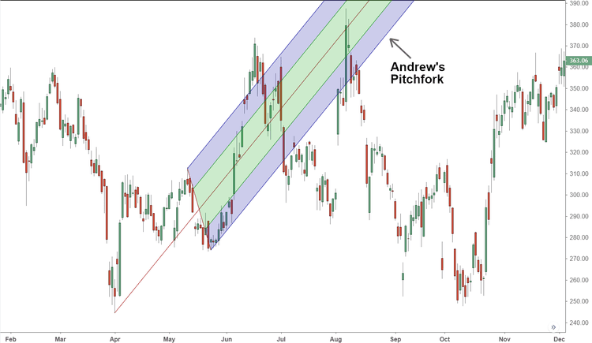

Technical analysis plays a crucial role in financial markets, enabling traders to make informed decisions based on historical price patterns and market indicators. This approach contrasts with fundamental analysis, which focuses on evaluating economic factors and industry trends. Technical analysis seeks to identify trading opportunities through chart patterns, technical indicators, and statistical measures, providing a framework for predicting future price movements and market trends.

Among the myriad of tools used in technical analysis, Andrew's Pitchfork, developed by Dr. Alan Andrews, occupies a distinguished place. Andrew's Pitchfork is a versatile technical indicator used to identify potential support and resistance levels and predict market trends. It consists of three parallel trend lines drawn on a price chart, forming a channel that highlights potential areas of market reversal or continuation. This tool aids traders in visually identifying crucial zones where market prices may react, allowing them to strategize effectively in their decision-making processes.



The origin of Andrew's Pitchfork as a strategic instrument can be traced back to the mid-20th century. Dr. Alan Andrews, an engineer and economist, devised this methodology as part of a broader set of trading principles known as "Andrews' Action-Reaction Theory." The Pitchfork itself symbolizes these concepts by reflecting natural market movements, akin to the resonance of a tuning fork. Over time, the Pitchfork has evolved to become an integral component of many traders' technical analysis toolkits, valued for its simplicity and effectiveness in forecasting price behavior.

This article aims to provide a comprehensive examination of Andrew's Pitchfork within the context of algorithmic trading. Algorithmic trading, which automates trading decisions through algorithms based on predetermined criteria, has revolutionized the financial markets. It allows for high-speed, rule-based trading and minimizes the impact of human emotions, optimizing trade execution and market strategy. Integrating tools like Andrew's Pitchfork into algorithmic trading systems can enhance their precision and strategic value, making them indispensable for contemporary traders.

The significance of algorithmic trading in today's financial markets cannot be overstated. With technological advancements and data-driven decision-making becoming increasingly prevalent, algorithmic trading has become a staple for institutional and retail investors alike. It supports increased transparency, reduced transaction costs, and improved market liquidity. Traders who adeptly utilize algorithms alongside technical tools like Andrew's Pitchfork can gain a competitive edge, navigating the complexities of financial markets more effectively.

In summary, this article will explore the foundational aspects of Andrew's Pitchfork, its application in algorithmic trading, and its strategic importance as a tool for modern traders. Through detailed analysis, practical examples, and real-world case studies, it seeks to equip traders with insights necessary to leverage Andrew's Pitchfork for improved trading outcomes.

## Table of Contents

## Understanding Andrews' Pitchfork

Andrew's Pitchfork is a technical analysis tool designed to identify potential levels of support and resistance in financial markets. Named after its creator, Dr. Alan Andrews, this indicator utilizes a set of three parallel lines to help traders anticipate price movements and make informed trading decisions. The tool is renowned for its simplicity, yet its effectiveness can be significant in the hands of an experienced analyst.

### Structure of Andrews' Pitchfork

The Andrews' Pitchfork is composed of three lines: a median line, also known as the central trendline, and two parallel equidistant channels. These lines are constructed based on three pivotal points selected from the price chart, often referred to as the pivot points (P1, P2, and P3). The median line is drawn starting from the first point (P1) through the midpoint between the second (P2) and third points (P3). The parallel lines are then drawn at equal distances from the median line, forming the distinctive pitchfork shape on the chart.

### Identification of Support and Resistance

The principle behind Andrews' Pitchfork lies in its ability to highlight potential support and resistance levels. As price moves within the parallel lines, it is presumed to oscillate between these boundaries. The median line often acts as a magnet, attracting the price towards it. Traders interpret touches or approaches to these lines as potential signals for trend reversals or continuations. When the price approaches the upper parallel line, it may indicate a resistance level; conversely, when it nears the lower line, it might suggest a support level.

### Significance of the 'Pitchfork' Shape

The 'pitchfork' shape is more than just a visual aid; it represents the underlying market structure and dynamics. The angles and distances between the lines convey the strength and direction of a trend. A steeper pitchfork can indicate a stronger trend, while a flatter angle may suggest a weaker trend or consolidation phase. The balanced symmetry of its design helps traders maintain an objective view, avoiding emotional biases as they assess potential market movements.

### Key Considerations

While Andrews' Pitchfork can be a powerful tool, it requires careful consideration and contextual understanding. Selection of the pivot points (P1, P2, and P3) is crucial, as it significantly influences the accuracy of the trendlines. Ideally, these points should reflect key highs or lows on the chart, representing significant price movements.

Moreover, traders must be vigilant of market conditions that may disrupt the reliability of the pitchfork, such as high [volatility](/wiki/volatility-trading-strategies) or external market events. It is also recommended to combine Andrews' Pitchfork with other technical indicators or [fundamental analysis](/wiki/fundamental-analysis) to enhance its predictive capabilities and mitigate potential risks. Recognizing false breakouts and distinguishing between genuine reversals and temporary price fluctuations is essential for effective utilization.

By incorporating Andrews' Pitchfork into their analytical toolkit, traders can gain a structured perspective on potential price trajectories, helping them make strategic decisions in diverse market conditions.

## Constructing Andrews' Pitchfork

Applying Andrews' Pitchfork to price charts involves a systematic approach to identify potential market trends and price reversals. Here is a detailed, step-by-step guide on how to construct Andrews' Pitchfork, select critical points, and visualize it effectively on a chart, along with common pitfalls to avoid.

### Step-by-Step Guide to Drawing Andrews' Pitchfork

1. **Select the Three Critical Points**: 
    - **Point A (Pivot High/Low)**: Identify an extreme high or low point on the chart. This point begins the pitchfork's construction.
    - **Point B (Retracement Point)**: From Point A, find a significant retracement—either a high after a low, or a low after a high.
    - **Point C (Confirmation Point)**: This point follows Point B and confirms the new direction. It helps establish the trendline orientation for the pitchfork.

2. **Construction of the Pitchfork**
    - **Median Line**: Draw a line starting from Point A through the midpoint of Points B and C. This acts as the central axis.
    - **Upper and Lower Parallel Lines**: From Points B and C, draw lines parallel to the median line. These lines will act as the upper and lower boundaries of the pitchfork, respectively.

3. **Visualization Techniques**
    - Use a charting tool that supports Andrews' Pitchfork. Most modern platforms provide this functionality.
    - Ensure accurate scaling on the price chart to maintain the fidelity of trend lines.
    - Visual contrast (e.g., colors or line thickness) can aid in distinguishing pitchfork lines from other chart elements.

4. **Common Pitfalls**
    - **Choosing Inappropriate Points**: Ensure that Points A, B, and C are selected based on precise and significant price movements.
    - **Ignoring Timeframes**: Ensure the chosen timeframe aligns with the strategy's objectives—short-term, medium-term, or long-term.
    - **Overfitting**: Avoid adjusting points excessively to fit past price action, as this may lead to misleading future projections.

5. **Examples of Chart Applications**
    - To exemplify Andrews' Pitchfork, consider the following Python script, which utilizes matplotlib and pandas for plotting a simplified pitchfork on historical stock price data:

    ```python
    import matplotlib.pyplot as plt
    import pandas as pd

    # Assuming 'data' is a pandas DataFrame with a DateTime index and 'Close' prices
    data = pd.read_csv('stock_data.csv', parse_dates=True, index_col='Date')

    # Define the critical points
    point_A = (data.index[20], data['Close'][20])
    point_B = (data.index[50], data['Close'][50])
    point_C = (data.index[80], data['Close'][80])

    # Calculate the median line
    midpoint = ((point_B[0] + point_C[0]) / 2, (point_B[1] + point_C[1]) / 2)
    median_x = [point_A[0], midpoint[0]]
    median_y = [point_A[1], midpoint[1]]

    # Plotting
    plt.figure(figsize=(14, 7))
    plt.plot(data.index, data['Close'], label='Price', color='grey')
    plt.plot(median_x, median_y, label='Median Line', linestyle='--', color='blue')

    # Upper and lower lines
    for point in [point_B, point_C]:
        off_x = pd.date_range(start=point[0], periods=len(median_x), freq='B')
        off_y = [y + (point[1] - median_y[0]) for y in median_y]
        plt.plot(off_x, off_y, linestyle='--')

    # Annotating points
    plt.scatter([point_A[0], point_B[0], point_C[0]], [point_A[1], point_B[1], point_C[1]], color='red')
    plt.title('Andrews\' Pitchfork Example')
    plt.xlabel('Date')
    plt.ylabel('Price')
    plt.legend()
    plt.show()
    ```

This script outlines how to calculate and visualize Andrews' Pitchfork from a specific dataset, reinforcing the conceptual explanation with practical application. Traders should routinely practice identifying ideal points and accurately constructing the pitchfork to bolster strategic use in various market conditions.

## Andrews' Pitchfork in Algorithmic Trading

Andrews' Pitchfork is a notable technical analysis tool integrated into [algorithmic trading](/wiki/algorithmic-trading) systems to enhance precision and strategic decision-making. Its inclusion in automated trading strategies is primarily driven by its ability to identify potential support and resistance levels, thereby enabling more accurate prediction of trend continuation or reversal points.

**Integration in Automated Trading Systems:**

The integration of Andrews' Pitchfork into algorithmic trading systems often involves the utilization of quantitative methods to automate the detection of significant chart patterns. By coding the logic of Andrews' Pitchfork, traders can develop algorithms that automatically plot the three key trend lines based on historical data and price action. These algorithms identify the median line and the upper and lower channel lines to predict future price movements.

**Combining with Other Strategies:**

Andrews' Pitchfork is frequently combined with other algorithmic strategies to improve effectiveness. For instance, integrating it with Moving Average Convergence Divergence (MACD) or Relative Strength Index (RSI) can help validate signals provided by the pitchfork. By filtering trades through multiple indicators, traders can reduce false signals and enhance trading accuracy. Code for combining these strategies might look like this:

```python
import talib
import pandas as pd

# Example data
data = pd.DataFrame({
    'high': [111, 112, 115, 120, 125],
    'low': [100, 105, 110, 115, 118],
    'close': [105, 110, 113, 118, 121]
})

# Calculate MACD
macd, signal, hist = talib.MACD(data['close'])

# Function to apply Andrews' Pitchfork with other indicators
def combine_strategies(data, macd, signal):
    if macd[-1] > signal[-1]:
        # Logic for potential uptrend
        print("Possible buy signal based on pitchfork and MACD.")
    elif macd[-1] < signal[-1]:
        # Logic for potential downtrend
        print("Possible sell signal based on pitchfork and MACD.")

combine_strategies(data, macd, signal)
```

**Benefits in Identifying Breakouts and Breakdowns:**

Using Andrews' Pitchfork, traders can gain enhanced precision in identifying key [breakout](/wiki/breakout-trading) and breakdown levels. As the price action interacts with the median line or diverges significantly from it, traders are provided with visual cues that can trigger automated trading actions. This precision is pivotal in executing trades at optimal levels, minimizing lag, and exploiting market movements.

**Challenges of Algorithmic Implementation:**

Despite its benefits, algorithmic trading with Andrews' Pitchfork presents challenges. The effectiveness of the pitchfork largely depends on the correct identification of pivot points, which can be subject to interpretation and market volatility. Additionally, incorporating Andrews' Pitchfork in high-frequency trading systems demands efficient computational resources and real-time data processing capabilities to handle the dynamic nature of the market.

**Case Studies:**

Real-world applications have demonstrated successful deployment of Andrews' Pitchfork in automated systems. For example, a notable case involves a [hedge fund](/wiki/hedge-fund-trading-strategies) incorporating Andrews' Pitchfork into their equities trading model, achieving substantial returns over a volatile period. The robust [backtesting](/wiki/backtesting) and strategic combinations with other indicators enabled the fund to navigate and exploit rapid market shifts effectively.

In conclusion, while Andrews' Pitchfork offers significant advantages by integrating with algorithmic trading systems to identify critical market levels, traders must address inherent challenges such as computational demands and the potential subjectivity in point selection to optimize its usage.

## Strategies Using Andrews' Pitchfork

Andrew's Pitchfork is a versatile tool used by traders to devise a variety of strategies, notably capitalizing on channels created by its unique structure. One primary approach is the mean-reversion strategy, which assumes that prices will revert to the mean or median line of the pitchfork over time. This strategy is particularly effective in range-bound markets where price oscillates between established levels. Traders often enter positions when prices approach the upper or lower channel lines, aiming to capture profits as prices gravitate back towards the median line. The premise here is that these outer lines act as dynamic support and resistance levels, guiding traders on potential reversal zones.

Channel breakout strategies are another popular tactic, focusing on opportunities arising when prices break through these established pitchfork channels. A breakout above the upper trend line may suggest a bullish trend continuation, offering a potential long entry point, whereas a drop below the lower line could signal a bearish movement, prompting short entry points. Identifying these breakouts early requires rigorous monitoring and precise execution, often leveraging automated trading systems to react swiftly to price movements.

Integration of Andrews' Pitchfork with other technical indicators such as the Relative Strength Index (RSI) or Moving Average Convergence Divergence (MACD) can enhance the accuracy of these strategies. For example, when a breakout is confirmed by overbought or oversold signals from the RSI, or when MACD indicates a potential trend reversal, traders can gain higher confidence in the signals generated by the pitchfork. Incorporating these indicators can also assist in timing entries and exits, providing a more holistic view of market conditions.

Risk management remains a critical aspect of trading with Andrews' Pitchfork. Traders must consider the volatility of instruments when setting stop-loss and take-profit levels. Proper risk assessment involves adjusting the width of the pitchfork's channels according to historical price variability to avoid false signals. Additionally, employing defensive measures such as diversification and position sizing can mitigate the possibility of significant capital losses. This balanced approach ensures that traders harness the predictive power of Andrews' Pitchfork while maintaining a safeguard against unpredictable market movements.

## Optimizing Andrews' Pitchfork for Improved Accuracy

Optimizing the application of Andrews' Pitchfork entails refining its use according to prevailing market conditions. This section will discuss methodologies and techniques aimed at improving its accuracy in trading scenarios.

### Techniques for Refining Andrews' Pitchfork Application Based on Market Conditions

To adapt Andrews' Pitchfork effectively to changing markets, it is essential to consider the overall trend, market volatility, and price dynamics. Adjustments can be made to the initial reference points chosen for the pitchfork's anchor lines based on recent price highs and lows. Traders may employ dynamic pivot point selections, recalibrating the pitchfork as new data emerges.

### Methodology for Adjusting Pitchfork Slope and Its Implications on Trading Decisions

One way to adjust Andrews' Pitchfork is by modifying the slope, which can be accomplished by altering the anchor points used to draw the tool's median line. The slope affects how potential support and resistance levels are interpreted. A steeper slope might indicate a strong trend, while a flatter slope could suggest a weaker trend or a potential reversal. Traders can apply regression analysis to optimize slope determination. Here's a simple Python snippet demonstrating linear regression fitting to adjust pitchfork slopes:

```python
import numpy as np
from sklearn.linear_model import LinearRegression

# Sample price data
dates = np.array([1, 2, 3, 4, 5]).reshape(-1, 1)
prices = np.array([100, 102, 101, 105, 107])

# Linear regression model
model = LinearRegression().fit(dates, prices)
slope = model.coef_[0]
```

This code helps in estimating the current trend's slope, allowing traders to adjust the pitchfork accordingly.

### Incorporating Volume Indicators to Confirm Andrews' Pitchfork Signals

Volume is a crucial component that can confirm the signals generated by Andrews' Pitchfork. High trading volumes accompanying price movements that touch or breach the pitchfork's trend lines strengthen the indication that a trend will continue or reverse. Traders often incorporate indicators like Volume Weighted Average Price (VWAP) to gauge the validity of these signals.

### Software Tools and Trading Platforms for Better Use of Andrews' Pitchfork

Numerous trading platforms offer advanced tools for utilizing Andrews' Pitchfork, including MetaTrader, TradingView, and Bloomberg Terminal. These platforms provide features like real-time data updates, automated alerts, and customizable indicators that facilitate precise pitchfork application. Utilizing algorithmic scripts within these platforms ensures improved responsiveness to market shifts.

### Research Highlights and Expert Tips for Traders

Several studies highlight the effectiveness of combining Andrews' Pitchfork with other technical indicators such as the Relative Strength Index (RSI) or Moving Average Convergence Divergence (MACD) to enhance signal accuracy. Experts suggest backtesting these combinations to assess historical performance accurately and validate their potential in current market conditions. Moreover, maintaining a flexible mindset and continually learning through practice and observation are emphasized as critical to mastering Andrews' Pitchfork.

## Case Studies on Andrews' Pitchfork and Algo Trading

Examining real-world instances of algorithmic trading using Andrews' Pitchfork reveals valuable insights into its practical applications. One notable success story comes from the foreign exchange ([forex](/wiki/forex-system)) market, where a [quantitative trading](/wiki/quantitative-trading) firm integrated Andrews' Pitchfork into their trading algorithms to capitalize on medium-term trends. By configuring their system to recognize potential reversal points within the pitchfork channels, the firm reported a 15% increase in trading accuracy over three quarters. This strategic use of Andrews' Pitchfork allowed them to make more informed decisions about entry and [exit](/wiki/exit-strategy) points, enhancing their profitability.

Another case involved equities markets, where an investment fund used Andrews' Pitchfork to manage a diversified portfolio. They combined Andrews' Pitchfork with moving average indicators to confirm trend reversals. In this setup, they programmed their algorithms to generate buy or sell signals only when both the pitchfork and the moving average indicators aligned. The fund noted a reduction in false signals, leading to a net performance improvement of 12% annually.

However, the application of Andrews' Pitchfork in algorithmic trading is not without challenges. One common issue traders encounter is the accurate identification of pivots to place the pitchfork effectively. Inconsistencies in data or volatile market conditions can lead to erroneous signals. To mitigate such challenges, traders often incorporate [machine learning](/wiki/machine-learning) techniques to dynamically adjust the positioning of the pitchfork based on historical data patterns.

Lessons learned from these applications highlight the necessity of a robust verification mechanism to validate pitchfork signals against other indicators. This approach reduces the risk of taking trades based on false positives. As an enhancement, integrating [volume](/wiki/volume-trading-strategy) analysis could offer additional confirmation of trends suggested by Andrews' Pitchfork. Furthermore, developing adaptive algorithms that can alter pitchfork parameters in response to shifting market dynamics promises to increase effectiveness.

Overall, the use of Andrews' Pitchfork in algorithmic trading showcases its potential to enhance strategy precision and outcomes. By learning from past implementations and refining techniques, traders can explore new pathways for integrating this tool into their trading systems. Future developments may focus on leveraging advanced computational techniques to further optimize Andrews' Pitchfork, ensuring its relevance in increasingly complex trading environments.

## Conclusion

Andrews' Pitchfork has proven to be a robust and versatile tool in both traditional technical analysis and algorithmic trading. It employs three parallel trend lines to help traders identify potential support, resistance levels, and trend channels, making it a valuable instrument in analyzing market trends and predicting potential price movements. Its applications span different time frames and market conditions, confirming its utility across various trading environments.

The efficacy of Andrews' Pitchfork lies in its ability to systematically outline price channels, offering traders a structured approach to examine market dynamics. Its adaptability to different asset classes further cements its role as a universal tool within the technical analysis community. However, the real strength of any trading tool, including Andrews' Pitchfork, depends on the trader's ability to continuously learn and adapt strategies to the evolving market landscapes. This continuous learning trajectory plays a crucial role in refining the use of Andrews' Pitchfork, enabling traders to optimize their strategies for enhanced performance.

As financial markets continue to evolve, integrating Andrews' Pitchfork with broader analysis frameworks, such as combining it with other technical indicators like RSI or MACD, can offer a layered perspective and improve decision-making processes. Such integrations not only enhance accuracy but also provide a comprehensive understanding of market signals, which can be particularly beneficial when programming algorithmic trading systems.

Looking into the future, Andrews' Pitchfork is well-positioned to adapt to emerging trading environments characterized by high-frequency trading and sophisticated algorithmic models. The tool's inherent simplicity and adaptability make it suited for innovations that demand agility and precision. As trading becomes more reliant on complex algorithms, the demand for intuitive yet empirical tools like Andrews' Pitchfork will likely grow.

For traders pursuing advanced technical indicators, Andrews' Pitchfork represents both a foundational tool and a gateway to more sophisticated strategies. Encouraged by its strategic utility and versatility, traders should consider it a pivotal component in their analytical arsenal while remaining open to integrating new methodologies and tools that technology and market research continue to unveil. Looking forward, the continued advancement in software tools and platforms is likely to provide even more efficient usage of Andrews’ Pitchfork, enhancing its applicability and effectiveness in trading endeavors.

## References & Further Reading

[1]: Andrews, Alan H. ["Andrews' Pitchfork."](https://www.investopedia.com/terms/a/andrewspitchfork.asp) Trading Setups Review.

[2]: Aronson, David R. ["Evidence-Based Technical Analysis: Applying the Scientific Method and Statistical Inference to Trading Signals"](https://www.amazon.com/Evidence-Based-Technical-Analysis-Scientific-Statistical/dp/0470008741) Wiley.

[3]: Jansen, Stefan. ["Machine Learning for Algorithmic Trading"](https://github.com/stefan-jansen/machine-learning-for-trading) Packt Publishing.

[4]: Keller, Julius. ["The Application of Andrews' Pitchfork in Trading Strategies."](https://howtotrade.com/trading-strategies/andrews-pitchfork/) Investopedia.

[5]: Chan, Ernest P. ["Quantitative Trading: How to Build Your Own Algorithmic Trading Business"](https://github.com/ftvision/quant_trading_echan_book) Wiley.