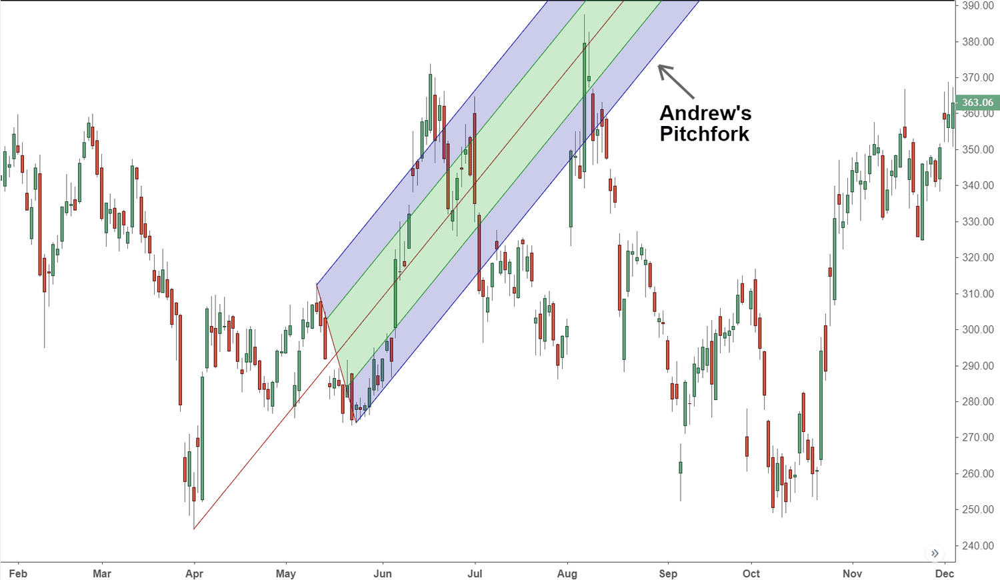

## Table of Contents

## What is Andrews' Pitchfork trading strategy?

Andrews' Pitchfork is a technical analysis tool used in trading to identify potential support and resistance levels in the price of an asset. It is drawn using three parallel lines, which are based on three significant points on a chart: a pivot point and two other points that represent the highs and lows around the pivot. The middle line, known as the median line, is drawn through the pivot point and is extended in both directions. The other two lines, called the upper and lower prongs, are drawn parallel to the median line from the high and low points, respectively. Traders use these lines to predict where the price might go next, helping them decide when to buy or sell.

Traders often look for the price to move within the boundaries of the pitchfork. If the price stays inside the prongs, it suggests that the current trend is strong and likely to continue. When the price touches or approaches one of the prongs, it might bounce back towards the median line, giving traders a chance to enter or exit trades. If the price breaks out of the pitchfork, it could signal that the trend is weakening or reversing, prompting traders to adjust their strategies. While Andrews' Pitchfork can be a useful tool, it's important to use it along with other indicators and analysis methods to make more informed trading decisions.

## Who developed Andrews' Pitchfork and when was it introduced?

Andrews' Pitchfork was developed by a trader named Alan Andrews. He came up with this tool to help traders see where prices might go next on a chart. Alan Andrews learned about this method from another trader named Roger Babson, who was his mentor. Roger Babson used a similar idea with three lines to predict price movements, and Alan Andrews improved it into what we now call Andrews' Pitchfork.

It's not exactly clear when Alan Andrews first introduced his Pitchfork to other traders. Some people think it was in the 1960s or 1970s. Over time, more and more traders started using Andrews' Pitchfork because it helped them make better decisions about buying and selling. Today, many traders still use this tool as part of their trading strategies.

## How do you draw Andrews' Pitchfork on a chart?

To draw Andrews' Pitchfork on a chart, start by finding three important points on the price chart. The first point is the pivot point, which is usually a major high or low in the price movement. The second point is the high point after the pivot, and the third point is the low point after the pivot. These three points should form a zigzag pattern on the chart.

Once you have these points, draw the median line of the Pitchfork. This line goes through the pivot point and is aimed halfway between the second and third points. After drawing the median line, draw the upper prong from the second point (the high) parallel to the median line. Then, draw the lower prong from the third point (the low) also parallel to the median line. Now you have Andrews' Pitchfork on your chart, with three lines that can help you see where the price might go next.

## What are the key components of Andrews' Pitchfork?

Andrews' Pitchfork is a tool used in trading to help predict where the price of something might go. It's made up of three lines: the median line, the upper prong, and the lower prong. The median line goes through a special point called the pivot point, which is usually a big high or low on the price chart. The upper prong is drawn from a high point after the pivot, and the lower prong is drawn from a low point after the pivot. Both the upper and lower prongs are drawn parallel to the median line.

Traders use these three lines to see if the price will stay inside the prongs or break out of them. If the price stays inside, it might mean the current trend is strong and likely to keep going. When the price touches one of the prongs, it might bounce back towards the median line, which can help traders decide when to buy or sell. If the price goes outside the prongs, it could mean the trend is getting weaker or might change direction, so traders might need to change their plans.

## What is the significance of the median line in Andrews' Pitchfork?

The median line in Andrews' Pitchfork is very important because it helps traders see where the price might go next. It's like the middle road that the price often follows. When you draw the median line, you start at a big high or low on the chart called the pivot point. Then, you draw the line so it goes halfway between the next high and low points. This line shows the main direction that the price is moving.

Traders watch the median line closely because the price often bounces off it or comes back to it. If the price touches the median line and then starts to move away from it, it might mean the price is going to keep moving in that direction. But if the price breaks through the median line and keeps going, it could be a sign that the trend is changing. This helps traders decide when to buy or sell, making the median line a key part of using Andrews' Pitchfork.

## How can Andrews' Pitchfork be used to identify potential support and resistance levels?

Andrews' Pitchfork helps traders find where the price of something might stop going up or down, which are called support and resistance levels. The three lines of the Pitchfork - the median line, the upper prong, and the lower prong - act like boundaries. When the price touches or gets close to the upper prong, it might stop going up and start going down again. This upper prong can be seen as a resistance level. On the other hand, when the price touches or gets close to the lower prong, it might stop going down and start going up again. This lower prong can be seen as a support level.

Traders also watch the median line closely because it often acts as both support and resistance. If the price bounces off the median line and starts moving away from it, the median line can be seen as a support or resistance level depending on the direction of the price movement. For example, if the price is going up and then touches the median line before going up again, the median line is acting as a support. If the price is going down and then touches the median line before going down again, the median line is acting as resistance. By watching how the price interacts with these lines, traders can better predict where the price might go next and make smarter trading decisions.

## What are the common entry and exit signals when using Andrews' Pitchfork?

When using Andrews' Pitchfork, traders look for certain signs to decide when to buy or sell. A common entry signal happens when the price touches one of the prongs and then starts moving back towards the median line. For example, if the price touches the lower prong and then starts going up, it might be a good time to buy. This is because the lower prong can act like a support level, and the price bouncing off it suggests that the price might keep going up. Another entry signal is when the price breaks out of the prongs. If the price breaks above the upper prong, it might be a sign to buy because it could mean the price is going to keep going up.

Exit signals are also important for knowing when to sell or close a trade. A common [exit](/wiki/exit-strategy) signal is when the price touches the median line after moving away from one of the prongs. If you bought when the price was at the lower prong and it moves up to the median line, that might be a good time to sell and take your profit. Another exit signal is when the price breaks out of the prongs in the opposite direction of your trade. If you bought and the price breaks below the lower prong, it might be a sign to sell and cut your losses because it could mean the price is going to keep going down. By watching these signals, traders can make better decisions about when to enter and exit trades.

## Can Andrews' Pitchfork be used in conjunction with other technical indicators?

Yes, Andrews' Pitchfork can be used with other technical indicators to make better trading decisions. Traders often combine it with tools like moving averages, the Relative Strength Index (RSI), and the Moving Average Convergence Divergence (MACD). For example, if the price touches the lower prong of the Pitchfork and starts moving up, a trader might look at the RSI to see if it's in an oversold condition, which could confirm that it's a good time to buy. Using these indicators together helps traders get a fuller picture of what the market might do next.

By using Andrews' Pitchfork along with other indicators, traders can check their trading ideas from different angles. If the Pitchfork shows a potential trend and other indicators like the MACD also show a strong trend, it can give traders more confidence in their trades. This way, they can make more informed decisions about when to buy or sell, and they can also manage their risks better. Combining different tools helps traders see the market more clearly and make smarter moves.

## What are the limitations and potential pitfalls of using Andrews' Pitchfork?

Andrews' Pitchfork can be a helpful tool for traders, but it has some limitations. One big problem is that it can be hard to pick the right points to draw the Pitchfork. If you choose the wrong pivot point or the wrong high and low points, the lines you draw might not be very useful. This can lead to wrong guesses about where the price will go next. Also, the Pitchfork works best in markets that have clear trends. If the market is moving up and down a lot without a clear direction, the Pitchfork might not help much.

Another thing to watch out for is that the Pitchfork is just one tool. Relying on it too much without looking at other signs can be risky. Sometimes, the price might break out of the Pitchfork lines, and if you're not using other tools to check, you might make bad trading choices. It's important to use the Pitchfork along with other indicators like moving averages or the RSI to get a better idea of what's happening in the market. This way, you can avoid some of the pitfalls and make smarter trades.

## How does Andrews' Pitchfork perform in different market conditions?

Andrews' Pitchfork works best when the market has a clear trend, either going up or going down. When the price is moving in a straight line, the Pitchfork's lines can help you see where the price might stop and turn around. The median line and the prongs act like roads that the price follows. If the price stays inside the prongs, it's a good sign that the trend will keep going. But if the price breaks out of the prongs, it might mean the trend is changing, and you need to be careful.

In markets that move up and down a lot without a clear direction, Andrews' Pitchfork can be tricky to use. When the price is all over the place, it's hard to pick the right points to draw the Pitchfork. This can make the lines less helpful because they might not match what the price is doing. In these choppy markets, you might want to use other tools along with the Pitchfork to get a better idea of what's going on.

## What are some advanced techniques for optimizing the use of Andrews' Pitchfork?

To make the most out of Andrews' Pitchfork, traders often use something called the "Schiff median line." This is a way to draw another line that helps predict where the price might go next. You draw the Schiff median line by finding a new pivot point and then drawing a line that goes halfway between the next high and low points, just like the main median line. But you draw it at a different angle. This extra line can help you see more possible places where the price might stop or turn around. It's like adding another road to your map, giving you more ways to guess where the price will go.

Another advanced technique is to use different time frames when you draw the Pitchfork. You can start by drawing it on a longer time frame, like a daily chart, to see the big picture. Then, you can draw it on a shorter time frame, like an hourly chart, to find better spots to buy or sell. By looking at the Pitchfork on different time frames, you can see how the price might move in the short term and the long term. This can help you make smarter trading choices because you're looking at the market from different angles.

## How can backtesting be applied to refine Andrews' Pitchfork trading strategies?

Backtesting is a way to check how well Andrews' Pitchfork would have worked in the past. You look at old price charts and draw the Pitchfork on them to see if it would have helped you make good trading choices. By doing this, you can see if the Pitchfork's lines really did show where the price would stop or turn around. If you find that the Pitchfork worked well in the past, it can give you more confidence to use it now. But if it didn't work so well, you might need to change how you use it or try different points to draw the lines.

Backtesting also helps you try out different ways to use the Pitchfork. You can test things like the Schiff median line or using the Pitchfork on different time frames to see what works best. By trying out these ideas on old data, you can find the best way to use the Pitchfork for your trading. This can help you make better trades in the future because you'll know what has worked before. Just remember, what worked in the past might not always work in the future, so keep learning and adjusting your strategy.

## What is Andrews Pitchfork and how does it work?

Andrews Pitchfork, a technical analysis tool developed by Dr. Alan Andrews, employs three parallel lines to facilitate the analysis of price movements within financial markets. The tool is designed to consist of a median line, often referred to as the central line, and two equidistant lines that serve as support and resistance levels. These lines are constructed based on three historical price points, which are pivotal in capturing prevailing market trends and potential reversals.

The central aspect of constructing an Andrews Pitchfork involves the selection of these historical price points, typically labeled as P1, P2, and P3. The median line is drawn from the first point, P1, and extends through the midpoint between the second, P2, and third points, P3. This line is pivotal as market prices are observed to gravitate towards it, with subsequent movements providing insights into overbought or oversold conditions. Prices oscillating around this median line enable traders to derive actionable trading signals.

The mathematical formula required for drawing the median line is derived by establishing coordinates for each of the selected points. If the points are denoted as $(x_1, y_1), (x_2, y_2), (x_3, y_3)$, the slope of the median line can be calculated by determining the midpoint of P2 and P3 using:

$$
\text{Midpoint} = \left(\frac{x_2 + x_3}{2}, \frac{y_2 + y_3}{2}\right)
$$

The median line equation is then determined by assessing the slope between P1 and the calculated midpoint, with the equation expressed as:

$$
y - y_1 = m(x - x_1)
$$

where $m$ is the slope of the line connecting P1 and the midpoint.

The equidistant lines, which form the prongs of the pitchfork, are subsequently drawn parallel to the median line. The distance of these lines from the median line is equal to the vertical distance between P2 or P3 and the median line. These lines act as dynamic support and resistance levels, crucial in anticipating price reversals or continuations.

Andrews Pitchfork, through its structured design and reliance on historical data points, offers traders a straightforward methodology for determining potential market turning points. Its application in assessing price tendencies provides a robust framework for generating reliable trading signals, indispensable for market participants relying on technical analysis.

## How do you draw the pitchfork?

To correctly draw Andrews Pitchfork, a trader must identify three pivotal price points that correspond to recent trend extremes. For an uptrend, these points are chosen in the order of a low, followed by a high, and then another low. Conversely, in a downtrend, the points are a high, followed by a low, and then another high. These points are critical in establishing the trajectory of the pitchfork.

The process begins with the construction of the median line, a central component of Andrews Pitchfork. This line starts at the initial extreme point and extends through the midpoint determined by the other two selected points. Mathematically, if the initial point is A, the subsequent high or low as point B, and the third point C, the midpoint $M$ is computed as:

$$
M_x = \frac{(B_x + C_x)}{2}
$$
$$
M_y = \frac{(B_y + C_y)}{2}
$$

where $B_x, B_y$ and $C_x, C_y$ are the coordinates of points B and C, respectively. The median line then runs from point A to this calculated midpoint $M$.

Following the establishment of the median line, the next step involves drawing two equidistant lines parallel to the median line. These lines emerge as the 'prongs' of the pitchfork. Each of these lines serves as a potential level of support or resistance, enabling traders to project future price boundaries more accurately.

In Python, the computation and visualization of Andrews Pitchfork could be achieved using libraries such as matplotlib for graphical representation and numpy for numerical calculations. Here's a basic example to visualize the pitchfork:

```python
import matplotlib.pyplot as plt
import numpy as np

# Points based on trend extremes
points = np.array([[-2, 1], [0, 4], [2, 1]])

# Calculate the midpoint between B and C
midpoint = [(points[1][0] + points[2][0]) / 2, (points[1][1] + points[2][1]) / 2]

# Plotting
plt.scatter(points[:, 0], points[:, 1], color='red')
plt.text(points[0][0], points[0][1], 'A', fontsize=12)
plt.text(points[1][0], points[1][1], 'B', fontsize=12)
plt.text(points[2][0], points[2][1], 'C', fontsize=12)

# Median line
plt.plot([points[0][0], midpoint[0]], [points[0][1], midpoint[1]], color='blue', label='Median Line')

# Equidistant lines (prongs)
slope = (midpoint[1] - points[0][1]) / (midpoint[0] - points[0][0])
for offset in [-2, 2]: # Distance for visualization
    plt.plot([points[0][0] + offset, midpoint[0] + offset], [points[0][1] + offset * slope, midpoint[1] + offset * slope], color='green', linestyle='--')

plt.title('Andrews Pitchfork')
plt.xlabel('Price')
plt.ylabel('Time')
plt.legend()
plt.grid(True)
plt.show()
```

This illustration helps identify how Andrews Pitchfork is constructed from the key historical price points, providing traders with visual cues to potential shifts in market trends. Each prong's distance and alignment reflect the approach for estimating support and resistance, essential factors in determining future price movement.

## References & Further Reading

[1]: Arbesman, J. (2010). ["Alan Andrews' Pitchfork: A Tool for Trend Analysis and Market Forecasting."](https://chartschool.stockcharts.com/table-of-contents/chart-analysis/chart-annotation-tools/andrews-pitchfork) Investopedia.

[2]: Pring, M. (2002). ["Technical Analysis Explained: The Successful Investor's Guide to Spotting Investment Trends and Turning Points"](https://www.amazon.com/Technical-Analysis-Explained-Fifth-Successful/dp/0071825177) by Martin J. Pring.

[3]: Murphy, J. J. (1999). ["Technical Analysis of the Financial Markets: A Comprehensive Guide to Trading Methods and Applications"](https://archive.org/details/technicalanalysi0000murp) by John J. Murphy.

[4]: Schwager, J. D. (2009). ["Technical Analysis: The Complete Resource for Financial Market Technicians"](https://books.google.com/books/about/Technical_Analysis.html?id=62-9CgAAQBAJ) by Charles D. Kirkpatrick II and Julie R. Dahlquist.

[5]: Appel, G. (2005). ["Technical Analysis: Power Tools for Active Investors"](https://www.amazon.com/Technical-Analysis-Power-Active-Investors/dp/0132930048) by Gerald Appel.

[6]: Tharp, V. (2007). ["Trade Your Way to Financial Freedom"](https://www.amazon.com/Trade-Your-Way-Financial-Freedom/dp/007147871X) by Van K. Tharp.

[7]: Kaufman, P. J. (2011). ["Trading Systems and Methods"](https://onlinelibrary.wiley.com/doi/book/10.1002/9781119202561) by Perry J. Kaufman.