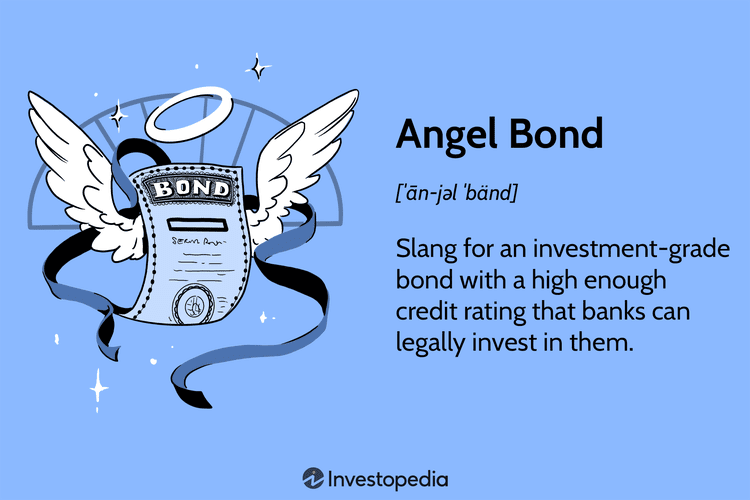

## Table of Contents

## What are Angel Bonds?

Angel Bonds are a type of financial instrument that companies use to raise money. They are called "angel" bonds because they often help struggling companies that need funds to stay afloat or grow. These bonds are usually issued by companies that are not doing well financially, so they offer higher interest rates to attract investors. This means that investors can earn more money, but it also means there is more risk because the company might not be able to pay back the bond.

Investors who buy angel bonds are betting that the company will turn things around and become successful. If the company does well, the bondholders get their money back with interest. However, if the company fails, the bondholders might lose their investment. Because of this risk, angel bonds are often seen as a way for investors to potentially make high returns, but they need to be careful and understand the risks involved.

## How do Angel Bonds differ from traditional bonds?

Angel Bonds and traditional bonds are both ways for companies to borrow money from investors, but they have some key differences. Traditional bonds are usually issued by companies that are financially stable. These companies can offer lower interest rates because they are seen as safer investments. Investors who buy traditional bonds expect to get their money back with interest over time, and the risk of not getting paid back is lower.

On the other hand, Angel Bonds are issued by companies that are struggling financially. Because these companies are riskier, they have to offer higher interest rates to attract investors. People who invest in Angel Bonds are taking a bigger chance that the company might not be able to pay them back. They hope that the company will improve and become successful, which would mean they get a higher return on their investment.

## What is the purpose of issuing Angel Bonds?

The main reason companies issue Angel Bonds is to get money when they are having financial problems. These companies might need the money to keep running, pay off debts, or try to grow their business. By issuing Angel Bonds, they can attract investors who are willing to take a risk in hopes of [earning](/wiki/earning-announcement) higher interest rates than what traditional bonds offer.

Angel Bonds help companies that are struggling to stay afloat or turn their business around. The money raised from these bonds can be used to make important changes or investments that could lead to better financial health in the future. However, because these companies are in a tough spot, there's a bigger chance that they won't be able to pay back the investors, making Angel Bonds a riskier choice for those who buy them.

## Who typically issues Angel Bonds?

Companies that are not doing well financially often issue Angel Bonds. These companies might be struggling to make money or pay their bills. They need to find a way to get cash quickly, so they offer these bonds to investors. By doing this, they hope to raise enough money to fix their problems and keep their business going.

Angel Bonds are a way for these struggling companies to attract investors. They offer higher interest rates than normal bonds because they are riskier. Investors who buy these bonds are betting that the company will get better and be able to pay them back with extra money. If the company fails, though, the investors might lose their money.

## What are the benefits of investing in Angel Bonds?

Investing in Angel Bonds can give you a chance to earn more money than you would with regular bonds. This is because the companies that issue Angel Bonds are in tough spots and need to offer higher interest rates to get people to invest. If the company does well and turns things around, you can get your money back with a lot of extra interest. This makes Angel Bonds attractive if you're willing to take a risk for a bigger reward.

However, there's a catch. Angel Bonds are riskier because the companies that issue them are struggling. There's a bigger chance that the company might not be able to pay you back. If the company goes bankrupt, you could lose all the money you invested. So, while Angel Bonds can offer big rewards, you need to be ready for the possibility of losing your money if things don't go well for the company.

## What are the risks associated with Angel Bonds?

Investing in Angel Bonds can be risky because the companies that issue them are not doing well financially. These companies are struggling to make money or pay their bills, so there's a big chance they might not be able to pay you back. If the company goes bankrupt, you could lose all the money you invested in the bonds. This makes Angel Bonds much riskier than regular bonds from companies that are doing better financially.

Another risk is that the value of Angel Bonds can go up and down a lot. If people start to think the company is in even more trouble, the price of the bonds can drop quickly. This means if you need to sell your bonds before they mature, you might get back less money than you paid for them. So, while Angel Bonds can offer the chance for big rewards, they come with the chance of big losses too.

## How are Angel Bonds structured?

Angel Bonds are a type of bond that companies issue when they are struggling financially. These bonds are structured to help the company raise money by offering investors higher interest rates than what you would get from regular bonds. The higher interest is meant to attract investors even though the company is in a tough spot. When you buy an Angel Bond, you are lending money to the company, and in return, they promise to pay you back the money you lent them plus the extra interest over a certain period of time.

The structure of Angel Bonds includes a few key parts. First, there's the [interest rate](/wiki/interest-rate-trading-strategies), which is usually higher than normal because the company is riskier. Second, there's the maturity date, which is when the company has to pay you back the money you lent them. If the company does well and turns things around, you get your money back with the extra interest. But if the company fails, you might not get your money back at all. So, while Angel Bonds can offer you a chance to earn more money, they also come with a bigger risk that you could lose your investment.

## Can you provide examples of companies that have issued Angel Bonds?

Some companies that have issued Angel Bonds include Eastman Kodak and American Airlines. Eastman Kodak, a company known for making cameras and film, was in big trouble financially. In 2010, they issued Angel Bonds to try and raise money to help them stay in business. They offered high interest rates to get people to invest, but it was still a risky move because the company was struggling.

Another example is American Airlines. In 2011, they were having a hard time making money and needed cash to keep flying. They issued Angel Bonds with high interest rates to attract investors. This was a way for them to get the money they needed, but it was also risky for the people who bought the bonds because the airline could have gone bankrupt and not paid them back.

## What are the tax implications of investing in Angel Bonds?

When you invest in Angel Bonds, you need to think about how it might affect your taxes. The interest you earn from these bonds is usually considered regular income. This means you have to pay taxes on it at your normal income tax rate, which can be higher than the tax rate for other types of investments like stocks or mutual funds. So, even though Angel Bonds can offer you a chance to earn more money, you also have to pay more in taxes on that extra money.

If the company that issued the Angel Bonds goes bankrupt and you lose your investment, you might be able to claim a tax deduction. This means you can reduce the amount of taxes you owe by the amount of money you lost. But, there are rules about how much you can deduct and when you can do it, so it's a good idea to talk to a tax expert to understand what you can and can't do.

## How do Angel Bonds impact the financial market?

Angel Bonds can have a big effect on the financial market. When a struggling company issues these bonds, it can help them stay in business or try to grow. This might be good for the market because it keeps companies from going bankrupt and losing jobs. But, it also adds more risk to the market. If lots of people invest in these risky bonds and the companies fail, it could lead to big losses for investors. This might make people less confident and cause them to be more careful with their money.

Also, Angel Bonds can change how investors behave. Because they offer higher interest rates, they might pull money away from safer investments like regular bonds or savings accounts. This can make the market more unstable because more money is going into riskier places. If the companies that issue these bonds do well, it could make the market stronger. But if they don't, it could lead to bigger problems and make the market less stable.

## What regulatory considerations should be noted when dealing with Angel Bonds?

When dealing with Angel Bonds, you need to think about the rules that govern them. The main regulatory body that watches over these bonds is the Securities and Exchange Commission (SEC) in the United States. The SEC makes sure that companies tell the truth about their financial situation when they issue bonds. This is important because Angel Bonds are riskier, and investors need to know what they're getting into. Companies have to follow strict rules about what they can say and how they can sell these bonds to make sure everything is fair and honest.

Another thing to keep in mind is that different countries might have their own rules about Angel Bonds. If you're investing in bonds from a company in another country, you need to understand the regulations there. These rules can affect how the bonds are sold, what information has to be shared, and how investors are protected. It's a good idea to talk to a financial advisor or lawyer who knows about these rules to make sure you're doing everything right and staying safe.

## How can an investor evaluate the performance of Angel Bonds?

To evaluate the performance of Angel Bonds, an investor should start by looking at the company's financial health. This means checking their income, debts, and how well they are doing in their business. If the company is making more money and paying off its debts, it's a good sign that they might be able to pay back the bond with interest. You can find this information in the company's financial reports, which are often available online or through investment websites.

Another way to evaluate Angel Bonds is by looking at the bond's interest rate and how it compares to other bonds. Since Angel Bonds usually offer higher interest rates because they are riskier, you want to see if the rate is high enough to make the risk worth it. Also, keep an eye on the bond's price in the market. If the price goes up, it means people think the company is doing better, but if it goes down, it might mean the company is still struggling. By keeping track of these things, you can get a better idea of how well your Angel Bonds are doing.

## References & Further Reading

[1]: ["Advances in Financial Machine Learning"](https://www.amazon.com/Advances-Financial-Machine-Learning-Marcos/dp/1119482089) by Marcos Lopez de Prado

[2]: ["Machine Learning for Algorithmic Trading"](https://www.amazon.com/Machine-Learning-Algorithmic-Trading-alternative/dp/1839217715) by Stefan Jansen

[3]: ["Quantitative Trading: How to Build Your Own Algorithmic Trading Business"](https://www.amazon.com/Quantitative-Trading-Build-Algorithmic-Business/dp/1119800064) by Ernest P. Chan

[4]: ["Evidence-Based Technical Analysis: Applying the Scientific Method and Statistical Inference to Trading Signals"](https://www.amazon.com/Evidence-Based-Technical-Analysis-Scientific-Statistical/dp/0470008741) by David Aronson

[5]: ["The Bond Book: Everything Investors Need to Know About Treasuries, Municipals, GNMAs, Corporates, Zeros, Bond Funds, Money Market Funds, and More"](https://www.amazon.com/Bond-Book-Third-Everything-Treasuries/dp/007166470X) by Annette Thau

[6]: Fabozzi, F. J. (2012). ["Bond Markets, Analysis, and Strategies"](https://books.google.com/books/about/Bond_Markets_Analysis_and_Strategies_ten.html?id=bQpNEAAAQBAJ) (8th ed.). Pearson.

[7]: Treynor, J. L. (1987). ["The Economics of the Dealer Function"](http://box5220.temp.domains/~elhamsae/wp-content/uploads/2020/01/The-Economics-of-the-Dealer-Function-Jack-Trayenor.pdf) The Journal of Finance, 42(1), 145-166.