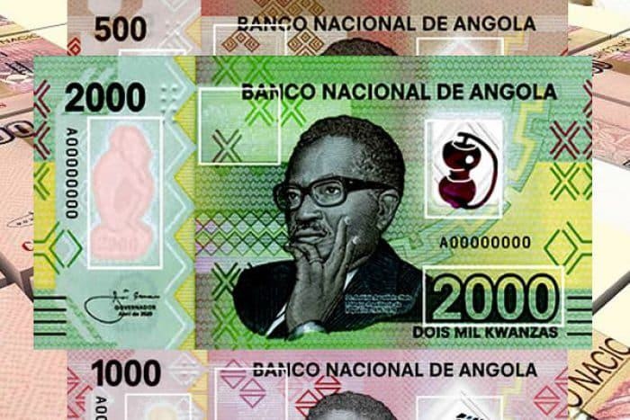

## Table of Contents

## What is the Angolan Novo Kwanza?

The Angolan Novo Kwanza is the official currency of Angola, a country in Africa. It is also called just Kwanza. The symbol for the Kwanza is Kz, and its international code is AOA. The Kwanza was first used in 1999 when it replaced the old Kwanza. This change happened because the old Kwanza had lost a lot of its value due to high inflation.

The Kwanza is divided into 100 smaller units called cêntimos. However, because of inflation, cêntimos are not used much anymore. The Banco Nacional de Angola, which is Angola's central bank, is in charge of the Kwanza. They make sure there is enough money in the country and that the currency stays stable. The value of the Kwanza can change compared to other currencies like the US dollar, and this can affect Angola's economy.

## When was the Angolan Novo Kwanza introduced?

The Angolan Novo Kwanza was introduced in 1999. It replaced the old Kwanza because the old one had lost a lot of its value due to high inflation. The new currency was meant to help make Angola's money more stable and easier to use.

The Banco Nacional de Angola, which is the country's central bank, is in charge of the Novo Kwanza. They make sure there is enough money in Angola and that the currency stays strong. The value of the Novo Kwanza can go up or down compared to other currencies like the US dollar, and this can affect Angola's economy.

## What is the symbol and ISO code for the Angolan Novo Kwanza?

The symbol for the Angolan Novo Kwanza is Kz. This symbol is used to show prices and amounts of money in Angola.

The ISO code for the Angolan Novo Kwanza is AOA. This code is used around the world to identify the currency in financial transactions and systems.

## How does the Angolan Novo Kwanza compare to its predecessor, the Kwanza?

The Angolan Novo Kwanza replaced the old Kwanza in 1999. The old Kwanza had lost a lot of its value because of high inflation. This made it hard for people to use and trust the old currency. The government decided to introduce the Novo Kwanza to make the money more stable and easier to use. When they changed to the new currency, they took away some zeros from the old amounts to make the numbers smaller and easier to work with.

The Novo Kwanza is managed by the Banco Nacional de Angola, which is Angola's central bank. They make sure there is enough money in the country and try to keep the currency's value steady. The new currency is divided into 100 cêntimos, but because of inflation, these smaller units are not used much anymore. The value of the Novo Kwanza can change compared to other currencies like the US dollar, which can affect Angola's economy. Overall, the Novo Kwanza was introduced to help fix the problems that the old Kwanza had.

## What are the denominations of the Angolan Novo Kwanza banknotes and coins?

The Angolan Novo Kwanza has banknotes in different amounts. These amounts are 200, 500, 1000, 2000, and 5000 Kwanzas. Each banknote has a different color and picture to help people tell them apart easily. The pictures on the banknotes show important people and places from Angola's history and culture.

The Angolan Novo Kwanza also has coins, but they are not used as much because of inflation. The coins come in amounts of 10, 20, 50, and 100 Kwanzas. These coins are made of metal and are smaller than the banknotes. Even though people do not use the coins a lot, they are still part of the currency.

## What is the current exchange rate of the Angolan Novo Kwanza to major currencies like the USD and EUR?

The exchange rate of the Angolan Novo Kwanza to the US Dollar (USD) changes often. As of now, 1 USD is about equal to 830 Kz. This means if you have 1 US Dollar, you can get around 830 Kwanzas. The exchange rate can go up or down because of things like Angola's economy, the price of oil, and what's happening in the world's money markets.

The exchange rate of the Angolan Novo Kwanza to the Euro (EUR) also changes. Right now, 1 EUR is about equal to 890 Kz. So, if you have 1 Euro, you can get around 890 Kwanzas. Just like with the USD, the rate between the Kwanza and the Euro can change because of Angola's economy and what's happening in Europe and around the world.

## How has the value of the Angolan Novo Kwanza changed over the past decade?

Over the past ten years, the value of the Angolan Novo Kwanza has gone down a lot compared to other big currencies like the US Dollar and the Euro. In 2013, 1 US Dollar was worth around 98 Kwanzas. But now, 1 US Dollar is worth about 830 Kwanzas. This big change happened because Angola's economy had some problems, like lower oil prices, which made the Kwanza weaker. When the price of oil, which Angola sells a lot of, goes down, the country earns less money, and this can make the Kwanza lose value.

The Angolan government and the central bank have tried different things to help the Kwanza stay stable. They changed the way they set the exchange rate to let it move more freely with the market, hoping this would help the currency. But the Kwanza still kept losing value. People in Angola felt this because things that are bought from other countries, like food and medicine, got more expensive. The government is still working to make the economy better and help the Kwanza become stronger, but it's a hard and slow process.

## What are the key factors influencing the value of the Angolan Novo Kwanza?

The value of the Angolan Novo Kwanza is influenced by many things, but the most important is the price of oil. Angola makes a lot of money from selling oil, so when the price of oil goes down, the country earns less. This can make the Kwanza lose value because Angola has less money to support its currency. Another big [factor](/wiki/factor-investing) is how much Angola needs to import things like food and medicine. If the Kwanza is weak, it costs more to buy these things from other countries, which can make life harder for people in Angola.

The government and the central bank also play a big role in the value of the Kwanza. They can change the exchange rate to make it move more freely with the market, hoping this will help the currency. But sometimes, even with these changes, the Kwanza can still lose value. The overall health of Angola's economy, including things like inflation and how much money people are spending, can also affect the Kwanza. If the economy is doing well, the Kwanza might get stronger, but if the economy is struggling, the Kwanza can become weaker.

## How does the Angolan government manage the Angolan Novo Kwanza's monetary policy?

The Angolan government, through the Banco Nacional de Angola, which is the country's central bank, manages the Angolan Novo Kwanza's monetary policy. They do this by controlling how much money is in the country and by setting the interest rates that banks charge each other. When the central bank changes these rates, it can make it cheaper or more expensive for banks to borrow money, which affects how much money is available for people and businesses to spend. If the central bank wants to slow down spending and fight inflation, they might raise interest rates to make borrowing more expensive. If they want to help the economy grow, they might lower interest rates to make borrowing cheaper.

The central bank also uses the exchange rate to manage the Kwanza's value. They can choose to let the Kwanza's value move more freely with the market or try to keep it stable by buying and selling foreign currency. In the past, Angola used a fixed exchange rate, but now they let the Kwanza's value change more freely. This can help the currency find its real value, but it can also make the Kwanza lose value quickly if the market thinks Angola's economy is doing badly. The government and the central bank keep a close eye on the economy, the price of oil, and inflation to make decisions about the Kwanza's monetary policy.

## What are the economic impacts of the Angolan Novo Kwanza's fluctuations on Angola's economy?

When the Angolan Novo Kwanza goes up and down a lot, it can make life harder for people in Angola. If the Kwanza loses value, things that Angola buys from other countries, like food and medicine, get more expensive. This is because Angola needs to use more Kwanzas to buy the same amount of foreign currency. People in Angola might find it harder to afford these things, which can make life tougher for them. Also, if the Kwanza is weak, businesses that need to import things to make their products might have to charge more, which can make everything more expensive and slow down the economy.

On the other hand, a weaker Kwanza can help Angola's businesses that sell things to other countries. When the Kwanza is weak, Angola's products become cheaper for people in other countries to buy. This can help these businesses sell more and make more money. But overall, a lot of ups and downs in the Kwanza's value can make it hard for businesses to plan and invest, which can slow down the economy. The government and the central bank try to manage the Kwanza's value to help the economy, but it's a hard job because many things, like the price of oil, can affect the Kwanza.

## How does the Angolan Novo Kwanza affect trade and investment in Angola?

The Angolan Novo Kwanza plays a big role in how Angola trades with other countries and how much money people want to invest there. When the Kwanza is weak, it makes Angola's products cheaper for people in other countries to buy. This can be good for Angola's businesses that sell things like oil and diamonds because they can sell more and make more money. But a weak Kwanza also makes it more expensive for Angola to buy things from other countries, like food and medicine. This can make life harder for people in Angola because they have to pay more for these important things.

The Kwanza's value can also affect how much money people want to invest in Angola. If the Kwanza is going up and down a lot, it can be risky for people to invest their money there. They might be worried that if the Kwanza loses value, they will lose money too. This can make it harder for Angola to get the money it needs to build new things and grow its economy. The government and the central bank try to keep the Kwanza stable to make it easier for businesses to plan and for people to invest, but it's a hard job because many things can affect the Kwanza's value.

## What are the future prospects and potential reforms for the Angolan Novo Kwanza?

The future of the Angolan Novo Kwanza depends a lot on Angola's economy and the price of oil. Angola wants to make its economy stronger by not relying so much on oil. They want to grow other parts of the economy like farming and making things. If they can do this, it might help the Kwanza become more stable. But it will take time and a lot of hard work. The government is also trying to keep inflation low, which is important for making the Kwanza stronger.

The Angolan government might also make some changes to help the Kwanza. They could make the rules about money easier so more people want to invest in Angola. They might also try to control how much money is in the country better to stop the Kwanza from going up and down too much. These changes could help make the Kwanza more stable and trusted. But it's a big challenge, and it will need the government to work hard and make good plans.

## References & Further Reading

[1]: [World Bank. (2022). Angola Overview.](https://www.worldbank.org/en/country/angola/overview)

[2]: [International Monetary Fund. (2023). Angola: Staff Concluding Statement of the 2023 Article IV Mission.](https://www.elibrary.imf.org/view/journals/002/2024/080/002.2024.issue-080-en.xml)

[3]: Bergstra, J., Bardenet, R., Bengio, Y., & Kégl, B. (2011). ["Algorithms for Hyper-Parameter Optimization."](https://dl.acm.org/doi/10.5555/2986459.2986743) Advances in Neural Information Processing Systems 24.

[4]: ["Advances in Financial Machine Learning"](https://www.amazon.com/Advances-Financial-Machine-Learning-Marcos/dp/1119482089) by Marcos Lopez de Prado

[5]: ["Evidence-Based Technical Analysis: Applying the Scientific Method and Statistical Inference to Trading Signals"](https://www.amazon.com/Evidence-Based-Technical-Analysis-Scientific-Statistical/dp/0470008741) by David Aronson

[6]: ["Machine Learning for Algorithmic Trading"](https://github.com/stefan-jansen/machine-learning-for-trading) by Stefan Jansen

[7]: ["Quantitative Trading: How to Build Your Own Algorithmic Trading Business"](https://www.amazon.com/Quantitative-Trading-Build-Algorithmic-Business/dp/1119800064) by Ernest P. Chan