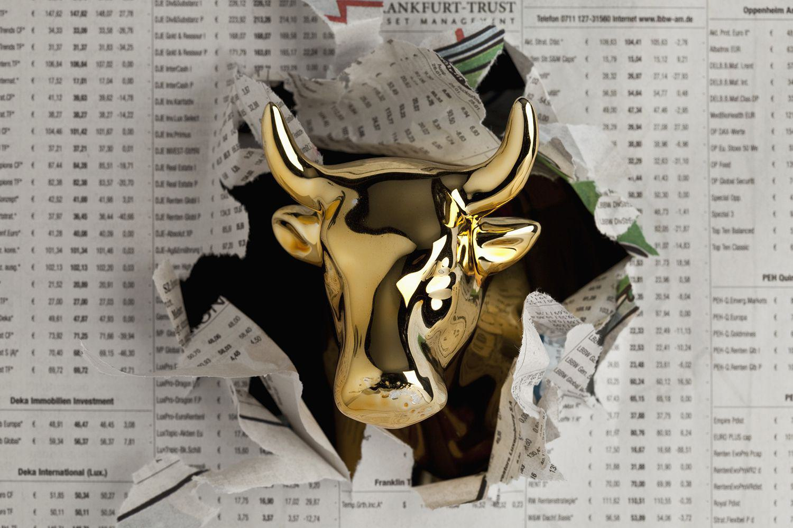

## Table of Contents

## What are animal spirits in finance?

Animal spirits in finance refer to the emotions and instincts that drive people's financial decisions. The term was first used by economist John Maynard Keynes to explain why people sometimes make choices that don't seem rational. These spirits can cause people to act impulsively, like buying stocks during a market bubble or selling them during a crash, even if it doesn't make sense logically.

These animal spirits can have a big impact on the economy. For example, if people feel confident and optimistic, they might spend more money and invest more, which can help the economy grow. But if they feel scared or pessimistic, they might save their money instead of spending it, which can slow down the economy. Understanding these emotions is important for economists and policymakers who want to predict and manage economic trends.

## Who coined the term 'animal spirits' and in what context?

John Maynard Keynes coined the term 'animal spirits' in his book "The General Theory of Employment, Interest, and Money," which he published in 1936. Keynes used the term to describe the human emotions and instincts that drive economic decisions, especially when people don't have all the information they need to make a fully rational choice.

Keynes believed that these animal spirits play a big role in how the economy works. He thought that people's feelings of optimism or pessimism could lead them to spend more or save more, which in turn affects economic growth. Understanding these emotions, Keynes argued, is crucial for managing the economy effectively.

## How do animal spirits influence economic behavior?

Animal spirits influence economic behavior by affecting how people feel about the economy and their future. When people feel hopeful and confident, they are more likely to spend money and invest in things like stocks or starting a business. This can lead to more jobs and growth in the economy. For example, if people believe the stock market will go up, they might buy more stocks, which can push the market even higher.

On the other hand, when people feel worried or scared, they might hold onto their money instead of spending it. They might also sell their investments to avoid losing money, which can make the economy slow down. For instance, during a financial crisis, people might panic and sell their stocks, causing the market to fall even more. So, animal spirits can create big changes in the economy based on how people feel, even if those feelings are not always based on facts.

## Can you provide examples of animal spirits affecting financial markets?

One big example of animal spirits affecting financial markets happened during the dot-com bubble in the late 1990s and early 2000s. People got really excited about new internet companies and started buying their stocks like crazy, even though many of these companies were not making any money yet. This excitement, or animal spirits, pushed stock prices way up. But when people realized that many of these companies were not going to be successful, they started selling their stocks, and the bubble burst. The stock market crashed, and a lot of people lost a lot of money.

Another example is the housing market crash in 2007-2008. Before the crash, people felt very confident about the housing market. They believed that home prices would keep going up, so they bought houses they couldn't really afford, thinking they could sell them later for a profit. Banks also felt this confidence and gave out a lot of risky loans. But when people started to realize that many couldn't pay back their loans, the housing market collapsed. This led to a big financial crisis that affected the whole world. In both cases, animal spirits drove people's decisions and had a huge impact on the markets.

## What is the relationship between animal spirits and economic bubbles?

Animal spirits are closely linked to economic bubbles. These bubbles happen when the prices of things like stocks or houses go way up because people get really excited and optimistic. They start buying a lot, thinking the prices will keep going up. This excitement is what we call animal spirits. It's like a wave of good feelings that makes people act without thinking too much about the risks. So, animal spirits can start a bubble by pushing prices higher and higher.

But when the bubble bursts, it's often because the animal spirits change. People start to feel worried or scared, and they begin selling what they bought. This can make prices fall really fast. The same feelings that helped create the bubble can also make it crash. So, animal spirits can both start and end economic bubbles. They show how much our feelings can affect the economy, even if those feelings aren't always based on facts.

## How do animal spirits impact investor psychology?

Animal spirits really change how investors think and act. When people feel good and hopeful, they might decide to buy more stocks or invest in new things. They think the market will keep going up, so they want to be part of it. This can make them take more risks because they feel confident. It's like when you're happy and you want to try new things without worrying too much.

But when people start to feel worried or scared, their feelings can make them do the opposite. They might sell their stocks quickly to avoid losing money, even if it means selling at a low price. This fear can make them very cautious and less likely to invest in anything new. So, animal spirits can make investors feel either very brave or very scared, and these feelings can lead to big changes in the market.

## What role do animal spirits play in business cycles?

Animal spirits help explain why the economy goes through ups and downs, called business cycles. When people feel good and hopeful, they spend more money and businesses do well. This makes the economy grow and can lead to a boom. During these times, people might start new businesses or buy more things because they think the good times will keep going. But these good feelings can sometimes make people act without thinking about the risks, which can lead to bubbles in the economy.

On the other hand, when people start to feel worried or scared, they might stop spending as much. They save their money instead of buying things, and businesses might not do as well. This can slow down the economy and even lead to a recession. The change in how people feel, from hopeful to worried, can make the economy go from growing to shrinking. So, animal spirits are a big part of why business cycles happen, showing how our feelings can affect the whole economy.

## How can policymakers account for animal spirits in economic planning?

Policymakers can account for animal spirits by paying attention to how people feel about the economy. They can use things like surveys to find out if people are feeling hopeful or worried. If people are feeling good, policymakers might not need to do much because the economy might be growing on its own. But if people are feeling scared, policymakers can try to boost confidence. They might lower interest rates to make it cheaper for people to borrow money, or they might spend more on things like building roads and schools to create jobs and make people feel better about the economy.

Understanding animal spirits also helps policymakers predict when the economy might be heading for a bubble or a crash. If they see that people are getting too excited and buying a lot, they might try to cool things down. They could raise interest rates to make borrowing more expensive, which can slow down spending. On the other hand, if they see that people are getting too scared and saving too much, they might try to calm people down by explaining what's happening and taking steps to help the economy. By keeping an eye on how people feel, policymakers can make better plans to keep the economy stable.

## What are the criticisms of the animal spirits theory in economics?

Some people don't like the animal spirits theory because they think it's too hard to measure. They say that feelings like hope and fear are inside people's heads, and it's tough to put numbers on them. These critics want to use hard data and facts to understand the economy, not just feelings. They worry that if we focus too much on animal spirits, we might miss other important things that affect the economy, like government policies or how much stuff we make.

Another criticism is that animal spirits can make the economy seem too unpredictable. If the economy goes up and down because of how people feel, it's hard to plan for the future. Some economists think this makes it harder to create good economic policies because they can't predict how people will feel next. They believe that if we rely too much on animal spirits, it might make it seem like the economy is just a big guessing game, and that doesn't help anyone plan or make smart decisions.

## How do animal spirits interact with rational expectations theory?

Animal spirits and rational expectations theory are two different ways to think about how people make choices in the economy. Rational expectations theory says that people use all the information they have to make smart decisions about things like buying stocks or spending money. They try to guess what will happen next based on facts and data. But animal spirits say that people don't always act this way. Sometimes, they let their feelings like hope or fear guide their choices, even if it doesn't seem logical. So, while rational expectations focus on thinking and planning, animal spirits focus on feelings and instincts.

These two ideas can work together to explain how the economy works. For example, people might use rational expectations to make plans, but then animal spirits can change how they feel about those plans. If people start to feel really hopeful, they might take more risks than they planned, and if they feel scared, they might hold back even if the facts say it's safe to move forward. So, animal spirits can add a layer of emotion to the rational choices people make, showing that both thinking and feeling play a part in how the economy moves.

## Can animal spirits be quantified or measured in financial models?

It's hard to put numbers on animal spirits because they are about how people feel, not hard facts. Feelings like hope and fear are inside people's heads, so it's tough to measure them the same way we measure things like how much money people make or how many cars they buy. But some people try to guess how people feel by asking them in surveys or looking at what they do, like how much they spend or how they vote. These guesses can help a little, but they're not as exact as numbers from a calculator.

Even though it's hard, some financial models try to include animal spirits by using things like how much people trust the economy or how happy they are. These models might use numbers from surveys to guess how people feel and then see how that might change what they do with their money. But because feelings can change quickly and are hard to pin down, these models are not perfect. They can give us a rough idea, but they can't tell us exactly how people will act because feelings are tricky and always moving.

## What are the latest research findings on the impact of animal spirits in modern financial markets?

Recent research has shown that animal spirits still play a big role in modern financial markets. One study found that social media can make animal spirits stronger. When people see others feeling excited or scared about the market on social media, they can start to feel the same way. This can make more people buy or sell stocks quickly, which can lead to big changes in the market. Another finding is that during times like the COVID-19 pandemic, animal spirits can make people act very differently. Fear about the future made many people sell their investments, even if it wasn't the best choice based on the facts.

Researchers are also looking at how animal spirits affect things like [cryptocurrency](/wiki/cryptocurrency) markets. These markets can be very up and down because they are new and people's feelings about them can change a lot. Studies have found that when people feel hopeful about cryptocurrencies, they might buy a lot and push the prices up. But if they start to feel scared, they might sell quickly and cause the prices to drop fast. Overall, these new findings show that understanding how people feel is still important for figuring out what might happen in financial markets.

## References & Further Reading

[1]: Keynes, J. M. (1936). ["The General Theory of Employment, Interest, and Money."](https://link.springer.com/book/10.1007/978-3-319-70344-2) Macmillan.

[2]: Akerlof, G. A., & Shiller, R. J. (2009). ["Animal Spirits: How Human Psychology Drives the Economy, and Why It Matters for Global Capitalism."](https://psycnet.apa.org/record/2009-01285-000) Princeton University Press.

[3]: Shiller, R. J. (2000). ["Irrational Exuberance."](https://archive.org/details/irrationalexuber00shil) Princeton University Press.

[4]: Thaler, R. H. (2015). ["Misbehaving: The Making of Behavioral Economics."](https://psycnet.apa.org/record/2015-22902-000) W. W. Norton & Company.

[5]: Barberis, N., & Thaler, R. (2003). ["A Survey of Behavioral Finance."](https://www.semanticscholar.org/paper/A-Survey-of-Behavioral-Finance-Barberis-Thaler/a4ab7d7161deac0f532d121b1614cf7b97d90e78) Handbook of the Economics of Finance, 1053-1128.

[6]: Kahneman, D. (2011). ["Thinking, Fast and Slow."](https://link.springer.com/article/10.1007/s00362-013-0533-y) Farrar, Straus and Giroux.