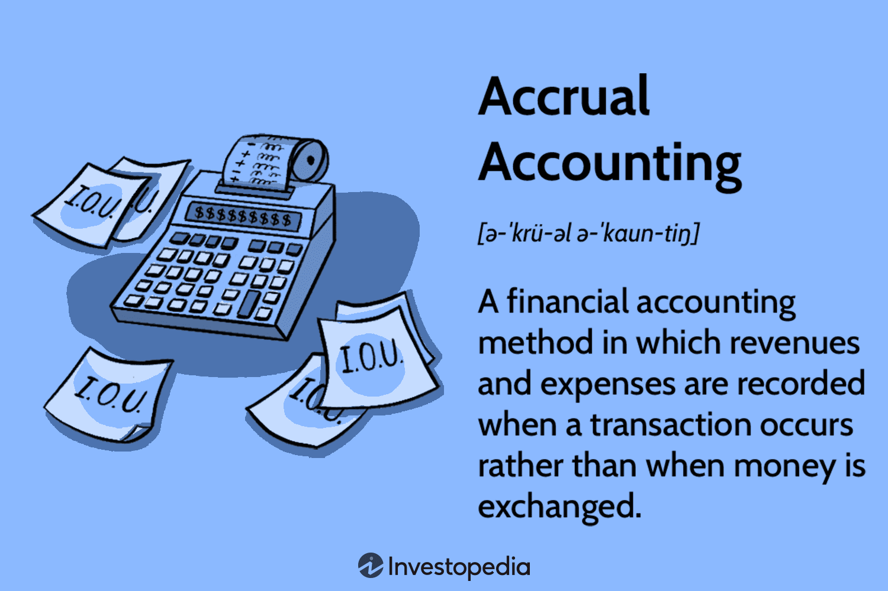

## Table of Contents

## What does 'annual basis' mean in simple terms?

When we say something happens on an 'annual basis,' it means it happens once every year. For example, if you have a meeting on an annual basis, you have that meeting once a year, like every January or every December.

This term is often used to talk about things that are regular and expected to happen yearly. It could be about paying bills, like an annual fee, or reviewing something, like an annual performance review at work. It helps people plan and remember when certain events or tasks need to happen.

## How is an annual basis different from other time frames like quarterly or monthly?

An annual basis means something happens once every year. It's like setting a reminder for the same time each year, such as celebrating a birthday or paying a yearly subscription. When you do something on an annual basis, you have a whole year to prepare or wait for it, which can be good for big events or long-term planning.

Quarterly and monthly are different because they happen more often. Quarterly means something happens four times a year, like every three months. For example, a business might have quarterly meetings to check on progress. Monthly means something happens every month, like paying a monthly bill or getting a monthly report. These shorter time frames help keep things more up-to-date and allow for more frequent check-ins or payments.

So, the main difference is how often things happen. Annual is once a year, quarterly is four times a year, and monthly is twelve times a year. Each one fits different needs, depending on how often you want to do something or how closely you need to keep track of it.

## Can you give examples of how the term 'annual basis' is used in everyday life?

In everyday life, people often talk about things they do on an annual basis. For example, many families have a tradition of going on a vacation once a year. They might plan a trip to the beach or the mountains every summer. This is something they look forward to and plan for all year long. Another common example is paying for things like car insurance or a gym membership. Some people choose to pay for these services once a year instead of every month. It helps them save a bit of money and not have to worry about monthly payments.

Also, at work, people might have an annual review with their boss. This is a meeting where they talk about what they did well over the past year and what they can do better. It happens once a year, usually around the same time, like in January or December. Schools also use the term 'annual basis' a lot. For instance, they might have an annual fundraising event where parents and students come together to raise money for new [books](/wiki/algo-trading-books) or sports equipment. These events are planned and happen once every year, helping everyone know when to expect them.

## What are the common applications of calculating on an annual basis in business?

In business, calculating on an annual basis is very important for planning and keeping track of things. One common use is for budgeting. Companies make a budget every year to plan how much money they will spend and earn. This helps them see the big picture and make sure they have enough money for the whole year. They might also look at their annual sales to see if they are making more or less money compared to last year. This helps them decide if they need to change their prices or find new ways to sell their products.

Another use is for performance reviews. Many businesses have annual performance reviews where they talk to their employees about how they did over the past year. This helps them see who is doing well and who might need more help or training. It also helps them decide on raises or promotions. Companies also use annual reports to share information with people who own part of the business, like shareholders. These reports show how the company did over the year and what they plan to do next. This helps everyone understand the business better and make good decisions.

## How do financial institutions use the concept of an annual basis in their operations?

Financial institutions use the concept of an annual basis a lot in their work. One big way they use it is for calculating interest on savings accounts or loans. If you have money in a savings account, the bank might pay you interest once a year. This is called an annual [interest rate](/wiki/interest-rate-trading-strategies). It helps you know how much extra money you will get at the end of the year. For loans, banks might charge interest on an annual basis too. This means you pay interest once a year, which helps you plan your payments and know how much you will owe.

Another way financial institutions use an annual basis is for reporting and planning. Banks and other financial companies have to make annual reports to show how they did over the year. These reports tell people who own part of the bank, like shareholders, how much money the bank made and what they plan to do next. This helps everyone understand the bank's health and make good decisions. Also, banks use annual planning to set goals for the next year, like how much they want to grow or what new services they want to offer. This helps them stay organized and work towards their big goals.

## What are the advantages of using an annual basis for budgeting and planning?

Using an annual basis for budgeting and planning helps businesses see the big picture. When you plan for a whole year, you can think about all the money you will need and all the money you expect to make. This helps you make sure you have enough money for everything, like paying employees, buying supplies, and other costs. It also lets you see if you are making more or less money compared to last year. This way, you can decide if you need to change your prices or find new ways to sell your products.

Another advantage is that planning on an annual basis helps everyone in the business know what to expect. When you set goals for the year, like how much you want to grow or what new services you want to offer, everyone can work together towards those goals. It also makes it easier to check how you are doing throughout the year. For example, you can see if you are on track to meet your goals or if you need to make changes. This helps keep everyone focused and working towards the same big goals.

## How does the concept of annual basis affect tax calculations and reporting?

The concept of an annual basis plays a big role in how taxes are calculated and reported. For individuals, this means looking at all the money you made and spent over the whole year to figure out how much tax you owe. You might get paid every week or every month, but when it comes to taxes, the government wants to see the total for the year. This helps them see if you made enough money to owe taxes or if you can get money back, like a tax refund. It also helps you plan better because you know what to expect at the end of the year.

For businesses, using an annual basis for taxes is important too. Companies have to report their income and expenses for the whole year to figure out their tax bill. This annual reporting helps them see if they made a profit or a loss and how much tax they need to pay. It also helps them plan for the next year because they can see how their taxes affected their money. By looking at the whole year, businesses can make better decisions about saving money or investing in new things.

## What are the challenges businesses face when switching to or from an annual basis system?

Switching to or from an annual basis system can be tough for businesses. One big challenge is changing how they keep track of money. If a business used to look at their money every month or every quarter, switching to an annual basis means they have to wait a whole year to see the big picture. This can make it hard to know if they are doing well or if they need to make changes sooner. Also, if they are used to paying bills or getting paid every month, changing to an annual system can mess up their cash flow. They might not have enough money to pay for things if they have to wait a whole year to get paid.

Another challenge is planning and setting goals. When a business uses an annual basis, they have to think about what they want to do for the whole year. This can be hard because a lot can change in a year. They might set goals that are too hard or too easy, and they won't know until the end of the year. On the other hand, if they switch from an annual basis to a shorter time frame, like monthly or quarterly, they have to get used to checking their progress more often. This can be a lot of work and might make them feel like they are always playing catch-up. Both ways, it takes time and effort to get used to the new system and make sure everything runs smoothly.

## How do annual basis calculations impact long-term investment strategies?

Annual basis calculations help people plan their long-term investments by giving them a clear picture of how their investments are doing over time. When you invest money, you want to know if you are making more money or losing money. By looking at your investments once a year, you can see if they are growing enough to meet your goals, like saving for retirement or buying a house. This helps you decide if you need to change your investments or keep them the same. It also helps you see how much money you might have in the future, which is important for making big plans.

Another way annual basis calculations affect long-term investment strategies is by helping you manage risk. Investing can be risky because the value of your investments can go up or down. By checking your investments every year, you can see if they are too risky or if you need to be more careful. For example, if your investments are losing a lot of money, you might decide to move your money to safer investments. On the other hand, if your investments are doing well, you might decide to take more risks to try to make even more money. This yearly check helps you stay on track and make smart choices about your money over the long term.

## In what ways can the use of an annual basis be optimized for better financial forecasting?

Using an annual basis for financial forecasting can be made better by looking at past years' data. When you see how your money did in the past, you can guess better what might happen next year. For example, if you see that your sales go up every summer, you can plan for that in your forecast. This helps you make a more accurate guess about how much money you will make or spend. Also, by breaking down the year into smaller parts, like quarters or months, you can see patterns and make your yearly forecast more detailed and useful.

Another way to make annual basis forecasting better is by using tools and software. These tools can help you put all your numbers together and see them in different ways. They can show you graphs and charts that make it easier to understand your money. This can help you spot trends or problems faster. Also, talking to experts or working with a financial advisor can help you use the annual basis better. They can give you tips and help you make a plan that fits your goals and needs.

## What are the international standards or variations in the application of an annual basis?

Different countries have their own ways of using an annual basis, but there are some common standards too. For example, many countries follow the International Financial Reporting Standards (IFRS) or the Generally Accepted Accounting Principles (GAAP) in the United States. These standards help businesses report their money in a way that everyone can understand. They say that businesses should look at their money once a year to see how they did and plan for the future. This helps make sure that businesses around the world are doing things in a similar way, which makes it easier to compare them.

Even though there are common standards, there can be differences in how countries use an annual basis. For example, the start and end of the financial year can be different. In the United States, the financial year usually starts on January 1 and ends on December 31. But in Australia, the financial year starts on July 1 and ends on June 30. These differences can affect how businesses plan and report their money. Also, some countries might have different rules about taxes or how often businesses need to report their money. So, while the idea of looking at money once a year is the same, the details can be different from one place to another.

## How do advanced statistical models incorporate the concept of an annual basis for predictive analytics?

Advanced statistical models use the concept of an annual basis to make predictions about the future. They look at data from past years to find patterns and trends. For example, if a model is trying to predict how much money a business will make next year, it will look at how much money the business made in past years. By seeing how things changed from one year to the next, the model can guess what might happen in the future. This helps businesses plan better because they can see what to expect and make decisions based on that.

These models can also use other information, like what's happening in the economy or changes in the market, to make their predictions more accurate. They might look at things like interest rates, inflation, or even the weather to see how these things affect the business's money. By putting all this information together and looking at it on an annual basis, the models can give a good idea of what might happen next year. This helps businesses and people make smart choices about their money and plan for the future.

## What is meant by "Annual Basis" in financial terminology?

The annual basis serves as a crucial pillar in financial analysis, encapsulating the idea of evaluating or calculating economic parameters over the span of one year. This concept forms the bedrock of various financial activities, including the projection of salaries, assessment of investment returns, and estimation of operational costs.

In salary calculations, the annual basis represents the total remuneration an employee receives over a year. This annual salary is often broken down into monthly or bi-weekly payments but is usually negotiated and evaluated based on its yearly total. For example, if an individual earns $60,000 annually, their monthly salary would typically be calculated as $60,000 divided by 12, resulting in $5,000 per month. This annual calculation aids employers and employees in understanding compensation packages comprehensively and facilitates budgeting.

When assessing investment returns, the annual basis provides a standardized metric to evaluate and compare performance. Investors often encounter terms like "annualized return," which refers to the geometric average amount of money earned by an investment each year over a given time period. The formula to calculate the annualized return is:

$$

\text{Annualized Return} = \left( \frac{\text{Ending Value}}{\text{Beginning Value}} \right)^{\frac{1}{n}} - 1 
$$

where $n$ is the number of years the investment is held. This calculation allows investors to assess the performance of different investments on a level playing field, regardless of the duration for which they were held.

In cost estimations, the annual basis facilitates the prediction of expenses over a year, providing a framework for long-term financial planning. Businesses use this approach to forecast yearly expenses like utilities, rent, and staff salaries. For instance, if a company anticipates monthly utility costs of $1,000, the annual cost would be $12,000. This projection aids in budget preparation and financial decision-making, ensuring that sufficient resources are allocated to meet future obligations.

By employing the annual basis in financial planning, individuals and organizations can make informed decisions, aligning their economic activities with their long-term financial goals. This approach not only helps in evaluating current financial status but also fortifies future financial stability by allowing stakeholders to anticipate and plan for upcoming fiscal needs.

## What is the Role of Annual Basis in Algo Trading?

Understanding the annual basis in [algorithmic trading](/wiki/algorithmic-trading) is vital for optimizing returns and evaluating performance metrics. Annual basis refers to the use of annualized figures for assessing investment strategies, providing a consistent timeframe for comparison. 

Algorithmic trading systems often rely on the concept of annualized returns to gauge the effectiveness of implemented strategies. For instance, a trading algorithm aiming for a 12% annual return needs to adjust its execution strategy to meet this target, accounting for varying market conditions. Here's a simple formula for annualized returns:

$$
\text{Annualized Return} = \left( (1 + \text{Total Return})^{\frac{1}{n}} \right) - 1
$$

Where $\text{Total Return}$ is the overall profit or loss over the period, and $n$ is the number of years.

Algorithms are designed to optimize annual returns by adjusting parameters such as trade entry and [exit](/wiki/exit-strategy) points, position sizing, and risk management rules. For instance, a [machine learning](/wiki/machine-learning)-based algorithm might analyze historical market data to predict future price movements, adjusting its strategy in real-time to improve annualized outcomes.

Challenges arise when applying annual basis calculations due to the volatile nature of financial markets. Market conditions fluctuate, potentially causing deviations from expected returns. Algorithms must be adaptive, incorporating recalibration processes to fine-tune strategies in response to market shifts. Additionally, ensuring accurate data inputs is crucial; otherwise, projections based on erroneous data could lead to suboptimal decisions.

To address these challenges, traders often employ robust [backtesting](/wiki/backtesting) frameworks. These frameworks simulate various market scenarios, allowing traders to adjust algorithms before deploying them in live markets. Regular monitoring and updating of algorithms are necessary to maintain alignment with targets based on annualized metrics, ensuring they accurately reflect current market trends. 

By leveraging annual basis concepts effectively, algorithmic trading can provide more precise, consistent, and efficient financial outcomes. Understanding and overcoming the inherent challenges is essential for optimizing these algorithmic systems, ensuring they meet financial goals within the dynamic trading environment.

## What are Practical Examples of Annual Basis in Algo Trading?

Algorithmic trading incorporates annual basis calculations to enhance investment horizon clarity and manage return expectations effectively. Understanding and applying these calculations is crucial for developing robust trading strategies, particularly in high-frequency trading ([HFT](/wiki/high-frequency-trading-strategies)) and predictive financial modeling.

### Case Study: High-Frequency Trading Strategies

In high-frequency trading, where thousands of trades may occur in a single second, annual performance reviews are indispensable for assessing strategy effectiveness. By analyzing annualized returns, traders can gauge the overall profitability and efficiency of their strategies. For instance, a trading algorithm might execute trades frequently throughout the year, capturing small price differentials. To assess its annual performance, the algorithm's net returns are annualized using the formula:

$$
\text{Annualized Return} = \left( \left( \frac{\text{Ending Value}}{\text{Beginning Value}} \right)^{\frac{1}{N}} - 1 \right) \times 100
$$

where $N$ is the number of years. This calculation helps in comparing returns with benchmark indices or other investment vehicles on a standard time scale.

```python
def calculate_annualized_return(beginning_value, ending_value, years):
    return ((ending_value / beginning_value) ** (1 / years) - 1) * 100

# Example usage
beginning_value = 100000
ending_value = 120000
years = 1
annualized_return = calculate_annualized_return(beginning_value, ending_value, years)
print(f"Annualized Return: {annualized_return:.2f}%")
```

### Historical Data for Future Annual Return Predictions

Another practical example is using historical data to predict future annual returns, aiding in strategic planning. Algorithmic models might analyze historical return data to project annual performance. For example, a predictive algorithm may utilize a machine learning model that takes historical price and [volume](/wiki/volume-trading-strategy) data as input to forecast future returns. Such models can incorporate [volatility](/wiki/volatility-trading-strategies) factors, economic indicators, and past performance metrics to refine predictions.

Consider a simplified model using linear regression to predict next year's returns based on past data. Here, historical returns can be fed into the model to generate projections:

```python
from sklearn.linear_model import LinearRegression
import numpy as np

# Sample historical data
years = np.array([1, 2, 3, 4, 5]).reshape(-1, 1)
returns = np.array([5, 7, 6, 8, 7])

# Linear regression model
model = LinearRegression()
model.fit(years, returns)

# Predicting next year's return
next_year = np.array([[6]])
predicted_return = model.predict(next_year)
print(f"Predicted Return for Next Year: {predicted_return[0]:.2f}%")
```

### Practical Implications

Integrating annual basis calculations in algorithmic trading delivers significant benefits, such as refined investment horizon assessments and realistic return expectations. This understanding aids in formulating strategy adjustments to improve profitability and risk management. Moreover, it assists investors in aligning trading strategies with broader financial objectives and market outlooks. Recognizing these applications enhances one's ability to navigate financial markets effectively and adapt to changes in trading dynamics.

## References & Further Reading

[1]: ["The Basics of Algorithmic Trading: Concepts and Examples"](https://www.investopedia.com/articles/active-trading/101014/basics-algorithmic-trading-concepts-and-examples.asp) by Chris Gallant, Investopedia.

[2]: Chan, E. (2009). ["Quantitative Trading: How to Build Your Own Algorithmic Trading Business."](https://github.com/ftvision/quant_trading_echan_book) John Wiley & Sons.

[3]: Lopez de Prado, M. (2018). ["Advances in Financial Machine Learning."](https://www.amazon.com/Advances-Financial-Machine-Learning-Marcos/dp/1119482089) John Wiley & Sons.

[4]: Jansen, S. (2020). ["Machine Learning for Algorithmic Trading."](https://github.com/stefan-jansen/machine-learning-for-trading) Packt Publishing.

[5]: Aronson, D. R. (2006). ["Evidence-Based Technical Analysis: Applying the Scientific Method and Statistical Inference to Trading Signals."](https://www.amazon.com/Evidence-Based-Technical-Analysis-Scientific-Statistical/dp/0470008741) Wiley.

[6]: Nuti, G., Mirghaemi, M., Treleaven, P., & Yingsaeree, C. (2011). ["Algorithmic trading."](https://www.semanticscholar.org/paper/Algorithmic-Trading-Nuti-Mirghaemi/dec841dd0f1fce55ba930b26f3fb945e330dfcbb) Computer, 44(11), 61-69.