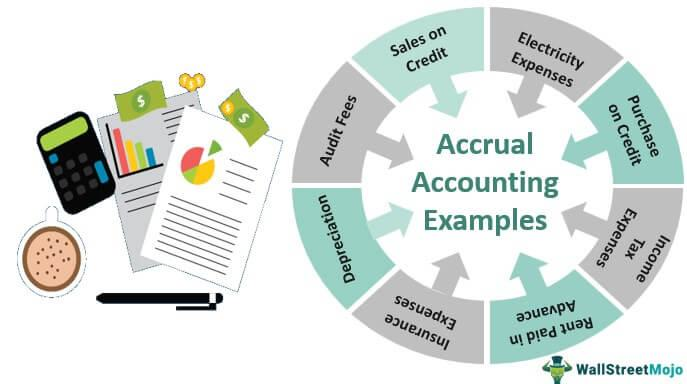

In today's rapidly evolving financial landscape, understanding the confluence of traditional financial terminology with cutting-edge technologies is crucial for investors seeking to optimize their portfolios. Key terms such as 'annual basis' and 'algorithmic trading' stand out as essential concepts that not only underpin financial strategies but also elevate them in the context of modern financial markets.

The term 'annual basis' serves as a bedrock in finance, offering a standardized framework for evaluating returns, costs, and budgets over a calendar year. This concept allows investors to make informed comparisons and projections, facilitating better decision-making and strategic planning. For instance, calculating investment returns on an annual basis provides a clear perspective on performance, making it easier to set benchmarks and expectations.



On the technology front, algorithmic trading, often abbreviated as algo trading, represents a paradigm shift in how trades are executed. By leveraging sophisticated computer algorithms, traders can execute orders with high speed and precision, enabling them to exploit market opportunities far beyond the reach of traditional manual trading methods. This advancement is not only revolutionizing how trades are conducted but also transforming the strategic approach toward achieving financial goals.

The purpose of this article is to unravel these key financial terms by using practical examples to enhance understanding. Readers will explore how the annual basis figure prominently in investment returns, shaping the way investors assess and strategize their portfolios over time. Concurrently, the article will highlight how algorithmic trading impacts modern markets by showcasing real-world applications and benefits, among them improved speed, accuracy, and the ability to execute complex trading strategies.

By the end of this exploration, readers will gain valuable insights into how the integration of these concepts can significantly affect real-world financial strategies. Attention will be given to the application of the annual basis in investment scenarios and the role of algorithmic trading in achieving efficient market participation and optimized returns. This foundational knowledge serves as a gateway to mastering the essentials of finance and technology, providing a robust framework for developing strategies aligned with long-term financial objectives.

## Table of Contents

## Understanding Financial Terminology: Annual Basis

The annual basis serves as a crucial pillar in financial analysis, encapsulating the idea of evaluating or calculating economic parameters over the span of one year. This concept forms the bedrock of various financial activities, including the projection of salaries, assessment of investment returns, and estimation of operational costs.

In salary calculations, the annual basis represents the total remuneration an employee receives over a year. This annual salary is often broken down into monthly or bi-weekly payments but is usually negotiated and evaluated based on its yearly total. For example, if an individual earns $60,000 annually, their monthly salary would typically be calculated as $60,000 divided by 12, resulting in $5,000 per month. This annual calculation aids employers and employees in understanding compensation packages comprehensively and facilitates budgeting.

When assessing investment returns, the annual basis provides a standardized metric to evaluate and compare performance. Investors often encounter terms like "annualized return," which refers to the geometric average amount of money earned by an investment each year over a given time period. The formula to calculate the annualized return is:

$$

\text{Annualized Return} = \left( \frac{\text{Ending Value}}{\text{Beginning Value}} \right)^{\frac{1}{n}} - 1 
$$

where $n$ is the number of years the investment is held. This calculation allows investors to assess the performance of different investments on a level playing field, regardless of the duration for which they were held.

In cost estimations, the annual basis facilitates the prediction of expenses over a year, providing a framework for long-term financial planning. Businesses use this approach to forecast yearly expenses like utilities, rent, and staff salaries. For instance, if a company anticipates monthly utility costs of $1,000, the annual cost would be $12,000. This projection aids in budget preparation and financial decision-making, ensuring that sufficient resources are allocated to meet future obligations.

By employing the annual basis in financial planning, individuals and organizations can make informed decisions, aligning their economic activities with their long-term financial goals. This approach not only helps in evaluating current financial status but also fortifies future financial stability by allowing stakeholders to anticipate and plan for upcoming fiscal needs.

## Algorithmic Trading: A Revolution in Finance

Algorithmic trading, often referred to as algo trading, represents a transformative progression in the financial markets by employing computer algorithms to automate trading processes. This technique leverages advanced mathematical models and rapid computational capabilities to execute trades at speeds and frequencies impossible for human traders. The integration of algorithms in trading platforms has allowed for enhanced precision and sophistication in managing financial assets.

**Mechanics of Algorithmic Trading**

At its core, [algorithmic trading](/wiki/algorithmic-trading) involves a set of prespecified rules or instructions that govern the trading process. These algorithms analyze market data, identify trading opportunities, and execute buy or sell orders based on predefined criteria, which can include price levels, timing, quantity, or any other quantitative metric. The algorithms utilize historical and real-time data inputs to make swift decisions, often performing trades in fractions of a second.

The process can be broken down into several key components:

1. **Data Analysis**: Algorithms ingest large volumes of data to identify patterns or trends. This data may include historical prices, economic indicators, financial reports, and even news sentiments.

2. **Strategy Development**: Traders design algorithms based on specific trading strategies, which can range from simple moving averages to complex arbitrage strategies. These strategies dictate the entry and exit points for trades.

3. **Execution**: Once the algorithm identifies a trading opportunity, it executes orders seamlessly across various markets and instruments. Algorithms can split large orders into smaller ones to minimize market impact and manage risk.

4. **Monitoring and Adjustment**: Continuous monitoring is essential, as algorithms may need to adjust to changing market conditions. This involves real-time tracking of performance metrics and recalibration of strategies.

**Benefits of Algorithmic Trading**

1. **Speed**: Algorithms execute trades at lightning speed, capitalizing quickly on opportunities and responding immediately to market changes. This significantly reduces the time lag associated with manual trading.

2. **Accuracy**: By eliminating the influence of human emotions, algorithmic trading enhances precision in decision-making, reducing errors caused by psychological biases.

3. **Complex Strategy Execution**: Algorithms can simultaneously evaluate multiple indicators and market conditions to implement sophisticated trading strategies that would be arduous for human traders to manage manually.

4. **Cost Efficiency**: Automation reduces transaction costs by minimizing manual intervention and improving the efficiency of order executions.

**Algorithmic Trading for Institutional and Individual Investors**

Institutional investors, such as hedge funds and investment banks, have extensively adopted algorithmic trading due to its ability to handle large trade volumes and execute complex strategies efficiently. These entities benefit from advanced infrastructure and data analysis capabilities, enabling them to execute high-frequency trading, statistical [arbitrage](/wiki/arbitrage), and other sophisticated strategies.

Individual investors are also gaining access to algorithmic trading through retail platforms and third-party services that offer algorithmic trading tools. While the scale and complexity may be smaller compared to institutions, individual traders can leverage simple algorithms for tasks such as rebalancing portfolios, order management, and risk management.

In summary, algorithmic trading has revolutionized the financial markets by introducing high-speed execution and enhanced accuracy, enabling both institutional and individual investors to optimize their trading strategies and augment returns. As technology continues to evolve, the role of algorithms in trading is poised to expand further, driving innovation in financial markets.

## The Role of Annual Basis in Algo Trading

Understanding the annual basis in algorithmic trading is vital for optimizing returns and evaluating performance metrics. Annual basis refers to the use of annualized figures for assessing investment strategies, providing a consistent timeframe for comparison. 

Algorithmic trading systems often rely on the concept of annualized returns to gauge the effectiveness of implemented strategies. For instance, a trading algorithm aiming for a 12% annual return needs to adjust its execution strategy to meet this target, accounting for varying market conditions. Here's a simple formula for annualized returns:

$$
\text{Annualized Return} = \left( (1 + \text{Total Return})^{\frac{1}{n}} \right) - 1
$$

Where $\text{Total Return}$ is the overall profit or loss over the period, and $n$ is the number of years.

Algorithms are designed to optimize annual returns by adjusting parameters such as trade entry and [exit](/wiki/exit-strategy) points, position sizing, and risk management rules. For instance, a [machine learning](/wiki/machine-learning)-based algorithm might analyze historical market data to predict future price movements, adjusting its strategy in real-time to improve annualized outcomes.

Challenges arise when applying annual basis calculations due to the volatile nature of financial markets. Market conditions fluctuate, potentially causing deviations from expected returns. Algorithms must be adaptive, incorporating recalibration processes to fine-tune strategies in response to market shifts. Additionally, ensuring accurate data inputs is crucial; otherwise, projections based on erroneous data could lead to suboptimal decisions.

To address these challenges, traders often employ robust [backtesting](/wiki/backtesting) frameworks. These frameworks simulate various market scenarios, allowing traders to adjust algorithms before deploying them in live markets. Regular monitoring and updating of algorithms are necessary to maintain alignment with targets based on annualized metrics, ensuring they accurately reflect current market trends. 

By leveraging annual basis concepts effectively, algorithmic trading can provide more precise, consistent, and efficient financial outcomes. Understanding and overcoming the inherent challenges is essential for optimizing these algorithmic systems, ensuring they meet financial goals within the dynamic trading environment.

## Practical Examples of Annual Basis in Algo Trading

Algorithmic trading incorporates annual basis calculations to enhance investment horizon clarity and manage return expectations effectively. Understanding and applying these calculations is crucial for developing robust trading strategies, particularly in high-frequency trading ([HFT](/wiki/high-frequency-trading-strategies)) and predictive financial modeling.

### Case Study: High-Frequency Trading Strategies

In high-frequency trading, where thousands of trades may occur in a single second, annual performance reviews are indispensable for assessing strategy effectiveness. By analyzing annualized returns, traders can gauge the overall profitability and efficiency of their strategies. For instance, a trading algorithm might execute trades frequently throughout the year, capturing small price differentials. To assess its annual performance, the algorithm's net returns are annualized using the formula:

$$
\text{Annualized Return} = \left( \left( \frac{\text{Ending Value}}{\text{Beginning Value}} \right)^{\frac{1}{N}} - 1 \right) \times 100
$$

where $N$ is the number of years. This calculation helps in comparing returns with benchmark indices or other investment vehicles on a standard time scale.

```python
def calculate_annualized_return(beginning_value, ending_value, years):
    return ((ending_value / beginning_value) ** (1 / years) - 1) * 100

# Example usage
beginning_value = 100000
ending_value = 120000
years = 1
annualized_return = calculate_annualized_return(beginning_value, ending_value, years)
print(f"Annualized Return: {annualized_return:.2f}%")
```

### Historical Data for Future Annual Return Predictions

Another practical example is using historical data to predict future annual returns, aiding in strategic planning. Algorithmic models might analyze historical return data to project annual performance. For example, a predictive algorithm may utilize a machine learning model that takes historical price and [volume](/wiki/volume-trading-strategy) data as input to forecast future returns. Such models can incorporate [volatility](/wiki/volatility-trading-strategies) factors, economic indicators, and past performance metrics to refine predictions.

Consider a simplified model using linear regression to predict next year's returns based on past data. Here, historical returns can be fed into the model to generate projections:

```python
from sklearn.linear_model import LinearRegression
import numpy as np

# Sample historical data
years = np.array([1, 2, 3, 4, 5]).reshape(-1, 1)
returns = np.array([5, 7, 6, 8, 7])

# Linear regression model
model = LinearRegression()
model.fit(years, returns)

# Predicting next year's return
next_year = np.array([[6]])
predicted_return = model.predict(next_year)
print(f"Predicted Return for Next Year: {predicted_return[0]:.2f}%")
```

### Practical Implications

Integrating annual basis calculations in algorithmic trading delivers significant benefits, such as refined investment horizon assessments and realistic return expectations. This understanding aids in formulating strategy adjustments to improve profitability and risk management. Moreover, it assists investors in aligning trading strategies with broader financial objectives and market outlooks. Recognizing these applications enhances one's ability to navigate financial markets effectively and adapt to changes in trading dynamics.

## Advantages and Challenges

Combining annual basis metrics with algorithmic trading presents several advantages that enhance both financial forecasting and trading execution. One of the primary benefits is the increased accuracy in predicting investment returns. By using an annual basis, investors can interpret financial data over consistent time intervals, allowing for more reliable extrapolation of trends and the assessment of long-term performance. This approach is particularly beneficial in algorithmic trading, where precise data analysis drives automated decision-making processes.

Efficiency in trading execution is another significant advantage provided by the integration of annual basis metrics. Algorithms can be programmed to adjust trading strategies based on yearly performance indicators and historical data, optimizing the timing and scale of trades. This adaptation ensures that trading systems remain aligned with long-term financial goals, thus reducing the likelihood of impulsive decision-making prompted by short-term market fluctuations.

However, several challenges arise when integrating annual basis metrics with algo trading. One major challenge is the technical barrier associated with developing and maintaining sophisticated algorithms capable of processing and analyzing massive datasets. As financial markets evolve rapidly, it is vital to ensure that algorithms are regularly updated to incorporate the latest data and trends. This necessitates a robust data management infrastructure and continuous refinement of algorithmic models.

Market volatility presents another obstacle, as it can distort annual return projections and lead to misleading forecasts. Sudden market shifts may render historical data less relevant, prompting a need for algorithms that can dynamically adjust risk parameters and investment strategies. To mitigate the effects of volatility, investors must develop algorithms capable of adapting to complex market environments without compromising long-term objectives.

To overcome these challenges and optimize strategies for better financial outcomes, investors should focus on maintaining accurate and comprehensive data inputs to feed their algorithms. Regular audits and performance reviews of trading algorithms are crucial to ensure efficacy and alignment with market conditions. Employing advanced data analytics, including machine learning techniques, can enhance pattern recognition and predictive accuracy, facilitating more informed trading decisions.

Incorporating these strategies enables investors to harness the full potential of annual basis metrics within algorithmic trading, promoting more resilient and profitable financial strategies.

## Conclusion

Mastering financial terms such as "annual basis" and the methodologies of "algorithmic trading" is crucial for making informed financial decisions. An understanding of these concepts empowers investors to design strategies that effectively manage risks and optimize returns over investment horizons. The annual basis provides a clear framework for evaluating growth, returns, and cost implications over the [course](/wiki/best-algorithmic-trading-courses) of a year, which is essential for long-term financial planning. This ensures that investors can accurately assess the performance and viability of their investments.

On the other hand, algorithmic trading offers enhanced precision and speed, enabling trades based on thoroughly analyzed market data. The fusion of these modern techniques with traditional financial principles such as the annual basis can lead to more efficient and successful investment strategies. For instance, an algorithm can be programmed in Python to calculate the annualized return of a portfolio, using historical price data to predict future trends:

```python
def annualized_return(total_return, years):
    return (1 + total_return) ** (1 / years) - 1

total_return = 0.25  # e.g., 25% total return
years = 3
annual_return = annualized_return(total_return, years)
print(f"The annualized return is {annual_return:.2%}")
```

Here, the code calculates an annualized return based on a 25% total return over three years, showcasing how quantitative methods enhance traditional financial calculations.

As trading technologies continue to evolve, they underscore the necessity of continuous learning and adaptation in the ever-changing financial landscape. Staying updated with the latest advancements ensures that investors can effectively leverage tools like algorithmic trading to maintain a competitive edge. This adaptation not only secures a deeper understanding of the financial markets but also prepares investors to swiftly respond to market dynamics, paving the way for achieving their long-term financial goals. The interplay between technological advancements and fundamental financial concepts will undoubtedly continue to shape the future of investment strategies.

## References & Further Reading

[1]: ["The Basics of Algorithmic Trading: Concepts and Examples"](https://www.investopedia.com/articles/active-trading/101014/basics-algorithmic-trading-concepts-and-examples.asp) by Chris Gallant, Investopedia.

[2]: Chan, E. (2009). ["Quantitative Trading: How to Build Your Own Algorithmic Trading Business."](https://github.com/ftvision/quant_trading_echan_book) John Wiley & Sons.

[3]: Lopez de Prado, M. (2018). ["Advances in Financial Machine Learning."](https://www.amazon.com/Advances-Financial-Machine-Learning-Marcos/dp/1119482089) John Wiley & Sons.

[4]: Jansen, S. (2020). ["Machine Learning for Algorithmic Trading."](https://github.com/stefan-jansen/machine-learning-for-trading) Packt Publishing.

[5]: Aronson, D. R. (2006). ["Evidence-Based Technical Analysis: Applying the Scientific Method and Statistical Inference to Trading Signals."](https://www.amazon.com/Evidence-Based-Technical-Analysis-Scientific-Statistical/dp/0470008741) Wiley.

[6]: Nuti, G., Mirghaemi, M., Treleaven, P., & Yingsaeree, C. (2011). ["Algorithmic trading."](https://www.semanticscholar.org/paper/Algorithmic-Trading-Nuti-Mirghaemi/dec841dd0f1fce55ba930b26f3fb945e330dfcbb) Computer, 44(11), 61-69.