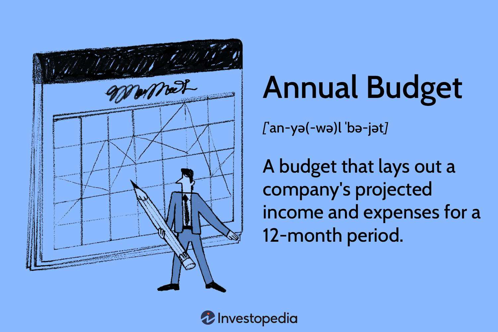

In today's rapidly evolving financial landscape, algorithmic trading stands as a pivotal force, dictating the need for meticulous budget management among engaged entities. The integration of advanced algorithms within trading strategies has transformed traditional financial operations, making effective budget allocation essential to sustaining competitive edges. This article examines the intricacies involved in managing budgets effectively, particularly focusing on the usage, annual budgeting processes, and development within the algorithmic trading milieu.

Algorithmic trading has necessitated significant changes in financial strategies. The reliance on computational power, software development, data acquisition, and system maintenance demands a restructured budget framework tailored to technological advancements. Institutions must align their budget usage with these technological imperatives to ensure efficient trading operations and maintain market relevance.



Moreover, understanding how algorithmic trading alters financial strategies is crucial. It requires enhanced budgeting frameworks that can accommodate the rapid changes and demands of automated trading systems. This context emphasizes the integration of sophisticated risk assessment tools and adaptive financial planning to contend with market volatility and compliance challenges.

This article will provide insights into how these elements interact to shape the financial strategies of entities employing algorithmic trading, highlighting the pressing need for enhanced budgeting methods capable of supporting such complex and data-driven trading environments.

## Table of Contents

## Understanding Budget Usage in Algorithmic Trading

Algorithmic trading depends heavily on high-frequency, high-speed data processing and intricate algorithms. This reliance demands consideration of budget usage to effectively support trading operations. A significant portion of budgets in algorithmic trading is allocated to the development and maintenance of these technological resources. In particular, investment in software development is critical. This includes acquiring and maintaining proprietary trading algorithms and platforms which need regular updates to respond to market changes. 

Moreover, the acquisition of market data forms a substantial part of the budget. Real-time data feeds are essential for effective algorithmic trading, as algorithms require accurate and up-to-date information to execute profitable trades. Market data subscriptions, especially those offering low-latency real-time feeds, are thus a considerable expense. 

System maintenance is another crucial financial consideration. High-frequency trading systems require ongoing maintenance to ensure optimal performance and minimal downtime. This may involve regular hardware upgrades to keep pace with technological advancements and reducing latency. 

Budget allocation should be strategically aligned with technological advancements to support efficient operations. This involves anticipating necessary investments in emerging technologies, which could provide competitive advantages in a rapidly evolving financial landscape. Overall, careful consideration of these budget components is essential for success in [algorithmic trading](/wiki/algorithmic-trading).

## The Components of an Annual Budget: Key Considerations

An annual budget serves as a foundational financial plan for any organization, delineating the expected revenues and expenditures for the forthcoming fiscal year. In the context of algorithmic trading, the construction of an annual budget involves a detailed understanding of both predictable and unforeseen financial variables, ensuring strategic alignment with technological and market demands.

One of the primary considerations for an annual budget in algorithmic trading is the allocation for hardware upgrades. As algorithmic trading relies heavily on cutting-edge technology for speed and efficiency, it is essential to consistently invest in the latest hardware to maintain competitive advantage. This includes high-performance servers, low-latency network infrastructure, and advanced computing resources capable of handling complex algorithms and large datasets.

Compliance costs are another critical component. The algorithmic trading sector is subject to rigorous regulatory scrutiny, which necessitates considerable expenditure to ensure adherence to legal mandates. Budgeting for compliance involves allocating funds for regular audits, legal consultations, and the implementation of systems that can automatically manage and report compliance metrics, thereby mitigating the risk of regulatory infringements.

Market data subscriptions form a significant part of the budgetary considerations and typically represent a substantial ongoing cost. Access to real-time and historical market data is indispensable for developing and testing trading algorithms. Organizations must strategically select data providers that offer the breadth and depth of information required while also negotiating favorable terms to optimize costs.

The budgeting process must also focus on setting realistic financial projections. This begins with a thorough analysis of historical financial data and market trends to forecast revenues and expenses accurately. Leveraging predictive analytics can enhance the precision of these forecasts, allowing for the anticipation of market fluctuations and cost trajectories. Organizations may employ tools like Python for data analysis and modeling, as illustrated below:

```python
import pandas as pd
import numpy as np
from statsmodels.tsa.arima_model import ARIMA

# Load historical financial data
data = pd.read_csv('historical_financial_data.csv')
data.set_index('Date', inplace=True)

# Define ARIMA model
model = ARIMA(data['Revenue'], order=(1, 1, 1))
model_fit = model.fit(disp=0)

# Forecast future revenues
forecast = model_fit.forecast(steps=12)
predicted_revenue = forecast[0]

# Print predicted revenues
print("Predicted Revenue for Next 12 Months: ", predicted_revenue)
```

This approach allows for the identification of potential cost-saving opportunities and helps in crafting budgets that are flexible enough to adapt to emerging market conditions.

In conclusion, by meticulously accounting for these key considerations, an organization in the algorithmic trading sphere can develop an annual budget that not only supports its strategic trading initiatives but also positions it to respond effectively to evolving external pressures.

## Budget Development Strategies in Algorithmic Trading

Effective budget development in algorithmic trading starts with a detailed examination of historical financial data and prevailing market trends. This approach is essential for building a solid financial foundation that aligns with the rapid and dynamic nature of algorithmic trading.

Analyzing past financial data allows organizations to understand spending patterns, which is crucial for identifying areas of inefficiency and potential cost-cutting opportunities. By examining fluctuations in operating expenses, such as those associated with software development or market data subscriptions, firms can pinpoint when and where their spending deviated from the norm and adjust their future budgets accordingly.

Market trends analysis is another critical component, as it helps organizations anticipate changes in market conditions that could impact trading strategies and associated costs. By understanding the cyclical nature of the markets they operate in, companies can align their budgets with expected market conditions, optimizing resource allocation during periods of high [volatility](/wiki/volatility-trading-strategies) or anticipated regulatory changes.

Incorporating predictive analytics into the budgeting process enhances the accuracy of financial forecasts. By leveraging [machine learning](/wiki/machine-learning) models and statistical algorithms, firms can improve expense forecasting and identify potential areas for cost savings. For instance, a predictive model can be trained to analyze historical spending data and current market trends to forecast future expenses with greater precision. A simple linear regression model in Python might look like this:

```python
from sklearn.linear_model import LinearRegression
import numpy as np

# Sample dataset: historical spending data
past_data = np.array([[2018, 1.2], [2019, 1.5], [2020, 1.7], [2021, 2.0]])
years = past_data[:, 0].reshape(-1, 1)
expenses = past_data[:, 1]

# Fit the model
model = LinearRegression().fit(years, expenses)

# Predict future expense for 2022
future_year = np.array([[2022]])
predicted_expense = model.predict(future_year)
print(f"Predicted expense for 2022: {predicted_expense[0]:.2f}")
```

Organizations also need to maintain flexibility in their budgets, adapting to the evolving nature of market conditions and technological demands. This adaptability is crucial because the pace at which algorithms trading technology evolves means that unforeseen costs can arise. Whether it's an unexpected requirement for a hardware upgrade or an increase in data acquisition rates due to a new trading strategy, being able to adjust budgeting plans accordingly ensures that the organization remains financially resilient.

In conclusion, effective budget development in algorithmic trading requires a multifaceted approach. By combining rigorous analysis of historical data with forward-looking market trend assessment and adopting advanced predictive analytics tools, firms can create flexible and robust budgets that align with their strategic trading goals. This proactive and adaptive approach helps entities better weather the economic volatilities of algorithmic trading.

## The Role of Algorithmic Trading in Financial Planning

Algorithmic trading has significantly altered the dynamics of financial markets by using complex algorithms for decision-making and trade execution. This transformation introduces considerable implications for financial planning and budget management within investment firms and trading entities. Understanding trading patterns and behaviors through advanced algorithms can significantly enhance the decision-making process. This enhancement is possible due to the data-driven insights derived from analyzing large volumes of market data at speeds unattainable by human traders. Consequently, financial planners are better equipped to allocate budgets efficiently, focusing investments where algorithmic trading indicates the highest potential returns or reduced risks.

Incorporating algorithmic insights allows for meticulous tailoring of financial strategies. For instance, algorithms can identify trends, correlations, and anomalies within market data, enabling the forecasting of market movements and the adjustment of budgetary allocations accordingly. Investment in technology and skilled personnel becomes crucial as these elements form the backbone of successful algorithmic trading strategies. Firms must prioritize budgeting for software development, high-performance computing resources, and data acquisition to maintain a competitive edge in trade execution precision and speed.

Risk management is another critical facet of budget planning in the context of algorithmic trading. The unpredictable nature of financial markets necessitates the incorporation of contingencies in budget development. Algorithms offer the advantage of real-time risk assessment and management, allowing firms to adjust their trading strategies dynamically in response to market volatility. Budgetary provisions must accommodate the costs associated with implementing and maintaining robust risk management systems, ensuring the entity's financial stability in the face of sudden market shifts.

Moreover, compliance with regulatory requirements plays a pivotal role in shaping budget considerations. The complexity of algorithmic trading strategies can sometimes lead to heightened scrutiny from regulatory bodies. To address this, organizations must ensure their budgetary plans include adequate resources for compliance activities, such as auditing and reporting. This proactive approach to regulatory engagement not only mitigates potential risks but also fosters trust and credibility in the marketplace.

The integration of algorithmic trading into financial planning provides opportunities for enhanced budget optimization. It allows for strategic allocation of resources to areas with the highest potential yield while maintaining a keen awareness of risk and compliance costs. This synergy between algorithmic insights and financial strategy is essential for contemporary trading entities seeking sustainable growth and competitive advantage in rapidly evolving market conditions.

## Regulatory Challenges and Budget Implications

The integration of algorithmic trading technologies into financial markets brings forward substantial regulatory challenges that directly impact budgetary strategies. These challenges primarily stem from the complex nature of algorithmic trading, which often operates at speeds and with a degree of sophistication that can outpace traditional regulatory frameworks. As such, organizations involved in algorithmic trading must allocate significant portions of their budgets to ensure compliance with an ever-evolving set of regulations.

First and foremost, compliance mandates necessitate dedicated financial resources for thorough auditing and reporting processes. Given the high-frequency nature of algorithmic trading, real-time data logging, tracking, and accurate reporting become indispensable. Firms must invest in advanced software systems that can monitor trading activities continuously and provide comprehensive audit trails. This often entails recurring expenditures on both software and personnel, including data analysts and compliance officers who specialize in interpreting and managing these audit outputs.

Furthermore, adaptive budgeting becomes a critical component in maintaining operational stability and market integrity. The pace at which regulatory changes occur requires organizations to remain flexible in their financial planning. A rigid budget may hinder a firm's ability to promptly address compliance issues, leading to potential fines or reputational damage. Therefore, financial strategies should incorporate contingency plans that allow for immediate reallocation of resources as needed, ensuring that compliance standards are consistently met.

From a strategic perspective, organizations can benefit from proactive regulatory engagement. This means not only adhering to current regulations but also anticipating future regulatory trends. By participating in industry forums or maintaining open communication with regulatory bodies, firms can gain insights that inform their budgeting processes. This foresight allows for smoother adaptations to regulatory changes, minimizing the financial impact of sudden compliance shifts.

Emerging technologies such as [artificial intelligence](/wiki/ai-artificial-intelligence) (AI) and machine learning (ML) can be leveraged to enhance compliance efforts. For example, AI algorithms can be employed to detect anomalous trading patterns that may signify breaches of compliance, thereby automating portions of the auditing process. Implementing such technologies requires an initial investment but can lead to cost savings over time by reducing the need for manual compliance checks and minimizing errors.

In summary, the integration of algorithmic trading systems mandates a responsive and well-funded approach to regulatory compliance. Organizations must prioritize financial resilience and adaptability within their budgeting frameworks to safeguard against the complex and rapidly evolving landscape of financial regulations. Successful management of these budgetary challenges not only ensures compliance but also reinforces market integrity and operational stability.

## Future Trends in Budgeting and Algorithmic Trading

Emerging technologies, particularly artificial intelligence (AI) and machine learning, are poised to significantly influence budget management and algorithmic trading strategies. These tools enhance the ability to refine financial forecasting, optimize resource allocation, and enable real-time budget adjustments, thereby transforming traditional budgeting frameworks.

### Refinement of Financial Forecasting

AI and machine learning provide sophisticated analytical tools capable of processing vast datasets to identify trends and predict future market conditions with greater accuracy. These technologies can analyze historical data and current market variables, improving forecasting models' precision. For instance, machine learning algorithms can adjust their predictive models continually based on new data inputs, reducing the uncertainty associated with market fluctuations and enhancing financial planning.

### Improved Resource Allocation

Resource allocation in algorithmic trading benefits significantly from AI's ability to evaluate numerous variables simultaneously. Machine learning models can assess the optimal distribution of financial resources across various trading strategies by considering factors such as anticipated market volatility, historical asset performance, and current economic indicators. This advanced analysis ensures that budget allocations are aligned with potential returns and risk profiles.

### Real-Time Budget Adjustments

One of the most promising aspects of integrating AI technologies into budgeting is the ability to perform real-time adjustments. As market conditions fluctuate, these systems can dynamically reallocate resources, minimizing losses and capitalizing on emerging opportunities. This agility allows organizations to respond promptly to unexpected changes, ensuring financial resilience and stability.

### Staying Ahead of Technological Advancements

Keeping pace with technological advancements is crucial for maintaining competitive advantage in algorithmic trading and effective budget management. Companies that leverage AI and machine learning can better align their fiscal goals with trading efficiencies, ensuring they make informed financial decisions. By investing in cutting-edge technologies, organizations prepare for future uncertainties and position themselves at the forefront of innovation.

Overall, AI and machine learning are not just enhancing current practices but are establishing a new paradigm in budget management and algorithmic trading. Adopting these technologies enables more strategic financial planning and efficient resource use, contributing to sustainable organizational growth in an evolving marketplace.

## Conclusion

In today's intertwining of financial management and technological innovation, the budgeting for algorithmic trading embodies distinct challenges and opportunities. The complexity of algorithmic trading, which leverages sophisticated algorithms and high-speed data processing, necessitates an agile and dynamic approach to budgeting. Organizations must prioritize the optimization of budget usage to achieve enhanced agility and improved financial performance. This optimization is achieved through strategic allocation of resources, enabling firms to remain competitive and responsive to the nuances of the trading environment.

Moreover, adopting a forward-thinking approach in both budget development and trading operations is crucial for ensuring sustainable growth in an unpredictable market environment. This entails not only utilizing historical data and market trends for forecasting but also integrating advanced technologies such as AI and machine learning to refine financial projections and resource allocation. These tools can offer real-time budget adjustments, aligning financial strategies with trading efficiencies. Consequently, organizations can better adapt to market volatility, regulatory changes, and technological advancements, securing their operational stability and long-term growth.

Therefore, the successful confluence of effective budget management and cutting-edge algorithmic trading strategies positions entities to navigate the complexities of contemporary financial markets, maximizing both resilience and profitability.

## References & Further Reading

[1]: Bergstra, J., Bardenet, R., Bengio, Y., & Kégl, B. (2011). ["Algorithms for Hyper-Parameter Optimization."](https://papers.nips.cc/paper/4443-algorithms-for-hyper-parameter-optimization) Advances in Neural Information Processing Systems 24.

[2]: ["Advances in Financial Machine Learning"](https://www.amazon.com/Advances-Financial-Machine-Learning-Marcos/dp/1119482089) by Marcos Lopez de Prado

[3]: ["Evidence-Based Technical Analysis: Applying the Scientific Method and Statistical Inference to Trading Signals"](https://www.amazon.com/Evidence-Based-Technical-Analysis-Scientific-Statistical/dp/0470008741) by David Aronson

[4]: ["Machine Learning for Algorithmic Trading"](https://github.com/stefan-jansen/machine-learning-for-trading) by Stefan Jansen

[5]: ["Quantitative Trading: How to Build Your Own Algorithmic Trading Business"](https://www.amazon.com/Quantitative-Trading-Build-Algorithmic-Business/dp/1119800064) by Ernest P. Chan