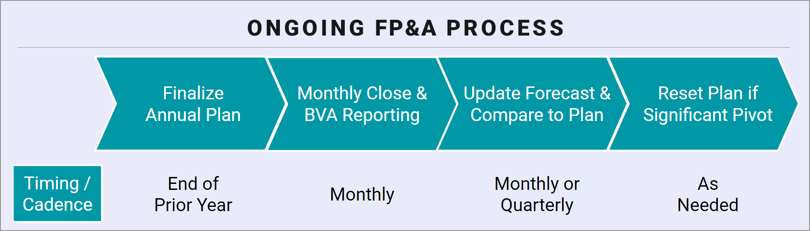

## Table of Contents

## What is annual financial planning and why is it important?

Annual financial planning is when you make a plan for your money for the whole year. It includes setting goals, making a budget, and deciding how to save or invest your money. You look at how much money you will earn and how much you will spend, and then you plan how to use the rest of your money wisely.

It's important because it helps you be ready for the future. When you plan your finances, you can save for big things like buying a house or going on a vacation. It also helps you avoid money problems by making sure you don't spend more than you earn. Planning your money each year makes you feel more in control and less worried about your finances.

## How can beginners start with annual financial planning?

To start with annual financial planning, beginners should first gather all their financial information. This means looking at how much money they make, like from their job or any other sources, and how much they spend on things like rent, food, and fun activities. They should also check their debts, like credit card balances or loans, and see how much they are saving or investing. Once they have a clear picture of their current financial situation, they can set some goals for the year. These goals could be saving for a big purchase, paying off debt, or starting an emergency fund.

Next, beginners should create a budget based on their goals and financial information. A budget helps them decide how to spend their money each month so they can reach their yearly goals. They should make sure their budget includes all their income and expenses, and they should try to stick to it as closely as possible. It's also a good idea to review and adjust the budget throughout the year if their financial situation changes. By following these steps, beginners can start planning their finances for the year and work towards a more stable financial future.

## What are the key components of an annual financial plan?

An annual financial plan has a few key parts. First, it starts with figuring out your income and expenses. This means looking at how much money you make from your job or other sources and how much you spend on things like rent, bills, and groceries. It's important to include all your money coming in and going out so you have a clear picture of your financial situation. After that, you set some goals for the year. These could be saving for a big purchase, paying off debt, or building an emergency fund. Your goals should be specific and achievable, and they guide how you will use your money.

The next part of the plan is creating a budget. A budget helps you decide how to spend your money each month to reach your yearly goals. It should include all your income and expenses, and you should try to stick to it as closely as possible. It's also a good idea to set aside some money for unexpected expenses or emergencies. Another important part is reviewing and adjusting your plan throughout the year. Your financial situation might change, so you need to check your plan regularly and make changes if needed. By doing these things, you can make a solid annual financial plan that helps you manage your money well.

## How do you set realistic financial goals for the year?

To set realistic financial goals for the year, start by looking at your current money situation. This means figuring out how much money you make and how much you spend. You should also think about any debts you have and how much you are saving or investing. Once you know where you stand, you can set goals that make sense for you. For example, if you have a lot of debt, a good goal might be to pay off a certain amount of it by the end of the year. Or, if you want to save for something big like a vacation, you can set a goal to save a certain amount of money each month.

When setting these goals, make sure they are specific and achievable. Instead of saying you want to "save more money," say you want to "save $1,000 by the end of the year." This makes it easier to track your progress and stay motivated. It's also important to be realistic about what you can do. If you set goals that are too hard to reach, you might get frustrated and give up. So, think about your income and expenses, and set goals that fit with your financial situation. By doing this, you can set goals that help you improve your finances without feeling overwhelmed.

## What tools and resources are available for managing an annual financial plan?

There are many tools and resources that can help you manage your annual financial plan. One popular tool is a budgeting app or software, like Mint or YNAB (You Need A Budget). These apps let you track your income and expenses, set up a budget, and see where your money is going. They can also send you reminders and alerts to help you stay on track with your financial goals. Another useful tool is a spreadsheet, like Microsoft Excel or Google Sheets. You can use these to make your own budget and track your progress throughout the year. They are flexible and can be customized to fit your specific needs.

In addition to tools, there are many resources available to help you with your financial planning. Websites like NerdWallet and Investopedia offer a lot of free information and advice on topics like budgeting, saving, and investing. You can also find [books](/wiki/algo-trading-books) and online courses that teach you how to manage your money better. If you need more personalized help, you might want to talk to a financial advisor. They can give you advice based on your specific financial situation and help you make a plan that works for you. By using these tools and resources, you can make managing your annual financial plan easier and more effective.

## How should one adjust their financial plan throughout the year?

Adjusting your financial plan throughout the year is important because things can change. You might get a new job, have unexpected expenses, or find that your goals are not as realistic as you thought. To adjust your plan, start by checking your budget every month or so. Look at your income and expenses to see if anything has changed. If you find that you are spending more than you planned, you might need to cut back on some things or find ways to earn more money. If you are saving more than expected, you could put that extra money towards your goals faster.

It's also a good idea to review your goals and see if they still make sense. Maybe you wanted to save for a vacation, but now you need to use that money for something else. Or maybe you paid off a debt sooner than you thought, and now you can focus on a different goal. When you make changes to your plan, write them down and update your budget. This way, you can keep track of your progress and stay on track with your new goals. By regularly adjusting your financial plan, you can make sure it stays useful and helps you reach your financial goals.

## What are common pitfalls in annual financial planning and how can they be avoided?

One common pitfall in annual financial planning is setting goals that are too hard to reach. People often want to save a lot of money or pay off big debts quickly, but if the goals are too big, they can get frustrated and give up. To avoid this, it's important to set goals that are realistic and achievable. Look at how much money you make and how much you spend, and set goals that fit with your current financial situation. It's better to set smaller, achievable goals and reach them than to set big goals and fail.

Another common mistake is not checking and updating the plan throughout the year. Things can change, like getting a new job or having unexpected expenses, and if you don't adjust your plan, it might not work anymore. To avoid this, review your budget and goals every month or so. Make changes if you need to, like cutting back on spending or finding ways to earn more money. By keeping your plan up to date, you can make sure it stays helpful and keeps you on track to reach your financial goals.

## How does tax planning integrate into annual financial planning?

Tax planning is a big part of your annual financial plan. It means thinking about how to pay less in taxes or get more money back from the government. You can do this by using things like tax deductions, credits, and saving in special accounts like a 401(k) or IRA. These can lower how much tax you owe or help you save more money. When you make your financial plan for the year, you should think about how to use these tax strategies to save money and reach your goals.

To include tax planning in your annual financial plan, start by learning about the tax rules that apply to you. You can use tools like tax software or talk to a tax professional to help you figure out the best way to save on taxes. As you make your budget and set your financial goals, think about how taxes will affect your money. For example, if you want to save for retirement, you might put money into a tax-advantaged account. By planning for taxes throughout the year, you can make smarter choices about your money and keep more of it in your pocket.

## What advanced strategies can be used to optimize an annual financial plan?

To optimize an annual financial plan, one advanced strategy is to use tax-efficient investing. This means putting your money into investments that help you pay less in taxes. For example, you can invest in tax-free bonds or use accounts like a Roth IRA, where your money grows without being taxed. Another strategy is to diversify your investments. Instead of putting all your money into one thing, you spread it out across different types of investments like stocks, bonds, and real estate. This can help you make more money and lower your risk if one investment doesn't do well.

Another advanced strategy is to use dollar-cost averaging. This means you invest a fixed amount of money at regular times, no matter what the market is doing. This can help you buy more shares when prices are low and fewer when prices are high, which can lead to better returns over time. Additionally, you can use rebalancing to keep your investment mix the way you want it. This means you sell some investments and buy others to make sure your portfolio stays balanced. By using these strategies, you can make your annual financial plan work better and help you reach your financial goals more effectively.

## How can one use financial forecasting in annual planning?

Financial forecasting is a way to guess what will happen with your money in the future. It's like making a smart guess about how much money you will make and spend over the next year. When you make your annual financial plan, you can use forecasting to see if your goals are possible. For example, if you want to save a certain amount of money, you can use forecasting to see if you can do it with your current income and expenses. This helps you plan better and make changes if you need to.

To use financial forecasting, start by looking at your past money records. See how much money you made and spent in the last year. Then, think about what might change in the next year. Maybe you will get a raise at work or have to spend more on something. Use this information to make a guess about your future money. You can use tools like spreadsheets or special software to help you with this. By forecasting, you can make a financial plan that is more likely to work and help you reach your goals.

## What role does investment management play in annual financial planning?

Investment management is a big part of your annual financial plan. It means deciding how to use your money to grow over time. You can put your money into things like stocks, bonds, or real estate. The goal is to make your money work for you so you can reach your financial goals faster. For example, if you want to save for retirement, you might invest in a mix of stocks and bonds to grow your savings. By managing your investments well, you can make more money and have a better chance of reaching your goals.

To include investment management in your annual plan, you need to think about your goals and how much risk you are willing to take. Some investments, like stocks, can go up and down a lot, but they might make you more money over time. Other investments, like bonds, are safer but might not grow as fast. You should also check your investments throughout the year and make changes if needed. This way, you can keep your money growing and stay on track with your financial plan.

## How can experts evaluate the effectiveness of their annual financial plan?

Experts can evaluate the effectiveness of their annual financial plan by looking at whether they reached their goals. They should check if they saved the amount of money they wanted, paid off their debts, or met other financial targets they set at the start of the year. They can also compare their actual income and expenses to what they planned. If they made more money or spent less than expected, that's good. But if they spent more or didn't make as much money as they thought, they need to figure out why and make changes for the next year.

Another way to see if the plan worked well is to look at their investments. Experts should check if their investments grew as expected and if they are still a good fit for their goals. They might also want to see how their plan handled unexpected events, like a sudden expense or a change in income. If the plan helped them deal with these surprises without too much trouble, that's a sign it was effective. By regularly reviewing these things, experts can make sure their financial plan is working and make it better for the future.

## What is Personal Finance?

Personal finance involves managing individual or family financial activities, encompassing expenses, savings, investments, insurance, and debt management. At its core, personal finance requires strategic planning to sustain financial stability and enable growth over time. It plays a vital role in setting both short-term and long-term financial goals while also developing effective strategies to reach them.

A fundamental aspect of personal finance is budgeting. Budgeting involves tracking all sources of income and expenses, which allows individuals to allocate resources effectively and ensure that spending does not exceed earnings. Creating a budget can be facilitated by using a simple mathematical equation:

$$
\text{Budget Surplus/Deficit} = \text{Total Income} - \text{Total Expenses}
$$

A positive result indicates a surplus, while a negative result points to a deficit, necessitating adjustments in spending or income enhancement.

Establishing an emergency fund is another critical component of personal finance. This fund acts as a financial safety net in case of unforeseen expenses such as medical emergencies or significant car repairs. Experts commonly recommend saving three to six months' worth of living expenses in an easily accessible account.

Investment knowledge is also essential in personal finance, which involves understanding various opportunities and risks. Investment strategies can range from conservative approaches, such as savings accounts and government bonds, to more aggressive tactics, like stocks and mutual funds. Each type of investment carries different risk levels and potential returns.

Furthermore, financial literacy is crucial for navigating personal finance effectively. It encompasses the ability to understand and apply various financial skills, including personal financial management, budgeting, and investing. Financial literacy empowers individuals to make informed decisions, avoid excessive debt, and plan for a financially secure future.

In summary, personal finance is a multifaceted discipline that requires coherent planning and execution to achieve financial objectives. It combines the practical elements of budgeting, savings, and investment with the intellectual components of financial literacy, forming a robust foundation for personal economic well-being.

## References & Further Reading

[1]: Bergstra, J., Bardenet, R., Bengio, Y., & Kégl, B. (2011). ["Algorithms for Hyper-Parameter Optimization."](https://dl.acm.org/doi/10.5555/2986459.2986743) Advances in Neural Information Processing Systems 24.

[2]: ["Advances in Financial Machine Learning"](https://www.amazon.com/Advances-Financial-Machine-Learning-Marcos/dp/1119482089) by Marcos Lopez de Prado

[3]: ["Evidence-Based Technical Analysis: Applying the Scientific Method and Statistical Inference to Trading Signals"](https://www.amazon.com/Evidence-Based-Technical-Analysis-Scientific-Statistical/dp/0470008741) by David Aronson

[4]: ["Machine Learning for Algorithmic Trading"](https://github.com/stefan-jansen/machine-learning-for-trading) by Stefan Jansen

[5]: ["Quantitative Trading: How to Build Your Own Algorithmic Trading Business"](https://www.amazon.com/Quantitative-Trading-Build-Algorithmic-Business/dp/1119800064) by Ernest P. Chan