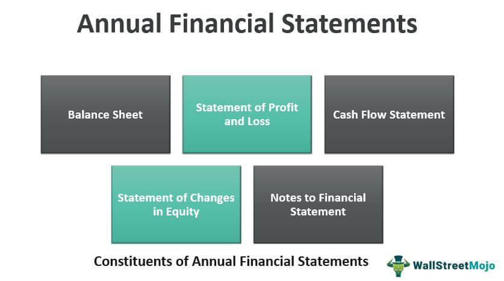

Understanding personal finance is a fundamental aspect of maintaining and enhancing financial growth and security. Personal finance includes a wide range of activities such as budgeting, saving, investing, insurance, and managing debt, all of which contribute to an individual's financial well-being. To effectively manage these areas, developing an annual financial plan is crucial. This plan serves as a roadmap, helping prioritize financial goals and outline strategies to achieve them. By focusing on an annual plan, individuals can assess their current financial situation, make necessary adjustments, and plan for future milestones.

Traditional financial planning methods have proven effective; however, integrating modern tools such as algorithmic trading can further enhance financial outcomes. Algorithmic trading employs automated algorithms to execute trades based on specific criteria, offering the potential for better investment performance through precise market analysis and timing. This incorporation allows individuals to benefit from advanced data analytics and potentially achieve improved returns.



In this article, essential aspects of personal finance, financial planning, and the contribution of algorithmic trading will be explored. Steps to create a comprehensive financial plan that aligns with long-term objectives will also be discussed, providing a structured approach to financial management. Moreover, leveraging technology in financial planning can streamline processes, increase efficiency, and optimize results. Planning tools and applications simplify budgeting, track expenses, and manage investments, making them indispensable in modern financial management.

By proactively engaging with these concepts and tools, individuals can confidently navigate their financial journey, ensuring security and growth.

## Table of Contents

## What is Personal Finance?

Personal finance involves managing individual or family financial activities, encompassing expenses, savings, investments, insurance, and debt management. At its core, personal finance requires strategic planning to sustain financial stability and enable growth over time. It plays a vital role in setting both short-term and long-term financial goals while also developing effective strategies to reach them.

A fundamental aspect of personal finance is budgeting. Budgeting involves tracking all sources of income and expenses, which allows individuals to allocate resources effectively and ensure that spending does not exceed earnings. Creating a budget can be facilitated by using a simple mathematical equation:

$$
\text{Budget Surplus/Deficit} = \text{Total Income} - \text{Total Expenses}
$$

A positive result indicates a surplus, while a negative result points to a deficit, necessitating adjustments in spending or income enhancement.

Establishing an emergency fund is another critical component of personal finance. This fund acts as a financial safety net in case of unforeseen expenses such as medical emergencies or significant car repairs. Experts commonly recommend saving three to six months' worth of living expenses in an easily accessible account.

Investment knowledge is also essential in personal finance, which involves understanding various opportunities and risks. Investment strategies can range from conservative approaches, such as savings accounts and government bonds, to more aggressive tactics, like stocks and mutual funds. Each type of investment carries different risk levels and potential returns.

Furthermore, financial literacy is crucial for navigating personal finance effectively. It encompasses the ability to understand and apply various financial skills, including personal financial management, budgeting, and investing. Financial literacy empowers individuals to make informed decisions, avoid excessive debt, and plan for a financially secure future.

In summary, personal finance is a multifaceted discipline that requires coherent planning and execution to achieve financial objectives. It combines the practical elements of budgeting, savings, and investment with the intellectual components of financial literacy, forming a robust foundation for personal economic well-being.

## The Importance of an Annual Financial Plan

An annual financial plan serves as a crucial tool for individuals aiming to gain a comprehensive understanding of their financial situation and map out their future financial objectives. This plan acts as a financial snapshot, illustrating one's current financial status while simultaneously outlining the goals to be achieved over the coming year. By providing an overview of financial health, it helps highlight areas that may require immediate attention or adjustment.

Creating and reviewing an annual financial plan allows individuals to accommodate significant life changes, such as marriage, childbirth, or a new job. For instance, changes in family structure may necessitate adjustments in budgeting and savings strategies. An essential component of the financial plan is the thorough assessment of savings and investments, ensuring they align with one's long-term financial aspirations. Tax planning is another critical aspect, as it ensures compliance with tax laws while maximizing potential deductions and credits, thereby improving financial efficiency.

Risk management is also an integral part of an annual financial plan. This involves evaluating insurance policies and investment risk levels, ensuring that any unforeseen events do not adversely impact financial stability. By formalizing these elements into a structured financial plan, individuals can make more informed decisions, gaining clarity on financial priorities and strategies. The process of developing and maintaining a structured plan aids in setting realistic financial goals and creating pathways to achieve them, enhancing overall financial security and transparency.

## Steps to Create an Effective Annual Financial Plan

Compiling a comprehensive financial inventory is the foundational step in creating an effective annual financial plan. This involves a detailed listing of all assets, liabilities, income sources, and expenses. Assets include cash, savings, investments, real estate, and valuable possessions, while liabilities encompass debts such as loans, mortgages, and credit card balances. By understanding the net worth—calculated as assets minus liabilities—individuals gain a clear picture of their financial standing.

Once the financial inventory is complete, setting achievable financial goals is crucial. These should be categorized into short-term (e.g., saving for a vacation), mid-term (e.g., purchasing a home), and long-term objectives (e.g., retirement planning). Goals should be Specific, Measurable, Achievable, Relevant, and Time-bound (SMART) to facilitate effective tracking and achievement.

Formulating a strategy to reach these objectives involves developing budgeting and saving plans. A budget should allocate resources towards daily expenses, savings, and debt repayment, ensuring that spending does not outstrip income. Saving strategies might include setting aside a specific percentage of income monthly or using automated savings accounts to reduce the temptation to spend.

Investment portfolio review and optimization are essential for securing better returns and mitigating risks. Regular assessment of investments ensures alignment with financial goals and risk tolerance. Diversification—spreading investments across various asset classes—can reduce exposure to market [volatility](/wiki/volatility-trading-strategies) and improve returns over time. Additionally, periodic rebalancing of the portfolio may be necessary to maintain the desired asset allocation.

Tax strategies form a critical component of financial planning, ensuring compliance and maximizing deductions. Utilizing tax-advantaged accounts, such as IRAs or 401(k) plans, can offer significant tax benefits. Keeping abreast of current tax laws and potential changes can further enhance tax strategies, potentially reducing taxable income and increasing savings.

By systematically addressing these steps, individuals can craft an annual financial plan that not only aligns with their current financial status but also lays a robust foundation for achieving their long-term financial aspirations.

## Integrating Algorithmic Trading into Financial Planning

Algorithmic trading employs computer algorithms to execute trading orders automatically, leveraging pre-set criteria such as timing, price, and quantity to optimize investment management. This approach can substantially enhance the efficiency of portfolio management by minimizing human error and taking advantage of rapid market changes.

The use of [algorithmic trading](/wiki/algorithmic-trading) can be particularly beneficial in risk mitigation. By conducting precise market analyses and executing trades at the optimal moment, algorithms can reduce the exposure to market volatility. For instance, an algorithm can be programmed to automatically implement stop-loss orders when asset prices drop below a specified threshold, thereby limiting potential losses.

Enhancing investment returns and diversifying portfolios are additional advantages offered by algorithmic trading. Algorithms can be programmed to identify a wide range of investment opportunities, including underexplored markets or asset classes, thus contributing to a more diversified investment strategy. Moreover, with the ability to process large volumes of data rapidly, algorithmic trading can capitalize on fleeting opportunities in the market.

However, the implementation of algorithmic trading tools comes with its own set of costs and risks. There are expenses associated with developing and maintaining sophisticated trading algorithms, as well as potential risks related to system failures or programming errors that can lead to substantial financial losses. It is imperative to consider these factors when incorporating algorithmic trading into a personal financial strategy.

Financial planning software with integrated algorithmic trading features can offer personalized investment strategies tailored to individual risk profiles and financial goals. These platforms allow users to customize algorithmic parameters, enabling a tailored approach to managing investments. For example, adaptive algorithms can adjust trading strategies in real-time based on evolving market conditions, offering agility and responsiveness to market trends.

By integrating algorithmic trading into financial planning, individuals can harness advanced technology to optimize investment outcomes while managing potential risks effectively. As this technology continues to evolve, it represents a progressive step towards more dynamic and efficient personal financial management.

## The Role of Technology in Modern Financial Planning

Technology has become a cornerstone of modern financial planning, revolutionizing how individuals manage their finances through innovative tools and applications. These resources simplify budgeting, track expenses, and manage investments, offering solutions that were once complex and time-consuming.

One of the most significant advancements is the emergence of robo-advisors. These platforms democratize investment management by offering automated, algorithm-driven financial planning services without requiring users to have extensive financial expertise. Robo-advisors typically evaluate an individual’s risk tolerance, financial goals, and time horizon to create and manage a diversified investment portfolio. According to a report by Deloitte, the global robo-advisory market is forecasted to grow significantly, underscoring its rising influence in the financial sector.

Moreover, financial applications provide real-time insights that support adherence to financial plans. Apps such as Mint and YNAB (You Need A Budget) allow users to set budgets, track spending, and visualize financial trends over time. The real-time feedback offered by these tools can prompt users to make necessary adjustments to remain aligned with their financial objectives.

Automation in financial software introduces efficiency and streamlines the planning process. Features such as automatic bill payments and savings allocations reduce the cognitive load on individuals, enabling them to focus on strategy rather than execution. Research by PwC highlights that automation in finance can result in substantial time savings, which can be redirected toward more strategic activities.

Data analytics and [artificial intelligence](/wiki/ai-artificial-intelligence) (AI) further enhance financial planning by leveraging large datasets to predict trends and inform decision-making. These technologies analyze historical data to identify patterns and project future market movements. For instance, AI-driven models can forecast stock price trends using techniques like time series analysis or [machine learning](/wiki/machine-learning) algorithms. Here’s a simple example of how Python can be used for basic stock price prediction using historical data:

```python
import pandas as pd
from sklearn.model_selection import train_test_split
from sklearn.ensemble import RandomForestRegressor
from sklearn.metrics import mean_squared_error

# Load historical stock data
data = pd.read_csv('stock_data.csv')
X = data[['open', 'high', 'low', '[volume](/wiki/volume-trading-strategy)']]  # Features
y = data['close']  # Target variable

# Split data into training and testing sets
X_train, X_test, y_train, y_test = train_test_split(X, y, test_size=0.2, random_state=42)

# Initialize and train the model
model = RandomForestRegressor(n_estimators=100, random_state=42)
model.fit(X_train, y_train)

# Predict and evaluate the model
predictions = model.predict(X_test)
mse = mean_squared_error(y_test, predictions)
print(f'Mean Squared Error: {mse:.2f}')
```

This script outlines a basic approach to predicting stock prices using a Random Forest model, illustrating the practical applications of AI in financial analysis.

In conclusion, technology aids individuals in navigating the complexities of financial planning by offering tools that simplify, automate, and optimize various aspects of financial management. As these technologies continue to evolve, they promise to empower users with more insightful, personalized, and efficient financial strategies.

## Conclusion

A well-structured annual financial plan is vital for achieving personal financial success. Such a plan allows individuals to map out their financial objectives clearly, providing a strategic path toward achieving both short-term and long-term goals. The essence of an annual financial plan lies in its ability to offer a detailed assessment of one's financial status, facilitating informed decision-making and financial clarity.

Incorporating technology into personal finance planning can significantly enhance efficiency and results. Financial planning tools and applications simplify complex processes, such as budgeting and investment management, by offering real-time insights and data analytics. Technologies like robo-advisors democratize access to investment management, enabling individuals to participate in financial markets with minimal prior knowledge. These tools automate the execution of strategies, ensuring that plans are adhered to more effectively.

Algorithmic trading represents a modern approach to investment management and can serve as a powerful complement to traditional financial strategies. By using automated and pre-programmed trading instructions, algorithmic trading can optimize investment returns, provide diversification benefits, and mitigate risks through precision in market analysis and trade execution. This method leverages technology to operate with minimal human intervention, potentially increasing the consistency and reliability of investment performance.

Regular reviews and updates of your financial plan are crucial for accommodating personal and market changes. Life events such as marriage, childbirth, and career changes, alongside market fluctuations, necessitate timely adjustments to financial strategies. By revisiting and revising financial plans periodically, individuals can ensure their plans remain aligned with their current financial circumstances and objectives.

Taking proactive steps today toward financial planning and management can ensure financial security and peace of mind for the future. By embracing a structured approach and integrating technological advancements, individuals can forge a sustainable and resilient financial future, ready to withstand unexpected challenges and capitalize on emerging opportunities.

## References & Further Reading

[1]: Bergstra, J., Bardenet, R., Bengio, Y., & Kégl, B. (2011). ["Algorithms for Hyper-Parameter Optimization."](https://dl.acm.org/doi/10.5555/2986459.2986743) Advances in Neural Information Processing Systems 24.

[2]: ["Advances in Financial Machine Learning"](https://www.amazon.com/Advances-Financial-Machine-Learning-Marcos/dp/1119482089) by Marcos Lopez de Prado

[3]: ["Evidence-Based Technical Analysis: Applying the Scientific Method and Statistical Inference to Trading Signals"](https://www.amazon.com/Evidence-Based-Technical-Analysis-Scientific-Statistical/dp/0470008741) by David Aronson

[4]: ["Machine Learning for Algorithmic Trading"](https://github.com/stefan-jansen/machine-learning-for-trading) by Stefan Jansen

[5]: ["Quantitative Trading: How to Build Your Own Algorithmic Trading Business"](https://www.amazon.com/Quantitative-Trading-Build-Algorithmic-Business/dp/1119800064) by Ernest P. Chan