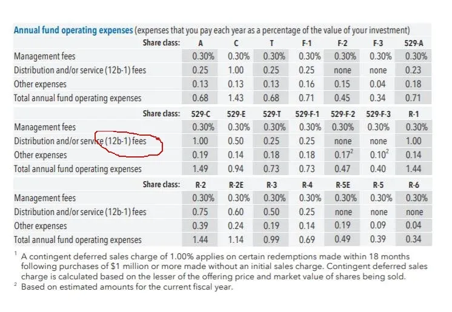

## Table of Contents

## What are Annual Fund Operating Expenses?

Annual Fund Operating Expenses are the costs that a mutual fund or an exchange-traded fund (ETF) incurs each year to manage and operate the fund. These expenses are taken out of the fund's assets and can include management fees, administrative costs, marketing and distribution fees, and other operational costs. The total of these expenses is usually expressed as a percentage of the fund's average net assets and is known as the expense ratio.

The expense ratio is important for investors because it directly affects the fund's returns. A higher expense ratio means that more of the fund's assets are used to cover costs, which can reduce the overall return for investors. For example, if a fund has an expense ratio of 1%, it means that 1% of the fund's assets will be used to pay for these expenses each year. Therefore, when choosing a fund, investors often look for funds with lower expense ratios to maximize their potential returns.

## Why are Annual Fund Operating Expenses important to investors?

Annual Fund Operating Expenses are important to investors because they affect how much money they can earn from their investments. These expenses are the costs that a fund has to pay every year to keep running. They include things like paying the people who manage the fund, the costs of running the office, and money spent on advertising. All these costs are taken out of the fund's money, which means less money is left to grow and make profits for the investors.

The total of these expenses is called the expense ratio, and it's shown as a percentage. If a fund has a high expense ratio, it means a bigger part of the fund's money is used to pay for these costs. This can make the fund's returns smaller because there's less money left to invest and grow. That's why investors often look for funds with lower expense ratios. A lower expense ratio means more of the fund's money can be used to make profits, which is better for the investors.

## How are Annual Fund Operating Expenses calculated?

Annual Fund Operating Expenses are figured out by adding up all the costs that a fund has to pay each year. These costs can include things like paying the people who manage the fund, the costs of running the office, and money spent on advertising. Once all these costs are added together, they are divided by the fund's total assets to get the expense ratio. The expense ratio is a percentage that shows how much of the fund's money is used to pay for these costs.

For example, if a fund has total costs of $1 million and total assets of $100 million, the expense ratio would be 1%. This means that 1% of the fund's money is used to pay for the costs of running the fund. The expense ratio is important because it helps investors see how much of their money is being used to pay for the fund's expenses, and how much is left to grow and make profits.

## What types of fees are included in Annual Fund Operating Expenses?

Annual Fund Operating Expenses include different kinds of fees that a fund has to pay every year. These fees can be things like the money paid to the people who manage the fund, which is called the management fee. Another fee is for the costs of running the office, like paying for electricity and computers. There are also fees for advertising and selling the fund, which are called marketing and distribution fees.

Other fees that might be included are for legal services, accounting, and keeping records of who owns the fund's shares. Sometimes, there are also fees for buying and selling the investments that the fund owns, which are called transaction costs. All these fees together make up the total Annual Fund Operating Expenses, and they are taken out of the fund's money before any profits are given to the investors.

## How do Annual Fund Operating Expenses affect a fund's performance?

Annual Fund Operating Expenses can make a big difference in how well a fund does. These expenses are the costs that a fund has to pay every year to keep running, like paying the people who manage the fund and the costs of running the office. When these expenses are high, they take a bigger chunk out of the fund's money. That means there's less money left to invest and grow, which can make the fund's returns smaller. For example, if a fund has a high expense ratio, like 2%, it means 2% of the fund's money is used just to pay for these costs every year.

Because of this, investors often look for funds with lower expense ratios. A lower expense ratio means more of the fund's money can be used to make profits. Over time, even a small difference in the expense ratio can add up to a big difference in how much money an investor makes. For example, if one fund has an expense ratio of 0.5% and another has 1%, the fund with the lower expense ratio will keep more money working for the investors, which can lead to better performance in the long run.

## Can Annual Fund Operating Expenses be compared across different types of funds?

Yes, Annual Fund Operating Expenses can be compared across different types of funds, like mutual funds and ETFs. The key thing to look at is the expense ratio, which is a percentage that shows how much of the fund's money is used to pay for costs each year. By comparing the expense ratios, investors can see which funds have lower costs and might give them better returns over time.

However, it's important to remember that different types of funds might have different kinds of costs. For example, some funds might have higher marketing and distribution fees, while others might have higher management fees. So, when comparing funds, it's a good idea to look at the whole picture and not just the expense ratio. This way, investors can make a better choice based on what they need and want from their investments.

## What is the difference between gross and net expense ratios?

The gross expense ratio is the total cost of running a fund before any fee waivers or reimbursements. It includes all the expenses like management fees, administrative costs, and marketing fees. This number shows the full amount of money taken out of the fund's assets to pay for these costs each year.

The net expense ratio, on the other hand, is what investors actually pay after any fee waivers or reimbursements are taken into account. Sometimes, a fund company might decide to lower the fees for a while to make the fund more attractive to investors. So, the net expense ratio can be lower than the gross expense ratio because it reflects these temporary reductions. This is important for investors to know because it shows the real cost they will pay to invest in the fund.

## How have regulatory changes impacted the disclosure of Annual Fund Operating Expenses?

Over the years, rules have changed to make it easier for people to know about the costs of investing in funds. The U.S. Securities and Exchange Commission (SEC) has made rules that say funds have to show their expenses clearly. This means funds have to tell investors about their expense ratios and other costs in a way that's easy to understand. These rules help investors see how much they're paying and compare different funds.

One big change was the introduction of the summary prospectus. This is a short document that gives the main points about a fund, including its costs. Before this, the information was often hidden in long, hard-to-read documents. Now, with the summary prospectus, it's easier for investors to find out about the annual fund operating expenses and make better choices about where to put their money.

## What strategies can fund managers use to manage or reduce Annual Fund Operating Expenses?

Fund managers can use different ways to manage or lower the annual fund operating expenses. One way is by choosing to work with companies that offer lower fees for services like managing the fund or keeping records. They can also try to do more things themselves instead of hiring other companies, which can save money. Another way is by using technology to make things like buying and selling investments cheaper and faster. By being smart about how they spend money, fund managers can keep the costs down and make the fund more attractive to investors.

Another strategy is to grow the size of the fund. When a fund gets bigger, the costs of running it don't go up as much as the money in the fund does. This means the expense ratio can go down because the same costs are spread over more money. Fund managers can also sometimes agree to lower their fees for a while to make the fund look better to investors. This is called a fee waiver, and it can help keep the net expense ratio low. By using these strategies, fund managers can keep the costs of running the fund under control and help investors get better returns.

## How do Annual Fund Operating Expenses influence fund selection in portfolio management?

When people who manage money, called portfolio managers, pick funds for their clients, they look at the annual fund operating expenses a lot. These expenses are the costs that a fund has to pay every year to keep running, like paying the people who manage the fund and the costs of running the office. The total of these expenses is called the expense ratio. A lower expense ratio means more of the fund's money can be used to make profits for the investors. So, portfolio managers often choose funds with lower expense ratios because they want to get the best returns for their clients.

But it's not just about [picking](/wiki/asset-class-picking) the fund with the lowest costs. Portfolio managers also think about other things like how well the fund has done in the past, what kinds of investments it makes, and how it fits with the rest of the portfolio. They want to make sure the fund will help reach their clients' goals. Even if a fund has a low expense ratio, it might not be the best choice if it doesn't fit well with the rest of the investments. So, while annual fund operating expenses are important, they are just one part of the puzzle when choosing funds for a portfolio.

## What are the long-term effects of high Annual Fund Operating Expenses on investment returns?

High Annual Fund Operating Expenses can really hurt how much money you make from your investments over a long time. These expenses are the costs that a fund has to pay every year to keep running, like paying the people who manage the fund and the costs of running the office. When these expenses are high, they take a bigger piece of the fund's money. That means there's less money left to invest and grow, which can make the fund's returns smaller. Over many years, even a small difference in the expense ratio can add up to a big difference in how much money you end up with. For example, if you invest $10,000 in a fund with a 1% expense ratio, and another $10,000 in a fund with a 0.5% expense ratio, the one with the lower expense ratio will likely give you more money in the end because it keeps more of your money working for you.

So, when choosing a fund, it's a good idea to look at the expense ratio and think about how it will affect your money over time. A fund with high expenses might not be the best choice, even if it looks good in other ways. Over the long term, the costs can eat away at your returns, and you might end up with less money than you hoped for. That's why many investors and people who manage money for others pay close attention to the expense ratio when picking funds. They want to make sure as much of their money as possible is being used to grow and make profits, not just to cover the costs of running the fund.

## How do international standards and practices regarding Annual Fund Operating Expenses vary?

Annual Fund Operating Expenses can be different around the world because each country has its own rules and ways of doing things. In the United States, the Securities and Exchange Commission (SEC) makes funds show their expenses clearly to help investors understand the costs. This includes showing the expense ratio, which is a percentage of the fund's money used to pay for costs each year. In Europe, the Undertakings for Collective Investment in Transferable Securities (UCITS) directive sets rules for funds, but the way expenses are shown and managed can still be different from one country to another. Some places might have higher costs for things like managing the fund or advertising, while others might have lower costs.

In Asia, practices can also vary a lot. For example, in Japan, funds have to follow rules set by the Financial Services Agency, which can be different from rules in other Asian countries like Singapore or Hong Kong. These differences can affect how much investors have to pay in fees and how these fees are shown. Some countries might have more rules about what fees can be charged, while others might let funds charge whatever they want as long as they tell investors about it. Understanding these differences is important for investors who want to put their money in funds from different parts of the world, as it can affect how much they earn from their investments.

## What are Operating Expenses and How Can We Understand Them?

Operating expenses are a fundamental component in the operational management of investment funds and vehicles. They represent the costs incurred in the day-to-day functioning of a fund. Typically, these expenses encompass management fees, administrative fees, and various other operational costs. Understanding these expenses is crucial for investors aiming to make informed decisions regarding their investments.

Expressed as a percentage of the total assets under management (AUM), operating expenses serve as a critical indicator of a fund's efficiency. For investors, the focus often lies on how these expenses impact overall investment performance. Significantly, higher operating expenses have the potential to substantially erode the net returns of an investment, considerably impacting the investor's bottom line.

One of the primary metrics used to evaluate these costs is the expense ratio. This ratio provides a clear comparison of a fund's operating costs relative to its total assets. The formula for calculating the expense ratio is:

$$
\text{Expense Ratio} = \frac{\text{Total Operating Expenses}}{\text{Average Total Assets}}
$$

In practice, the expense ratio is disclosed in a fund's prospectus, offering transparency to potential investors. As a regulatory requirement, this disclosure helps investors assess the cost implications associated with particular funds. It thereby influences their investment decisions, guiding choices that align with their financial goals and cost-tolerance levels.

Accurate evaluation of operating expenses allows investors to assess the true cost of investing in a fund. Funds with lower expense ratios generally have a competitive advantage as they consume a smaller portion of investors' returns, thus enhancing net profitability. Conversely, funds with higher expense ratios need to deliver superior returns to justify their cost structures. Therefore, a thorough understanding of operating expenses equips investors with the necessary insights to optimize their investment strategies, balance costs against expected returns, and adjust portfolios accordingly.

## What are the investment costs in algo trading?

In [algorithmic trading](/wiki/algorithmic-trading), cost efficiency is paramount owing to the high-frequency nature of transactions and the often narrow margins. Investment costs in this sphere predominantly encompass expenditures related to technology, data acquisition, and infrastructure.

The Operating Expense Ratio (OER) serves as a pivotal metric for assessing the cost-effectiveness of trading operations. It is calculated as:

$$
\text{OER} = \frac{\text{Operating Expenses}}{\text{Total Assets}}
$$

Maintaining an optimal OER is crucial for sustaining profitability in algorithmic trading. Given the fast-evolving technological landscape, traders must continually manage these expenses to preserve a competitive edge and ensure maximization of profits. This involves strategic allocation of resources to technology and infrastructure and continuous evaluation of cost structures.

Investment costs also must be weighed against the progress in trading technology. This includes the implementation of advanced technologies such as cloud computing and the development of efficient trading algorithms. Cloud computing, for instance, offers scalable data storage and processing capabilities, which can significantly reduce infrastructural expenses.

Effective management of high operational expenses is vital. If not controlled, these expenses can significantly erode profit margins. Strategies such as algorithm optimization, efficient hardware usage, and adopting agile development practices contribute to reducing operational expenses. By focusing on cost-effective technologies and infrastructures, traders can enhance their operational efficiency and maintain sustainable profit margins.

## What is the conclusion?

Effective investment cost management is central to enhancing net returns, applicable to both traditional fund investment and algorithmic trading. By closely scrutinizing operating expenses, investors can make more informed decisions, aligning their strategies with financial goals and ensuring a competitive market stance. Managing these expenses involves assessing expense ratios, which are expressed as:

$$
\text{Expense Ratio} = \left( \frac{\text{Total Operating Expenses}}{\text{Total Assets}} \right) \times 100
$$

This metric provides transparency and helps investors understand the proportion of investment value consumed by operating costs, enabling better comparisons across different funds and trading strategies.

While market [volatility](/wiki/volatility-trading-strategies) presents significant challenges, maintaining a disciplined approach to expense management remains foundational for sustainable investment practices. Investors and traders can navigate dynamic trading environments by maintaining cost efficiency without compromising on strategic investments in technology and human resources. This balance is essential for enhancing the profitability of trading and investment operations.

The growing trend towards low-cost investing emphasizes the importance of rigorous expense analysis and management. As financial markets continue to develop, focusing on expense minimization will remain pivotal, ensuring investment portfolios are well-positioned for long-term success. By prioritizing expense management, investors can enhance their net returns, thus achieving stronger, more resilient investment portfolios in a competitive landscape.

## References & Further Reading

[1]: ["Common Sense on Mutual Funds"](https://www.amazon.com/Common-Sense-Mutual-Funds-Anniversary/dp/0470138130) by John C. Bogle

[2]: French, K. R. (2008). ["Presidential Address: The Cost of Active Investing."](http://qed.econ.queensu.ca/faculty/milne/322/ECON322(2008)%20Kenneth%20R%20French.pdf) The Journal of Finance, 63(4), 1537-1573.

[3]: Carhart, M. M. (1997). ["On Persistence in Mutual Fund Performance."](https://onlinelibrary.wiley.com/doi/full/10.1111/j.1540-6261.1997.tb03808.x) The Journal of Finance, 52(1), 57-82.

[4]: ["A Guide to Fund Management"](https://www.amazon.com/Guide-Fund-Management-Daniel-Broby/dp/1906348189) by David McCafferty

[5]: Hasanhodzic, J., & Lo, A. W. (2007). ["Can Hedge-Fund Returns Be Replicated? The Linear Case."](https://papers.ssrn.com/sol3/papers.cfm?abstract_id=924565) Journal of Investment Management, 5(2), 5-45.