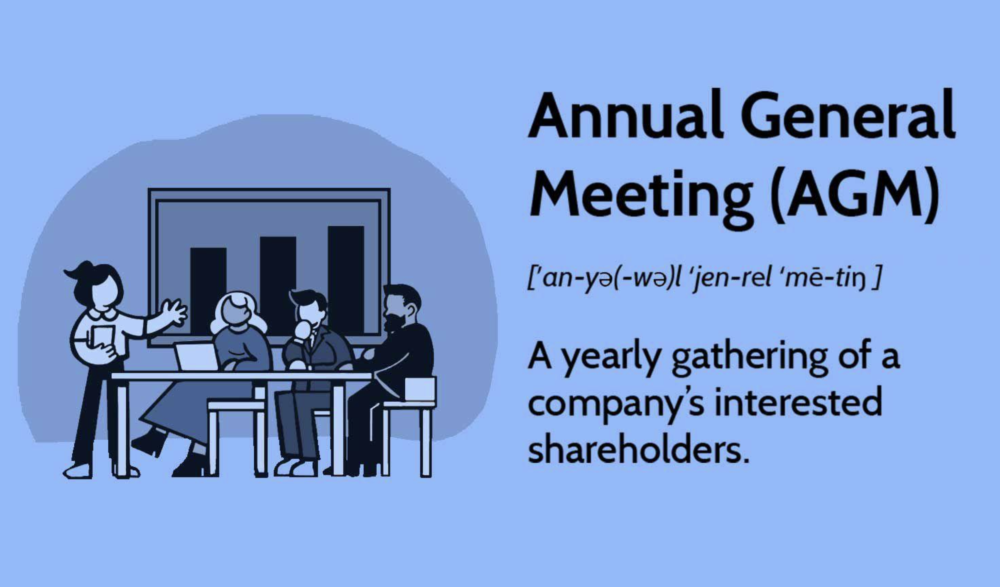

## Table of Contents

## What is an Annual General Meeting (AGM)?

An Annual General Meeting (AGM) is a yearly gathering that a company holds for its shareholders. It's a chance for the company to share important information about how it's doing, what it plans to do next, and to let shareholders ask questions or give their opinions.

During the AGM, shareholders can vote on important decisions, like choosing who will be on the company's board of directors or approving the company's financial statements. It's an important event because it helps keep the company transparent and accountable to the people who own part of it.

## Why is an AGM important for a company?

An AGM is important for a company because it helps keep everyone informed. It's a time when the company tells its shareholders about how it did over the past year, what it plans to do next, and any big changes that might be happening. This openness helps build trust between the company and the people who own part of it. When shareholders know what's going on, they feel more connected to the company and are more likely to support it.

Another reason AGMs are important is that they give shareholders a voice. At the meeting, shareholders can ask questions, share their thoughts, and vote on important decisions like who should be on the board of directors or whether to approve the company's financial reports. This voting power makes sure that the company listens to its shareholders and makes decisions that are good for everyone. By having an AGM, a company shows that it values its shareholders and wants to work together with them.

## Who can attend an AGM?

An AGM is a meeting that shareholders of a company can attend. Shareholders are people who own part of the company through stocks or shares. They have the right to be at the AGM because they are part owners of the company.

Sometimes, other people can come to the AGM too. For example, members of the company's board of directors or top managers might be there to give reports or answer questions. Also, some companies let guests or the public attend, but these people usually can't vote or take part in decisions.

Overall, the main people at an AGM are the shareholders. They are the ones who can vote and make important choices about the company's future.

## How often should a company hold an AGM?

A company should hold an AGM once every year. This is because the law says that companies need to have a yearly meeting to talk to their shareholders about how things are going and what plans they have for the future.

Having an AGM every year helps keep everyone in the loop. It's a chance for shareholders to ask questions, give their opinions, and vote on important decisions. This regular meeting makes sure the company stays open and honest with the people who own part of it.

## What are the typical agenda items at an AGM?

At an AGM, the company usually starts by sharing a report on how it did over the past year. This includes talking about the financial results, like how much money the company made or lost. The board of directors and top managers might give speeches about what the company achieved and any big challenges they faced. They also talk about the company's plans for the future and any new projects or goals they want to reach.

After the reports, shareholders get a chance to ask questions and share their thoughts. This part is important because it lets shareholders feel involved and heard. Then, the meeting moves on to voting. Shareholders vote on important decisions, like choosing who will be on the board of directors or approving the company's financial statements. These votes help make sure the company is doing what's best for everyone who owns part of it.

Sometimes, there are other things on the agenda too. For example, the company might talk about changes to its rules or bylaws, or they might discuss big decisions like merging with another company or making big investments. All these items help keep shareholders informed and involved in the company's direction.

## What is the role of shareholders during an AGM?

Shareholders play a big role at an AGM. They are the owners of the company through the stocks or shares they own. At the meeting, shareholders get to listen to reports about how the company did in the past year and what plans it has for the future. They can ask questions about anything they want to know more about. This helps them understand the company better and feel more connected to it.

Shareholders also get to vote on important decisions at the AGM. They vote on who should be on the board of directors, which are the people who help run the company. They also vote on the company's financial statements to make sure everything looks good. By voting, shareholders can help guide the company in a way that they think is best for everyone who owns part of it. Their votes make sure the company listens to them and works to do what's best for all shareholders.

## How can shareholders participate if they cannot attend in person?

If shareholders can't go to the AGM in person, they can still take part. One way is by using a proxy vote. This means they can give someone else the power to vote for them at the meeting. They fill out a form to say who they want to vote on their behalf and how they want them to vote on different issues. This way, even if they can't be there, their voice still counts.

Another way shareholders can join in is if the company offers a virtual AGM. This means the meeting happens online, and shareholders can watch it from home or anywhere with a computer or phone. They can listen to the reports, ask questions through a chat or email, and vote online. Virtual AGMs make it easier for more people to be involved, even if they live far away or have busy schedules.

## What legal requirements must be met for an AGM?

Companies have to follow certain rules when they hold an AGM. They must have the meeting once every year, usually within a certain time after the end of their financial year. This makes sure shareholders get regular updates on how the company is doing. Companies also need to send out a notice to all shareholders before the AGM, telling them when and where it will happen. This notice has to be sent out a certain number of days in advance, often at least 21 days, so everyone has time to plan to attend or send in their vote.

At the AGM, companies must present their financial statements and reports to the shareholders. This includes the company's profits or losses and how they spent their money. Shareholders have the right to ask questions about these reports. The company also needs to let shareholders vote on important decisions, like who will be on the board of directors and whether to approve the financial statements. These rules make sure the AGM is fair and that shareholders can have a say in how the company is run.

## How does voting work at an AGM?

At an AGM, voting is how shareholders make important decisions for the company. Each shareholder usually gets one vote for each share they own. They vote on things like who should be on the board of directors, approving the company's financial statements, and sometimes on big changes like merging with another company. The company gives out ballots or uses electronic voting systems so shareholders can choose what they want.

If a shareholder can't come to the AGM, they can still vote by using a proxy vote. This means they fill out a form to let someone else vote for them. They can tell their proxy how to vote on each issue, or they can let the proxy decide. This way, even if they can't be there in person, their voice still counts in the decisions.

The votes are counted during or right after the AGM. To pass, a decision usually needs more than half of the votes, but some big decisions might need a bigger majority. Once all the votes are counted, the company tells everyone the results. This makes sure everyone knows what was decided and helps keep the company running in a way that shareholders agree with.

## What is a proxy vote and how is it used in AGMs?

A proxy vote is a way for shareholders to vote at an AGM even if they can't be there in person. It lets them give someone else the power to vote for them. To do this, a shareholder fills out a form called a proxy form. On this form, they write down the name of the person they want to vote for them, called the proxy. They can also tell the proxy how to vote on each issue, like saying "yes" or "no" to different decisions. If they don't give specific instructions, the proxy can decide how to vote.

Using a proxy vote is important because it makes sure every shareholder can have a say in the company's decisions, even if they can't attend the meeting. The proxy takes the form to the AGM and votes according to the shareholder's wishes. This way, the shareholder's voice is still heard, and they can help make important choices about things like who should be on the board of directors or whether to approve the company's financial statements. It helps keep the company fair and makes sure everyone's opinion counts.

## What are some common challenges faced during AGMs and how can they be addressed?

One common challenge at AGMs is getting enough shareholders to attend and vote. Sometimes, not many people show up, which can make it hard to make important decisions because you need a certain number of votes. To fix this, companies can send out reminders about the meeting and make it easy for people to vote even if they can't come in person. They can offer online voting or proxy voting, where shareholders can give someone else the power to vote for them. This helps more people take part and makes sure important decisions can be made.

Another challenge is keeping the meeting organized and on time. AGMs can get long and off-topic if lots of people want to ask questions or talk about different things. To handle this, companies can set a clear agenda and stick to it. They can also limit how long each person can speak or ask questions, so everyone gets a chance to be heard without the meeting going on too long. By planning well and keeping things moving, companies can make sure the AGM runs smoothly and everyone stays focused on the important topics.

## How have AGMs evolved with the advent of digital technology?

With the rise of digital technology, AGMs have changed a lot. Now, companies can hold virtual AGMs, where shareholders can join the meeting online from anywhere. They can watch live videos of the meeting, ask questions through chat or email, and vote using their computers or phones. This makes it easier for more people to be involved, especially if they live far away or have busy schedules. It also saves money and time because the company doesn't need to rent a big place for everyone to meet in person.

Another big change is that companies can now send out notices and documents electronically. Instead of mailing out paper invitations and reports, they can email them or post them on a website. This is faster and more eco-friendly. Digital technology also makes voting easier. Shareholders can vote online before or during the AGM, which is more convenient than filling out paper ballots. Overall, digital tools have made AGMs more accessible and efficient, helping companies connect with their shareholders in new and better ways.

## References & Further Reading

[1]: Bergstra, J., Bardenet, R., Bengio, Y., & Kégl, B. (2011). ["Algorithms for Hyper-Parameter Optimization."](https://papers.nips.cc/paper/4443-algorithms-for-hyper-parameter-optimization) Advances in Neural Information Processing Systems 24.

[2]: ["Advances in Financial Machine Learning"](https://www.amazon.com/Advances-Financial-Machine-Learning-Marcos/dp/1119482089) by Marcos Lopez de Prado

[3]: ["Evidence-Based Technical Analysis: Applying the Scientific Method and Statistical Inference to Trading Signals"](https://www.amazon.com/Evidence-Based-Technical-Analysis-Scientific-Statistical/dp/0470008741) by David Aronson

[4]: ["Machine Learning for Algorithmic Trading"](https://github.com/PacktPublishing/Machine-Learning-for-Algorithmic-Trading-Second-Edition) by Stefan Jansen

[5]: ["Quantitative Trading: How to Build Your Own Algorithmic Trading Business"](https://www.amazon.com/Quantitative-Trading-Build-Algorithmic-Business/dp/1119800064) by Ernest P. Chan