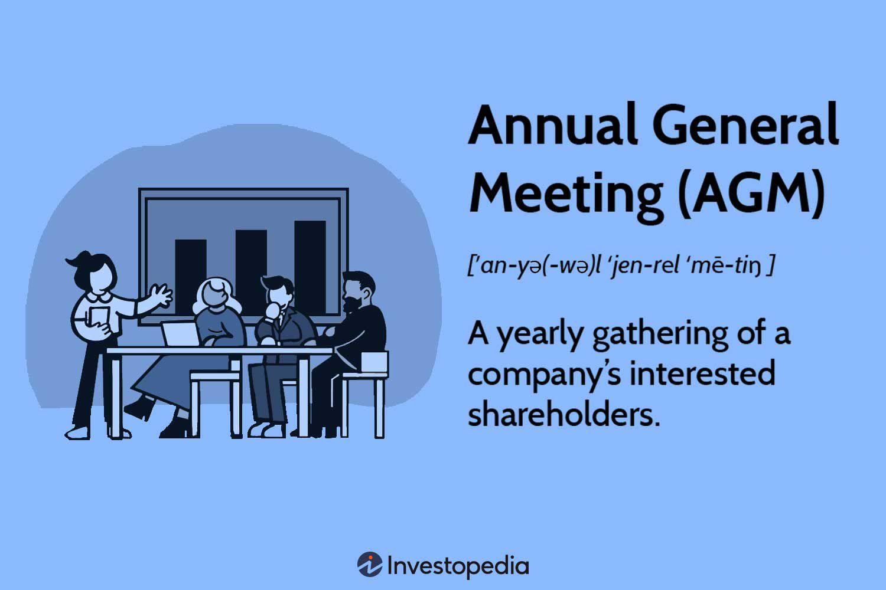

An Annual General Meeting (AGM) is a fundamental event for corporations, serving as a key dialogue platform between shareholders and management. During AGMs, shareholders receive critical updates on a company's financial health and strategic direction, which significantly influence investor confidence and market performance. Usually conducted on an annual basis, these meetings offer transparency and accountability, reinforcing corporate governance.

In recent years, the landscape of AGMs has been transformed by technological advancements, particularly the integration of algorithmic trading in corporate strategies. Algorithmic trading, which uses complex algorithms to automate financial trading, has gained traction due to its ability to execute trades at speeds and efficiencies above human capacity. This shift has not only impacted trading itself but also influenced broader corporate decision-making processes.



This article will explore the significance of AGMs, their traditional structure, and the evolving influence of algorithmic trading on these gatherings. By examining the roles of AGMs within the corporate governance framework and the transformative effects of algorithmic trading on company operations, stakeholders and investors can gain a comprehensive understanding of these pivotal elements. Understanding these developments is essential for stakeholders aiming to make informed decisions and for investors keen on navigating the rapidly changing financial landscape.

## Table of Contents

## Understanding the Annual General Meeting (AGM)

An Annual General Meeting (AGM) is a formal gathering of a company’s shareholders, aimed at fostering communication between the management and the shareholders regarding the company’s performance and future outlook. It is a foundational event in corporate governance, providing a platform for transparency and accountability. During an AGM, several key activities are undertaken to ensure the smooth operation and strategic direction of a company. 

One of the primary activities within an AGM is the presentation and review of the company’s financial statements. This includes the balance sheet, income statement, and cash flow statement. These documents are crucial for giving shareholders insights into the company's financial health and performance over the past fiscal year. Understanding these financials enables shareholders to make informed decisions regarding their investments and align with the company’s financial strategies.

Another significant aspect of AGMs is the election of board members. Shareholders are given the opportunity to vote on the appointment or re-election of individuals to the company's board of directors. This process is essential as the board plays a pivotal role in overseeing the company’s management, making strategic decisions, and protecting the interests of the shareholders.

Additionally, AGMs serve as a forum for discussing key issues that affect the company. Shareholders can raise concerns, ask questions directly to the executive management, and provide their input on significant business decisions. This ensures that the management operates with a level of transparency and accountability, adhering to the best interests of the shareholders.

Importantly, AGMs are legally mandated in most jurisdictions, underscoring their critical role in maintaining shareholder trust. They serve as a regulatory obligation that enforces corporate disclosure and governance standards. This legal requirement ensures that all listed companies conduct AGMs regularly, thereby facilitating ongoing engagement between the company and its investors.

In conclusion, the AGM is a key event in a corporation's calendar, crucial for reinforcing shareholder trust and fulfilling corporate governance responsibilities. Through activities such as financial reviews, board elections, and strategic discussions, AGMs ensure that shareholders remain actively involved in the trajectory of the company.

## Algorithmic Trading in Corporate Strategies

Algorithmic trading represents a significant advancement in the financial sector, utilizing sophisticated computer algorithms to automate trading processes. This technology enables faster executions and more efficient trading operations, which are crucial for maintaining competitiveness in today's fast-paced markets.

Corporations leverage [algorithmic trading](/wiki/algorithmic-trading) primarily to optimize their investment strategies. By automating the trading process, companies can execute trades at speeds and frequencies that are impossible for a human trader. This capability allows corporations to capitalize on market inefficiencies and adjust their positions swiftly in response to market fluctuations, thereby improving overall investment returns.

Risk management is another area where algorithmic trading is highly beneficial. By employing advanced algorithms, corporations can monitor multiple risk factors in real time and automate responses to mitigate potential risks. This proactive approach to risk management enhances a company’s ability to protect its financial health, ensuring long-term stability and sustainability.

The integration of algorithmic trading into corporate finance also drives transparency and precision in decision-making processes. Algorithms can analyze vast amounts of data with high accuracy, providing insights that are essential for making informed financial decisions. The resulting transparency allows stakeholders to understand the rationale behind trading decisions, which fosters trust and enhances corporate governance.

As technology evolves, corporations are increasingly adopting algorithmic trading, recognizing it as a tool essential for maintaining their competitive edge in the financial markets. The continuous development of [artificial intelligence](/wiki/ai-artificial-intelligence) (AI) and [machine learning](/wiki/machine-learning) technologies further enhances the capabilities of algorithmic trading, enabling corporations to handle more complex trading strategies and adapt to changing market conditions. This evolution not only improves financial performance but also helps companies position themselves strategically within the industry. 

In conclusion, algorithmic trading is integral to modern corporate strategies, enabling faster, more informed, and more resilient financial operations. Its role in optimizing investment strategies, managing risks, and enhancing transparency positions it as a cornerstone in the future of corporate finance.

## The Impact of AGMs on Corporate Decisions

Annual General Meetings (AGMs) play a pivotal role in shaping corporate strategies and decisions. During these events, shareholders are granted the opportunity to vote on a myriad of crucial corporate matters, such as mergers, acquisitions, and future investments. Their influence ensures that corporate strategies align with shareholder interests and business objectives.

AGMs are essential for presenting and approving financial statements, which detail the company's financial performance over a certain period. These statements provide shareholders with transparency about the company's fiscal health. Moreover, discussions during AGMs often lead to the sanctioning of dividend payments, which directly impact shareholder returns and can affect a company’s stock price.

Another significant aspect of AGMs is the election of directors to the board. This process allows shareholders to shape the leadership and potentially alter company policies and governance structures. By electing directors, shareholders can enforce changes in management strategies to align with their expectations, directly affecting the company’s long-term trajectory and governance.

Shareholder participation during AGMs acts as a mechanism to keep management decisions accountable. This interaction between the company and its shareholders ensures a democratic approach to decision-making, serving as a check and balance on executive authority. Through questions and discussions, shareholders can challenge management decisions and propose alternative strategies.

The outcomes of AGMs can substantially influence the company's market perception and stock price. Announcements regarding new strategies, changes in leadership, or shifts in dividend policies can lead to market [volatility](/wiki/volatility-trading-strategies). For investors, AGMs provide critical insights into a company's future direction, influencing their trading and investment decisions. Understanding the potential impact of AGMs on corporate strategies underscores the importance of these meetings in achieving long-term corporate success and maintaining shareholder confidence.

## Algorithmic Trading: Shaping the Future of AGMs

Algorithmic trading is transforming the landscape of Annual General Meetings (AGMs) by revolutionizing how financial data is presented and analyzed, thus offering deeper insights into corporate performance. This technological advancement leverages the power of artificial intelligence (AI) and machine learning to enhance the precision and efficiency of decision-making processes, crucial for the outcomes deliberated during AGMs.

The adoption of AI and machine learning in trading empowers corporations with predictive capabilities, enabling them to forecast market trends and optimize their strategies accordingly. These technologies utilize complex algorithms to process vast amounts of data at speeds unattainable by human analysis alone. For instance, machine learning algorithms can identify patterns and correlations in historical data, leading to better-informed forecasts. In Python, a simple linear regression to forecast trends might be implemented as follows:

```python
from sklearn.linear_model import LinearRegression
import numpy as np

# Sample data: years and annual profits
years = np.array([2018, 2019, 2020, 2021, 2022]).reshape(-1, 1)
profits = np.array([200, 250, 300, 350, 400])

# Create a linear regression model
model = LinearRegression().fit(years, profits)

# Predict future profits
future_years = np.array([2023, 2024]).reshape(-1, 1)
predicted_profits = model.predict(future_years)
predicted_profits
```

Through real-time data analysis, algorithmic trading allows for swift responses to market changes, thus supporting strategic decisions and strengthening shareholder value. This real-time capability means that companies can adjust their investment strategies almost instantaneously in response to market developments, leading to more agile and responsive corporate strategies.

Corporations are increasingly integrating these advanced trading tools into AGM discussions as a testament to their commitment to innovation and strategic foresight. By utilizing algorithmic trading, companies can seamlessly present and interpret complex financial information, making AGM discussions richer and more informative. This integration not only boosts transparency but also positions the company as a forward-thinking entity that is adapting to modern challenges.

In summary, algorithmic trading is playing a significant role in shaping the future of AGMs by enhancing the presentation and analysis of financial data. Its ability to provide real-time insights and trend forecasts significantly improves strategic decision-making, giving corporations a competitive edge and heightening shareholder engagement during AGMs.

## Conclusion

The intersection of Annual General Meetings (AGMs) and algorithmic trading marks a pivotal evolution in both corporate governance and financial strategy. Traditionally, AGMs have been integral to maintaining shareholder engagement and fostering corporate transparency. They serve as a platform for shareholders to exercise their rights, review company performance, and influence strategic directions. This remains unchanged as AGMs continue to be a cornerstone for ensuring accountability and transparency within corporate entities.

Simultaneously, algorithmic trading is transforming the manner in which companies confront market challenges. By leveraging advanced algorithms and real-time data analysis, corporations can now enhance the precision of their financial strategies. This revolution in trading methodologies not only allows for efficient risk management but also optimizes investment strategies, leading to more informed decisions. As such, algorithmic trading is gradually becoming embedded within corporate financial frameworks, significantly shaping market engagement tactics.

For stakeholders, remaining apprised of developments within both AGMs and algorithmic trading is essential. Each facet plays a critical role in determining the trajectory of corporate landscapes. As businesses endeavor to stay competitive, understanding the synergies between traditional governance practices and innovative trading technologies becomes indispensable. This awareness ensures that stakeholders can effectively navigate the complexities of modern corporate environments.

Looking ahead, the ongoing advancements in technology suggest that both AGMs and algorithmic trading will continue to undergo enhancements. These improvements promise to introduce new opportunities, such as more robust data analytics during shareholder meetings, and innovative trading strategies that leverage cutting-edge technologies like artificial intelligence and machine learning. However, they also present challenges, notably in terms of ensuring that these technologies are used ethically and responsibly. As a result, corporations and investors must remain vigilant, ready to adapt and seize the new prospects that emerge from this dynamic intersection.

## References & Further Reading

[1]: Bergstra, J., Bardenet, R., Bengio, Y., & Kégl, B. (2011). ["Algorithms for Hyper-Parameter Optimization."](https://papers.nips.cc/paper/4443-algorithms-for-hyper-parameter-optimization) Advances in Neural Information Processing Systems 24.

[2]: ["Advances in Financial Machine Learning"](https://www.amazon.com/Advances-Financial-Machine-Learning-Marcos/dp/1119482089) by Marcos Lopez de Prado

[3]: ["Evidence-Based Technical Analysis: Applying the Scientific Method and Statistical Inference to Trading Signals"](https://www.amazon.com/Evidence-Based-Technical-Analysis-Scientific-Statistical/dp/0470008741) by David Aronson

[4]: ["Machine Learning for Algorithmic Trading"](https://github.com/PacktPublishing/Machine-Learning-for-Algorithmic-Trading-Second-Edition) by Stefan Jansen

[5]: ["Quantitative Trading: How to Build Your Own Algorithmic Trading Business"](https://www.amazon.com/Quantitative-Trading-Build-Algorithmic-Business/dp/1119800064) by Ernest P. Chan