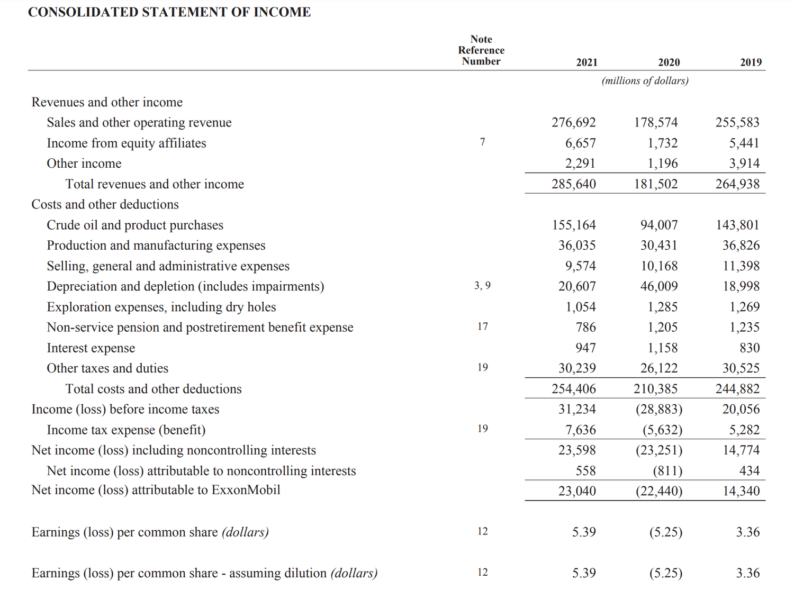

The financial world is a dynamic ecosystem, perpetually evolving with the integration of new technologies and methodologies. In this ever-shifting landscape, annual events and algorithmic trading are pivotal in shaping investment strategies and influencing returns. This article investigates into the exploration of these two influential elements to better understand their impact on market dynamics and investor decision-making processes.

Annual financial events, such as corporate earnings reports, shareholder meetings, and regulatory filings, serve as critical checkpoints that define corporate transparency and accountability. These events are instrumental in the decision-making processes of investors and analysts, as they provide essential data points for assessing the health and performance of companies and markets. By analyzing these events, investors can create informed strategies that align with financial regulations and market expectations.



Parallelly, algorithmic trading has emerged as a cornerstone of modern investment strategies, optimally leveraging advanced computational power and automated processes. By employing algorithms to execute trades based on predefined criteria, investors can enhance their decision-making efficacy, enabling quicker responses to market changes and the ability to manage larger volumes of trades than manual methods allow. Algorithmic trading optimizes investment performance by employing techniques such as backtesting, real-time monitoring, and statistical analysis, ultimately enhancing annual returns.

The interaction between traditional annual financial events and contemporary algorithmic trading practices presents a synergistic potential. This synergy allows investors to integrate traditional analytical methods with advanced technological tools, creating robust portfolios that capitalize on both historical and real-time market data. By doing so, they are able to adapt their investment strategies to maximize returns and minimize risks in a technologically advanced financial environment.

Encouraging the strategic integration of these insights into investor portfolios can significantly bolster investment outcomes. By staying informed of annual financial activities and utilizing algorithmic trading methodologies, investors can better navigate the complexities of the market and revamp their investment approaches in line with contemporary opportunities. Through this comprehensive understanding and adaptation, investors can maintain a competitive edge in the continually evolving financial markets.

## Table of Contents

## Understanding Annual Financial Events

Annual financial events are pivotal in defining critical touchpoints within financial and corporate operations. These events are integral to the structural framework that ensures the smooth and transparent operation of public companies and other financial entities.

### Key Annual Reports, Shareholder Meetings, and Regulatory Filings

Annual reports, shareholder meetings, and regulatory filings are primary components that offer transparency and accountability within corporations. 

#### Annual Reports

Annual reports are comprehensive documents that companies are required to produce each year, detailing their operational, financial, and managerial objectives. These reports include the financial statements – the balance sheet, income statement, and cash flow statement – which provide a detailed insight into a company's financial performance. The annual report also includes a management discussion and analysis (MD&A) section where executives explain the financial results and outline future strategies. 

#### Shareholder Meetings

Annual shareholder meetings are another critical touchpoint, providing a platform for the board of directors and management to communicate directly with shareholders. These meetings are an opportunity to discuss the company's performance and future strategies, and to vote on corporate decisions such as electing directors or approving mergers. Shareholders use this meeting to express concerns and hold management accountable.

#### Regulatory Filings

Regulatory filings, such as the 10-K form required by the Securities and Exchange Commission (SEC) in the United States, are essential for maintaining transparency and accountability. These filings provide a more in-depth analysis of company performance than annual reports and are legally mandated to ensure investors have access to accurate and timely information. 

### Impact on Corporate and Investor Strategies

Annual events influence corporate and investor strategies by providing critical information necessary for informed decision-making.

#### Taxes, Fees, and Reports

Annual taxes and fees are another layer of these events that corporations must navigate. Companies need to strategize adequately to handle tax liabilities, influencing decisions on everything from capital investments to dividend policies. Tax regulations evolve, and companies must adapt their strategies accordingly to optimize their financial outcomes.

Reports also play a significant role. For instance, sustainability reports, while not mandatory, have become increasingly significant as investors are more interested in the corporate social responsibility aspects of companies. These reports can influence investor sentiment and company valuation.

### Importance in Investor Decision-Making and Market Analysis

For investors, annual financial events are crucial for two primary reasons: they offer insights into the underlying health of a company and shape market expectations.

By reviewing annual reports and filings, investors can assess a company's performance, comparing it against industry benchmarks or historical performance. This comparison is crucial when making decisions about buying, holding, or selling securities. 

Moreover, the data from these reports and meetings impact market analysis. Large institutional investors and analysts use this information to adjust their market models and forecasts, affecting stock prices and market trends.

In conclusion, annual financial events serve vital roles in financial and corporate governance, offering transparency and guiding both corporate strategy and investor decision-making. They establish a framework that underpins the market function, ensuring that all stakeholders have access to reliable information to guide their economic choices.

## The Role of Annual Returns in Investment

Annual returns are a key metric used to evaluate the performance of an investment over a specified timeframe, typically one year. Understanding and analyzing these returns is crucial for assessing the effectiveness of investment strategies and ensuring that they align with long-term financial goals.

To calculate simple annual returns, the formula is:

$$
\text{Simple Annual Return} = \frac{\text{Ending Value} - \text{Beginning Value}}{\text{Beginning Value}} \times 100
$$

This calculation provides a direct percentage increase or decrease in the value of an investment over a year. While straightforward, simple annual returns do not account for the effects of compounding, which can significantly influence the growth of investments over time.

Compound annual returns, often referred to as the Compound Annual Growth Rate (CAGR), account for compounding. The formula for CAGR is:

$$
\text{CAGR} = \left( \frac{\text{Ending Value}}{\text{Beginning Value}} \right)^{\frac{1}{n}} - 1
$$

where $n$ is the number of years. CAGR provides a smoothed annual rate of growth that assumes the investment grows at the same rate every year. This measure is particularly useful for comparing the efficiency of investments over multiple years, offering a more realistic view of performance when reinvesting profits.

Annual returns are crucial for evaluating investment efficiency as they help investors understand how well an asset is performing relative to expectations and other potential investments. By assessing annual returns, investors can determine which assets align best with their strategic objectives, ensuring that portfolios are constructed to maximize returns while managing risk appropriately.

Comparing annual returns across various asset classes is vital for comprehensive market analysis and investment decision-making. Different asset classes, such as equities, bonds, real estate, and commodities, exhibit distinct risk and return profiles. For example, stocks might offer higher potential returns but come with greater [volatility](/wiki/volatility-trading-strategies), whereas bonds typically provide more stability with lower returns. By analyzing annual returns across these asset classes, investors can diversify their portfolios effectively, balancing risk and reward to achieve desired financial outcomes.

In summary, annual returns play a pivotal role in investment assessment, providing insights into performance, strategic alignment, and inter-asset comparison. Understanding both simple and compound annual returns allows investors to make informed decisions, optimizing their asset allocation to meet specific financial goals and adapt to changing market conditions.

## Algorithmic Trading: Enhancing Annual Returns

Algorithmic trading, often known as algo trading, employs complex algorithms to execute financial transactions with minimal human intervention. This practice uses computer systems to follow pre-set instructions for trading, taking into account variables like timing, price, and [volume](/wiki/volume-trading-strategy). In modern finance, [algorithmic trading](/wiki/algorithmic-trading) has become integral due to its efficiency and speed, greatly enhancing annual returns by optimizing investment strategies.

Algo trading optimizes strategies in several ways. Firstly, it reduces human error and emotion-driven decision-making. Algorithms execute trades based on data-driven insights, ensuring precision. Secondly, algo trading can perform transactions at a much faster rate than humans, capitalizing on market opportunities that may only exist for fractions of a second. Finally, by executing trades all through the trading day, algorithms ensure comprehensive market participation, which may enhance returns.

The processes constituting algorithmic trading include [backtesting](/wiki/backtesting) and real-time monitoring. Backtesting involves testing a trading algorithm on historical data to verify its viability. This step is critical for developing robust strategies. For instance, traders write Python scripts to test strategies using historical prices and volumes, providing insights into how the strategy would have performed in the past. An example script might look like:

```python
import pandas as pd
import numpy as np

# Load historical data
data = pd.read_csv('historical_data.csv')

# Define a simple moving average strategy
window = 50
data['SMA'] = data['Close'].rolling(window=window).mean()

# Identify buy/sell signals
data['Signal'] = np.where(data['Close'] > data['SMA'], 1, 0)

# Calculate returns
data['Return'] = data['Close'].pct_change()
data['Strategy_Return'] = data['Return'] * data['Signal'].shift(1)

# Cumulative returns
cumulative_return = (1 + data['Strategy_Return']).cumprod() - 1
print("Cumulative Strategy Return:", cumulative_return.iloc[-1])
```

Real-time monitoring, on the other hand, ensures that the algorithm functions optimally under current market conditions. Traders continuously monitor their algorithms to adjust to market changes swiftly, which is crucial for mitigating risk and maximizing profits.

The practical impact of algorithmic trading on investment returns is evident in its widespread acceptance among institutional investors and hedge funds. For example, quantitative funds using algorithmic trading strategies have significantly outperformed traditional mutual funds by exploiting inefficiencies in the market and generating alpha through sophisticated trading techniques.

In conclusion, algorithmic trading is instrumental in maximizing annual returns. Its ability to process vast amounts of data rapidly allows investors to apply meticulous trading strategies and maintain a competitive edge in the market. As technology continues to advance, the role of algorithmic trading in modern finance is expected to grow, further enhancing the efficiency and profitability of investment practices.

## Real-World Applications and Case Studies

QuantConnect, [Interactive Brokers](/wiki/interactive-brokers-api), and Alpaca are prominent platforms that facilitate algorithmic trading, each offering unique features that enhance trading precision, efficiency, and the potential for substantial returns.

QuantConnect provides an open-source algorithmic trading infrastructure, allowing developers and traders to design, backtest, and deploy strategies in a cloud-based environment. The platform supports several programming languages, including Python and C#, making it accessible to a wide range of users. QuantConnect's Lean Algorithm Framework enables users to simulate trades with historical data to optimize strategies before applying them to live markets. For instance, a [momentum](/wiki/momentum) strategy leveraging QuantConnect’s backtesting can track past asset price trends to predict future movements, potentially achieving a notable annualized return compared to the broader market.

Interactive Brokers (IB) offers extensive market access through its trading platform, which integrates algorithmic trading capabilities. With IB, traders can create sophisticated strategies using tools like the Trader Workstation (TWS) API, allowing for automation in executing trades based on predefined criteria. Real-world implementations might include a [pair trading](/wiki/pair-trading) algorithm, which identifies correlated securities and takes long and short positions accordingly. By registering the historical correlation between two assets, traders can exploit statistical deviations, increasing potential for consistent returns.

Alpaca provides commission-free trading, focusing on ease of integration through REST and WebSocket APIs, particularly appealing for developers implementing trading algorithms. Through Alpaca, strategies can execute trades based on real-time data, coupled with seamless connection to financial data streams. A case study might involve a simple moving average (SMA) crossover strategy, where an algorithm tracks two SMAs: one shorter and one longer (e.g., 50-day and 200-day). When the shorter SMA crosses above the longer one, a buy signal is triggered, potentially aligning investments with upward market trends.

These platforms support traders in developing sophisticated strategies by allowing back-testing, real-time monitoring, and API integration. The ability to execute precise trades with reduced emotional interference introduces efficiency, while their vast data access enhances strategy robustness. Thus, these tools align with modern trading requirements, supporting both novice and advanced traders in pursuing enhanced investment returns through algorithmic trading.

## Risk Management in Algorithmic Trading

Algorithmic trading introduces a plethora of opportunities for optimizing investment returns but is not without its inherent risks. A major [factor](/wiki/factor-investing) contributing to these risks is the speed and volume at which automated systems execute trades, often amplifying market volatility and potential errors. The key to mitigating these risks lies in effective risk management strategies tailored for algorithmic trading systems.

Diversification stands as a foundational principle in risk management. By allocating investments across a variety of asset classes, sectors, and geographic regions, traders can minimize the potential impact of volatility in any single market sector. This approach, often quantified using the Modern Portfolio Theory, seeks to minimize risk for a given level of expected return. The diversification process can be mathematically optimized using techniques such as the Mean-Variance Optimization:

$$
\text{Maximize } \frac{E(R_p) - R_f}{\sigma_p}
$$

where $E(R_p)$ is the expected portfolio return, $R_f$ is the risk-free rate, and $\sigma_p$ represents the portfolio's standard deviation.

Monitoring and strategic adjustments complement diversification by providing ongoing oversight and tuning of algorithmic strategies. Real-time analysis and performance metrics can signal when adjustments are necessary, allowing traders to refine or suspend algorithms in response to evolving market conditions. The continuous assessment of algorithms helps ensure they operate within predefined risk parameters, mitigating adverse impacts from rapid market shifts.

Stop-loss orders serve as an effective tool to limit potential losses. A stop-loss order automatically initiates a sell action when an asset reaches a specified price, providing a safety net against severe market downturns. Here's a basic example using Python:

```python
def apply_stop_loss(current_price, stop_loss_price):
    if current_price <= stop_loss_price:
        print("Sell order triggered!")
    else:
        print("Hold position.")

# Example usage
apply_stop_loss(current_price=48, stop_loss_price=50)
```

This simple logic halts losses by exiting positions at predetermined thresholds, contributing significantly to maintaining the integrity of the trading strategy.

A robust risk management framework involves comprehensive testing and validation of trading algorithms before deployment. Backtesting strategies on historical data is crucial for understanding potential pitfalls and performance issues in different market scenarios. Employing a rigorous risk assessment process, including scenario analysis and stress testing, ensures that algorithms are robust enough to withstand market fluctuations.

Incorporating these risk management techniques into algorithmic trading frameworks not only bolsters trading resilience but also enhances the potential for long-term success. As financial markets continue to evolve, establishing solid risk management protocols will be integral to leveraging the full potential of algorithmic trading systems.

## Conclusion

Annual financial events and algorithmic trading significantly shape today's investment landscapes, each contributing unique elements that influence decisions and performance. Annual events such as financial reports, shareholder meetings, and regulatory filings provide necessary transparency and accountability. They form a basis for investors to assess company performance, guide strategic planning, and evaluate market position. These events serve as foundational elements that inform various facets of market analysis and investor decision-making.

Algorithmic trading, on the other hand, represents the cutting-edge evolution of trading methods. It introduces efficiencies and accuracies that manual trading simply cannot match, utilizing mathematical models and complex algorithms to execute trades at speeds and frequencies beyond human capacity. This approach allows for optimizing investment strategies, enhancing annual returns, and managing risks dynamically. The integration of algorithmic trading with annual assessments allows investors to not only react to but anticipate market shifts with statistical backing.

Investors are therefore encouraged to embrace these technological advancements. The agility of algorithmic trading facilitates quick adaptations to market changes, maximizing returns while mitigating potential risks through strategies such as diversification and stop-loss orders. A comprehensive understanding and strategic incorporation of both traditional financial event assessments and modern algorithmic trading practices could lead to enhanced investment returns.

Looking to the future, the continuous progression of technologies and methodologies will further transform financial markets. As [artificial intelligence](/wiki/ai-artificial-intelligence) and [machine learning](/wiki/machine-learning) continue to evolve, they are likely to further refine algorithmic trading strategies, offering even more sophisticated tools for market analysis and decision-making. In this evolving landscape, success will depend on the ability to blend these emerging technologies with traditional financial practices, ensuring investors are well-positioned to capture opportunities and manage challenges efficiently.

## References & Further Reading

[1]: Bergstra, J., Bardenet, R., Bengio, Y., & Kégl, B. (2011). ["Algorithms for Hyper-Parameter Optimization."](https://dl.acm.org/doi/10.5555/2986459.2986743) Advances in Neural Information Processing Systems 24.

[2]: ["Advances in Financial Machine Learning"](https://www.amazon.com/Advances-Financial-Machine-Learning-Marcos/dp/1119482089) by Marcos Lopez de Prado

[3]: ["Evidence-Based Technical Analysis: Applying the Scientific Method and Statistical Inference to Trading Signals"](https://www.amazon.com/Evidence-Based-Technical-Analysis-Scientific-Statistical/dp/0470008741) by David Aronson

[4]: ["Machine Learning for Algorithmic Trading"](https://github.com/stefan-jansen/machine-learning-for-trading) by Stefan Jansen

[5]: ["Quantitative Trading: How to Build Your Own Algorithmic Trading Business"](https://www.amazon.com/Quantitative-Trading-Build-Algorithmic-Business/dp/1119800064) by Ernest P. Chan