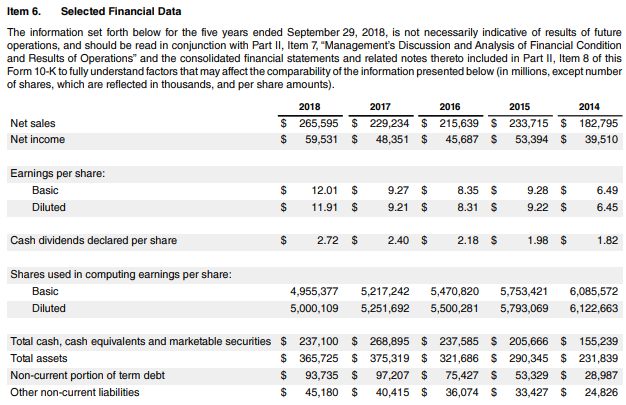

In today's fast-paced financial world, understanding corporate reporting and financial statements is crucial for investors, analysts, and stakeholders. Annual reports serve as a foundation for corporate transparency, providing insights into a company's performance and strategic direction. These reports present a detailed account of a company's financial health, operational activities, and future plans, making them an essential tool for informed decision-making.

The evolution of technology has significantly impacted financial markets, notably through the emergence of algorithmic trading. This form of trading utilizes computer algorithms to execute orders based on pre-defined criteria, often at speeds and efficiencies that surpass human capabilities. In this context, the accuracy and timeliness of financial data have become more critical than ever. Accurate corporate reporting ensures that algorithmic trading systems have reliable data to function optimally, thereby influencing market liquidity and stability.



This article examines the intricate connections between annual reports, financial statements, corporate reporting, and algorithmic trading. As these relationships continue to develop, the role of comprehensive and precise financial documentation cannot be overstated, emphasizing the ever-growing need for stringent reporting practices and regulatory oversight.

## Table of Contents

## Understanding Annual Reports

An annual report is a crucial document that public corporations are required to provide to shareholders and other stakeholders, containing comprehensive details about the company's financial condition, operational activities, and plans for the future. This document plays a vital role in maintaining transparency and accountability within corporations, serving as a key communication tool between the company and its investors.

Following the 1929 stock market crash, the need for standardized corporate financial reporting became apparent, leading to regulations that mandate the publication of annual reports. This regulatory framework aims to restore investor confidence by ensuring that companies present accurate and consistent financial information.

The annual report is typically composed of several key components, each serving a distinct purpose in conveying the company's performance and strategy. The sections usually include:

1. **Corporate Information**: This section provides an overview of the company's identity, including its mission, vision, values, and often a letter to shareholders from the CEO or chairman. It sets the tone of the report and highlights significant achievements and goals.

2. **Financial Statements**: These are essential components that offer quantitative insights into the company's financial health. The primary financial statements include:
   - **Balance Sheet**: Displays the company's assets, liabilities, and shareholders' equity at a specific point in time. It is used to evaluate the company's financial position and liquidity.
   - **Income Statement**: Reports the company's financial performance over a particular period, detailing revenues, expenses, and profits. It helps stakeholders understand the company's operating efficiency and profitability.
   - **Cash Flow Statement**: Provides a summary of cash inflows and outflows from operating, investing, and financing activities, highlighting how the company generates and uses cash.
   - **Statement of Changes in Equity**: Illustrates changes in the company's equity over the reporting period, including profits retained and dividends paid.

3. **Management’s Discussion and Analysis (MD&A)**: This section offers a narrative explanation of the financial statements, where management discusses the financial results, business performance, risks, and future outlook. It provides context that quantitative data alone cannot convey, helping stakeholders gain a deeper understanding of the factors influencing the company's operations.

Overall, annual reports serve as a foundational element of corporate governance, ensuring that stakeholders have access to the information required for making informed investment decisions. The clarity and detail provided in these reports contribute to a transparent financial ecosystem, fostering trust and engagement among investors and the broader financial community.

## Components of Financial Statements

Financial statements are integral components of an annual report and are essential for evaluating a company’s fiscal health. They serve to provide a snapshot of a company's financial performance over a specific period, allowing stakeholders to make informed decisions.

The balance sheet, also known as the statement of financial position, is one of the primary financial statements. It reflects a company’s assets, liabilities, and shareholders’ equity at a particular point in time. Key equations governing the balance sheet are:

$$
\text{Assets} = \text{Liabilities} + \text{Equity}
$$

This equation ensures that the balance sheet is balanced and provides insights into a company's financial structure, [liquidity](/wiki/liquidity-risk-premium), and capital adequacy.

The income statement, or profit and loss statement, provides details of a company’s revenues, expenses, and profits over a specific period. It essentially measures the company’s profitability by presenting a summary of its revenue streams and expenditures. A crucial calculation from the income statement is the net income:

$$
\text{Net Income} = \text{Total Revenue} - \text{Total Expenses}
$$

The cash flow statement elaborates on the inflow and outflow of cash within a company over a period. It is segmented into three sections: cash flows from operating activities, investing activities, and financing activities. This statement ensures stakeholders understand how the company generates and uses cash, thus providing a clearer picture of its liquidity and long-term solvency.

Finally, the statement of changes in equity, often known as the statement of retained earnings, reconciles the equity at the start of the period with that at the end. It includes transactions such as dividends and contributions from or distributions to shareholders. This statement is crucial for understanding the factors influencing changes in stockholders’ equity.

These financial documents collectively offer a comprehensive view of a company's financial performance, facilitating stakeholders' ability to conduct thorough analyses and make well-informed investment decisions. Accurate interpretation of these statements is vital for assessing financial risk and forecasting future performance.

## The Role of Corporate Reporting

Corporate reporting is a vital process by which organizations communicate their financial performance, strategic plans, and operational insights to stakeholders, including investors, regulators, and the general public. This communication is essential for maintaining investor confidence, as it ensures stakeholders have access to accurate and comprehensive information about a company's financial health and business operations. The transparency offered by corporate reporting helps reduce information asymmetry, thus enabling informed decision-making by investors and other interested parties.

One of the primary purposes of corporate reporting is to ensure compliance with regulatory requirements. Regulatory bodies, such as the Securities and Exchange Commission (SEC) in the United States, mandate that public companies adhere to strict reporting standards. These standards are designed to provide consistency and comparability across different companies and industries, which facilitates fair analysis and evaluation of corporate performance. Compliance with these regulations is critical not only for legality but also for cultivating trust among stakeholders.

Corporate reporting is not static; it continuously evolves in response to changes in the regulatory landscape and the increasing demand for greater transparency from companies. Regulatory frameworks are often updated to address emerging financial risks and to incorporate new accounting practices. For example, the adoption of International Financial Reporting Standards (IFRS) has been a significant development in global corporate reporting, promoting a uniform accounting language across borders.

The demand for transparency has grown alongside the rise of socially conscious and environmentally aware investors who prioritize sustainable and responsible business practices. Companies are now expected to report not only their financial performance but also their sustainability efforts and impacts. This has led to the emergence of Environmental, Social, and Governance ([ESG](/wiki/esg-investing)) reporting, which provides insights into a company’s commitment to sustainable business practices.

Modern corporate reporting also embraces technological advancements to enhance the accessibility and usability of financial information. Digital reporting tools and platforms allow companies to present their data interactively, making it easier for stakeholders to analyze and interpret the information. Moreover, the integration of technologies like blockchain in corporate reporting processes holds promise for further improving the accuracy and reliability of reported data.

In summary, corporate reporting is a cornerstone of the financial ecosystem, essential for maintaining transparency, regulatory compliance, and stakeholder trust. As regulatory environments and stakeholder expectations continue to evolve, companies must adapt their reporting practices to meet these challenges, ensuring the ongoing integrity and relevance of the information they provide.

## Algorithmic Trading: An Overview

Algorithmic trading is a method of executing orders using automated pre-programmed trading instructions. This practice relies on mathematical models and extensive data analysis. The computer algorithms used in [algorithmic trading](/wiki/algorithmic-trading) determine vital aspects such as timing, price, and quantity of trade orders, thereby optimizing the efficiency and speed at which these transactions are carried out. 

The automation of trading strategies allows large orders to be broken down and executed in smaller quantities over time, reducing market impact and increasing the likelihood of achieving desired trade outcomes. This capability is particularly crucial in high-frequency trading scenarios, where speed and precision are paramount. Algorithmic trading helps in enhancing liquidity, improving market efficiency, and reducing transaction costs.

A significant aspect of algorithmic trading is its dependence on comprehensive financial data analysis. As such, it demands accurate and timely corporate reporting to support its decision-making processes. The data extracted from financial statements is crucial for evaluating market conditions, identifying potential opportunities, and executing trades that could optimize returns.

Moreover, integrating [artificial intelligence](/wiki/ai-artificial-intelligence) (AI) and [machine learning](/wiki/machine-learning) (ML) into algorithmic trading systems further enhances their capabilities. These technologies enable systems to learn from historical data, recognize patterns, and adapt strategies dynamically based on new data inputs. For example, machine learning algorithms can be trained to predict asset price movements or to identify profitable trading signals based on complex data sets. Python, with libraries like TensorFlow and PyTorch, is commonly used in developing these AI-driven trading models due to its versatility and robust support for numerical and data analysis.

In summary, algorithmic trading leverages the power of computer algorithms to streamline and enhance trading processes. The accuracy of financial data and the integration of AI and ML technologies continue to refine the capabilities of algorithmic trading, making it an indispensable tool in modern financial markets.

## Impact of Financial Statements on Algorithmic Trading

Algorithmic trading systems leverage computational algorithms to execute trades at speeds and frequencies unattainable by human traders. These systems rely significantly on financial statements and annual reports to analyze and synthesize data into actionable trading strategies. The precision and timeliness of the data contained within these reports are crucial for algorithmic processes that integrate both historical and real-time data inputs.

Annual reports and financial statements are essential as they provide both quantitative data (e.g., revenue, expenses, profit margins) and qualitative insights (e.g., management’s analysis, risk factors) necessary for algorithms to make informed decisions. The interrelation between different financial metrics, such as the income statement's impact on a company's cash flow statement, can be critical inputs for algorithms designed to predict market movements or evaluate investment opportunities.

For example, consider a simplistic algorithm designed to make stock purchase decisions based on the price-to-earnings (P/E) ratio derived from financial statements. The Python code for calculating the P/E ratio could look like this:

```python
def calculate_pe_ratio(stock_price, earnings_per_share):
    if earnings_per_share == 0:
        return float('inf')  # Infinite P/E ratio if earnings per share is zero
    return stock_price / earnings_per_share

# Example usage
stock_price = 100
earnings_per_share = 5
pe_ratio = calculate_pe_ratio(stock_price, earnings_per_share)
print(f"The P/E ratio is: {pe_ratio}")
```

Accurate, timely, and transparent financial reporting directly influences the effectiveness and reliability of such trading algorithms. The reports provide a foundation of trust and ensure that the data input into algorithms reflects the most recent and relevant information, reducing the risk of erroneous trading decisions. Furthermore, with the increasing integration of artificial intelligence and machine learning technologies, algorithmic systems are becoming more adept at identifying patterns and predicting outcomes based on financial data, enhancing their impact on financial markets.

In conclusion, the congruence between financial statements and algorithmic trading underscores the importance of meticulous corporate reporting. When financial statements are both accurate and timely, they not only comply with regulatory standards but also serve as a linchpin for the smooth operation of automated trading systems. This dynamic has profound implications for market dynamics, as reliable data informs trading decisions that can affect volumes, liquidity, and pricing in financial markets.

## Conclusion

Annual reports, financial statements, and corporate reporting are fundamental components in the financial ecosystem, serving as the backbone for critical decision-making processes for investors, analysts, and stakeholders. These documents collectively ensure that a company's financial condition and operational activities are transparently communicated, building trust and facilitating informed investment decisions.

In the era of algorithmic trading, the significance of timely and accurate financial reporting is amplified. Algorithmic trading systems, which execute orders at speeds and frequencies impossible for human traders, rely on precise and up-to-date financial data. Discrepancies or delays in reporting can lead to substantial impacts on trading decisions and market dynamics. Thus, the role of comprehensive financial documentation becomes even more critical, as they form the dataset for these automated systems.

As technology evolves, the accuracy and integrity of financial reporting are more crucial than ever. The integration of artificial intelligence and machine learning into trading strategies demands impeccable data accuracy, pushing for more rigorous financial reporting standards and practices. Regulatory oversight is necessary to ensure these practices meet the evolving standards of transparency and accountability. Consequently, maintaining stringent controls and audit procedures is essential to uphold the credibility of corporate reporting, ensuring that stakeholders, including algorithmic traders, have access to reliable and timely data.

## References & Further Reading

[1]: Bergstra, J., Bardenet, R., Bengio, Y., & Kégl, B. (2011). ["Algorithms for Hyper-Parameter Optimization."](https://dl.acm.org/doi/10.5555/2986459.2986743) Advances in Neural Information Processing Systems 24.

[2]: ["Advances in Financial Machine Learning"](https://www.amazon.com/Advances-Financial-Machine-Learning-Marcos/dp/1119482089) by Marcos Lopez de Prado

[3]: ["Evidence-Based Technical Analysis: Applying the Scientific Method and Statistical Inference to Trading Signals"](https://www.amazon.com/Evidence-Based-Technical-Analysis-Scientific-Statistical/dp/0470008741) by David Aronson

[4]: ["Machine Learning for Algorithmic Trading"](https://github.com/stefan-jansen/machine-learning-for-trading) by Stefan Jansen

[5]: ["Quantitative Trading: How to Build Your Own Algorithmic Trading Business"](https://www.amazon.com/Quantitative-Trading-Build-Algorithmic-Business/dp/1119800064) by Ernest P. Chan