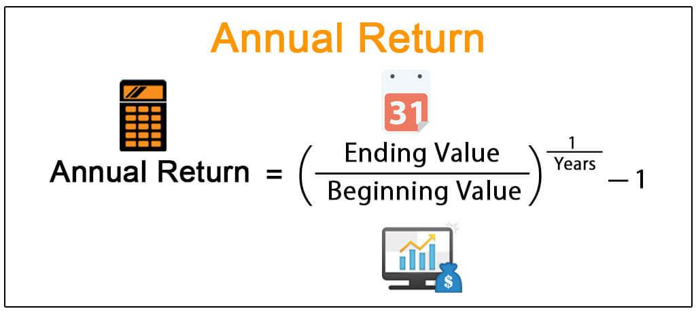

## Table of Contents

## What is an annual return?

An annual return is the amount of money an investment makes in one year. It is usually shown as a percentage. For example, if you invest $100 and it grows to $105 in a year, the annual return is 5%.

Annual returns are important because they help you see how well an investment is doing over time. They can be used to compare different investments. Keep in mind that past annual returns do not guarantee future results, but they can give you a good idea of what to expect.

## Why is the annual return important for investors?

The annual return is important for investors because it tells them how much money their investment made in one year. This helps them understand if their investment is doing well or not. If the annual return is high, it means the investment grew a lot in that year. If it's low or negative, it means the investment didn't grow much or even lost money.

Investors use the annual return to compare different investments. For example, if one investment has an annual return of 5% and another has 10%, the second one might seem better. But, it's also important to look at other things like risk and how long the money is tied up. Knowing the annual return helps investors make smarter choices about where to put their money.

## How do you calculate the annual return for an investment?

To calculate the annual return for an investment, you need to know the starting value, the ending value, and how long the investment lasted. If it was for exactly one year, it's simple. Subtract the starting value from the ending value to find the gain or loss. Then, divide that gain or loss by the starting value and multiply by 100 to get the percentage. For example, if you invested $100 and it grew to $105 after one year, the gain is $5. Divide $5 by $100 to get 0.05, and then multiply by 100 to get a 5% annual return.

If the investment lasted for more or less than a year, you need to adjust the calculation. First, find the total return by subtracting the starting value from the ending value and dividing by the starting value, just like before. Then, you need to figure out the annual return by using the formula: Annual Return = (1 + Total Return)^(1/Number of Years) - 1. For example, if you invested $100 and it grew to $110 in two years, the total return is 10%. To find the annual return, you calculate (1 + 0.10)^(1/2) - 1, which equals about 4.88%. This means the investment grew by about 4.88% each year on average.

## What is the difference between simple annual return and compound annual return?

Simple annual return is easy to figure out. It's just how much more money you have at the end of one year compared to the start, shown as a percentage. If you put in $100 and get $105 at the end of the year, the simple annual return is 5%. This way of calculating return doesn't think about any money you might earn on the money you've already earned, which is called compounding.

Compound annual return, or CAGR (Compound Annual Growth Rate), looks at how your investment grows over time, including the effect of compounding. If you keep your money in an investment for more than one year, the money you earn in one year can earn more money in the next year. For example, if you start with $100 and it grows to $110 in two years, the compound annual return would be about 4.88%. This is different from the simple annual return because it takes into account the growth of your earnings over time.

## Can you provide an example of calculating the simple annual return?

Let's say you put $100 into an investment at the start of the year. By the end of the year, your investment has grown to $105. To find the simple annual return, you subtract the starting amount from the ending amount, which gives you a gain of $5. Then, you divide that $5 gain by the starting amount of $100. This gives you 0.05. Finally, you multiply 0.05 by 100 to turn it into a percentage. So, the simple annual return is 5%.

Simple annual return is useful because it tells you how much your money grew in one year. It's easy to understand and calculate, but it doesn't take into account any earnings you might make on your earnings, which is called compounding. If you want to see how your investment grows over time, including the effect of compounding, you would need to calculate the compound annual return instead.

## How does the time period affect the annual return calculation?

The time period you look at can change how you see the annual return. If you only look at one year, you get the simple annual return. This is easy to figure out because you just see how much your money grew in that year. But if you want to know how your money grew over more than one year, you need to use a different way to calculate it. This is where the compound annual return comes in. It looks at the whole time you had your money invested and shows you the average growth each year, including the money you earned on your earnings.

For example, if you put $100 into an investment and it grows to $110 in two years, the simple annual return for each year would be 5% if you just looked at the total growth. But, if you use the compound annual return, you would see that your money actually grew by about 4.88% each year on average. This difference happens because the compound annual return takes into account the effect of your earnings growing over time. So, the time period you choose to look at can make a big difference in how you understand your investment's performance.

## What are the limitations of using annual return as a performance measure?

Using annual return as a way to measure how well an investment is doing has some problems. One big problem is that it only looks at how much money you made in one year. It doesn't tell you about the ups and downs your investment might have had during that time. If your investment went up and down a lot but ended up with a good annual return, you might think it was less risky than it really was. Also, annual return doesn't tell you about other costs, like fees you might have to pay, which can make your real return smaller.

Another problem with annual return is that it doesn't show you the whole picture over a long time. It's just a snapshot of one year. If you want to see how an investment does over many years, you need to look at the compound annual return. This way, you can see how your money grows over time, including the money you earn on your earnings. But even then, past annual returns don't promise you'll get the same results in the future. So, while annual return can be helpful, it's not the only thing you should look at when deciding if an investment is good or not.

## How can annual return be used to compare different investments?

Annual return is a useful tool for comparing different investments because it shows you how much money each investment made in one year. If you have two investments, you can look at their annual returns to see which one grew more in that year. For example, if one investment has an annual return of 5% and another has 10%, the second one made more money in that year. This can help you decide which investment might be better for you. But remember, it's important to look at more than just the annual return. You should also think about how risky the investments are and any fees you might have to pay.

It's also good to know that annual return can help you see how an investment has done over time. If you look at the annual returns for several years, you can get a better idea of how steady or up and down an investment has been. This can help you compare investments over the long run. For example, if one investment has had a steady 6% annual return for five years, and another has had returns that jump between 2% and 12%, the first one might seem safer even if the second one sometimes has higher returns. So, using annual return to compare investments can give you a lot of helpful information, but it's just one part of the bigger picture.

## What role does inflation play in the real annual return of an investment?

Inflation is important when you look at the real annual return of an investment. It's the rate at which the prices of things you buy go up over time. If inflation is high, the money you get from your investment might not buy as much as it used to. So, even if your investment has a good annual return, if inflation is high, the real value of your money might not grow as much as you think. To find the real annual return, you need to take away the inflation rate from your investment's annual return.

For example, if your investment has an annual return of 5% and inflation is 3%, your real annual return is only 2%. This means your money is only growing by 2% in terms of what it can actually buy. It's important to think about inflation when you're looking at how well your investments are doing. If you don't, you might think your money is growing more than it really is. So, always remember to check the inflation rate and use it to find out your real annual return.

## How do taxes impact the annual return of an investment?

Taxes can lower the annual return of an investment. When you earn money from your investment, you might have to pay taxes on that money. The tax you pay depends on things like where you live and how much money you made. If you have to pay a lot in taxes, it means you get to keep less of the money your investment made. For example, if your investment has an annual return of 10% but you have to pay 30% in taxes, you only get to keep 7% of that return after taxes.

It's important to think about taxes when you're looking at how well your investments are doing. The money you have to pay in taxes can make a big difference in your real annual return. Some investments might have special tax rules that can help you keep more of your money. For example, some retirement accounts let your money grow without being taxed until you take it out. So, when you're choosing where to put your money, think about how taxes might affect your annual return.

## What advanced metrics can be used alongside annual return to better assess investment performance?

Alongside annual return, there are other advanced metrics that can help you better understand how well your investment is doing. One important metric is the Sharpe Ratio. This tells you how much extra return you're getting for the risk you're taking. If the Sharpe Ratio is high, it means your investment is doing well compared to how risky it is. Another useful metric is the standard deviation, which shows how much your investment's returns go up and down. A high standard deviation means your investment can be very unpredictable, which might make it riskier.

Another metric you can use is the beta, which tells you how your investment moves with the market. If your investment has a high beta, it means it goes up and down a lot more than the market. This can be good or bad, depending on what you're looking for. Lastly, the alpha measures how well your investment does compared to what you would expect based on its risk level. A positive alpha means your investment is doing better than expected. Using these metrics along with the annual return can give you a fuller picture of how your investment is performing and help you make better decisions.

## How can annual return be adjusted for risk to provide a more comprehensive analysis?

To get a better idea of how well your investment is doing, you can adjust the annual return for risk. One way to do this is by using the Sharpe Ratio. This ratio looks at how much more return you're getting for the risk you're taking. If the Sharpe Ratio is high, it means your investment is doing well compared to how risky it is. This can help you see if the extra return you're getting is worth the risk. Another way to adjust for risk is by looking at the standard deviation of your investment's returns. A high standard deviation means your investment goes up and down a lot, which can be riskier. By knowing this, you can see if the annual return you're getting is worth the ups and downs.

Another useful metric is the beta, which tells you how your investment moves with the market. If your investment has a high beta, it means it goes up and down more than the market. This can be good or bad, depending on what you're looking for. A high beta might mean you can get higher returns, but it also means you might lose more money if the market goes down. Lastly, you can look at the alpha, which measures how well your investment does compared to what you would expect based on its risk level. A positive alpha means your investment is doing better than expected. By using these metrics along with the annual return, you can get a fuller picture of how your investment is performing and make smarter choices about where to put your money.

## What is Understanding Annual Return?

An annual return represents the yearly performance of an investment, expressed as a percentage. It captures capital gains, dividends, and interest, thus offering a holistic view of an asset's profitability over a specified period. By considering these facets, the annual return serves as an essential metric for investors to assess the effectiveness of different investment vehicles comprehensively.

Calculating annual returns enables investors to make informed decisions regarding portfolio management and helps them achieve their financial objectives. This measure allows for straightforward comparison between the financial outcomes of various assets, which is vital for aligning investments with personal or institutional goals.

Mathematically, the simple annual return can be calculated using the following formula:

$$
\text{Annual Return (\%)} = \left( \frac{\text{Ending Value} - \text{Beginning Value} + \text{Dividends}}{\text{Beginning Value}} \right) \times 100
$$

This formula provides a basic understanding by incorporating the dividends received, offering a snapshot of the investment's yearly performance.

Moreover, annual returns facilitate comparative analysis across different asset classes. For instance, comparing the annual returns of stocks, bonds, and real estate investments allows investors to discern which assets align best with their risk tolerance and expected outcomes.

Beyond mere calculation, effectively interpreting annual returns is crucial for accommodating varying financial landscapes and economic conditions. By understanding the nuances of how annual returns reflect on investment strategies, investors can align their portfolios more closely with their long-term financial objectives. This strategic insight ensures that the investments made today are aligned with future requirements and personal financial aspirations, making annual return an indispensable tool in an investor's toolkit.

## How do you calculate annual returns?

To fully grasp the measurement of annual returns, it is essential to understand the calculation methods involved. These methods offer insights into how investments perform relative to initial capital over specified periods and are crucial for informed decision-making and strategy evaluation.

### Simple Annual Return

The simple annual return is a straightforward measure that indicates the percentage gain or loss of an investment over a single year. It is calculated by subtracting the initial investment value from the final investment value, dividing the result by the initial investment value, and then multiplying by 100 to convert it into a percentage. The formula is represented as:

$$
\text{Simple Annual Return} = \left( \frac{\text{Ending Value} - \text{Initial Value}}{\text{Initial Value}} \right) \times 100
$$

For instance, if an investment grows from $10,000 to $11,500 over a year, the simple annual return would be:

$$
\left( \frac{11,500 - 10,000}{10,000} \right) \times 100 = 15\%
$$

This method provides a quick snapshot but has limitations in assessing investments held over multiple years or those with varying time frames.

### Compound Annual Growth Rate (CAGR)

For a more nuanced analysis over extended periods, the Compound Annual Growth Rate (CAGR) is preferred as it accounts for the effects of compounding, which can significantly impact investment efficiency. CAGR provides a smoothed annual rate of return, effectively averaging annual returns over a specified duration, assuming the investment compounds each year. The CAGR formula is:

$$
\text{CAGR} = \left( \frac{\text{Ending Value}}{\text{Initial Value}} \right)^{\frac{1}{n}} - 1
$$

where $n$ is the number of years the investment is held.

For example, if an asset grows from $10,000 to $15,000 over 3 years, the CAGR would be:

$$
\left( \frac{15,000}{10,000} \right)^{\frac{1}{3}} - 1 \approx 0.1447 \text{ or } 14.47\%
$$

### Practical Calculation Using Python

Using Python, investors can easily compute these returns, especially beneficial for complex portfolios or longer durations involving compounding.

```python
def calculate_simple_return(initial_value, ending_value):
    return ((ending_value - initial_value) / initial_value) * 100

def calculate_cagr(initial_value, ending_value, years):
    return ((ending_value / initial_value) ** (1 / years) - 1) * 100

# Example usage
initial_investment = 10000
final_value = 15000
years = 3

simple_return = calculate_simple_return(initial_investment, final_value)
cagr = calculate_cagr(initial_investment, final_value, years)

print(f"Simple Annual Return: {simple_return:.2f}%")
print(f"Compound Annual Growth Rate (CAGR): {cagr:.2f}%")
```

By utilizing these methods, investors can better evaluate and compare different investment vehicles, aligning their portfolios with longer-term financial objectives effectively. Understanding these calculations is not just a numerical exercise but a critical component of strategic investment planning.

## References & Further Reading

[1]: Bergstra, J., Bardenet, R., Bengio, Y., & Kégl, B. (2011). ["Algorithms for Hyper-Parameter Optimization."](https://dl.acm.org/doi/10.5555/2986459.2986743) Advances in Neural Information Processing Systems 24.

[2]: ["Advances in Financial Machine Learning"](https://www.amazon.com/Advances-Financial-Machine-Learning-Marcos/dp/1119482089) by Marcos Lopez de Prado

[3]: ["Evidence-Based Technical Analysis: Applying the Scientific Method and Statistical Inference to Trading Signals"](https://www.amazon.com/Evidence-Based-Technical-Analysis-Scientific-Statistical/dp/0470008741) by David Aronson

[4]: ["Machine Learning for Algorithmic Trading"](https://github.com/PacktPublishing/Machine-Learning-for-Algorithmic-Trading-Second-Edition) by Stefan Jansen

[5]: ["Quantitative Trading: How to Build Your Own Algorithmic Trading Business"](https://books.google.com/books/about/Quantitative_Trading.html?id=j70yEAAAQBAJ) by Ernest P. Chan