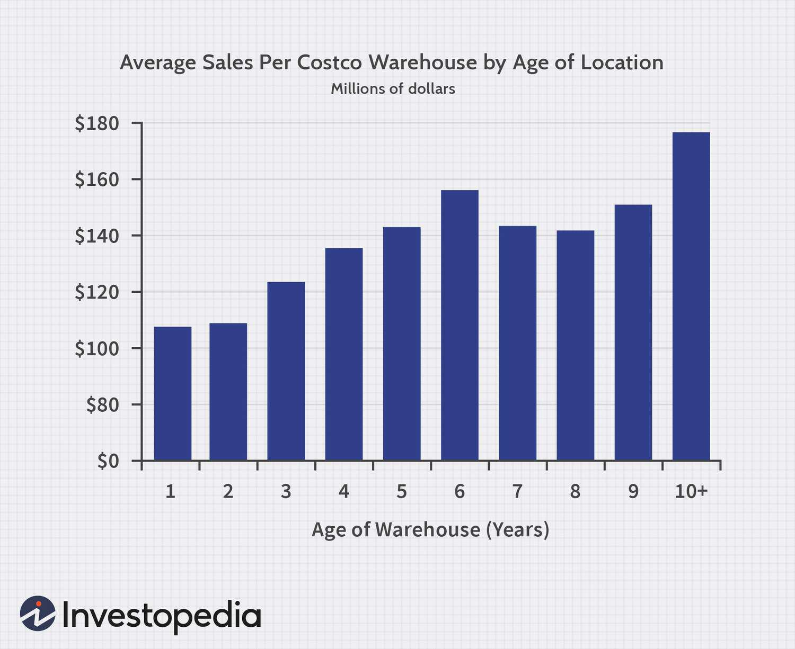

Analyzing retail performance has become increasingly crucial in today's dynamic market environment, where consumer preferences and technological advancements are rapidly evolving. Retailers must adapt to these changes to remain competitive and sustain growth. In this context, Costco Wholesale Corporation stands out as a prominent player in the global retail sector, renowned for its warehouse club membership model and competitive pricing strategies. As a leader in the retail industry, Costco's operational strategies and performance metrics are closely scrutinized to gain insights into successful retail practices.

Costco's significant role in the retail sector is evidenced by its expansive global network of warehouses, diversified product offerings, and strong membership base. The company's ability to maintain low prices while offering high-quality products has earned it a loyal customer following. This success is reflected in its impressive annual revenues and consistent growth over the years, positioning Costco as a critical benchmark for analyzing retail success factors.

In recent years, the integration of algorithmic trading has emerged as a novel approach in the retail industry, aimed at enhancing sales strategies and optimizing operational efficiency. Algorithmic trading involves using advanced algorithms to analyze massive datasets, thereby enabling retailers to make informed decisions related to inventory management, pricing strategies, and demand forecasting. By harnessing technology-driven insights, retailers can respond more swiftly and accurately to market trends and consumer demand fluctuations.

This article aims to explore the interplay between Costco's sales performance and the impact of algorithmic trading on retail revenue. It seeks to highlight how Costco, as a retail giant, might leverage algorithmic trading to further enhance its strategic capabilities in this competitive landscape. The discussion will be structured around key areas, including an overview of Costco’s sales metrics and trading algorithms, offering a comprehensive perspective on how advanced technologies can influence retail performance.

In summary, this article will provide insights into the significance of retail performance analysis, with a specific focus on Costco's strategies. It will also examine the potential of algorithmic trading as a transformative tool in the retail sector, offering a glimpse into future trends and strategies that could redefine retail success.

## Table of Contents

## Costco's Retail Performance and Annual Revenue

Costco Wholesale Corporation holds a prominent position in the global retail industry, renowned for its distinctive business model of membership-only warehouse clubs. It ranks as one of the largest retailers worldwide, competing alongside giants like Walmart and Amazon. Costco's appeal lies in its ability to offer bulk products at discounted prices, attracting both individual consumers and small business owners. This unique selling proposition has positioned Costco as a formidable player in the retail market.

### Annual Revenue and Growth Trends

Costco has consistently demonstrated robust financial performance, with its annual revenue depicting a steady upward trajectory. In the fiscal year 2022, the company reported a revenue of $227 billion, representing a growth of about 17% compared to the previous year. This consistent growth can be attributed to Costco's strategic expansion plans and its ability to maintain high membership renewal rates. Over the past five years, Costco's compound annual growth rate (CAGR) for revenue has averaged approximately 10%, underscoring its significant market presence.

### Factors Contributing to Sales Growth

Several factors underpin Costco's impressive sales growth. Primarily, membership fees play a crucial role in driving revenue. Costco charges annual membership fees for access to its stores, contributing substantially to its income. In fiscal year 2022, membership fee revenue alone amounted to over $4 billion. High renewal rates, often exceeding 90%, ensure a steady stream of revenue and reflect strong customer loyalty.

Additionally, Costco's product diversification strategy bolsters its sales performance. By offering a wide range of products, including groceries, electronics, apparel, and household items, Costco meets diverse consumer needs. This product variety not only attracts a broad customer base but also encourages larger basket sizes, increasing average transaction values.

### Revenue Growth Compared to Industry Averages

In comparison to industry and market averages, Costco's revenue growth stands out as exceptional. The global retail industry generally experiences a modest growth rate due to fierce competition and market saturation. However, Costco's growth rate surpasses many of its competitors, reflecting its successful business strategy. For instance, while the retail sector as a whole witnessed an average growth rate of 4-5% annually, Costco's growth rate consistently outpaces this benchmark, illustrating its competitive edge.

### Regional and Product Category Revenue Distribution

Costco's revenue distribution varies across different regions and product categories. The United States remains its largest market, contributing approximately 70% of its overall revenue. International markets, including Canada, Mexico, and parts of Asia and Europe, account for the remaining 30%, highlighting Costco's global reach and expansion efforts.

In terms of product categories, groceries form the largest share of Costco's revenue, aligning with consumer demand for bulk household essentials. However, non-food categories like electronics and apparel have shown considerable growth, reflecting shifts in consumer preferences and Costco's adaptability in offering a broad product spectrum.

In conclusion, Costco's dynamic approach to retailing—emphasizing membership retention, product diversification, and strategic global expansion—underpins its strong retail performance and competitive market position. Its ability to consistently outpace industry growth rates reaffirms its status as a leading player in the global retail landscape.

## The Role of Algorithmic Trading in Retail

Algorithmic trading has revolutionized various sectors, including retail, by employing complex algorithms to facilitate high-frequency trading and data-driven decision-making. In the retail industry, [algorithmic trading](/wiki/algorithmic-trading) refers to the use of automated and systematic trading strategies that analyze a vast amount of data to make informed decisions on inventory procurement, sales forecasting, and pricing strategies.

The application of algorithmic trading in retail provides substantial benefits. First and foremost, it enhances accuracy in sales forecasting. Algorithms can process historical sales data, market trends, and consumer preferences simultaneously to predict future sales with high precision. This precision enables retailers to optimize stock levels, minimizing the risk of overstocking or stockouts, thus reducing carrying costs and lost sales opportunities.

Moreover, algorithmic trading is instrumental in dynamic pricing strategies. By analyzing competitor pricing, demand fluctuations, and customer buying patterns, algorithms can adjust prices in real-time to maximize profitability and competitiveness. This capability ensures that retailers remain agile and responsive to market conditions without manual intervention.

Inventory management is another area where algorithms offer significant efficiencies. By automatically assessing inventory turnover rates, lead times, and demand variability, algorithms can suggest optimal restocking schedules and quantities. This automated approach maximizes inventory turnover while maintaining adequate stock levels to satisfy customer demand.

Despite these advantages, implementing algorithmic trading in retail is not without challenges. One primary concern is the quality and quantity of data required. Retailers must ensure their data is clean, current, and comprehensive to prevent erroneous outputs from the algorithms. Additionally, there are technological hurdles, as the integration of sophisticated algorithms necessitates robust IT infrastructure and investment in specialized expertise to monitor and refine these systems.

Another challenge is the potential for market [volatility](/wiki/volatility-trading-strategies) caused by algorithm-induced trading patterns, necessitating safeguards to mitigate adverse impacts. Ethical considerations also arise, as algorithms making autonomous decisions could conflict with customer fairness and transparency.

Technological advancements continually enhance algorithmic trading capabilities, especially with the rise of [machine learning](/wiki/machine-learning) and [artificial intelligence](/wiki/ai-artificial-intelligence). These technologies allow algorithms to learn from new data inputs, improving their predictive accuracy and strategic effectiveness over time. Retailers leveraging these advancements can gain a competitive edge through intelligent automation and enhanced decision-making processes.

In conclusion, algorithmic trading presents a promising avenue for the retail sector, offering benefits in sales forecasting, pricing strategies, and inventory management. However, successful implementation demands high-quality data, robust infrastructure, and vigilant oversight to mitigate risks and fully capitalize on these technological innovations.

## Interconnection Between Costco's Sales and Algorithmic Trading

Costco Wholesale Corporation, renowned for its membership-only warehouse clubs, presents a compelling case for understanding the potential synergies between retail sales performance and algorithmic trading strategies. Leveraging algorithmic trading, Costco can enhance its sales performance by optimizing inventory management, refining pricing strategies, and gaining insightful forecasts.

Costco can potentially utilize algorithmic trading to refine inventory management. Algorithms can analyze vast amounts of sales data to anticipate demand fluctuations more accurately, ensuring optimal inventory levels that minimize both overstock and stockouts. For instance, machine learning models can process historical sales data to predict seasonal product demand, resulting in more efficient stock replenishment schedules.

Additionally, algorithmic trading can impact customer experience by enabling dynamic pricing strategies. Real-time data insights allow Costco to adjust prices responsively according to market conditions, inventory levels, and competitor pricing. This not only maintains Costco's market competitiveness but also aligns with consumer expectations for value deals, enhancing customer satisfaction and loyalty.

Data-driven insights from algorithmic trading play a pivotal role in strategic decision-making at Costco. These insights enable Costco to conduct advanced market analyses, informing decisions on product diversification and geographic market expansion. For example, unsupervised learning methods can identify emerging consumer trends, assisting Costco in tailoring its product offerings to meet evolving customer needs.

Looking forward, the integration of advanced trading algorithms in Costco's operations presents promising prospects. Embracing edge computing and artificial intelligence can bolster Costco's ability to process and act on data in real-time, making it more agile in adapting to market changes. The future may see Costco adopting more advanced predictive analytics, enabling a proactive approach to sales strategy and competitive positioning. 

In conclusion, the intersection of Costco's retail practices with algorithmic trading offers a path to enhanced operational efficiency, improved customer experiences, and informed strategic growth.

## Conclusion

In analyzing Costco's retail performance, one observes a consistent upward trajectory in its sales metrics, significantly driven by strategic factors like membership fees and product diversification. These components have bolstered Costco's position in the global retail market, showcasing substantial growth trends in annual revenue. The company's ability to sustain these revenues is further enhanced by careful revenue distribution across diverse regions and product categories. Such robust performance metrics position Costco favorably in comparison with industry and market averages, underscoring its competitive edge in retail.

Amidst this backdrop, the emergence of algorithmic trading offers promising potential to enhance Costco's retail strategies. By adopting advanced algorithms, Costco could better forecast sales, optimize inventory management, and fine-tune pricing strategies. Algorithmic insights provide granular, data-driven decision-making that can refine operational efficiencies and enhance the customer shopping experience. The benefit of using algorithms extends to mitigating risks and adapting to market fluctuations swiftly, ensuring Costco remains at the forefront of retail innovation.

Looking forward, retail performance analytics are set to evolve with the integration of cutting-edge technologies. The role of algorithms will become increasingly central to driving efficiencies and competitive advantages in retail. Technological interventions, such as artificial intelligence and machine learning, will augment algorithmic capabilities, paving the way for more insightful analytics and predictive models. Retailers who embrace these advancements are likely to experience operational enhancements and maintain competitive standards in the evolving market landscape.

For Costco, the adoption of comprehensive algorithmic strategies presents a viable pathway to amplify its market leadership. As retail dynamics continue to shift towards data-centric approaches, leveraging these technologies will be crucial. Encouragingly, other retailers should consider following suit by incorporating algorithmic strategies into their business models to remain competitive and align with future trends. This proactive adoption will not only contribute to improved performance but also secure a resilient market position amidst the increasing complexity of retail operations.

## References & Further Reading

[1]: ["Costco Wholesale Corporation's 2022 Annual Report"](https://investor.costco.com/financials/annual-reports-and-proxy-statements/default.aspx)

[2]: Lopez de Prado, M. (2018). ["Advances in Financial Machine Learning"](https://www.amazon.com/Advances-Financial-Machine-Learning-Marcos/dp/1119482089).

[3]: Chan, E. P. (2009). ["Quantitative Trading: How to Build Your Own Algorithmic Trading Business"](https://github.com/ftvision/quant_trading_echan_book).

[4]: Jansen, S. (2020). ["Machine Learning for Algorithmic Trading"](https://github.com/stefan-jansen/machine-learning-for-trading).

[5]: ["Corporate Information: Costco Wholesale Corporation"](https://investor.costco.com/company-profile/default.aspx)

[6]: Banker, R., Mashruwala, R., & Tripathy, A. (2014). "Does a Differentiation Strategy Lead to More Sustainable Financial Performance than a Cost Leadership Strategy?" *Management Science Papers*, 7(1), 1-30.