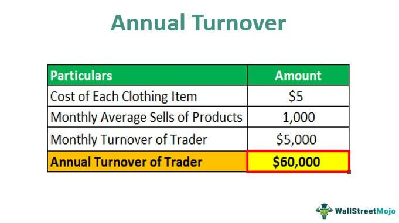

## Table of Contents

## What is annual turnover?

Annual turnover is the total amount of money a business makes from selling its products or services in one year. It's like adding up all the sales receipts for the whole year. This number is important because it shows how well a business is doing. If the annual turnover is high, it means the business is selling a lot of its products or services.

People often use annual turnover to compare how a business is doing from one year to the next. For example, if the turnover goes up, it might mean the business is growing. On the other hand, if it goes down, it could mean the business is not doing as well. This information helps business owners and investors make decisions about the future of the company.

## Why is calculating annual turnover important for a business?

Calculating annual turnover is important for a business because it shows how much money the business is making from sales in a year. This number helps business owners see if they are doing well or if they need to make changes. If the turnover is high, it means the business is selling a lot of its products or services, which is good. If it's low, it might mean the business needs to find new ways to attract customers or sell more.

Annual turnover also helps businesses plan for the future. By looking at the turnover from one year to the next, business owners can see if their business is growing or shrinking. This information is useful for making decisions about things like expanding the business, hiring more staff, or investing in new products. It also helps when talking to banks or investors, because it shows how healthy the business is.

In simple terms, knowing the annual turnover is like checking the health of your business. It tells you if you're on the right track or if you need to do something different. This makes it a key number that every business owner should keep an eye on.

## How do you define 'turnover' in the context of business?

In the context of business, turnover is the total amount of money a company makes from selling its products or services over a certain period, usually a year. It's like adding up all the money that comes in from sales. This number is important because it shows how much business a company is doing. If the turnover is high, it means the company is selling a lot, which is good. If it's low, it might mean the company needs to work harder to sell more.

Turnover is different from profit. Profit is what's left after you subtract all the costs of running the business from the turnover. So, even if a company has a high turnover, it might not be making a lot of profit if its costs are also high. Business owners use turnover to see how well their company is doing and to plan for the future. It helps them decide if they need to change their strategies, like trying to sell more or cutting costs.

## What is the basic formula for calculating annual turnover?

The basic formula for calculating annual turnover is to add up all the money a business makes from selling its products or services in one year. So, if you sold a toy for $10, a book for $15, and a game for $20 in one year, your annual turnover would be $10 + $15 + $20 = $45.

This number is important because it tells you how much business you did in a year. It's like looking at all your sales receipts for the whole year and adding them up. Knowing your annual turnover helps you see if your business is doing well or if you need to make changes to sell more.

## Can you provide a simple example of calculating annual turnover for a small business?

Imagine you own a small bakery. Over the course of a year, you sell cakes, cookies, and bread. In January, you made $1,000 from selling cakes, $500 from cookies, and $300 from bread. In February, you made $900 from cakes, $600 from cookies, and $400 from bread. You keep track of your sales like this for every month of the year.

At the end of the year, you add up all the money you made from selling cakes, cookies, and bread. Let's say the total for the year is $50,000 from cakes, $25,000 from cookies, and $15,000 from bread. When you add these amounts together, your annual turnover for the bakery is $50,000 + $25,000 + $15,000 = $90,000. This number tells you how much money your bakery made from sales in one year.

## How does annual turnover differ from gross revenue?

Annual turnover and gross revenue are similar because they both show how much money a business makes from selling its products or services. But they can be different depending on how a business counts its money. Annual turnover is the total amount of money a business makes from sales in one year. It's like adding up all the sales receipts for the whole year.

Gross revenue can be the same as annual turnover if a business only counts money from sales. But sometimes, gross revenue can include other money that comes into the business, like interest from a bank account or money from selling old equipment. So, gross revenue might be a bit higher than annual turnover if the business includes these other types of income.

## What are common mistakes to avoid when calculating annual turnover?

When calculating annual turnover, one common mistake is including money that isn't from sales. For example, if you add money from loans or investments to your turnover, you'll get a number that's too high. Annual turnover should only include the money you make from selling your products or services. So, make sure to only count the money that comes from your sales receipts.

Another mistake is not keeping track of all your sales throughout the year. If you forget to include some months or some types of products, your turnover number will be too low. It's important to keep good records and add up all your sales carefully. Using a simple spreadsheet or a bookkeeping app can help you make sure you don't miss anything.

Sometimes, businesses also mix up turnover with profit. Turnover is just the total sales money, not what's left after paying for costs. If you subtract costs like rent or salaries from your turnover, you're actually calculating profit, not turnover. Keep these two numbers separate to get a clear picture of your business's performance.

## How can annual turnover be used to assess business performance?

Annual turnover is a key number that shows how well a business is doing. It tells you how much money the business made from selling its products or services in one year. By looking at the annual turnover, you can see if the business is growing or shrinking. If the turnover goes up from one year to the next, it means the business is selling more, which is a good sign. If it goes down, it might mean the business needs to find new ways to attract customers or sell more.

Comparing annual turnover to other numbers can also help assess business performance. For example, if you look at the turnover per employee, you can see how efficient your team is. A high turnover per employee might mean your team is doing a great job at selling. Also, comparing your turnover to similar businesses can show if you're doing better or worse than your competitors. This information helps business owners make smart decisions about growing their business or making changes to improve sales.

## What factors can affect annual turnover in different industries?

Annual turnover can be affected by many different things depending on the industry. For example, in the retail industry, things like how much people want to buy, the time of year, and what other stores are doing can change how much a business sells. If it's the holiday season, people might buy more, so the turnover could go up. But if there's a new store nearby selling the same things cheaper, the turnover might go down. Also, if the economy is not doing well, people might not spend as much money, which can hurt turnover.

In the service industry, like restaurants or hotels, the turnover can depend on things like how good the service is, where the business is located, and what's happening in the area. If a restaurant gets a lot of good reviews, more people might come to eat there, which can increase the turnover. But if a big event happens nearby that draws people away, the turnover might drop. The time of year can also make a difference; for example, hotels might see higher turnover in the summer if they're in a vacation spot.

In industries like manufacturing, factors like the cost of materials, how well the machines work, and how many products people want can affect the turnover. If the price of materials goes up, it might be harder to make a profit, which can lower the turnover. On the other hand, if a new product becomes really popular, the turnover could go up because more people want to buy it. Keeping an eye on these factors helps businesses plan and adjust to keep their turnover strong.

## How do seasonal businesses calculate their annual turnover?

Seasonal businesses calculate their annual turnover the same way other businesses do, by adding up all the money they make from sales in one year. Even though they might only be open for part of the year, they still count all the sales they make during that time. For example, if a business sells Christmas decorations and is only open from October to December, they would add up all the money they made in those three months to find their annual turnover.

It's important for seasonal businesses to keep good records of their sales during their open months. This helps them see how well they did compared to other years and plan for the next season. If they see their turnover going up, it might mean they're doing something right, like having better products or more customers. If it goes down, they might need to think about new ways to attract people or sell more during their season.

## What advanced metrics can be derived from annual turnover data?

From annual turnover data, businesses can figure out important numbers like the growth rate. This tells them how much their sales went up or down from one year to the next. To find the growth rate, they subtract last year's turnover from this year's turnover, then divide that number by last year's turnover, and finally multiply by 100 to get a percentage. A high growth rate means the business is doing better and selling more than before. This can help business owners see if their plans are working or if they need to try something different.

Another useful number is the turnover per employee. This shows how much each worker helps the business make in sales. To find it, you divide the total annual turnover by the number of employees. A high turnover per employee might mean the team is good at selling or that the business is running smoothly. This can be helpful when deciding if the business should hire more people or if they need to train their current team to sell more.

Businesses can also look at the turnover by product or service. This breaks down the total turnover into smaller parts, showing how much money each thing they sell is making. By comparing the turnover of different products or services, businesses can see which ones are doing well and which ones might need more attention. This helps them focus on what's working and maybe stop selling things that aren't making much money.

## How can businesses use annual turnover to forecast future performance?

Businesses can use annual turnover to forecast future performance by looking at how their sales have changed over time. If the annual turnover has been going up each year, it might mean that the business will keep growing. They can use this information to make plans for the next year, like deciding to make more products or hire more people. By comparing the turnover from one year to the next, business owners can see if their strategies are working and make guesses about what might happen in the future.

Another way to use annual turnover for forecasting is by looking at patterns and trends. For example, if a business sees that their turnover goes up every summer, they can plan to have more stock ready for that time of year. They can also look at what's happening in the economy or with their competitors to make better guesses about future sales. By understanding these patterns, businesses can get ready for busy times and make smart decisions to keep their turnover growing.

## What is Defining Annual Turnover?

Annual turnover refers to the total revenue or sales that a company generates over the course of a fiscal year. It is a fundamental metric used to assess a company's capacity to market its products or services, serving as a key indicator of the company's financial health and operational efficiency.

The annual turnover provides insights into the sales performance of a business. High turnover figures suggest strong sales and potentially high demand for a company's offerings, indicating robust market performance. Conversely, low turnover may signal issues such as poor market conditions, ineffective sales strategies, or declining demand for products or services.

In the context of investment, turnover is additionally applied to portfolios, indicating the frequency at which assets within a fund are bought and sold within a year. This is often expressed as a turnover ratio. A high turnover ratio within investment funds implies a higher rate of trading, which can affect management strategy and costs. Frequent trading may lead to increased transaction costs and tax implications, which can erode investment returns. Conversely, lower turnover ratios often suggest a more long-term investment strategy with potentially lower costs.

The formula for calculating the annual turnover of a company is as follows:

$$

\text{Annual Turnover} = \sum (\text{Revenue from Sales}) 
$$

Where the total revenue is calculated by summing up all the sales made by the company in a year. This can be represented as a simple Python code snippet to calculate the turnover:

```python
def calculate_annual_turnover(sales_revenue_list):
    return sum(sales_revenue_list)

# Example usage
sales_revenue = [1000, 2000, 3000, 4000, 5000]  # Example monthly sales revenue
annual_turnover = calculate_annual_turnover(sales_revenue)
print("Annual Turnover:", annual_turnover)
```

This basic understanding of annual turnover is critical not only for company executives but also for investors who rely on such metrics to make informed decisions concerning stock purchases and portfolio management. Turnover serves as a lens through which both efficiency and market demand can be evaluated, providing essential insights for strategic planning and financial analysis.

## How do you calculate turnover? Could you provide an example?

To calculate a company's annual turnover, or total revenue, the fundamental approach involves summing all income generated from sales activities throughout a fiscal year. This metric provides insight into the company's ability to market its products or services effectively.

Consider the following example, which demonstrates this calculation: A company sells 10,000 units of its product within a year, and each unit is priced at $50. The annual turnover can be calculated as follows:

$$
\text{Annual Turnover} = \text{Number of Units Sold} \times \text{Price per Unit}
$$

Substituting the given values:

$$
\text{Annual Turnover} = 10,000 \times 50 = 500,000
$$

Therefore, the company's annual turnover amounts to $500,000. This figure reflects the gross sales revenue, providing a snapshot of the company's sales performance over the year.

To further illustrate the calculation process using a programming perspective, an example in Python can automate this turnover calculation for different scenarios:

```python
def calculate_turnover(units_sold, price_per_unit):
    return units_sold * price_per_unit

# Example calculation
units_sold = 10000
price_per_unit = 50
annual_turnover = calculate_turnover(units_sold, price_per_unit)
print(f"The annual turnover is: ${annual_turnover}")
```

This Python function `calculate_turnover` simplifies the process, allowing for rapid computation of turnover for varying sales quantities and pricing schemes.

Understanding the turnover calculation is not only relevant for historical analysis but it also aids in forecasting future sales performance as part of strategic planning. Keeping accurate records of sales and routinely calculating turnover helps businesses identify trends, evaluate the effectiveness of their sales strategies, and ultimately, drive growth.

## What is the Comparative and Industry Analysis of Turnover?

Examining turnover across different industries offers insights into how various sectors capitalize on market opportunities and manage operational efficiencies. Turnover metrics can vary significantly based on industry-specific factors such as product demand cycles, technology adoption, and competitive landscape.

### Technology Sector
In the technology sector, companies like Apple and Amazon exemplify high annual turnover due to their extensive product lines and innovative offerings. Apple, with its range of consumer electronics, has consistently reported robust turnover figures, reflecting both its widespread brand appeal and effective supply chain management. According to Apple's financial statements, its turnover is bolstered by the continuous release of high-demand products like iPhones, iPads, and MacBooks.

Amazon, as a dominant player in e-commerce and cloud computing, showcases significant turnover driven by its vast online marketplace and Amazon Web Services (AWS). The company's strategic expansion into various markets, coupled with competitive pricing and extensive logistics network, contributes to its substantial turnover.

### Retail Sector
The retail sector often sees high turnover rates due to frequent inventory sales and seasonal demand fluctuations. Retail giants like Walmart demonstrate significant turnover, leveraging their broad product assortment and aggressive pricing strategies. Walmart's large-scale operations and focus on everyday low prices foster a high turnover, reflecting consumer behavior and purchasing patterns.

In contrast, retailers with niche markets or luxury goods may experience lower turnover rates but with higher margins. These differences underscore the importance of aligning turnover analysis with business models and customer segments.

### Manufacturing Sector
Manufacturing industries, characterized by production processes and economies of scale, often have different turnover dynamics. Companies like General Electric (GE) and Siemens operate in diverse manufacturing segments, including industrial equipment and healthcare technologies. The turnover in these sectors is influenced by factors such as production cycles, innovation in manufacturing processes, and global supply chain efficiencies.

The manufacturing sector's turnover is often measured against production capacity and market demand for manufactured goods. Efficient operations, lean manufacturing techniques, and technological advancements contribute to optimizing turnover.

### Comparative Insights
Comparing turnover across sectors highlights how industry-specific elements shape financial performance. Technology companies may exhibit higher turnover through rapid product innovation and market penetration, while retail relies on volume and price competitiveness. Manufacturing emphasizes process efficiency and scale.

An effective comparison also considers turnover ratios, calculated as:

$$
\text{Turnover Ratio} = \frac{\text{Net Sales}}{\text{Average Inventory}}
$$

A high turnover ratio generally indicates efficient inventory management and sales performance, relevant across all sectors.

### Conclusion
Understanding turnover in various industries helps stakeholders identify best practices, market leaders, and strategic opportunities for growth. Turnover analysis, when integrated with other financial metrics, supports optimized decision-making and competitive positioning across technology, retail, and manufacturing landscapes.

## References & Further Reading

[1]: ["Advances in Financial Machine Learning"](https://www.amazon.com/Advances-Financial-Machine-Learning-Marcos/dp/1119482089) by Marcos Lopez de Prado

[2]: ["Evidence-Based Technical Analysis: Applying the Scientific Method and Statistical Inference to Trading Signals"](https://www.amazon.com/Evidence-Based-Technical-Analysis-Scientific-Statistical/dp/0470008741) by David Aronson

[3]: ["Machine Learning for Algorithmic Trading"](https://github.com/stefan-jansen/machine-learning-for-trading) by Stefan Jansen

[4]: ["Quantitative Trading: How to Build Your Own Algorithmic Trading Business"](https://www.amazon.com/Quantitative-Trading-Build-Algorithmic-Business/dp/1119800064) by Ernest P. Chan

[5]: Gopikrishnan, P., Plerou, V., Gabaix, X., & Stanley, H. E. (2001). ["Quantifying Stock Price Response to Demand Fluctuations."](https://pubmed.ncbi.nlm.nih.gov/12241320/) Physical Review E, 64(3), 035106.

[6]: Treynor, J. L. (1965). ["How to Rate Management of Investment Funds."](https://onlinelibrary.wiley.com/doi/10.1002/9781119196679.ch10) Financial Analysts Journal, 21(1), 55-65.