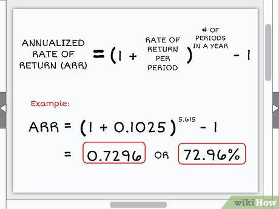

In the fast-paced world of financial markets, understanding key financial formulas and metrics is crucial for success, especially regarding algorithmic trading. Annualization is a mathematical process that transforms shorter-term performance metrics into annual figures, allowing for a standardized basis to compare investment performance, assess loan costs, and analyze various financial data.

Annualized rates are vital tools in financial analysis. They give investors and analysts a consistent method to forecast future performance and compare different investment opportunities. This article explores the concept of annualization, detailing its calculation methods, and highlights its significance across various financial domains such as investments, loans, and taxation. Through practical examples, we demonstrate how annualized rates are applied, simplifying complex financial scenarios into comprehensible projections.



Algorithmic trading leverages annualization to refine strategies and manage risks efficiently. By incorporating annualized metrics, trading algorithms can evaluate predicted risks and returns, thus optimizing strategies to coincide with specific investment goals. Whether you are an experienced investor or a novice eager to learn, this exploration of annualized rates aims to enhance your understanding and application in financial markets, ultimately aiding in making informed decisions and crafting robust trading algorithms.

## Table of Contents

## Understanding Annualization

Annualization refers to the method of converting a short-term financial rate or figure into an equivalent annual figure. This approach is particularly useful in finance for projecting future performance or making comparisons among various investments. The essence of annualization is to provide a consistent basis for evaluation over a standardized time frame, typically a year.

The process generally involves multiplying a shorter-term rate of return by the number of periods in a year. For instance, if you have a monthly rate of return, you can annualize it by multiplying it by 12. Similarly, for a quarterly rate of return, the multiplication factor would be 4. This straightforward calculation offers a uniform measure to assess different investment opportunities or financial instruments over the long term.

However, merely multiplying the short-term rate by the number of periods assumes that there is no compounding of returns, which is rarely the case in real-world financial markets. In practice, annualization often considers compounding effects to provide a more accurate picture of potential growth. Compounding refers to the process by which returns are reinvested to generate additional earnings over time.

The formula for annualizing a rate with compounding is:

$$
\text{Annualized Rate} = (1 + \text{Short-term Rate})^{\text{Number of Periods}} - 1
$$

This equation accounts for the compounding effect by raising the short-term rate plus one to the power of the number of periods, then subtracting one from the result. For example, if an investment yields a return of 2% in one month, the annualized return, considering monthly compounding, would be calculated as:

$$
\text{Annualized Rate} = (1 + 0.02)^{12} - 1 \approx 26.82\%
$$

This formula not only enables comparison across different time frames and investment types but also enhances the precision of financial forecasts by incorporating the impact of compounding.

Understanding how to apply the basic formula for annualization and its components is crucial for investors and analysts. It allows them to accurately predict potential returns and assess the growth prospects of various financial products, contributing to more informed and strategic decision-making in the financial markets.

## How to Calculate Annualized Rates

To calculate an annualized rate, start by identifying the shorter-term rate of return. Annualization helps present a short-term financial outcome in annual terms, enabling comparisons across different timeframes and investment types. The simplest approach is linear multiplication, where the shorter-term rate is multiplied by the number of periods in a year. For example, if you have a monthly return, you multiply by 12; if you have a quarterly return, you multiply by 4.

However, when dealing with compounding, the calculation needs to be adjusted to account for the accumulation of returns over time. The formula to annualize a rate with compounding is:

$$
\text{Annualized Rate} = \left( (1 + \text{Short-term Rate})^{\text{Number of Periods}} \right) - 1
$$

Consider an investment that yields a 2% return in one month. To calculate the annualized return with compounding, apply the formula as follows:

$$
\text{Annualized Rate} = \left( (1 + 0.02)^{12} \right) - 1 \approx 0.2682 \text{ or } 26.82\%
$$

This methodology ensures that the compounding effects are included, providing a more accurate reflection of potential growth over a year. The ability to transform various timeframes into an annualized format aids investors and analysts in conducting fair comparisons and making more informed financial decisions across multiple investment opportunities.

## Applications in the Financial Sector

In the financial sector, annualization is a critical tool that enhances the understanding and interpretation of various financial activities by converting short-term observations into an annual framework. This conversion allows stakeholders to make more informed comparisons and forecasts.

In the field of investments, annualization facilitates the prediction of potential annual performance based on short-term gains. By converting monthly or quarterly returns into an annualized format, investors can compare different securities more comprehensively. This approach helps in gauging the potential growth and risk, allowing investors to align their portfolios with their financial objectives more accurately.

For loans, lenders frequently use annualized rates to express the cost of borrowing as Annual Percentage Rates (APRs). These rates incorporate both interest and additional fees over a year, providing borrowers with a clearer understanding of the long-term cost of a loan. For instance, converting a monthly [interest rate](/wiki/interest-rate-trading-strategies) into an APR involves compounding the rate over twelve months to reflect the actual financial burden accurately.

In economics, annualized rates are instrumental in depicting key economic indicators such as inflation, changes in the Consumer Price Index (CPI), and Gross Domestic Product (GDP) growth. By presenting these variables in an annualized manner, economists can provide more accurate insights into economic health and trends. This assists policymakers and analysts in making decisions that impact economic planning and forecasting.

Regarding taxation, annualization proves beneficial in tax planning by estimating annual income based on shorter-term earnings, such as quarterly profits. This forecasting supports individuals and businesses in anticipating tax liabilities and optimizing their tax strategies, thus ensuring compliance and financial efficiency.

In each scenario, annualization serves as a standardized measure that simplifies the analysis and decision-making process. By translating different financial metrics into a uniform annual context, stakeholders gain enhanced clarity and accuracy in their assessments and forecasts, leading to more strategic financial planning and management.

## Examples of Annualization in Financial Analysis

In the context of financial analysis, annualization serves as a practical tool to extrapolate short-term financial data into meaningful long-term projections. By understanding how to annualize returns, rates, and values, investors and analysts can better compare the performance of different investments or financial strategies over a standardized timeline. Here are a few examples that illustrate the utility of annualization in various financial scenarios.

### Example 1: Stock Return Annualization
Consider a stock that achieves a 3% return in a single month. To determine the projected annual return, you can multiply this monthly return by 12, assuming a simple model without compounding. This gives an approximate annual return of 36%:
$$

\text{Annualized Return} = 3\% \times 12 = 36\% 
$$
However, if compounding effects are taken into account, the formula becomes more complex:
$$

\text{Annualized Return} = (1 + 0.03)^{12} - 1 \approx 42.58\%
$$
This demonstrates how compounding can significantly enhance the projected annualized return, providing a more comprehensive picture of potential investment growth.

### Example 2: Loan APR with Monthly Compounding
When dealing with loans, annual percentage rate (APR) converts monthly interest rates into an annual rate while considering compounding effects. For instance, if a loan has a monthly interest rate of 0.5%, the annualized rate can be calculated using the formula:
$$

\text{Annualized APR} = (1 + 0.005)^{12} - 1 \approx 6.17\%
$$
This approach captures the cumulative impact of monthly compounding, which is crucial in accurately expressing the true cost of borrowing over a year.

### Example 3: Taxpayer Income Annualization
For tax planning, annualization helps project annual earnings based on shorter-term income reports. Suppose a taxpayer earns $10,000 in a quarter. To estimate their annual income, you multiply the quarterly earnings by four:
$$

\text{Estimated Annual Income} = \$10,000 \times 4 = \$40,000 
$$
This simplified calculation assumes consistent earnings across all quarters, providing a baseline for tax obligations and planning.

These examples underscore how annualization can be applied across various financial contexts, transforming short-term [statistics](/wiki/bayesian-statistics) into standardized, long-term projections that facilitate clearer analysis and strategic decision-making.

## Limitations of Annualizing Financial Data

Annualization is a useful tool in financial analysis, but it is not without its limitations. One significant drawback is its inability to account for seasonal variations and unexpected market fluctuations. These factors can substantially influence financial performance but are often not reflected when data is annualized. This limitation can be particularly evident in industries or markets that experience cyclical trends where performance might vary significantly from one period to another.

Short-term [volatility](/wiki/volatility-trading-strategies) also poses a substantial challenge when relying solely on annualized rates to predict long-term outcomes. Because annualization projects short-term returns over a longer timeframe, it tends to overlook the temporary, yet sometimes severe, fluctuations that can occur in financial markets. These fluctuations can lead to inaccurate predictions. For instance, a sudden market downturn might temporarily affect a stock's performance, but annualizing a short-term rate without accounting for such volatility could overstate or understate the true annual return.

Market conditions, company performance, and broader economic factors can dramatically change the financial landscape, further complicating projections based on annualized rates. For example, a business might experience a sudden change in competitive dynamics, or economic shifts might alter interest rates, each of which could invalidate assumptions made during the annualization process. These changes can lead to significant deviations from annualized projections, highlighting the need for cautious use.

Therefore, while annualization provides a standardized framework for comparison and forecasting, it should not be used in isolation. Analysts and investors are encouraged to supplement annualization with other forms of analysis to achieve a more robust understanding of potential financial outcomes. Techniques such as stress testing, scenario analysis, and incorporating non-annualized financial metrics can provide additional insights and account for the variables that annualized rates might miss.

## Annualization in Algorithmic Trading

Algorithmic trading leverages annualized rates to optimize trading strategies by providing a standardized evaluation of performance, risk, and potential returns. By converting short-term returns into annualized figures, [algorithmic trading](/wiki/algorithmic-trading) systems can consistently assess and compare various strategies over different time frames.

Annualized metrics are vital in predicting risks and aligning algorithmic strategies with specific investment goals. For example, a trading algorithm might use annualized volatility, commonly known as the standard deviation of returns on an investment, to determine the risk associated with specific trades. This approach helps to maintain the desired risk-reward balance and ensure that the strategy remains within predefined risk parameters.

One significant use of annualized data in algorithmic trading is [backtesting](/wiki/backtesting). Backtesting involves simulating a trading strategy using historical data to evaluate its potential effectiveness before deploying it in real-time markets. By incorporating annualized measures such as annualized returns and volatility, traders can gain insights into how a strategy might perform over the long term under different market conditions. For example, a Python script implementing a backtest might utilize libraries like NumPy and pandas to calculate annualized returns:

```python
import numpy as np
import pandas as pd

# Assuming 'returns' is a pandas Series of daily returns of a trading strategy
annualized_return = (np.prod(1 + returns) ** (252 / len(returns))) - 1
```

Here, `252` represents the average number of trading days in a year, using daily returns to compute the annualized rate. This calculation provides traders with a consistent metric to compare the historical performance of different strategies.

Furthermore, the ability to compute and adapt annualized metrics quickly allows algorithmic traders to gain a competitive advantage. By employing efficient computational tools, traders can swiftly adjust their algorithms based on the latest annualized data, optimizing their strategies to suit evolving market dynamics. This adaptability is crucial in the fast-paced trading environment, where decision-making hinges on the rapid evaluation of complex data sets.

In conclusion, annualization is a fundamental concept in algorithmic trading that facilitates precise evaluation, strategy optimization, and competitive decision-making. By understanding and incorporating annualized metrics, traders can enhance their strategies and align them more closely with their financial objectives.

## Conclusion

Annualization serves as an essential instrument in financial analysis, offering a universal benchmark to assess performance and facilitate informed decision-making. This methodology simplifies comparing diverse financial instruments and forecasts, making it indispensable for financial analysts and investors alike. By converting short-term rates into an annual figure, investors can better understand and predict the long-term potential of various assets.

However, while annualization provides valuable insights, it must be employed judiciously alongside other financial metrics and analytical tools to attain a comprehensive financial evaluation. Factors such as seasonal variations, market volatility, and unexpected economic changes can impact the accuracy of annualized data, underscoring the importance of supplementary analyses to validate predictions.

In the context of algorithmic trading, annualization plays a critical role in crafting effective trading algorithms capable of adapting to dynamic market conditions. By incorporating annualized rates into the evaluation process, algorithms can estimate potential risks and returns more accurately, enhancing their ability to align with specified investment goals. This approach aids in backtesting strategies, showcasing potential performance under varying market scenarios and offering algorithmic traders a competitive advantage.

A deep understanding and adept application of annualized rates empower investors and traders to refine their strategies, ensuring alignment with their financial objectives. By judiciously integrating annualization with other analytical practices, stakeholders can navigate financial markets with greater confidence and precision, fostering robust investment strategies and optimized financial outcomes.

## References & Further Reading

[1]: ["Advances in Financial Machine Learning"](https://www.amazon.com/Advances-Financial-Machine-Learning-Marcos/dp/1119482089) by Marcos Lopez de Prado

[2]: ["Evidence-Based Technical Analysis: Applying the Scientific Method and Statistical Inference to Trading Signals"](https://www.amazon.com/Evidence-Based-Technical-Analysis-Scientific-Statistical/dp/0470008741) by David Aronson

[3]: ["Machine Learning for Algorithmic Trading"](https://github.com/stefan-jansen/machine-learning-for-trading) by Stefan Jansen

[4]: ["Quantitative Trading: How to Build Your Own Algorithmic Trading Business"](https://www.amazon.com/Quantitative-Trading-Build-Algorithmic-Business/dp/1119800064) by Ernest P. Chan

[5]: Bodie, Z., Kane, A., & Marcus, A. J. (2014). ["Investments."](https://www.mheducation.com/highered/product/Investments-Bodie.html) McGraw-Hill Education.

[6]: Hull, J. C. (2017). ["Options, Futures, and Other Derivatives"](https://www.pearson.com/en-us/subject-catalog/p/options-futures-and-other-derivatives/P200000005938/9780136939917). Pearson.

[7]: Sharpe, W. F. (1994). ["The Sharpe Ratio."](https://web.stanford.edu/~wfsharpe/art/sr/SR.htm) Journal of Portfolio Management.