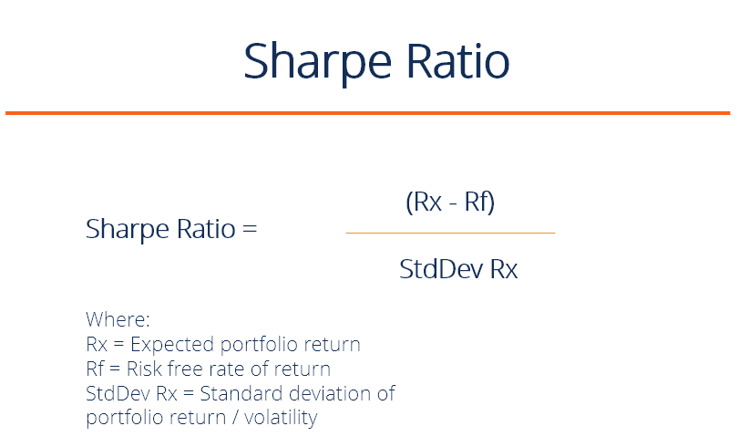

Algorithmic trading represents a cutting-edge approach to executing trades, utilizing pre-defined mathematical models to optimize decision-making processes. At the heart of these strategies lies not only the pursuit of returns but also a deep comprehension of the associated risks. The Annualized Sharpe Ratio emerges as a crucial metric within the financial industry, enabling traders to evaluate the risk-adjusted performance of their trading strategies with precision. By balancing returns against volatility, this ratio provides an invaluable perspective that goes beyond mere profit calculations.

The Sharpe Ratio serves as a cornerstone in discerning the quality of returns, allowing investors to weigh them against the inherent risks. Unlike traditional assessments that may focus solely on gains, the Sharpe Ratio integrates risk factors, offering a nuanced picture of performance. It achieves this by examining the excess return per unit of risk, effectively separating skill from mere chance.



This article offers a comprehensive exploration of the Sharpe Ratio's role in algorithmic trading, diving into its calculation methodologies and illustrating its practical application through examples. Understanding how to measure and interpret risk-adjusted returns not only enhances strategic planning but also provides a robust framework for comparing diverse trading strategies. Through accurate risk assessment and strategic deployment, traders can utilize the Sharpe Ratio to refine their approaches and optimize outcomes.

## Table of Contents

## Understanding the Sharpe Ratio

The Sharpe Ratio, developed by Nobel laureate William F. Sharpe in 1966, is a crucial metric used to evaluate the performance of an investment by adjusting for its risk. It offers investors a lens through which the [volatility](/wiki/volatility-trading-strategies) of returns can be interpreted and compared across different trading strategies. Essentially, the Sharpe Ratio aims to quantify the additional return gained per unit of risk taken, thus enabling investors to make informed decisions about where to allocate their capital.

At its core, the Sharpe Ratio is calculated using three principal components: the return of the investment, the risk-free rate, and the standard deviation of the investment returns. The formula is expressed as:

$$
\text{Sharpe Ratio} = \frac{R_i - R_f}{\sigma_i}
$$

Where:
- $R_i$ represents the expected return of the investment.
- $R_f$ denotes the risk-free rate, which is the return of an investment with zero risk, typically associated with government treasury bills.
- $\sigma_i$ is the standard deviation of the investment's excess return, which measures its volatility.

By incorporating the risk-free rate into the calculation, the Sharpe Ratio effectively separates the investor's compensation for risk-taking from merely risk-free returns. The result is a clean comparison of the profitability of investments relative to the risk they [carry](/wiki/carry-trading). A higher Sharpe Ratio is indicative of better risk-adjusted performance, suggesting that an investment has generated more return per unit of risk.

The utility of the Sharpe Ratio extends to facilitating comparative analysis across different assets or portfolios. For instance, two portfolios may offer the same average return; however, the portfolio with a lower standard deviation of returns will have a higher Sharpe Ratio, indicating a more stable investment. This makes the Sharpe Ratio an attractive metric for investors aiming to achieve balance in their portfolios by maximizing returns while minimizing exposure to volatility. Moreover, it helps investors differentiate between returns achieved through skill and those resulting from excess exposure to risk.

## Annualizing the Sharpe Ratio

Annualizing the Sharpe Ratio is a crucial step in standardizing risk-adjusted performance measures across different investments and timeframes. The annualized Sharpe Ratio adjusts for the number of trading periods within a year, ensuring that investors can make consistent comparisons between strategies that might operate over varying time horizons. 

For most financial markets, the number of trading days in a year is approximately 252. This is based on a standard assumption used in financial modelling and quantitative analysis. The conversion of the Sharpe Ratio from daily returns to an annualized figure is typically accomplished using the square root of the number of trading periods. The formula for the annualized Sharpe Ratio can be expressed as:

$$
\text{Annualized Sharpe Ratio} = \text{Daily Sharpe Ratio} \times \sqrt{252}
$$

Understanding the subtleties of this annualization process is especially important when assessing high-frequency trading strategies, which may execute trades on intraday data. Such strategies require careful adjustment to ensure the calculated Sharpe Ratio accurately reflects the strategy's performance over an annual horizon, given their potentially large number of trading periods.

Adjusting for different trading periods also extends to weekly or monthly data. For example, if one were using monthly returns instead, the number of periods used would be roughly 12. The flexibility of the Sharpe Ratio allows it to be tailored to the periodicity of returns:

$$
\text{Annualized Sharpe Ratio} = \text{Sharpe Ratio per period} \times \sqrt{\text{Number of periods in a year}}
$$

Accurate adjustments for trading periods are instrumental in aligning strategies on a comparable basis, particularly when evaluating options that operate on diverse cycles or incorporating global markets with varying trading days. Hence, recognizing how the length and frequency of data collection can impact performance metrics is key to implementing effective evaluation criteria.

## Calculating the Sharpe Ratio

To calculate the Sharpe Ratio, the formula is:

$$
\text{Sharpe Ratio} = \frac{\bar{R}_p - R_f}{\sigma_p}
$$

where $\bar{R}_p$ represents the expected return of the portfolio, $R_f$ is the risk-free rate, and $\sigma_p$ denotes the standard deviation of the portfolio's excess return. This measurement allows investors to determine how much excess return they are receiving for the extra volatility they endure for holding a riskier asset.

For a practical application, let's consider a portfolio with an annual return of 8%, a risk-free rate of 3%, and a standard deviation of returns of 4%. Applying these figures into the formula provides:

$$
\text{Sharpe Ratio} = \frac{8\% - 3\%}{4\%} = \frac{5\%}{4\%} = 1.25
$$

This result signifies that the portfolio's return is 1.25 times the risk undertaken, offering an insight into the risk-adjusted return.

When calculating an annualized Sharpe Ratio, crucial for standardizing performance over different timelines, multiply the Sharpe Ratio by the square root of the number of periods within a year. For example, using daily returns, typically assumed to involve 252 trading days, the annualization process is as follows:

$$
\text{Annualized Sharpe Ratio} = \text{Sharpe Ratio} \times \sqrt{252}
$$

Assuming that the calculated Sharpe Ratio is based on daily returns, it becomes essential to apply proper annualization to ensure accurate benchmark comparisons and informed decision-making in investments.

## Benchmark Considerations

A crucial element in employing the Sharpe Ratio is selecting an appropriate benchmark. The choice of benchmark can significantly affect the interpretation of the Sharpe Ratio, as it directly influences the calculation of excess returns. Common benchmarks include market indices such as the S&P 500, which provide a broad-market comparison, as well as risk-free investments like government treasury bills, considered as a baseline for safe returns.

In [algorithmic trading](/wiki/algorithmic-trading), particularly for market-neutral strategies, the selection of a benchmark plays a pivotal role. Market-neutral strategies aim to deliver positive returns irrespective of the market's direction, often through long and short positions. Selecting an inadequate benchmark could misleadingly inflate or deflate the perceived success of such strategies. In these cases, conventional market indices might not capture the relative risk and returns effectively.

Understanding whether to include the risk-free rate or zero as the benchmark depends heavily on the structure and intent of the trading strategy. For instance, when evaluating strategies designed to outperform treasury bills, the risk-free rate serves as a relevant benchmark. However, in situations where the primary goal is to achieve gains independent of market movements, such as in pairs trading or statistical [arbitrage](/wiki/arbitrage), benchmark relevance might differ, potentially opting for zero or an alternative reference point that better represents the strategy’s objectives.

By carefully selecting benchmarks that align with the strategy's risk profile and goals, traders and portfolio managers can ensure a more accurate assessment of their performance using the Sharpe Ratio. Misalignment, by contrast, could lead to skewed insights, obscuring inherent risks or overestimating returns.

## Limitations of the Sharpe Ratio

The Sharpe Ratio is a widely used measure for evaluating the risk-adjusted returns of an investment portfolio. However, its limitations can impact the accuracy and usefulness of the metric in certain trading situations. One primary limitation is its historical focus; the Sharpe Ratio relies on past data to gauge future performance. This backward-looking approach may not accurately reflect future risk profiles, especially in volatile or rapidly changing markets where historical trends may not continue.

Another critical limitation is the assumption of normally distributed returns. The Sharpe Ratio assumes that investment returns follow a normal distribution, which simplifies the modeling of potential outcomes and risks. However, financial markets are frequently subject to anomalies and tail risks that deviate from a normal distribution. These can include sudden market crashes or extreme fluctuations, often referred to as "fat tails," which the Sharpe Ratio fails to account for adequately.

Moreover, the Sharpe Ratio does not consider transaction costs, which can significantly impact real-world investment returns. High-frequency trading strategies, particularly, are sensitive to these costs, which can reduce profitability and alter the perceived risk-return profile of a strategy. Ignoring such factors can lead to overestimation of the actual returns or underestimation of risk, thereby presenting a skewed view of performance.

To address these limitations, investors and traders might complement the Sharpe Ratio with additional metrics that account for non-normal distributions and transactional inefficiencies, offering a more comprehensive view of potential risks and returns.

## Practical Application and Examples

An annualized Sharpe Ratio is a key marker for traders assessing the quality of their investment strategies. Typically, a ratio below 1 indicates that the returns are not commensurate with the risk taken, often leading such strategies to be overlooked in institutional investment settings. Conversely, a Sharpe Ratio above 2 is considered highly desirable, particularly in the quantitative [hedge fund](/wiki/hedge-fund-trading-strategies) sector, which seeks strategies that provide greater returns per unit of risk.

The use of the Sharpe Ratio can vary significantly between different trading strategies due to differences in risk management methodology. For instance, a buy-and-hold strategy may inherently carry different risk characteristics compared to a market-neutral strategy. Buy-and-hold strategies are generally more exposed to market volatility, thus potentially resulting in a lower Sharpe Ratio. In contrast, market-neutral strategies are designed to minimize market exposure and optimize risk-adjusted returns, which could potentially yield a higher Sharpe Ratio.

Quantitative strategies, which employ complex models and algorithms to execute trades, benefit from using the Sharpe Ratio alongside other performance metrics. This comprehensive approach allows traders to capture a more nuanced picture of the strategy’s effectiveness. For example, metrics such as the Sortino Ratio, which focuses on downside risk, or the Calmar Ratio, which compares trade-off between risk and return over the maximum drawdown, may complement the Sharpe Ratio in evaluating a strategy.

In practice, traders and analysts might employ Python to calculate and visualize these performance metrics, facilitating more precise strategy adjustments. Here's an example of how a Sharpe Ratio can be calculated using Python:

```python
import numpy as np

# Annualized return and standard deviation
annual_return = 0.08  # 8%
annual_std_dev = 0.04  # 4%
risk_free_rate = 0.03  # 3%

# Sharpe Ratio calculation
sharpe_ratio = (annual_return - risk_free_rate) / annual_std_dev
print(f"The Sharpe Ratio is: {sharpe_ratio:.2f}")
```

This calculation helps investors quickly assess whether a strategy is worth pursuing or requires further refinement. Ultimately, integrating the Sharpe Ratio with a suite of analytical tools allows for a robust evaluation of algorithmic strategies, ensuring that decisions are informed by a balanced understanding of risk and return.

## Conclusion

The Annualized Sharpe Ratio is a crucial metric in evaluating algorithmic trading strategies. Unlike pure return metrics that only provide a superficial snapshot of performance, the Sharpe Ratio offers a nuanced understanding of how returns compare to the risks taken to achieve them. This insight allows traders and investors to assess whether a strategy's performance is driven by excess volatility or by consistent risk-adjusted returns.

Despite its utility, the Sharpe Ratio comes with limitations that require careful consideration. It is a historical measure, relying on past data to assess future performance. This dependency might not accurately forecast future risk profiles, especially in the face of market anomalies or unforeseen economic events. Therefore, it is vital to use the Sharpe Ratio alongside other analytical tools such as the Sortino Ratio, which accounts for downside risk, or the Calmar Ratio, emphasizing maximum drawdown. Combining these tools can provide a more comprehensive risk assessment.

Continuous refinement and updating of benchmarks and risk assessments are necessary to maximize the Sharpe Ratio's effectiveness. The choice of benchmark can significantly impact the Sharpe Ratio, especially in different market conditions and strategy types. Regularly updating these parameters ensures the Sharpe Ratio remains a relevant and accurate reflection of the strategy's performance. In this way, traders can leverage the Sharpe Ratio not as a standalone metric but as part of a broader, adaptive analytical framework that responds to the changing landscape of financial markets.

## References & Further Reading

[1]: Sharpe, W. F. (1966). ["Mutual Fund Performance."](http://www.stat.ucla.edu/~nchristo/statistics_c183_c283/sharpe__mutual_fund_performance.pdf) The Journal of Business, 39(1), 119-138.

[2]: Marcos Lopez de Prado. ["Advances in Financial Machine Learning."](https://www.amazon.com/Advances-Financial-Machine-Learning-Marcos/dp/1119482089) Wiley.

[3]: David Aronson. ["Evidence-Based Technical Analysis: Applying the Scientific Method and Statistical Inference to Trading Signals."](https://www.amazon.com/Evidence-Based-Technical-Analysis-Scientific-Statistical/dp/0470008741)

[4]: Stefan Jansen. ["Machine Learning for Algorithmic Trading."](https://github.com/stefan-jansen/machine-learning-for-trading)

[5]: Ernest P. Chan. ["Quantitative Trading: How to Build Your Own Algorithmic Trading Business."](https://www.amazon.com/Quantitative-Trading-Build-Algorithmic-Business/dp/0470284889)

[6]: ["Measuring Portfolio Risk and Performance—A Practitioner’s Guide to Risk-Adjusted Performance"](https://stablebread.com/how-to-measure-your-portfolios-risk-adjusted-performance/) by CFA Institute

[7]: Elton, E. J., Gruber, M. J., Brown, S. J., & Goetzmann, W. N. (2014). ["Modern Portfolio Theory and Investment Analysis"](https://books.google.com/books/about/Modern_Portfolio_Theory_and_Investment_A.html?id=181CEAAAQBAJ). Wiley.