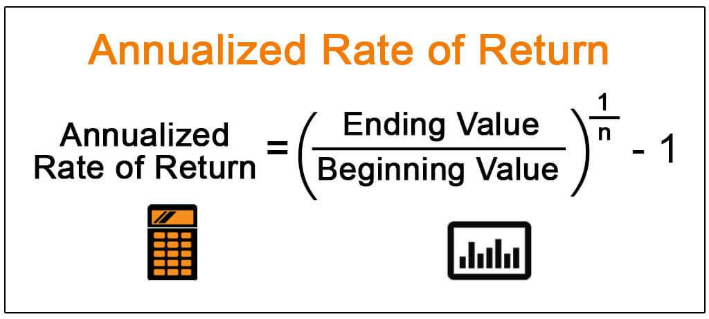

## Table of Contents

## What is the basic definition of Annualized Total Return?

Annualized Total Return is a way to measure how well an investment has done over a period of time, but it shows the return as if it happened over just one year. This helps people compare different investments easily, no matter how long they've been held. For example, if you want to know how a stock did over five years, the annualized total return would tell you what the average yearly return was during that time.

To calculate the annualized total return, you need to know the total gain or loss of the investment and the time period over which it happened. You then use a special math formula to turn that total into a yearly rate. This is useful because it gives you a clear number to compare with other investments or with a benchmark like the stock market's average return. It's a handy tool for anyone trying to figure out which investments are performing the best over time.

## How is Annualized Total Return calculated?

To calculate the Annualized Total Return, you start with the total return of your investment over a certain period. This total return is the percentage increase or decrease in the value of your investment from the beginning to the end of that period. Once you have this total return, you need to figure out how long the period was in years. Then, you use a formula to turn that total return into an annual rate. The formula is: (1 + Total Return)^(1/Number of Years) - 1. This formula helps you find out what the average yearly return would have been if the investment grew at a steady rate over the whole period.

For example, if you invested $1,000 and it grew to $1,200 over 2 years, your total return would be 20% (or 0.20 in decimal form). To find the annualized total return, you would calculate (1 + 0.20)^(1/2) - 1, which equals about 0.095 or 9.5%. This means that, on average, your investment grew by about 9.5% each year over those 2 years. This calculation helps you compare this investment's performance to others or to a benchmark, like the stock market's average return, over the same time frame.

## Why is Annualized Total Return important for investors?

Annualized Total Return is important for investors because it helps them understand how well their investments are doing over time. It turns the total growth of an investment into a yearly rate, which makes it easier to compare different investments. For example, if one investment grew a lot over 5 years and another grew a little over 1 year, the annualized total return lets you see which one did better each year on average. This way, investors can pick the investments that are likely to give them the best returns over time.

Also, annualized total return helps investors see how their investments stack up against things like the stock market's average return. If an investment's annualized total return is higher than the market's, it might be a good choice. But if it's lower, the investor might want to look for something else. By using annualized total return, investors can make smarter choices about where to put their money, helping them reach their financial goals.

## Can you explain the difference between Annualized Total Return and simple total return?

Annualized Total Return and simple total return both tell you how much your investment has grown, but they do it in different ways. Simple total return shows you the overall increase or decrease in your investment's value from the start to the end of a period. For example, if you invest $100 and it grows to $120 over 2 years, your simple total return is 20%. It's a straightforward way to see how much your investment has changed, but it doesn't tell you how it did each year.

On the other hand, Annualized Total Return takes that simple total return and turns it into a yearly rate. It helps you understand what the average yearly growth of your investment was over the whole period. Using the same example, if your $100 grew to $120 over 2 years, the annualized total return would be about 9.5% per year. This is useful because it lets you compare your investment's performance to other investments or to the stock market's average return, even if they were held for different lengths of time.

## How does compounding affect Annualized Total Return?

Compounding plays a big role in figuring out the Annualized Total Return. When you earn money on an investment, you can reinvest that money to earn even more. This is called compounding. It's like [earning](/wiki/earning-announcement) interest on your interest. When you calculate the Annualized Total Return, you take this compounding into account. That means the return you see isn't just from the money you put in at the start, but also from all the earnings that got reinvested along the way.

Because of compounding, the Annualized Total Return gives you a better picture of how well your investment is doing over time. If you just looked at the simple total return without considering compounding, you might think your investment did okay, but not great. But when you see the annualized return, which includes the effect of compounding, you might realize your investment is actually doing much better than you thought. This is why understanding compounding is important when you're trying to figure out how good your investment really is.

## What are some common time periods used for calculating Annualized Total Return?

People often use different time periods to calculate the Annualized Total Return of their investments. Some common ones are one year, three years, five years, and ten years. These time periods help investors see how well their investments are doing over short, medium, and long periods. A one-year period might show how an investment did recently, while a ten-year period can show how it did over a longer time, which can be important for planning for the future.

Choosing the right time period depends on what the investor wants to know. If someone is thinking about keeping their money in an investment for a long time, they might look at the five or ten-year annualized total return. This gives them an idea of how the investment has grown over time, including the effects of compounding. On the other hand, if someone is more interested in recent performance, they might focus on the one-year or three-year return. This helps them see if the investment is doing well right now.

## How does Annualized Total Return help in comparing different investments?

Annualized Total Return helps investors compare different investments by turning the total growth of each investment into a yearly rate. This makes it easy to see which investment did better each year on average, even if they were held for different lengths of time. For example, if one investment grew a lot over 5 years and another grew a little over 1 year, the annualized total return lets you see which one had a better yearly performance. This way, investors can pick the investments that are likely to give them the best returns over time.

It also helps investors compare their investments to benchmarks like the stock market's average return. If an investment's annualized total return is higher than the market's, it might be a good choice. But if it's lower, the investor might want to look for something else. By using annualized total return, investors can make smarter choices about where to put their money, helping them reach their financial goals.

## What are the limitations or potential pitfalls of using Annualized Total Return?

Using Annualized Total Return can be really helpful, but it also has some limitations. One big issue is that it assumes the investment grows at a steady rate every year, which isn't always true. In real life, investments can go up and down a lot. This means the annualized total return might make an investment look smoother and more predictable than it really is. Also, if you're looking at a short time period, like just one year, the annualized total return might not show you the full picture of how the investment does over the long run.

Another potential pitfall is that annualized total return doesn't take into account things like taxes and fees, which can make a big difference in how much money you actually get to keep. If you're not careful, you might think an investment is doing better than it really is because you're not considering these costs. Plus, past performance doesn't guarantee future results, so just because an investment had a good annualized total return in the past doesn't mean it will keep doing well. It's important to look at other factors and not just rely on this one number when making investment decisions.

## How can Annualized Total Return be used to assess the performance of mutual funds or ETFs?

Annualized Total Return is a great tool for figuring out how well mutual funds or ETFs are doing over time. It takes the total growth of the fund or [ETF](/wiki/etf-trading-strategies) and turns it into a yearly rate. This makes it easy to compare different funds or ETFs, even if they've been around for different lengths of time. For example, if you want to see how a mutual fund did over the last 5 years compared to an ETF that's only been around for 3 years, the annualized total return helps you see which one did better each year on average. This can help you decide which one might be a better choice for your investment goals.

However, it's important to remember that annualized total return has its limits. It assumes that the fund or ETF grows at a steady rate every year, which isn't always true. In real life, the value of mutual funds and ETFs can go up and down a lot. So, the annualized total return might make them look smoother and more predictable than they really are. Also, it doesn't take into account things like taxes and fees, which can affect how much money you actually get to keep. So, while annualized total return is a useful measure, it's best to use it along with other information to get a full picture of how well a mutual fund or ETF is doing.

## Can you provide an example of how to calculate Annualized Total Return for a specific investment?

Let's say you invested $1,000 in a stock, and after 3 years, your investment grew to $1,300. To find the Annualized Total Return, you first need to figure out the total return. The total return is how much your investment grew, which in this case is 30% because $1,300 is 30% more than $1,000. Now, you need to turn that 30% total return into a yearly rate. You do this by using the formula: (1 + Total Return)^(1/Number of Years) - 1. So, for our example, it's (1 + 0.30)^(1/3) - 1.

When you do the math, (1 + 0.30)^(1/3) is about 1.091, and then you subtract 1 to get 0.091. This means the Annualized Total Return is about 9.1%. So, even though your investment grew by 30% over 3 years, the average yearly growth was about 9.1%. This number helps you compare this stock's performance to other investments or to the stock market's average return over the same time.

## How do taxes and fees impact the Annualized Total Return?

Taxes and fees can make a big difference in the Annualized Total Return of an investment. When you earn money from your investment, you might have to pay taxes on those earnings. This means you get to keep less of the money you made. Fees are costs you pay for things like managing your investment or trading. These fees come out of your investment, so they reduce how much your investment grows. Both taxes and fees lower the total amount of money you have at the end, which means the Annualized Total Return you see might be higher than what you actually get to keep.

Because of this, it's important to think about taxes and fees when you're looking at the Annualized Total Return. If you don't, you might think an investment is doing better than it really is. For example, if an investment has a high Annualized Total Return but also high fees, the money you actually get to keep might not be as much as you thought. So, when you're comparing different investments, make sure to look at the after-tax and after-fee returns to get a true picture of how well they're doing.

## What advanced statistical methods can be used to refine the calculation of Annualized Total Return?

To make the calculation of Annualized Total Return more accurate, you can use something called the geometric mean. This method takes into account the ups and downs of your investment over time, not just the total growth. It's like figuring out the average yearly return while considering that your investment might grow a lot one year and shrink the next. By using the geometric mean, you get a better idea of how your investment really did over time, especially if it had a lot of ups and downs.

Another way to refine the calculation is by using something called the Modified Dietz Method. This method helps you figure out the return of your investment when you add or take out money at different times. It's useful because it gives you a more accurate picture of your investment's performance when you're not just leaving your money in there without touching it. By using these advanced methods, you can get a clearer and more precise view of how well your investment is doing, which can help you make better decisions about where to put your money.

## What is Understanding Total Return?

Total return is a critical metric that quantifies the actual rate of return on an investment or portfolio over a specified period. This measure encompasses all forms of investment income, including capital gains, dividends, and interest, thereby offering a holistic picture of the investment's performance. 

### Components of Total Return

1. **Capital Gains**: Capital gains refer to the increase in the value of an asset or investment over its purchase price. This gain is realized when the investment is sold for a higher price than its original purchase cost.

2. **Income**: This includes periodic payouts from dividends for stocks and interest payments for bonds. These are generally received by the investor during the holding period of the investment.

By integrating both capital gains and income, total return offers a comprehensive measure of an investment's success, enabling investors to evaluate their performance more accurately than by simply looking at price changes.

### Calculating Total Return

The formula for calculating total return is straightforward. It considers the total value of the investment at the end of the period, subtracts the initial value, and includes any income received:

$$
\text{Total Return} = \frac{(V_{\text{final}} + I - V_{\text{initial}})}{V_{\text{initial}}}
$$

where:
- $V_{\text{final}}$ is the final value of the investment.
- $V_{\text{initial}}$ is the initial value of the investment.
- $I$ is the income received from the investment (e.g., dividends or interest).

### Example Calculation

Consider an investor who purchases a stock at $100. Over the [course](/wiki/best-algorithmic-trading-courses) of a year, the stock price rises to $120, and the investor receives $5 in dividends. The total return would be calculated as follows:

- $V_{\text{final}} = 120$
- $V_{\text{initial}} = 100$
- $I = 5$

$$
\text{Total Return} = \frac{(120 + 5 - 100)}{100} = 0.25 \text{ or } 25\%
$$

Thus, the total return of 25% indicates that the investment has grown by 25% over the specified period, accounting for both price appreciation and dividend income.

This comprehensive approach to measuring investment performance allows investors to fully assess the profitability of their investments, comparing different opportunities effectively and making informed decisions about portfolio adjustments. Moreover, understanding total return is essential for aligning investment objectives with risk and return expectations, especially when evaluating the success of investment strategies.

## What is Annualized Return?

Annualized return is a fundamental metric used to evaluate the performance of an investment over time, expressed as a geometric average. This metric provides a clear, standardized annual measure of an investment's growth rate, effectively allowing investors to compare different investments irrespective of the durations they cover. 

Unlike simple annual returns, which might mislead by ignoring the effects of compounding, annualized return incorporates both the time [factor](/wiki/factor-investing) and compounding effect, thus offering a more accurate picture of an investment's performance. To calculate the annualized return, the geometric mean is utilized instead of an arithmetic mean to account for the compounding effect, which can substantially influence returns over multiple periods. 

The formula for annualized return (AR) can be expressed as:

$$
AR = \left( \frac{V_f}{V_i} \right)^{\frac{1}{n}} - 1
$$

where $V_f$ is the final value of the investment, $V_i$ is the initial value, and $n$ is the number of years of the investment period. This formula demonstrates how the initial investment grows to the final value over time, recalibrated annually. For example, if an investment grows from $1,000 to $1,500 over three years, the annualized return would be:

$$
AR = \left( \frac{1500}{1000} \right)^{\frac{1}{3}} - 1 \approx 0.1447
$$

or approximately 14.47% per annum.

One of the primary advantages of using annualized return is its ability to smooth out short-term [volatility](/wiki/volatility-trading-strategies), providing a clearer long-term perspective. In markets characterized by frequent fluctuations, this smoothing effect ensures investors are not misled by short-term anomalies. Moreover, it provides a robust framework for evaluating returns on investments of differing time periods, thus ensuring fairer comparisons across diverse asset classes or investment strategies.

Additionally, annualized returns enable investors to better understand the risk-adjusted returns of an investment. By integrating this metric, investors can make more informed decisions regarding portfolio adjustments and strategic planning. It remains a pivotal tool in financial analysis due to its widespread applicability in comparative performance analysis, especially when evaluating portfolios or investment funds with varying time horizons.

## What is the Formula and how is the Calculation done?

Total return is a measure that considers the overall growth of an investment over a specific period, capturing both the capital appreciation and income generated. The formula for calculating total return is:

$$
\text{Total Return (\%)} = \left( \frac{\text{Ending Value} - \text{Beginning Value} + \text{Income}}{\text{Beginning Value}} \right) \times 100
$$

To illustrate, consider an investment that had a beginning value of $1,000, an ending value of $1,200, and generated $50 income during the period. The total return would be calculated as follows:

$$
\text{Total Return (\%)} = \left( \frac{1,200 - 1,000 + 50}{1,000} \right) \times 100 = 25\%
$$

This example demonstrates the inclusion of both capital appreciation ($200) and income ($50) when determining total return.

Annualized return provides a way to express the total return as an average annual rate. This enables comparisons over different time periods. The annualized return is calculated using the geometric mean of the period returns, represented by the formula:

$$
\text{Annualized Return (\%)} = \left( (1 + \text{Total Return})^{\frac{1}{n}} - 1 \right) \times 100
$$

where $n$ represents the number of periods (e.g., years).

Using the previous example with a 25% total return over two years, the annualized return is calculated thus:

$$
\text{Annualized Return (\%)} = \left( (1 + 0.25)^{\frac{1}{2}} - 1 \right) \times 100 \approx 11.8\%
$$

This annualized return shows how much, on average, the investment grew each year over the two-year period.

Breaking down the calculation process involves identifying each component in the formulas. Practically, in any programmatic environment, this could be implemented in Python as follows:

```python
def calculate_total_return(beginning_value, ending_value, income):
    return ((ending_value - beginning_value + income) / beginning_value) * 100

def calculate_annualized_return(total_return, periods):
    return ((1 + total_return / 100) ** (1/periods) - 1) * 100

# Example case:
beginning_value = 1000
ending_value = 1200
income = 50
periods = 2

total_return = calculate_total_return(beginning_value, ending_value, income)
annualized_return = calculate_annualized_return(total_return, periods)

print(f"Total Return: {total_return:.2f}%")
print(f"Annualized Return: {annualized_return:.2f}%")
```

These formulas and calculations help investors standardize measurements of investment performance, offering critical insights for decision-making processes. Understanding and applying these metrics allows for more informed investment strategies, essential for both individuals and automated trading systems.

## What is the significance in algorithmic trading?

In [algorithmic trading](/wiki/algorithmic-trading), total return and annualized return are pivotal metrics for evaluating trading algorithms and strategies. These returns provide a comprehensive view of an algorithm's performance, offering insights into its effectiveness in generating profits.

Total return measures the overall performance of an investment or trading strategy over a specific time, capturing capital gains and any income generated, such as dividends or interest. This metric is useful for assessing the absolute gains achieved by an algorithm since its inception, highlighting its raw profitability. However, algorithmic traders often need to standardize these returns across different time frames or strategies to make fair comparisons.

Annualized return, being a geometric average, translates the total return into an equivalent annual return that an investor would earn if the investment grew at a steady rate each year. It provides a normalized measure of performance that allows traders to compare the consistency and reliability of different trading algorithms. This return smooths out the effects of volatility and compounding, offering a clearer picture of an algorithm's long-term performance.

For example, consider a trading algorithm that yields a total return of 150% over three years. To determine its annualized return, the formula is:

$$
AR = \left(1 + TR \right)^{\frac{1}{n}} - 1
$$

where $AR$ is the annualized return, $TR$ is the total return (expressed as a decimal), and $n$ is the number of years. Substituting the values, we have:

$$
AR = \left(1 + 1.5 \right)^{\frac{1}{3}} - 1 \approx 0.353, \text{ or } 35.3\%
$$

This calculation reveals that the algorithm effectively yields an average return of 35.3% per annum over the given period. Such a metric is essential for traders looking to evaluate long-term consistency and potential risk when comparing various algorithms or adjusting their strategies.

Furthermore, the annualized return can also serve as a benchmark against market indices or alternative investment opportunities. By assessing annualized returns, traders can derive insights into their algorithms' performance relative to these benchmarks, aiding in strategy refinement. As algorithmic trading relies heavily on data-driven decision-making, understanding these metrics enhances an investor's ability to devise strategies that maximize returns while maintaining acceptable risk levels.

## How does this compare with other metrics?

Total return and annualized return are fundamental metrics used in assessing investment performance, but they are not the only metrics available for investors and financial analysts. Other important metrics that provide additional insights into performance include the Compound Annual Growth Rate (CAGR), Internal Rate of Return (IRR), and Time-Weighted Return (TWR). Each of these metrics has distinct benefits and limitations, making them suitable for different investment contexts.

### Total Return vs. CAGR
The Compound Annual Growth Rate (CAGR) measures the rate at which an investment grows annually, assuming growth is compounded over the period. It is calculated using the formula:

$$
\text{CAGR} = \left( \frac{\text{Ending Value}}{\text{Beginning Value}} \right)^{\frac{1}{n}} - 1
$$

where $n$ is the number of years. While total return accounts for the full period's gains and income, CAGR provides a smoothed annual growth rate, making it useful for understanding the average annual performance. However, CAGR does not reflect the year-by-year volatility, as it focuses solely on the start and end values, potentially obscuring fluctuations in the interim.

### Total Return vs. IRR
The Internal Rate of Return (IRR) is a metric used to evaluate the profitability of investments, particularly useful in scenarios involving multiple cash flows over time, such as real estate or private equity investments. IRR is defined as the discount rate that makes the net present value (NPV) of all cash flows from the investment equal to zero. Calculating IRR involves solving for $r$ in the equation:

$$
\sum_{t=0}^{T} \frac{C_t}{(1 + r)^t} = 0
$$

where $C_t$ represents cash flows at time $t$.

IRR is more complex than total return and can provide insights into the efficiency of capital deployment. However, it assumes that interim cash flows are reinvested at the IRR itself, which may not always be realistic.

### Total Return vs. TWR
Time-Weighted Return (TWR) is designed to measure investment performance independently of external cash flows, such as deposits and withdrawals. It calculates investment performance by segmenting the investment-period into sub-periods each time cash flows occur. The formula is as follows:

$$
\text{TWR} = \prod (1 + R_i) - 1
$$

where $R_i$ are the returns for each sub-period. This metric is especially useful in assessing fund managers, as it eliminates the influence of client-driven transactions. Total return, by contrast, is affected by such cash flows, offering a comprehensive picture that includes all gains and losses regardless of external interventions.

### Integration for Holistic Performance Evaluation
Each of these metrics provides unique insights into different aspects of investment performance. For a holistic evaluation, it is beneficial to integrate them rather than rely on a single metric. For example, while total return provides an overall picture of gains, CAGR offers a clear understanding of average growth, IRR evaluates the efficiency of cash flow investments, and TWR provides clarity on the manager's performance without the noise of external cash flows.

By utilizing these metrics in concert, investors can gain a nuanced view of their investments, enabling informed decision-making and effective portfolio management. Each metric provides a piece of the performance puzzle, and together they offer a comprehensive assessment of investment success and strategy efficacy.

## References & Further Reading

[1]: ["Principles of Quantitative Equity Investing: A Complete Guide to Creating, Evaluating, and Implementing Trading Strategies"](https://ptgmedia.pearsoncmg.com/images/9780134192796/samplepages/9780134192796.pdf) by Sugata Ray

[2]: ["Algorithmic Trading: Winning Strategies and Their Rationale"](https://onlinelibrary.wiley.com/doi/pdf/10.1002/9781118676998.fmatter) by Ernie Chan

[3]: ["A Non-Random Walk Down Wall Street"](https://www.jstor.org/stable/j.ctt7tccx) by Andrew W. Lo and A. Craig MacKinlay

[4]: ["Quantitative Momentum: A Practitioner's Guide to Building a Momentum-Based Stock Selection System"](https://books.google.com/books/about/Quantitative_Momentum.html?id=K2npCgAAQBAJ) by Wesley R. Gray and Jack R. Vogel

[5]: Da, Zhi, et al. (2016). ["The Sum of All FEARS Investor Sentiment and Asset Prices."](https://www.jstor.org/stable/24466846) The Review of Financial Studies.