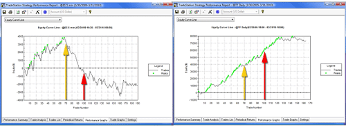

In the competitive world of algorithmic trading, backtesting serves as a fundamental process essential for determining the potential success of trading strategies. By allowing traders to simulate the performance of their strategies using historical market data, backtesting provides insights into how their strategies might perform in real market conditions. One of the key metrics used in this evaluation is annualized turnover. This metric plays a crucial role in assessing the efficiency and viability of trading strategies.

Annualized turnover measures the frequency at which assets within a portfolio are exchanged over a year, providing insight into the trade activity of a strategy. Understanding this metric is essential for identifying whether a trading strategy is overly aggressive or more passive in nature. High annualized turnover indicates a strategy with frequent trading, potentially leading to increased transaction costs which can erode overall profitability. Conversely, low turnover generally aligns with a buy-and-hold strategy, indicating fewer transactions and possibly lower costs.



The attention to annualized turnover during backtesting is significant because it affects both the direct costs associated with trading and the indirect impact on strategy performance. By analyzing and optimizing this metric, traders aim to strike a balance between seizing market opportunities and minimizing transaction costs. The subsequent examination of annualized turnover seeks to explore its implications on the development and refinement of algorithmic trading strategies, offering a pathway toward more successful and cost-effective approaches.

## Table of Contents

## Understanding Annualized Turnover

Annualized turnover is a metric used to assess the frequency at which assets within a portfolio are replaced over a specified period, with the result extrapolated to reflect a yearly rate. This metric provides insight into the trading activity level of a portfolio, giving an indication of how often transactions are made. 

In practical terms, high annualized turnover rates are indicative of an active trading strategy, characterized by frequent buying and selling of securities. This approach might be adopted by traders aiming to capitalize on short-term market movements, potentially leading to higher returns but also increased transaction costs. Conversely, low annualized turnover rates suggest a buy-and-hold strategy, which involves fewer transactions and is often associated with long-term investment objectives.

Mathematically, the annualized turnover is calculated by first determining the total value of trades conducted within a particular period. This is divided by the average or initial portfolio value to derive the turnover ratio. If the analysis covers a period shorter than a year, such as a quarter or half-year, the turnover ratio can be annualized by adjusting the time [factor](/wiki/factor-investing) accordingly. The formula for annualized turnover can be expressed as:

$$
\text{Annualized Turnover} = \left( \frac{\text{Total Trade Volume in Period}}{\text{Initial Portfolio Value}} \right) \times \left( \frac{\text{Number of Periods in a Year}}{\text{Number of Periods Covered}} \right)
$$

Understanding the rate of turnover helps traders and portfolio managers gauge the implications of their trading frequency in terms of potential returns and the operational costs incurred through transaction fees.

## The Importance of Annualized Turnover in Backtesting

Assessing annualized turnover during the [backtesting](/wiki/backtesting) phase of [algorithmic trading](/wiki/algorithmic-trading) strategies is a critical component for traders aiming to optimize their strategies. One of the primary reasons for analyzing this metric is its ability to provide insights into the frequency of trades executed by a strategy. More frequent trading can often mean higher transaction costs, which in turn can significantly impact the net profitability of a trading strategy.

Transaction costs include broker fees, bid-ask spreads, and potential slippage, all of which are incurred each time a trade is executed. For strategies with high turnover, these costs can accumulate quickly, eating into profits. Therefore, understanding and monitoring the annualized turnover allows traders to gauge how substantial these costs might become over time.

In financial terms, the turnover rate reflects the proportion of a portfolio that is traded over a specific period. It serves as a measure of [liquidity](/wiki/liquidity-risk-premium) and activity within the strategy. A high turnover rate often suggests an active trading approach, potentially exploiting short-term market opportunities. However, this comes with the caveat of heightened costs, making the optimization of turnover a vital factor in strategy performance.

Optimization of the annualized turnover involves fine-tuning the balance between the frequency of transactions and the resultant transaction costs. Traders must analyze the trade-off between the opportunity of capturing market movements and the costs of executing trades. Efficient backtesting should therefore incorporate analysis of turnover rates to identify strategies that achieve high returns while minimizing unnecessary costs. Through strategic adjustments and refinements, traders can enhance their strategies to achieve superior long-term performance.

## Calculating Annualized Turnover in Backtested Strategies

To compute annualized turnover in backtested trading strategies, one must start by determining the total [volume](/wiki/volume-trading-strategy) of trades executed within the specified backtest period. This requires the trader to sum up the absolute value of all buy and sell transactions conducted during the backtest. Once the total trade volume is calculated, the next step is to obtain the turnover ratio. This ratio is calculated by dividing the total trade volume by the initial portfolio value:

$$
\text{Turnover Ratio} = \frac{\text{Total Trade Volume}}{\text{Initial Portfolio Value}}
$$

To convert this turnover ratio into an annualized figure, it is necessary to adjust it based on the length of the backtest period. If the backtest period encompasses less than a full year, the turnover ratio should be extrapolated to represent an entire year. The formula to achieve this extrapolation is:

$$
\text{Annualized Turnover} = \text{Turnover Ratio} \times \frac{\text{Number of Days in a Year}}{\text{Number of Days in Backtest Period}}
$$

This calculation assumes a standard year consisting of 252 trading days, aligning with typical market conventions. This adjustment allows traders to compare turnover metrics across strategies with different backtest durations and provides a standardized measure of how actively a trading strategy is managed. By understanding the annualized turnover rate, traders can evaluate the potential impact of transaction costs and make informed decisions about their strategy's viability.

## Impacts of High Turnover Rates on Strategy Performance

High turnover rates in trading strategies can offer certain benefits, such as the potential to capitalize on a greater number of market opportunities. However, these benefits are often counterbalanced by significant costs that can erode overall strategy performance. One of the primary challenges associated with high turnover is the cost of transactions. Each trade incurs fees, which can accumulate rapidly as the frequency of trades increases. These transaction costs can substantially reduce net returns, particularly in strategies where the trade volume is high and the margins per trade are relatively small.

Moreover, high turnover rates might imply the occurrence of overtrading, a scenario where the volume of trading surpasses what might be considered optimal for maximizing returns. Overtrading can lead to diminishing returns over time because the incremental gains from frequent trades are outweighed by the cumulative costs and the potential for decision fatigue or strategic errors. In addition, frequent trading can lead to increased market impact costs, which occur when the execution of a trade itself affects the price of the asset, particularly in less liquid markets.

Balancing turnover rates is crucial for optimizing net performance. Strategies must be carefully crafted to achieve an optimal turnover rate—one that leverages market opportunities without incurring prohibitive costs. This involves setting clear criteria for trades to avoid unnecessary transactions and integrating robust risk management techniques to sustain profitability. By focusing on precision rather than frequency, traders can work towards reducing turnover while maintaining or even enhancing the performance of their trading strategies.

Effective management of turnover rates thus requires a nuanced approach that may involve algorithm refinements, systematic reviews of trading criteria, and adherence to strategic objectives. As traders continue to refine their algorithms, monitoring and adjusting turnover rates will remain vital to achieving favorable trading outcomes, particularly in algorithmic trading where the competition is intense, and margins are often slim.

## Strategies to Manage and Reduce Turnover

Optimization techniques in algorithmic trading are crucial for managing and reducing annualized turnover, thereby minimizing unnecessary trades and cutting transaction costs. One effective strategy involves adjusting stop-loss levels and target prices. By recalibrating these parameters, traders can restrict the number of trades executed, which can lower the turnover rate. This involves setting stop-losses at levels that reflect a more precise market condition assessment rather than conservative, tight thresholds that trigger frequent trades.

Algorithm refinements can further aid in managing turnover. These refinements focus on enhancing trade precision rather than trading frequency. Such improvements can involve incorporating more sophisticated data analysis techniques to better identify trading signals, thus reducing the need for rapid execution. For instance, [machine learning](/wiki/machine-learning) algorithms can be trained to recognize subtle market patterns and to execute trades based on statistically significant signals rather than noise. This approach prioritizes the quality of trades over quantity.

To implement these strategies, traders can leverage optimization tools to simulate different scenarios and assess the impact of various parameters on turnover rates. Techniques such as grid search or genetic algorithms can be employed to systematically explore a range of parameter values to identify those that minimize turnover without compromising performance. Additionally, the use of transaction cost analysis (TCA) can provide insights into how adjustments in trading strategies affect overall costs, allowing for a more informed approach to refining algorithms.

In Python, one might use libraries like NumPy and Pandas to handle data arrays and conduct performance analytics, alongside machine learning libraries such as scikit-learn to improve model accuracy, which in turn reduces unnecessary trades. For example, here's a simplistic Python function to adjust a stop-loss threshold:

```python
def adjust_stop_loss(current_price, volatility, multiplier=1.5):
    """
    Adjusts the stop-loss threshold based on current price and market [volatility](/wiki/volatility-trading-strategies).

    Parameters:
    current_price (float): The current price of the asset.
    volatility (float): The observed volatility of the asset.
    multiplier (float): A factor to scale the volatility, default is 1.5.

    Returns:
    float: The new stop-loss threshold.
    """
    threshold = current_price - (volatility * multiplier)
    return threshold
```

The function adjusts the stop-loss threshold by considering current market conditions, where higher volatility will result in a wider stop-loss, potentially reducing turnover. By incorporating such strategies, traders can refine their trading algorithms, balancing trade frequency with execution precision, thereby achieving improved profitability with optimized turnover rates.

## Conclusion

Annualized turnover is a vital metric in backtesting, playing a crucial role in shaping the net outcomes of a trading strategy. When traders carefully analyze and manage turnover, they can enhance the success and cost-efficiency of their trading strategies. This metric serves as a clear indication of how often assets within a portfolio are traded, directly influencing transaction costs.

A well-managed turnover rate helps traders strike a balance between capturing market opportunities and minimizing the costs associated with excessive trading. This balance is pivotal, as transaction costs can erode profits, especially in strategies that involve frequent trades. High turnover rates may lead to overtrading, where the gains from market opportunities are offset by elevated costs, ultimately reducing net returns.

Developing and refining algorithms to balance turnover with transaction costs presents a continual challenge for traders. This ongoing effort requires a strategic approach, where algorithmic refinements prioritize precision and relevance of trades over sheer frequency. By focusing on meaningful trades that align with strategy objectives, traders can mitigate unnecessary turnover, thereby optimizing the profitability of their strategies.

In conclusion, the consideration of annualized turnover in backtesting is not merely about measuring trade frequency; it is an integral part of strategy optimization. Traders who focus on understanding and managing this metric are better positioned to achieve sustainable, cost-effective trading outcomes, ensuring their strategies remain competitive in an ever-evolving market.

## References & Further Reading

[1]: Bergstra, J., Bardenet, R., Bengio, Y., & Kégl, B. (2011). ["Algorithms for Hyper-Parameter Optimization."](https://papers.nips.cc/paper/4443-algorithms-for-hyper-parameter-optimization) Advances in Neural Information Processing Systems 24.

[2]: ["Advances in Financial Machine Learning"](https://www.amazon.com/Advances-Financial-Machine-Learning-Marcos/dp/1119482089) by Marcos Lopez de Prado

[3]: ["Evidence-Based Technical Analysis: Applying the Scientific Method and Statistical Inference to Trading Signals"](https://www.amazon.com/Evidence-Based-Technical-Analysis-Scientific-Statistical/dp/0470008741) by David Aronson

[4]: ["Machine Learning for Algorithmic Trading"](https://github.com/stefan-jansen/machine-learning-for-trading) by Stefan Jansen

[5]: ["Quantitative Trading: How to Build Your Own Algorithmic Trading Business"](https://books.google.com/books/about/Quantitative_Trading.html?id=j70yEAAAQBAJ) by Ernest P. Chan