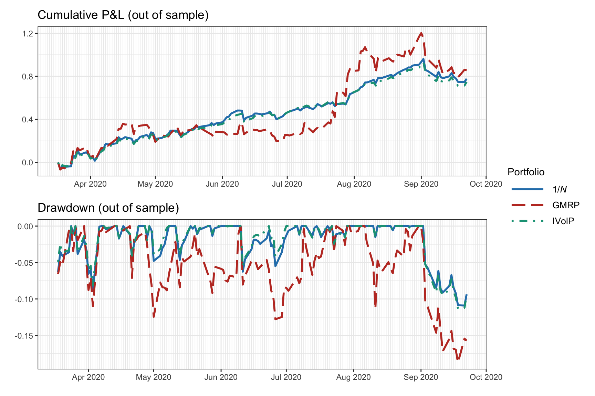

## Table of Contents

## What is annualized turnover in the context of backtesting?

Annualized turnover in backtesting refers to how often a portfolio's holdings are bought and sold over a year. It is a measure of how actively a portfolio is managed. If a portfolio has a high turnover, it means the stocks or assets in it are traded frequently. On the other hand, a low turnover indicates that the portfolio's assets are held for longer periods with fewer trades.

This metric is important because it helps investors understand the trading costs associated with a strategy. Higher turnover can lead to higher transaction costs, which can eat into the returns of the portfolio. By annualizing the turnover, investors can compare the trading activity of different strategies on a yearly basis, making it easier to assess the efficiency and cost-effectiveness of each approach.

## Why is it important to calculate annualized turnover in backtesting?

Calculating annualized turnover in backtesting is important because it shows how often the investments in a portfolio are being bought and sold over a year. This helps investors see how active the strategy is. If a strategy has a high turnover, it means the investments are being traded a lot. This can be good if the strategy is making money, but it can also mean more costs because buying and selling investments often can be expensive.

Knowing the annualized turnover also helps investors compare different investment strategies. By looking at the turnover rate each year, investors can see which strategies trade more and which ones hold onto investments longer. This can help them choose a strategy that fits their goals and how much they are willing to pay in trading costs. In the end, understanding turnover can lead to better decisions about which investment strategies to use.

## How do you calculate annualized turnover for a trading strategy?

To calculate annualized turnover for a trading strategy, you first need to figure out the total turnover for the period you're looking at. Turnover is the total value of all the trades (buying and selling) you made during that time. For example, if you bought and sold stocks worth $100,000 over six months, that's your turnover for those six months. To annualize it, you need to adjust this number to represent what it would be over a full year. If your six-month turnover was $100,000, you would double it to get the annualized turnover, which would be $200,000.

This process helps you understand how active your trading strategy is over a year. If you have data for a different period, like three months, you would multiply the turnover by four to get the annualized figure. The key is to make sure you're comparing apples to apples when looking at different strategies. By annualizing the turnover, you can see which strategies involve a lot of trading and which ones are more about holding onto investments for longer periods. This helps you make better choices about which strategy fits your goals and how much you're willing to pay in trading costs.

## What is the difference between turnover and annualized turnover?

Turnover is how much you buy and sell in a certain time. It's the total value of all the trades you make, like if you bought and sold $50,000 worth of stocks in a month, that's your turnover for that month.

Annualized turnover takes that monthly turnover and guesses what it would be for a whole year. If your turnover for a month was $50,000, you would multiply it by 12 to get the annualized turnover, which would be $600,000. This helps you compare how active your trading is over a year, even if you only have data for a shorter time.

## Can annualized turnover be used to compare different trading strategies?

Yes, annualized turnover can be used to compare different trading strategies. It helps you see how often each strategy trades its investments over a year. If one strategy has a high annualized turnover, it means it's trading a lot, while a strategy with a low turnover is holding onto its investments longer. This can help you pick a strategy that fits how active you want to be and how much you're willing to pay in trading costs.

By using annualized turnover, you can make sure you're comparing strategies fairly. Even if you only have data for part of a year, you can guess what the turnover would be for the whole year. This way, you can see which strategies are more active and which ones are less active, making it easier to choose the best one for your goals.

## What are the common pitfalls when calculating annualized turnover?

One common pitfall when calculating annualized turnover is not accounting for the full value of trades. Sometimes people only look at the buying part or the selling part, but you need to include both to get the right turnover. If you only count buying or selling, your turnover number will be wrong, and that can mess up how you compare different trading strategies.

Another mistake is not adjusting for the time period correctly. If you have data for less than a year, you need to multiply the turnover by the right number to guess what it would be for a whole year. For example, if you have three months of data, you need to multiply by four, not by three. If you don't do this right, your annualized turnover won't be accurate, and you might think a strategy is more or less active than it really is.

## How does annualized turnover affect the transaction costs in a trading strategy?

Annualized turnover shows how often you buy and sell investments in a year. If your strategy has a high annualized turnover, it means you're trading a lot. This can lead to higher transaction costs because every time you buy or sell something, you usually have to pay fees or commissions. These costs can add up quickly if you're trading a lot, and they can eat into the money you make from your investments.

On the other hand, if your strategy has a low annualized turnover, you're not trading as much. This means you'll have fewer transaction costs because you're not buying and selling as often. By keeping an eye on your annualized turnover, you can better understand how much you might be spending on trading and choose a strategy that helps you keep those costs down while still meeting your investment goals.

## What impact does annualized turnover have on the risk-adjusted performance of a portfolio?

Annualized turnover can affect the risk-adjusted performance of a portfolio because it shows how often you're buying and selling investments. If your turnover is high, you're trading a lot, which can lead to higher transaction costs. These costs can eat into your returns, making your portfolio's performance look worse when you adjust for risk. High turnover might also mean you're taking on more risk because you're constantly changing what you own, which can make your portfolio more volatile.

On the other hand, a low annualized turnover means you're not trading as much. This can help keep your transaction costs down, which can improve your risk-adjusted performance. When you're not spending as much on buying and selling, more of your returns stay in your pocket. Also, holding onto investments longer can sometimes lead to a more stable portfolio, which can be good for managing risk. So, understanding your annualized turnover can help you pick a strategy that balances risk and cost in a way that works for you.

## How can high annualized turnover indicate potential overfitting in a backtest?

High annualized turnover in a backtest can be a sign that a trading strategy might be overfitting. Overfitting happens when a strategy is too perfectly tuned to past data, making it work great in the backtest but not so well in real life. If a strategy has a very high turnover, it means it's trading a lot, trying to catch every little move in the market. This can make the backtest look really good because it's using all the tiny details from the past data. But in real life, the market doesn't always move the same way, so a strategy that trades too much might not do as well.

When you see a high annualized turnover, it's a good idea to check if the strategy is too complicated. A strategy that's too focused on past data might not work well in the future because it's not flexible enough to handle new market conditions. By keeping an eye on the turnover, you can see if the strategy is trying to do too much and maybe simplify it to make it more likely to work well in the real world.

## What are advanced methods to optimize annualized turnover in portfolio management?

One advanced way to optimize annualized turnover in portfolio management is by using algorithms that focus on reducing trading costs. These algorithms can look at past data to find the best times to buy and sell, so you don't trade too much. They can also use techniques like batch trading, where you group trades together to save on costs. By doing this, you can lower your turnover and keep more of your money instead of spending it on fees.

Another method is to use a strategy called "rebalancing bands." Instead of rebalancing your portfolio at set times, you only make changes when your investments move outside certain limits. This means you trade less often, which can lower your turnover. It's like setting up guardrails for your portfolio, so you only adjust when things get too far off track. This can help you manage your portfolio more efficiently and keep your costs down.

## How does annualized turnover relate to market liquidity and trading volume?

Annualized turnover shows how much you buy and sell in a year. It's important because it can tell you about the market's liquidity and trading volume. Liquidity means how easy it is to buy or sell something without the price changing a lot. If a market has high liquidity, you can trade a lot without worrying too much about the price moving against you. Trading volume is how many shares or how much value is traded in a day. If a market has high trading volume, it means a lot of people are buying and selling, which can make it easier to trade without big price changes.

When you have a high annualized turnover in your portfolio, it might mean you're taking advantage of a market with good liquidity and high trading volume. You can trade a lot without big costs because there are always people ready to buy or sell what you have. But if the market isn't very liquid or doesn't have much trading volume, a high turnover can be risky. You might have trouble selling what you want to sell without the price dropping a lot, which can hurt your returns. So, understanding the liquidity and trading volume of the markets you're trading in can help you manage your annualized turnover better.

## What role does annualized turnover play in regulatory compliance and reporting for investment funds?

Annualized turnover is important for investment funds when it comes to following the rules and reporting to people like investors and regulators. It shows how often a fund buys and sells its investments in a year. Regulators want to know this because it can tell them if a fund is taking on too much risk or if it's costing too much in trading fees. If a fund has a high turnover, it might need to explain why it's trading so much and how it's managing the costs and risks that come with it.

When investment funds report to their investors, they often include the annualized turnover to show how active the fund's management is. Investors can use this information to see if the fund is trading a lot or holding onto investments for a long time. This helps them decide if the fund fits their goals and how much they're willing to pay in trading costs. By keeping track of the annualized turnover, funds can make sure they're following the rules and giving their investors clear information about how the fund is managed.

## What is Understanding Annualized Turnover?

Annualized turnover is a metric used to assess the frequency at which assets within a portfolio are replaced over a specified period, with the result extrapolated to reflect a yearly rate. This metric provides insight into the trading activity level of a portfolio, giving an indication of how often transactions are made. 

In practical terms, high annualized turnover rates are indicative of an active trading strategy, characterized by frequent buying and selling of securities. This approach might be adopted by traders aiming to capitalize on short-term market movements, potentially leading to higher returns but also increased transaction costs. Conversely, low annualized turnover rates suggest a buy-and-hold strategy, which involves fewer transactions and is often associated with long-term investment objectives.

Mathematically, the annualized turnover is calculated by first determining the total value of trades conducted within a particular period. This is divided by the average or initial portfolio value to derive the turnover ratio. If the analysis covers a period shorter than a year, such as a quarter or half-year, the turnover ratio can be annualized by adjusting the time [factor](/wiki/factor-investing) accordingly. The formula for annualized turnover can be expressed as:

$$
\text{Annualized Turnover} = \left( \frac{\text{Total Trade Volume in Period}}{\text{Initial Portfolio Value}} \right) \times \left( \frac{\text{Number of Periods in a Year}}{\text{Number of Periods Covered}} \right)
$$

Understanding the rate of turnover helps traders and portfolio managers gauge the implications of their trading frequency in terms of potential returns and the operational costs incurred through transaction fees.

## How do you calculate annualized turnover in backtested strategies?

To compute annualized turnover in backtested trading strategies, one must start by determining the total [volume](/wiki/volume-trading-strategy) of trades executed within the specified backtest period. This requires the trader to sum up the absolute value of all buy and sell transactions conducted during the backtest. Once the total trade volume is calculated, the next step is to obtain the turnover ratio. This ratio is calculated by dividing the total trade volume by the initial portfolio value:

$$
\text{Turnover Ratio} = \frac{\text{Total Trade Volume}}{\text{Initial Portfolio Value}}
$$

To convert this turnover ratio into an annualized figure, it is necessary to adjust it based on the length of the backtest period. If the backtest period encompasses less than a full year, the turnover ratio should be extrapolated to represent an entire year. The formula to achieve this extrapolation is:

$$
\text{Annualized Turnover} = \text{Turnover Ratio} \times \frac{\text{Number of Days in a Year}}{\text{Number of Days in Backtest Period}}
$$

This calculation assumes a standard year consisting of 252 trading days, aligning with typical market conventions. This adjustment allows traders to compare turnover metrics across strategies with different backtest durations and provides a standardized measure of how actively a trading strategy is managed. By understanding the annualized turnover rate, traders can evaluate the potential impact of transaction costs and make informed decisions about their strategy's viability.

## References & Further Reading

[1]: Bergstra, J., Bardenet, R., Bengio, Y., & Kégl, B. (2011). ["Algorithms for Hyper-Parameter Optimization."](https://papers.nips.cc/paper/4443-algorithms-for-hyper-parameter-optimization) Advances in Neural Information Processing Systems 24.

[2]: ["Advances in Financial Machine Learning"](https://www.amazon.com/Advances-Financial-Machine-Learning-Marcos/dp/1119482089) by Marcos Lopez de Prado

[3]: ["Evidence-Based Technical Analysis: Applying the Scientific Method and Statistical Inference to Trading Signals"](https://www.amazon.com/Evidence-Based-Technical-Analysis-Scientific-Statistical/dp/0470008741) by David Aronson

[4]: ["Machine Learning for Algorithmic Trading"](https://github.com/stefan-jansen/machine-learning-for-trading) by Stefan Jansen

[5]: ["Quantitative Trading: How to Build Your Own Algorithmic Trading Business"](https://books.google.com/books/about/Quantitative_Trading.html?id=j70yEAAAQBAJ) by Ernest P. Chan