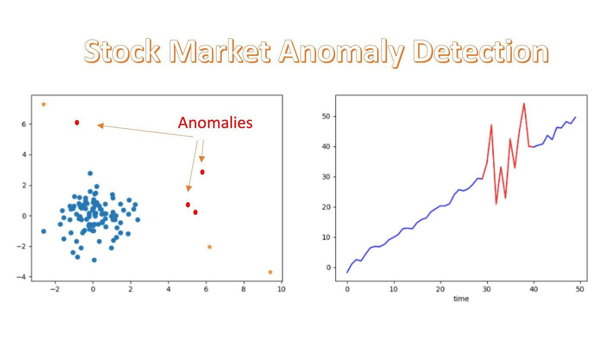

Understanding anomalies in market data is crucial for algorithmic traders seeking to capitalize on inefficiencies. Anomalies refer to deviations from expected behaviors or values in financial markets, presenting both challenges and opportunities for traders. These deviations may be caused by a variety of factors, including but not limited to market sentiment, macroeconomic events, and irregular investor behavior.

Algorithmic trading is a strategy that leverages computer algorithms to execute trades at high speeds, often bypassing human limitations in processing and reacting to data. This approach allows traders to scan and analyze large datasets rapidly, making it possible to identify and exploit subtle patterns and anomalies that might be missed by manual trading methods.



Detecting and exploiting market anomalies is essential for developing effective trading strategies. The identification of anomalies involves the use of statistical methods, machine learning, and data analysis tools to spot patterns or deviations from the norm. Once identified, these anomalies can inform trading decisions, enabling traders to exploit market inefficiencies for potential profit.

This article explores various types of anomalies, as well as their detection methods and implications for algorithmic trading. By understanding how these anomalies can be recognized and leveraged, traders can enhance their strategies and potentially gain a competitive advantage in the fast-paced world of financial markets.

## Table of Contents

## Types of Market Anomalies

Market anomalies can significantly influence trading strategies by providing insights into predictable patterns or discrepancies in the financial markets. These anomalies are primarily categorized into seasonal, momentum, size, and reaction-based anomalies.

Seasonal, or calendar anomalies, are recurring patterns in stock returns at specific times of the year or week. Two notable examples include the January Effect and Monday Effect. The January Effect refers to the tendency for stock prices, especially small-cap stocks, to rise more in January compared to other months. This can be attributed to year-end tax-loss selling, followed by investment of the proceeds in the new year, coupled with new-year investor optimism. The Monday Effect suggests that stock prices are likely to decline on Mondays, possibly due to the accumulation of bad news over the weekend, leading to a negative start to the trading week.

Momentum anomalies involve the continued movement of asset prices in the same direction as previous trends. This suggests that securities that have performed well in the past will continue to perform well in the short term, and those that have performed poorly will continue to underperform. The [momentum](/wiki/momentum) effect can be identified using indicators like moving averages or the relative strength index (RSI). Conversely, momentum reversals, where prices reverse after a prolonged trend, also occur and can be utilized in trading strategies.

Size and value anomalies pertain to discrepancies linked to market capitalization and valuation metrics of stocks. The size anomaly, often referred to as the Small-Cap Effect, indicates that small-cap stocks tend to outperform large-cap stocks over the long term. This phenomenon may arise from the under-researched and undervalued nature of small-cap stocks, leading to higher growth potential. Value anomalies, on the other hand, indicate that stocks with low price-to-earnings (P/E) ratios or high book-to-market ratios tend to outperform the market. This occurs as investors eventually recognize the undervaluation of these stocks, driving their prices up.

Reaction-based anomalies are characterized by market underreaction or overreaction to new information. Underreaction occurs when the market fails to incorporate new information quickly or fully, leading to price adjustments over time as the information becomes more recognized by investors. Overreaction, conversely, happens when investors react too strongly to new information, causing excessive price movements that are later corrected as the initial response is tempered. These anomalies offer opportunities to exploit the mismatch between expected and actual market responses through well-timed trades. 

Understanding and leveraging these market anomalies is essential for traders seeking to develop strategies that capitalize on predictable market behaviors and discrepancies.

## Detecting Anomalies Using Algorithms

Algorithmic trading employs a range of techniques and methodologies to effectively identify and exploit market anomalies. These methodologies leverage the power of data analysis and computational algorithms to uncover opportunities that may not be immediately evident through traditional trading strategies. 

### Statistical Arbitrage

Statistical [arbitrage](/wiki/arbitrage) is a sophisticated method that capitalizes on historical data mispricing to develop profitable trading strategies. In this approach, traders seek to identify relationships between different securities and take advantage of temporary deviations from these established relationships. Statistical models are constructed to determine the expected prices or returns, allowing traders to execute trades when prices deviate from these expectations, assuming a reversion to the mean.

For example, a trader might identify a pair of stocks that historically move in tandem. If one stock diverges from its partner, the trader can short the overperforming stock and go long on the underperforming one, anticipating their prices will converge again. The mathematical model employed could involve regression analysis to establish a mean-reverting relationship, possibly represented by:

$$
Y_t = \alpha + \beta X_t + \epsilon_t
$$

where $Y_t$ and $X_t$ represent the prices of the securities at time $t$, and $\epsilon_t$ is the error term.

### Machine Learning Models

Machine learning has significantly advanced the detection of complex patterns in financial data. Both supervised and unsupervised learning models are used to discover anomalies that may signal trading opportunities. Supervised learning involves training models on labeled datasets to predict outcomes, while unsupervised learning does not require labels and is used to identify hidden patterns or groupings in data.

Algorithms such as neural networks or support vector machines (SVMs) are often applied to mine financial datasets for anomalies. For instance, a [neural network](/wiki/neural-network) might be trained to predict price movements based on historical patterns:

```python
from sklearn.neural_network import MLPClassifier

# Define the features and target variable
X = financial_data.drop(columns=['Outcome'])
y = financial_data['Outcome']

# Initialize and train the neural network
model = MLPClassifier(hidden_layer_sizes=(100,), max_iter=2000)
model.fit(X, y)

# Predict potential anomalies
predictions = model.predict(new_data)
```

### Sentiment Analysis

Sentiment analysis utilizes natural language processing (NLP) to derive market sentiment from a wide array of textual data sources, including news articles, social media, and earnings reports. By quantifying sentiment—typically as positive, negative, or neutral—traders can identify anomalies linked to investor emotions and sentiment.

A sentiment score can be extracted from the text using language models:

```python
from textblob import TextBlob

# Function to calculate sentiment score
def analyze_sentiment(text):
    return TextBlob(text).sentiment.polarity

# Analyze sentiment of a sample text
sentiment_score = analyze_sentiment("The company's earnings exceeded expectations.")
```

This sentiment score can serve as a signal, triggering trading actions if significant sentiment shifts are detected.

### Advantages of These Methods

Each of these methods offers distinct advantages for anomaly detection and trading. Statistical arbitrage efficiently exploits quantifiable relationships between securities, [machine learning](/wiki/machine-learning) models provide the capability to uncover non-linear patterns and adapt to changing market conditions, and sentiment analysis offers insights into market perceptions and psychological influences. Collectively, these techniques enhance the toolkit available for algorithmic traders to capitalize on market anomalies, thus potentially leading to superior trading performance.

## Applications in Algorithmic Trading

Anomaly detection algorithms in [algorithmic trading](/wiki/algorithmic-trading) are instrumental in enhancing trading strategies through various methodologies. Calendar-based strategies take advantage of predictable market patterns, such as the January Effect, where stock prices historically tend to increase, and the Holiday Effect, where returns may vary around holidays. These patterns offer traders a chance to plan and execute trades around anticipated market movements associated with specific times or events.

Value-based algorithms focus on identifying undervalued stocks by prioritizing investments in low price-to-earnings (P/E) ratios and stocks with high book-to-market values. These metrics help traders locate companies that may be undervalued relative to the market, with the potential for appreciation as market perceptions adjust.

Momentum-based strategies capitalize on the continuation of existing market trends. These strategies involve buying securities that have exhibited strong past performance and selling those with poor performance. Additionally, earnings-related strategies guide trades based on unexpected earnings announcements, allowing traders to respond to new information that could impact security valuations.

Size-based strategies target anomalies related to market capitalization, such as the Small-Cap Effect. This approach seeks to exploit the tendency for smaller companies to outperform larger ones, potentially yielding higher returns for investors.

The integration of these anomaly detection algorithms with algorithmic trading frameworks necessitates robust computational tools and strategies. Algorithms must be backtested rigorously using historical data to ensure validity and performance. The effective execution of these strategies can be streamlined through high-frequency trading platforms and real-time data feeds, which are vital for swiftly reacting to market anomalies and maximizing potential profits.

## Practical Considerations

Effective application of anomaly-based strategies necessitates rigorous [backtesting](/wiki/backtesting) and simulation processes. Backtesting allows traders to evaluate how a strategy might have performed using historical data, providing insights into its potential effectiveness and shortcomings. Simulation extends this by enabling the testing of strategies in a controlled environment, mimicking real market conditions. This practice is crucial for refining algorithms and preparing them to operate successfully in live trading scenarios.

Risk management is indispensable in trading strategies that exploit anomalies. Traders employ diversification to spread investments across different assets, reducing exposure to any single market anomaly. Stop-loss orders are another critical tool, automatically selling an asset when it reaches a predetermined price level, thus capping potential losses. This disciplined approach ensures that the impact of incorrect predictions or unexpected market conditions is minimized.

Anomaly-driven trades benefit significantly from high-frequency trading ([HFT](/wiki/high-frequency-trading-strategies)) and real-time data feeds. HFT strategies execute trades at speeds that allow them to capitalize on minute price changes quickly, while real-time data feeds ensure that traders have the latest market information at their disposal. The synergy of these technologies facilitates the swift execution of trades based on detected anomalies, improving the likelihood of capturing profitable opportunities.

Regulatory and ethical considerations also play a pivotal role in the application of anomaly-based trading strategies. Traders must ensure compliance with market regulations to avoid legal repercussions and maintain the integrity of market operations. Market manipulation, such as using trades to create false or misleading appearances, must be avoided to preserve fair trading conditions. Maintaining ethical practices safeguards both the trader's reputation and the broader market ecosystem.

Ultimately, traders must balance the potential rewards associated with anomalies against the inherent risks. While anomalies can offer lucrative opportunities, they are inherently unpredictable and may entail significant risk if not managed properly. An effective strategy requires continuous adaptation and refinement in response to market changes, ensuring both compliance and profitability in the ever-evolving financial landscape.

## Notable Companies and Tools

Several firms have become prominent in the field of algorithmic trading by leveraging sophisticated algorithms to capitalize on market anomalies. Notable among these are Renaissance Technologies and Two Sigma, both of which utilize advanced machine learning algorithms and big data analytics. These companies efficiently process extensive volumes of information, allowing for the identification and exploitation of subtle market inefficiencies that might otherwise go undetected.

Renaissance Technologies, founded by former mathematician James Simons, is renowned for its quantitative approach to investing. The firm employs complex mathematical models and high-frequency trading strategies to take advantage of market anomalies. Similarly, Two Sigma leverages its expertise in data science and technology, incorporating [artificial intelligence](/wiki/ai-artificial-intelligence) to analyze vast datasets in real time. This enables them to uncover non-obvious patterns that can be translated into profitable trading strategies.

In addition to these firms, several tools are available that specialize in anomaly detection and predictive analytics. Kensho Technologies, for instance, provides powerful analytics solutions that help traders identify market inefficiencies. Its platform is designed to process and analyze large-scale financial data, offering insights that support informed trading decisions.

AIQLabs is another company offering tools for the detection of market anomalies. Their focus on machine learning-based models allows for the recognition of complex market patterns, enhancing the ability of traders to make informed decisions based on anomaly detection.

Moreover, TradeIdeas' HawkEye applies advanced scanning techniques to identify unusual market behavior. This tool aids traders by providing a real-time analysis of market movements, flagging potential opportunities where anomalies may present themselves.

These companies and tools exemplify the forefront of technological innovation in anomaly detection and algorithmic trading, offering traders refined methods to exploit inefficiencies in financial markets while managing risk effectively.

## Conclusion

Market anomalies offer traders unique opportunities to achieve superior returns through algorithmic trading. These deviations from expected market behaviors allow traders to exploit inefficiencies that others might overlook. Nevertheless, the pursuit of such opportunities comes with inherent challenges that necessitate the use of sophisticated techniques and robust risk management strategies. The detection and exploitation of anomalies require rigorous quantitative analysis, deploying advanced technologies like machine learning and real-time data analysis to stay ahead.

As financial markets evolve, the significance of anomalies might increase, urging traders to continuously innovate. The adoption of new technologies and methodologies is crucial for identifying and capitalizing on emerging anomalies. For instance, machine learning algorithms can uncover patterns in vast datasets that may not be immediately apparent through traditional analysis. This capability is essential as markets become more complex and the [volume](/wiki/volume-trading-strategy) of data increases.

Traders must adapt and refine their strategies consistently to maintain a competitive edge. This involves backtesting new strategies against historical data to confirm their validity and adjusting them in response to changing market conditions. By doing so, traders can ensure that their strategies remain relevant and effective in exploiting market inefficiencies.

A comprehensive understanding of market anomalies and their application in algorithmic trading can lead to significant trading advantages. It involves a blend of technical expertise, market knowledge, and strategic foresight. With an appropriate deployment of resources and strategies, traders can not only identify these anomalies but also leverage them for profitable trading ventures, balancing potential rewards with the associated risks.

## References & Further Reading

[1]: ["Algorithmic Trading and DMA: An Introduction to Direct Access Trading Strategies"](https://www.amazon.com/Algorithmic-Trading-DMA-introduction-strategies/dp/0956399207) by Barry Johnson

[2]: ["Advances in Financial Machine Learning"](https://www.amazon.com/Advances-Financial-Machine-Learning-Marcos/dp/1119482089) by Marcos Lopez de Prado

[3]: Jegadeesh, N., & Titman, S. (1993). ["Returns to Buying Winners and Selling Losers: Implications for Stock Market Efficiency."](https://www.bauer.uh.edu/rsusmel/phd/jegadeesh-titman93.pdf) Journal of Finance, 48(1).

[4]: Lahmiri, S., & Bekiros, S. (2019). ["Performance of machine learning methods in forecasting equity market returns."](https://www.semanticscholar.org/paper/Can-machine-learning-approaches-predict-corporate-a-Lahmiri-Bekiros/0817b5350348bcb70481128a379714400c1cc322) Expert Systems with Applications, 134, 33-44.

[5]: Fama, E. F. (1998). ["Market efficiency, long-term returns, and behavioral finance."](https://www.sciencedirect.com/science/article/pii/S0304405X98000269) Journal of Financial Economics, 49(3), 283-306.

[6]: Carhart, M. M. (1997). ["On Persistence in Mutual Fund Performance."](https://www.jstor.org/stable/2329556) Journal of Finance, 52(1). 

[7]: ["Quantitative Trading: How to Build Your Own Algorithmic Trading Business"](https://www.amazon.com/Quantitative-Trading-Build-Algorithmic-Business/dp/1119800064) by Ernest P. Chan

[8]: Chan, E., & Lakonishok, J. (1993). ["Value and contrarian investing: empirical evidence on stock market anomalies."](https://doi.org/10.1016/0927-5398(93)90003-E) Journal of Financial Economics, 52(2).

[9]: "Introduction to Algorithms for Data Mining and Machine Learning” by Xin-She Yang