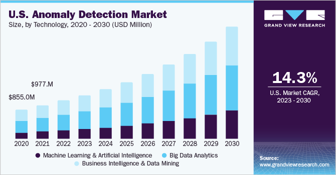

## Table of Contents

## What are market data anomalies?

Market data anomalies are unusual patterns or events in financial markets that don't follow the normal behavior of the market. These can be caused by many things, like mistakes in data, big news events, or even computer errors. When traders and investors see these anomalies, they often try to understand why they happened and what they might mean for their investments.

Anomalies can be important because they can give clues about what might happen next in the market. For example, if a stock price suddenly jumps up or down a lot, it might mean that something important is happening with that company. By studying these anomalies, people can make better decisions about buying or selling stocks. However, it's also important to be careful because sometimes anomalies can be misleading and lead to bad investment choices.

## How can market data anomalies affect trading decisions?

Market data anomalies can really change how people make trading decisions. When traders see something unusual in the market, like a big jump or drop in a stock price, they start to think about why it happened. They might decide to buy or sell based on what they think the anomaly means. For example, if a stock price suddenly goes up a lot, traders might think something good is happening with the company and decide to buy the stock, hoping to make money as the price keeps going up.

But, anomalies can also trick traders into making bad choices. Sometimes, a big change in price might just be a mistake or caused by something that doesn't really matter in the long run. If traders act too quickly without understanding the real reason behind the anomaly, they might buy or sell at the wrong time. This can lead to losing money instead of making it. So, it's important for traders to look closely at anomalies and think carefully before making any big moves.

## What are some common types of market data anomalies?

Market data anomalies can show up in different ways. One common type is a sudden big change in price. This can happen when there's breaking news about a company, like a new product launch or a scandal. Another type is when trading [volume](/wiki/volume-trading-strategy) goes way up or down out of nowhere. This might happen if a lot of people start buying or selling a stock at the same time, maybe because of a rumor or a big event.

Another kind of anomaly is when there's a mistake in the data. This can happen if someone enters the wrong numbers or if there's a problem with the computer system that tracks prices. These mistakes can make it look like a stock's price has changed a lot when it really hasn't. Also, sometimes anomalies happen because of what's called a "fat finger" trade, where someone accidentally buys or sells a lot more than they meant to.

Lastly, there are anomalies caused by high-frequency trading. These are trades made by computers very quickly, and sometimes they can cause prices to move in strange ways. For example, if a lot of computers start selling a stock at the same time, the price can drop suddenly. Understanding these different types of anomalies can help traders make better decisions and avoid getting tricked by unusual market movements.

## How can one identify market data anomalies?

To spot market data anomalies, you need to keep an eye on the market and watch for things that don't seem normal. Look for big jumps or drops in stock prices that happen suddenly. These might be caused by news about a company, like a new product or a problem. Also, watch out for times when a lot more or a lot less trading is happening than usual. This could mean something big is going on, or it could be a mistake in the data.

Another way to find anomalies is by using tools and software that help track the market. These tools can alert you when something unusual happens, like a big change in price or trading volume. They can also help you see patterns and figure out if what you're seeing is a real anomaly or just a normal market move. It's important to check different sources and not just rely on one, because sometimes what looks like an anomaly might just be a mistake or a temporary glitch.

## What are the potential causes of market data anomalies?

Market data anomalies can happen for many reasons. One big reason is news about a company, like a new product or a problem. When this news comes out, it can make the stock price jump up or down a lot. Another reason is mistakes in the data. Sometimes, someone might enter the wrong numbers or there could be a problem with the computer system that tracks prices. These mistakes can make it look like a stock's price has changed a lot when it really hasn't.

Another cause of anomalies is trading volume going up or down a lot suddenly. This can happen if a lot of people start buying or selling a stock at the same time, maybe because of a rumor or a big event. Also, high-frequency trading, where computers trade very quickly, can cause prices to move in strange ways. If a lot of computers start selling a stock at the same time, the price can drop suddenly. Sometimes, a "fat finger" trade, where someone accidentally buys or sells a lot more than they meant to, can also cause an anomaly.

## What tools and techniques are used to detect market data anomalies?

To find market data anomalies, people use different tools and ways to look at the market. One common tool is software that watches the market all the time. This software can send alerts when something unusual happens, like a big change in a stock's price or a lot more trading than usual. It can also show graphs and charts that help people see patterns and figure out if what they're seeing is really an anomaly or just a normal market move.

Another way to spot anomalies is by using math and numbers to study the market. This can include things like looking at how prices move over time or using special formulas to find unusual patterns. Traders might also use different sources of information to check if what they're seeing is real. By comparing data from different places, they can tell if an anomaly is a mistake or something important that they need to pay attention to.

## How do market data anomalies impact different types of financial instruments?

Market data anomalies can affect different financial instruments like stocks, bonds, and commodities in various ways. For stocks, a sudden big change in price or trading volume can make investors think something important is happening with the company. This might lead them to buy or sell the stock quickly, hoping to make money or avoid losing it. If the anomaly is caused by a mistake or a temporary glitch, it can cause confusion and lead to bad trading decisions. For bonds, anomalies might show up as unusual changes in interest rates or bond prices, which can affect how much investors are willing to pay for them.

Commodities like oil or gold can also be impacted by market data anomalies. A sudden jump or drop in the price of a commodity might be caused by news about supply and demand, like a new oil discovery or a problem at a mine. Traders might react to these anomalies by buying or selling the commodity, which can lead to more price changes. Just like with stocks and bonds, it's important for traders to understand the real reason behind the anomaly to make smart trading choices and not get tricked by unusual market movements.

## What are the best practices for managing market data anomalies in real-time trading?

When trading in real-time, it's important to have good tools that watch the market all the time. These tools can send alerts when something unusual happens, like a big change in price or a lot more trading than usual. This helps traders see anomalies quickly and figure out if they need to do something about them. It's also a good idea to use different sources of information to check if what you're seeing is real. By comparing data from different places, traders can tell if an anomaly is a mistake or something important that they need to pay attention to.

Once an anomaly is spotted, traders should think carefully before making any big moves. It's easy to get excited and act too quickly, but sometimes anomalies can be misleading. Taking a moment to understand why the anomaly happened can help traders make better decisions. For example, if a stock price suddenly goes up a lot, it might be because of good news about the company, but it could also be a mistake in the data. By staying calm and doing a bit of research, traders can avoid bad choices and make the most of the information they have.

## How do regulatory bodies address market data anomalies?

Regulatory bodies, like the Securities and Exchange Commission (SEC) in the U.S., keep a close eye on the market to spot and deal with data anomalies. They use special tools and rules to watch for unusual changes in prices or trading volumes. When they see something that doesn't look right, they start looking into it to find out why it happened. They want to make sure the market is fair and that no one is cheating or making mistakes that could hurt other people.

If a regulatory body finds out that an anomaly was caused by something bad, like a mistake or someone trying to cheat, they can take action to fix it. They might make new rules or punish the people who caused the problem. This helps keep the market safe and fair for everyone. By doing this, they try to stop big problems from happening and make sure that traders and investors can trust the market.

## What advanced statistical methods are used to analyze market data anomalies?

To understand market data anomalies better, people use advanced math and numbers called statistical methods. One common way is using something called time series analysis. This helps them see how prices or trading volumes change over time and spot any unusual patterns. Another method is called regression analysis, which looks at how different things in the market are connected. By using regression, people can figure out if an anomaly is just a random thing or if it's caused by something else in the market.

Another important tool is machine learning. This is when computers learn from past data to find patterns and predict what might happen next. Machine learning can help spot anomalies by looking at a lot of data very quickly and finding things that don't fit the normal pattern. Also, something called cluster analysis can group similar data together, which helps find unusual groups of data that might be anomalies. By using these advanced methods, people can get a better understanding of why anomalies happen and make smarter decisions about trading.

## How can machine learning be applied to predict and mitigate market data anomalies?

Machine learning can help predict and deal with market data anomalies by looking at a lot of past data and finding patterns. It can learn what normal market behavior looks like and then spot when something unusual happens. For example, if a stock price suddenly jumps up or down a lot, machine learning can check if this has happened before and what caused it. By doing this, it can give traders a heads-up about possible anomalies before they happen, helping them make better trading choices.

Once an anomaly is found, machine learning can also help figure out what caused it. It can look at different pieces of information like news about a company, trading volumes, and past price changes to see if the anomaly is real or just a mistake. This helps traders understand if they need to act on the anomaly or if it's something they can ignore. By using machine learning, traders can be more prepared and make smarter decisions to avoid losing money because of unusual market movements.

## What case studies illustrate significant market data anomalies and their consequences?

One famous case of a market data anomaly happened on May 6, 2010, known as the "Flash Crash." That day, the stock market suddenly dropped a lot in just a few minutes. Many stocks, including big ones like Procter & Gamble, lost a lot of value very quickly. It turned out that this was caused by high-frequency trading computers making a lot of trades very fast. This event showed how important it is to watch the market closely and understand what can cause these big changes. It led to new rules to try to stop something like this from happening again.

Another example is the "London Whale" incident in 2012. A trader at JPMorgan Chase made some big trades that caused unusual changes in the price of certain financial instruments. These trades were so big that they created anomalies in the market data, making it hard for other traders to understand what was going on. The bank ended up losing billions of dollars because of these trades. This case showed how one person's actions can lead to big market anomalies and how important it is for banks to have good checks and rules in place to stop this from happening.

## Can we detect anomalies using algorithms?

Algorithmic trading employs a range of techniques and methodologies to effectively identify and exploit market anomalies. These methodologies leverage the power of data analysis and computational algorithms to uncover opportunities that may not be immediately evident through traditional trading strategies. 

### Statistical Arbitrage

Statistical [arbitrage](/wiki/arbitrage) is a sophisticated method that capitalizes on historical data mispricing to develop profitable trading strategies. In this approach, traders seek to identify relationships between different securities and take advantage of temporary deviations from these established relationships. Statistical models are constructed to determine the expected prices or returns, allowing traders to execute trades when prices deviate from these expectations, assuming a reversion to the mean.

For example, a trader might identify a pair of stocks that historically move in tandem. If one stock diverges from its partner, the trader can short the overperforming stock and go long on the underperforming one, anticipating their prices will converge again. The mathematical model employed could involve regression analysis to establish a mean-reverting relationship, possibly represented by:

$$
Y_t = \alpha + \beta X_t + \epsilon_t
$$

where $Y_t$ and $X_t$ represent the prices of the securities at time $t$, and $\epsilon_t$ is the error term.

### Machine Learning Models

Machine learning has significantly advanced the detection of complex patterns in financial data. Both supervised and unsupervised learning models are used to discover anomalies that may signal trading opportunities. Supervised learning involves training models on labeled datasets to predict outcomes, while unsupervised learning does not require labels and is used to identify hidden patterns or groupings in data.

Algorithms such as neural networks or support vector machines (SVMs) are often applied to mine financial datasets for anomalies. For instance, a [neural network](/wiki/neural-network) might be trained to predict price movements based on historical patterns:

```python
from sklearn.neural_network import MLPClassifier

# Define the features and target variable
X = financial_data.drop(columns=['Outcome'])
y = financial_data['Outcome']

# Initialize and train the neural network
model = MLPClassifier(hidden_layer_sizes=(100,), max_iter=2000)
model.fit(X, y)

# Predict potential anomalies
predictions = model.predict(new_data)
```

### Sentiment Analysis

Sentiment analysis utilizes natural language processing (NLP) to derive market sentiment from a wide array of textual data sources, including news articles, social media, and earnings reports. By quantifying sentiment—typically as positive, negative, or neutral—traders can identify anomalies linked to investor emotions and sentiment.

A sentiment score can be extracted from the text using language models:

```python
from textblob import TextBlob

# Function to calculate sentiment score
def analyze_sentiment(text):
    return TextBlob(text).sentiment.polarity

# Analyze sentiment of a sample text
sentiment_score = analyze_sentiment("The company's earnings exceeded expectations.")
```

This sentiment score can serve as a signal, triggering trading actions if significant sentiment shifts are detected.

### Advantages of These Methods

Each of these methods offers distinct advantages for anomaly detection and trading. Statistical arbitrage efficiently exploits quantifiable relationships between securities, [machine learning](/wiki/machine-learning) models provide the capability to uncover non-linear patterns and adapt to changing market conditions, and sentiment analysis offers insights into market perceptions and psychological influences. Collectively, these techniques enhance the toolkit available for algorithmic traders to capitalize on market anomalies, thus potentially leading to superior trading performance.

## References & Further Reading

[1]: ["Algorithmic Trading and DMA: An Introduction to Direct Access Trading Strategies"](https://www.amazon.com/Algorithmic-Trading-DMA-introduction-strategies/dp/0956399207) by Barry Johnson

[2]: ["Advances in Financial Machine Learning"](https://www.amazon.com/Advances-Financial-Machine-Learning-Marcos/dp/1119482089) by Marcos Lopez de Prado

[3]: Jegadeesh, N., & Titman, S. (1993). ["Returns to Buying Winners and Selling Losers: Implications for Stock Market Efficiency."](https://www.bauer.uh.edu/rsusmel/phd/jegadeesh-titman93.pdf) Journal of Finance, 48(1).

[4]: Lahmiri, S., & Bekiros, S. (2019). ["Performance of machine learning methods in forecasting equity market returns."](https://www.semanticscholar.org/paper/Can-machine-learning-approaches-predict-corporate-a-Lahmiri-Bekiros/0817b5350348bcb70481128a379714400c1cc322) Expert Systems with Applications, 134, 33-44.

[5]: Fama, E. F. (1998). ["Market efficiency, long-term returns, and behavioral finance."](https://www.sciencedirect.com/science/article/pii/S0304405X98000269) Journal of Financial Economics, 49(3), 283-306.

[6]: Carhart, M. M. (1997). ["On Persistence in Mutual Fund Performance."](https://www.jstor.org/stable/2329556) Journal of Finance, 52(1). 

[7]: ["Quantitative Trading: How to Build Your Own Algorithmic Trading Business"](https://www.amazon.com/Quantitative-Trading-Build-Algorithmic-Business/dp/1119800064) by Ernest P. Chan

[8]: Chan, E., & Lakonishok, J. (1993). ["Value and contrarian investing: empirical evidence on stock market anomalies."](https://doi.org/10.1016/0927-5398(93)90003-E) Journal of Financial Economics, 52(2).

[9]: "Introduction to Algorithms for Data Mining and Machine Learning” by Xin-She Yang