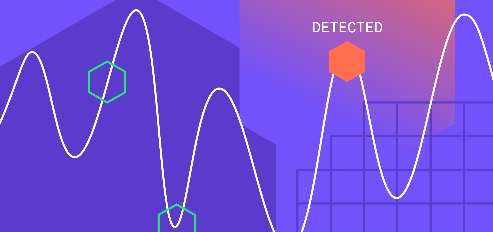

## Table of Contents

## What is Anomaly Detection in the context of machine learning?

Anomaly detection in machine learning is about finding unusual data points that don't fit well with the rest of the data. Imagine you have a bunch of apples, and most of them are red. If you find a blue apple, that's an anomaly because it's different from the others. In machine learning, these anomalies could be errors, fraud, or just something new and interesting that we didn't expect.

To do anomaly detection, we use different methods. One common way is to use a model that learns what "normal" data looks like. Then, when new data comes in, the model can tell if it's normal or if it's an anomaly. For example, we might use a statistical model to find anomalies in credit card transactions to catch fraud. Another way is to use clustering, where we group similar data points together, and anything that doesn't fit into a group might be an anomaly.

## Why is Anomaly Detection important in various industries?

Anomaly detection is really important in many industries because it helps find things that are out of the ordinary. For example, in banking, it can spot unusual transactions that might be fraud. This means banks can stop criminals from stealing money and keep their customers safe. In manufacturing, anomaly detection can find when a machine is not working right. This helps fix problems before they cause big issues, saving time and money.

In healthcare, anomaly detection can help doctors find unusual patterns in patient data, like early signs of diseases. This can lead to quicker treatment and better health for patients. In cybersecurity, it's used to find strange activities on computer networks, which could be hackers trying to break in. By catching these anomalies early, companies can protect their data and keep their systems running smoothly.

Overall, anomaly detection is like a watchful eye that helps keep things running smoothly across different fields. It's all about spotting the unusual so that people can take action to fix problems, prevent fraud, or even save lives.

## What are the common types of anomalies that can be detected?

There are three main types of anomalies that can be detected: point anomalies, contextual anomalies, and collective anomalies. Point anomalies are single data points that are very different from the rest of the data. For example, if most people spend around $100 on groceries each week, someone spending $1000 would be a point anomaly. Contextual anomalies are data points that are unusual only in a certain context. For instance, a high temperature might be normal in summer but an anomaly in winter. Collective anomalies happen when a group of data points together are unusual, even if each point on its own seems normal. An example would be a series of small transactions that add up to a large amount, which could indicate fraud.

Detecting these different types of anomalies requires different approaches. For point anomalies, you might use statistical methods to find data points that are far away from the average. For example, if you're looking at the average spending on groceries, you might flag any spending that is more than two standard deviations away from the mean as an anomaly: $$ |x - \mu| > 2\sigma $$. For contextual anomalies, you need to consider the context, like the time of year or the location, and use models that can understand these factors. Collective anomalies often require looking at sequences or patterns over time, so methods like time series analysis or clustering can be helpful. By understanding the type of anomaly you're looking for, you can choose the right tools and methods to detect them effectively.

## What are the basic steps involved in the Anomaly Detection process?

The first step in anomaly detection is collecting and preparing the data. You need to gather all the information you want to check for anomalies. This could be things like credit card transactions, machine sensor readings, or patient health records. Once you have the data, you need to clean it up. This means fixing any mistakes, like missing or wrong numbers, and making sure all the data is in a format that your anomaly detection method can use. For example, if you're looking for unusual spending patterns, you might want to make sure all the amounts are in the same currency and that there are no negative numbers.

Next, you choose and apply an anomaly detection method. There are many methods to pick from, and which one you use depends on what kind of anomalies you're looking for. If you're looking for point anomalies, you might use a simple statistical method like calculating the mean and standard deviation of your data and flagging any data points that are more than two standard deviations away from the mean: $$ |x - \mu| > 2\sigma $$. For more complex anomalies, you might use [machine learning](/wiki/machine-learning) models like clustering or neural networks. Once you've chosen your method, you run it on your data to find the anomalies. 

After detecting the anomalies, the final step is to analyze and act on them. You need to look at the anomalies to see if they are really unusual or if they're just mistakes in the data. If they are true anomalies, you need to figure out what to do about them. This could mean stopping a fraudulent transaction, fixing a broken machine, or alerting a doctor to a patient's unusual symptoms. Acting quickly and correctly on the anomalies can help prevent problems and keep things running smoothly.

## What are some simple statistical methods used for Anomaly Detection?

One simple statistical method for anomaly detection is the Z-score method. This method measures how many standard deviations a data point is from the mean of the dataset. If a data point has a Z-score that is too high or too low, it might be an anomaly. For example, if most people spend around $100 on groceries each week, and someone spends $300, you can calculate the Z-score to see if it's an anomaly. The formula for the Z-score is $$ Z = \frac{(X - \mu)}{\sigma} $$, where $X$ is the data point, $\mu$ is the mean, and $\sigma$ is the standard deviation. If the Z-score is greater than 2 or less than -2, the data point is often considered an anomaly.

Another simple method is the Interquartile Range (IQR) method. This method uses the middle 50% of the data to find anomalies. First, you find the first quartile (Q1) and the third quartile (Q3) of the data. The IQR is the difference between Q3 and Q1. Any data point that is more than 1.5 times the IQR below Q1 or above Q3 is considered an anomaly. For example, if Q1 is $50 and Q3 is $150, the IQR is $100. Any spending below $50 - 1.5 * 100 = -$100 or above $150 + 1.5 * 100 = $300 would be flagged as an anomaly. These methods are easy to use and can quickly help you spot unusual data points.

## How does machine learning improve Anomaly Detection compared to traditional methods?

Machine learning improves anomaly detection by learning from data in a way that traditional methods can't. Traditional methods, like using the Z-score or the Interquartile Range, rely on simple [statistics](/wiki/bayesian-statistics) and fixed rules. They work well for finding simple anomalies, but they might miss more complex patterns or adapt poorly to changing data. Machine learning, on the other hand, can learn what "normal" looks like from the data itself. It can find patterns that are too complicated for simple statistics to catch. For example, a machine learning model might learn that certain combinations of transactions or sensor readings are normal, even if they look unusual when looked at alone.

Moreover, machine learning models can adapt over time. As new data comes in, the model can update its understanding of what is normal and what is an anomaly. This means it can stay accurate even when the data changes, like when new types of fraud appear or when machines start to wear out differently. Traditional methods would need someone to manually update the rules or thresholds, which can be slow and might miss new types of anomalies. By using machine learning, anomaly detection becomes more flexible, accurate, and able to handle the complexities of real-world data.

## What are the most common machine learning algorithms used for Anomaly Detection?

One common machine learning algorithm for anomaly detection is the Isolation Forest. This algorithm works by randomly splitting the data into smaller groups until each data point is isolated. Anomalies are usually easier to isolate because they are different from the rest of the data. So, if a data point gets isolated quickly, it's more likely to be an anomaly. This method is good because it's fast and can handle big datasets.

Another popular algorithm is the One-Class SVM (Support Vector Machine). This method learns what normal data looks like and then tries to find a boundary around it. Any data point that falls outside this boundary is considered an anomaly. For example, if you're looking at credit card spending, the One-Class SVM can learn the normal spending patterns and flag any spending that's too far away from these patterns as an anomaly. The formula for the decision function in One-Class SVM can be written as $$ f(x) = \text{sign}(\sum_{i=1}^{n} \alpha_i K(x_i, x) - \rho) $$, where $K$ is the kernel function, $\alpha_i$ are the learned weights, and $\rho$ is a parameter.

A third method is clustering, often using algorithms like K-means or DBSCAN. These algorithms group similar data points together. Any data point that doesn't fit well into any group might be an anomaly. For example, if you're looking at machine sensor readings, clustering can group normal readings together, and any reading that's far away from these groups could be a sign that something's wrong with the machine.

## How do unsupervised learning techniques apply to Anomaly Detection?

Unsupervised learning techniques are really helpful for anomaly detection because they can find unusual patterns without needing any labeled data. Imagine you have a bunch of data, but you don't know which parts are normal and which are anomalies. Unsupervised learning algorithms can look at this data and figure out what's common and what's not. They do this by finding patterns or groups in the data. For example, clustering algorithms like K-means or DBSCAN can group similar data points together. Any data point that doesn't fit well into any group is seen as an anomaly. This is great for finding new types of anomalies that you didn't know about before.

Another way unsupervised learning helps with anomaly detection is by using algorithms like Isolation Forest or One-Class SVM. Isolation Forest works by randomly splitting the data until each data point is alone. Anomalies are usually easier to isolate because they're different from the rest of the data. So, if a data point gets isolated quickly, it's more likely to be an anomaly. One-Class SVM, on the other hand, learns what normal data looks like and then tries to find a boundary around it. Any data point that falls outside this boundary is considered an anomaly. The formula for the decision function in One-Class SVM can be written as $$ f(x) = \text{sign}(\sum_{i=1}^{n} \alpha_i K(x_i, x) - \rho) $$, where $K$ is the kernel function, $\alpha_i$ are the learned weights, and $\rho$ is a parameter. These unsupervised methods are powerful because they can adapt to new data and find complex patterns that simple statistical methods might miss.

## What challenges are faced when implementing Anomaly Detection systems?

One challenge when implementing anomaly detection systems is dealing with noisy or incomplete data. Real-world data often has mistakes, missing pieces, or extra information that can make it hard for the system to tell what's normal and what's not. For example, if you're looking at credit card transactions, some might be missing or recorded wrongly. This can lead to false alarms where the system thinks something is an anomaly when it's not, or it might miss real anomalies because they're hidden by the noise. Cleaning up the data before using it can help, but it takes time and effort.

Another challenge is choosing the right method for detecting anomalies. There are many different ways to do anomaly detection, like using simple statistics, clustering, or machine learning models. Each method has its own strengths and weaknesses, and what works well for one type of data might not work for another. For example, the Z-score method, where you calculate $$ Z = \frac{(X - \mu)}{\sigma} $$ and flag anomalies if the Z-score is too high or too low, is simple but might miss complex patterns. On the other hand, machine learning models like Isolation Forest can find more complicated anomalies but might be harder to set up and understand. Picking the right method depends on understanding the data and what kind of anomalies you're trying to find.

## How can one evaluate the performance of an Anomaly Detection model?

To evaluate the performance of an anomaly detection model, you can use several metrics that compare the model's predictions to the actual data. One common way is to look at the confusion matrix, which shows how many true positives, true negatives, false positives, and false negatives the model found. From this, you can calculate metrics like accuracy, precision, recall, and the F1 score. Precision tells you how many of the flagged anomalies were really anomalies, while recall tells you how many of the actual anomalies the model caught. The F1 score is a balance between precision and recall, and it's useful when you want to consider both. For example, if your model flags a transaction as fraudulent, precision helps you know if it's really fraud, and recall helps you know if it's catching all the fraud.

Another way to evaluate the model is by using the Receiver Operating Characteristic (ROC) curve and the Area Under the Curve (AUC). The ROC curve plots the true positive rate against the false positive rate at different thresholds. A good model will have a curve that hugs the top-left corner of the plot, showing high true positives and low false positives. The AUC is a single number that summarizes the ROC curve; a higher AUC means better performance. For example, if your model has an AUC of 0.9, it's doing a good job of distinguishing between normal and anomalous data. These metrics help you understand how well your anomaly detection model is working and where it might need improvements.

## What are some advanced techniques in Anomaly Detection, such as deep learning approaches?

Deep learning approaches in anomaly detection use neural networks to find unusual data points. One popular method is autoencoders. An autoencoder learns to copy its input to its output, but it does this by compressing the data into a smaller representation and then trying to rebuild it. If the autoencoder can rebuild the data well, it means the data is normal. If it can't, the data might be an anomaly. For example, if you're looking at sensor readings from a machine, an autoencoder can learn what normal readings look like. If a new reading is hard for the autoencoder to rebuild, it might mean the machine is not working right. This method is good because it can find complex patterns that simpler methods might miss.

Another advanced technique is using Generative Adversarial Networks (GANs) for anomaly detection. GANs have two parts: a generator that makes new data and a discriminator that tries to tell if the data is real or fake. By training these two parts together, the generator learns to make data that looks very real, and the discriminator gets better at telling real data from fake data. You can use this to find anomalies by seeing if the discriminator thinks a data point is unusual. For example, if you're looking at credit card transactions, the GAN can learn what normal spending looks like. If a new transaction looks weird to the discriminator, it might be fraud. This method is powerful because it can adapt to new types of data and find anomalies that are hard to spot with other methods.

## How can Anomaly Detection be integrated into real-time systems and what are the considerations for doing so?

Integrating anomaly detection into real-time systems means the system can find unusual things as they happen. This is really helpful in areas like fraud detection, where you want to stop a bad transaction right away. To do this, you need to make sure your anomaly detection model can work quickly and handle a lot of data coming in all the time. For example, if you're using a simple method like the Z-score, where you calculate $$ Z = \frac{(X - \mu)}{\sigma} $$ to find anomalies, you need to update the mean and standard deviation as new data comes in. This way, the system can keep checking for unusual things without slowing down.

There are some important things to think about when setting up real-time anomaly detection. First, you need to make sure the system can handle a lot of data without getting overwhelmed. This might mean using special tools or hardware that can process data quickly. Second, you need to be careful about false alarms. If the system flags too many normal things as anomalies, it can be annoying and might make people ignore real problems. To fix this, you might need to adjust the model or use more complex methods like machine learning to make the system more accurate. Finally, you need to think about how the system will react when it finds an anomaly. For example, in a fraud detection system, you might want to stop the transaction and alert someone to check it out. Making sure the system can do this quickly and correctly is key to making real-time anomaly detection work well.